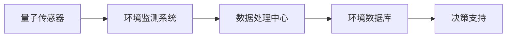
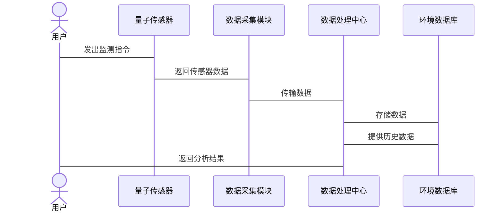

                 


# 如何评估企业的量子传感器环境监测应用

关键词：量子传感器，环境监测，企业评估，技术应用，系统架构

摘要：本文详细探讨了如何评估企业在环境监测中应用量子传感器的各个方面。从基本概念到算法原理，从系统架构到项目实战，再到最佳实践，本文为读者提供了全面的指导，帮助企业在实际应用中有效评估和优化量子传感器的环境监测方案。

---

## 第一部分：量子传感器环境监测应用概述

### 第1章：量子传感器与环境监测的背景介绍

#### 1.1 量子传感器的基本概念
- 1.1.1 量子传感器的定义
- 1.1.2 量子传感器的核心原理
- 1.1.3 量子传感器的分类与特点

#### 1.2 环境监测的重要性
- 1.2.1 环境监测的定义与目标
- 1.2.2 环境监测的主要技术手段
- 1.2.3 环境监测在企业中的应用价值

#### 1.3 量子传感器在环境监测中的优势
- 1.3.1 高灵敏度与高精度
- 1.3.2 高分辨率与快速响应
- 1.3.3 适应复杂环境的能力

#### 1.4 量子传感器环境监测应用的挑战
- 1.4.1 技术局限性
- 1.4.2 成本与可行性问题
- 1.4.3 数据处理与分析的复杂性

#### 1.5 本章小结

---

## 第二部分：量子传感器环境监测的核心概念与联系

### 第2章：量子传感器环境监测的核心概念与联系

#### 2.1 量子传感器的核心原理
- 2.1.1 量子力学基础
- 2.1.2 传感器的基本工作原理
- 2.1.3 量子传感器的信号采集与处理

#### 2.2 量子传感器与传统传感器的对比
- 2.2.1 概念对比
- 2.2.2 性能对比
- 2.2.3 应用场景对比

#### 2.3 量子传感器环境监测的实体关系图


#### 2.4 本章小结

---

## 第三部分：量子传感器环境监测的算法原理

### 第3章：量子传感器环境监测的算法原理

#### 3.1 量子传感器数据处理算法
- 3.1.1 数据采集与预处理
- 3.1.2 量子信号增强算法
- 3.1.3 数据融合与分析

#### 3.2 量子传感器算法的数学模型
- 3.2.1 量子态表示
  $$|\psi\rangle = \alpha|0\rangle + \beta|1\rangle$$
- 3.2.2 传感器信号模型
  $$S = \sum_{i=1}^{n} a_i x_i + \epsilon$$

---

## 第四部分：量子传感器环境监测的系统分析与架构设计

### 第4章：量子传感器环境监测的系统分析与架构设计

#### 4.1 环境监测的应用场景
- 4.1.1 气质监测
- 4.1.2 水质监测
- 4.1.3 土壤监测

#### 4.2 系统功能设计
- 4.2.1 数据采集模块
- 4.2.2 数据处理模块
- 4.2.3 数据分析模块

#### 4.3 系统架构设计


#### 4.4 系统接口设计


#### 4.5 本章小结

---

## 第五部分：量子传感器环境监测的项目实战

### 第5章：量子传感器环境监测的项目实战

#### 5.1 环境监测系统安装与配置
- 5.1.1 硬件安装
- 5.1.2 软件安装
- 5.1.3 网络配置

#### 5.2 量子传感器数据处理核心代码实现
```python
import numpy as np
from qiskit import QuantumCircuit, Aer, execute

# 初始化量子电路
qc = QuantumCircuit(2, 2)
qc.h(0)
qc.cx(0, 1)
qc.measure(0, 0)
qc.measure(1, 1)

# 执行量子模拟
backend = Aer.get_backend('qasm_simulator')
job = execute(qc, backend)
result = job.result()
counts = result.get_counts(qc)

print(counts)
```

#### 5.3 代码解读与功能分析
- 5.3.1 代码功能解析
- 5.3.2 代码运行结果分析
- 5.3.3 代码优化建议

#### 5.4 实际案例分析与解读
- 5.4.1 案例背景介绍
- 5.4.2 数据采集与处理过程
- 5.4.3 分析结果与决策支持

#### 5.5 本章小结

---

## 第六部分：量子传感器环境监测应用的最佳实践

### 第6章：量子传感器环境监测应用的最佳实践

#### 6.1 量子传感器选择与配置
- 6.1.1 传感器性能评估
- 6.1.2 传感器部署策略
- 6.1.3 传感器校准与维护

#### 6.2 数据处理与分析的注意事项
- 6.2.1 数据清洗方法
- 6.2.2 数据分析模型选择
- 6.2.3 数据可视化技巧

#### 6.3 项目实施中的注意事项
- 6.3.1 技术风险控制
- 6.3.2 成本控制策略
- 6.3.3 项目进度管理

#### 6.4 未来发展趋势
- 6.4.1 量子传感器技术的进步
- 6.4.2 环境监测领域的创新
- 6.4.3 量子传感器与其他技术的融合

#### 6.5 本章小结

---

## 结语

---

## 作者：AI天才研究院 & 禅与计算机程序设计艺术

