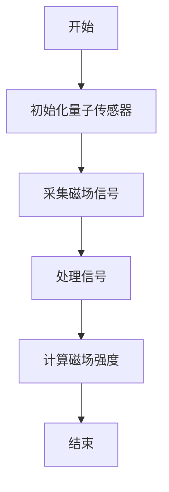
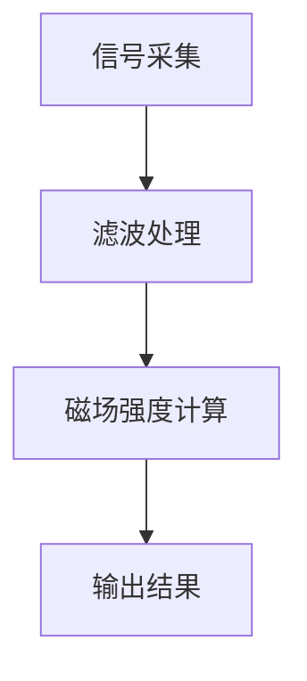
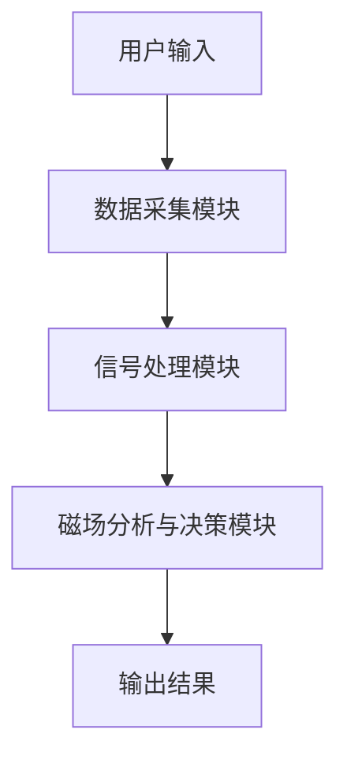

                 


# 如何评估企业的量子传感器磁场探测应用

> 关键词：量子传感器，磁场探测，企业评估，技术原理，应用场景，解决方案

> 摘要：本文系统地探讨了如何评估企业在量子传感器磁场探测技术上的应用。文章从量子传感器的基本概念出发，分析其在企业中的应用场景，深入讲解磁场探测的核心算法原理，并通过实际案例展示系统架构设计与项目实施。最后，结合实际经验，提出最佳实践建议，帮助企业有效评估和应用量子传感器技术。

---

# 第一部分: 量子传感器磁场探测应用概述

## 第1章: 量子传感器与磁场探测基础

### 1.1 量子传感器的基本概念

#### 1.1.1 量子传感器的定义与分类
量子传感器是一种基于量子效应的测量装置，用于检测物理量如磁场、电场、重力等。根据测量目标，磁场探测型量子传感器可以分为量子霍尔效应传感器、超导量子干涉仪（SQUID）等。这些传感器利用量子力学特性，提供高灵敏度和高精度的测量能力。

#### 1.1.2 磁场探测的基本原理
磁场探测通过检测磁场的变化来获取信息。量子传感器利用量子效应，如自旋磁性、超导量子干涉效应等，将磁场变化转化为可测量的电信号。例如，SQUID传感器通过超导环中的磁通量变化来测量磁场。

#### 1.1.3 量子传感器的优势与局限性
量子传感器的优势在于高灵敏度和高精度，能够在复杂环境中稳定工作。然而，其局限性包括对环境条件的严格要求（如温度控制）和较高的制造成本。

### 1.2 量子传感器在企业中的应用场景

#### 1.2.1 石油勘探中的磁场探测
在石油勘探中，磁场探测用于识别地下地质结构。量子传感器能够精确测量地磁场变化，帮助确定油田位置和储量。

#### 1.2.2 医疗设备中的磁场检测
在医疗领域，量子传感器用于磁共振成像（MRI）设备，提供高分辨率的体内成像，帮助诊断疾病。

#### 1.2.3 国防与安全领域的应用
在国防领域，量子传感器用于检测武器装备的磁场信号，进行隐蔽监测和反制。

### 1.3 企业评估量子传感器磁场探测的需求分析

#### 1.3.1 企业对磁场探测技术的需求
企业可能需要磁场探测技术用于产品质量检测、环境监测等领域，量子传感器能够提供更高的精度和效率。

#### 1.3.2 量子传感器在企业中的潜在价值
通过提高检测效率和准确性，量子传感器能够降低企业成本，提升产品竞争力。

#### 1.3.3 评估指标与方法的选择
评估指标包括灵敏度、精度、稳定性等，企业应结合实际需求选择合适的评估方法。

---

## 第2章: 量子传感器磁场探测的核心概念与联系

### 2.1 量子传感器磁场探测的物理原理

#### 2.1.1 量子力学基础
量子力学是量子传感器的基础，涉及波函数、量子态等概念。例如，自旋磁性利用电子的自旋特性来检测磁场。

#### 2.1.2 磁场与量子态的关系
磁场变化会改变量子系统的能量状态，量子传感器通过检测这些变化来测量磁场。

#### 2.1.3 传感器的量子效应
量子效应如超导量子干涉效应被用于磁场探测，提供高灵敏度。

### 2.2 核心概念对比分析

#### 2.2.1 量子传感器与传统传感器的对比
| 特性       | 量子传感器           | 传统传感器           |
|------------|----------------------|----------------------|
| 灵敏度     | 极高                 | 较低                 |
| 精度       | 极高                 | 较低                 |
| 适用场景   | 高精度需求场景       | 一般精度需求场景     |
| 成本       | 较高                 | 较低                 |

#### 2.2.2 不同磁场探测技术的优劣势分析
| 技术       | 优势               | 劣势               |
|------------|--------------------|--------------------|
| SQUID      | 高灵敏度           | 高昂成本           |
| GMR        | 成本低              | 灵敏度较低         |

#### 2.2.3 量子传感器磁场探测的性能指标
性能指标包括灵敏度、分辨率、稳定性等，企业应根据需求选择合适的传感器。

### 2.3 实体关系图与流程图

#### 2.3.1 磁场探测系统的ER实体关系图
```mermaid
er
    entity 量子传感器 {
        id
        类型
        灵敏度
    }
    entity 磁场信号 {
        id
        强度
        位置
    }
    entity 测量结果 {
        id
        时间戳
        传感器id
        磁场信号id
    }
    量子传感器 -[测量]-> 测量结果
    磁场信号 -[记录]-> 测量结果
```

#### 2.3.2 磁场探测过程的mermaid流程图


---

## 第3章: 量子传感器磁场探测的算法原理

### 3.1 算法原理概述

#### 3.1.1 量子传感器数据处理的基本流程
数据处理包括信号采集、噪声抑制、磁场强度计算等步骤。

#### 3.1.2 信号检测与噪声抑制的算法
常用小波变换或傅里叶变换进行信号处理，去除噪声。

#### 3.1.3 磁场强度的计算方法
通过数学模型将电信号转换为磁场强度。

### 3.2 算法实现细节

#### 3.2.1 量子滤波算法的mermaid流程图


#### 3.2.2 算法的Python实现代码
```python
import numpy as np

def quantum_filter(signal):
    # 假设signal是一个包含噪声的磁场信号
    # 使用傅里叶变换进行滤波
    n = len(signal)
    fft = np.fft.fft(signal)
    # 设定滤波器
    fft_filtered = fft * np.blackman(n)
    filtered_signal = np.fft.ifft(fft_filtered)
    return filtered_signal

# 示例使用
signal = np.array([1.0, 2.0, 3.0, 4.0, 5.0])
filtered = quantum_filter(signal)
print(filtered)
```

#### 3.2.3 算法的数学模型与公式
磁场强度计算公式：
$$
B = k \cdot |F(signal)|
$$
其中，\( F \) 是傅里叶变换，\( k \) 是比例常数。

---

## 第4章: 量子传感器磁场探测的系统架构设计

### 4.1 系统功能模块设计

#### 4.1.1 数据采集模块
负责采集磁场信号，输出数字信号。

#### 4.1.2 信号处理模块
对信号进行滤波和增强，去除噪声。

#### 4.1.3 磁场分析与决策模块
计算磁场强度，生成报告。

### 4.2 系统架构图

#### 4.2.1 系统架构的mermaid图


#### 4.2.2 系统接口设计
接口包括传感器与处理器之间的数据接口，以及处理器与上层应用的接口。

#### 4.2.3 系统交互流程图


---

## 第5章: 量子传感器磁场探测的项目实战

### 5.1 项目环境与工具安装

#### 5.1.1 开发环境配置
安装Python、NumPy、Matplotlib等工具。

#### 5.1.2 量子传感器模拟器的安装
使用开源模拟器进行实验。

#### 5.1.3 数据分析工具的安装
安装Jupyter Notebook用于数据分析。

### 5.2 核心功能实现

#### 5.2.1 磁场数据采集的代码实现
```python
import numpy as np

def acquire_magnetic_signal(sample_rate, duration):
    # 生成模拟信号
    t = np.linspace(0, duration, sample_rate * duration)
    signal = np.sin(2 * np.pi * t) + np.random.normal(0, 0.1, len(t))
    return signal

signal = acquire_magnetic_signal(1000, 1)
print(signal)
```

#### 5.2.2 数据处理算法的实现
```python
import numpy as np

def process_signal(signal):
    # 使用小波变换进行处理
    n = len(signal)
    # 小波分解
    coeffs = pywt.wavedec(signal, 'db4', level=2)
    # 重构信号
    reconstructed = pywt.waverec(coeffs, 'db4')
    return reconstructed

processed = process_signal(signal)
print(processed)
```

#### 5.2.3 磁场分析与可视化
使用Matplotlib进行数据可视化：
```python
import matplotlib.pyplot as plt

plt.plot(signal, label='Original Signal')
plt.plot(processed, label='Processed Signal')
plt.legend()
plt.show()
```

### 5.3 实际案例分析

#### 5.3.1 案例背景与需求分析
某企业需要检测生产线上的磁场干扰，选择量子传感器进行实时监测。

#### 5.3.2 系统实现
部署量子传感器，采集数据，进行实时分析，生成报告。

#### 5.3.3 系统运行与结果分析
系统成功检测到异常磁场，帮助企业及时解决问题。

### 5.4 项目小结

通过项目实战，验证了量子传感器在磁场探测中的应用价值，同时积累了实施经验。

---

## 第6章: 最佳实践与总结

### 6.1 小结
量子传感器在磁场探测中具有巨大潜力，企业应根据需求选择合适的技术方案。

### 6.2 注意事项
注意环境条件对传感器性能的影响，确保系统稳定运行。

### 6.3 拓展阅读
推荐阅读《量子传感器技术与应用》和《磁场探测技术的新进展》。

---

作者：AI天才研究院/AI Genius Institute & 禅与计算机程序设计艺术 /Zen And The Art of Computer Programming

---

这篇博客文章详细讲解了如何评估企业在量子传感器磁场探测技术上的应用，从基础概念到实际应用，为读者提供了全面的技术指导和实践建议。

