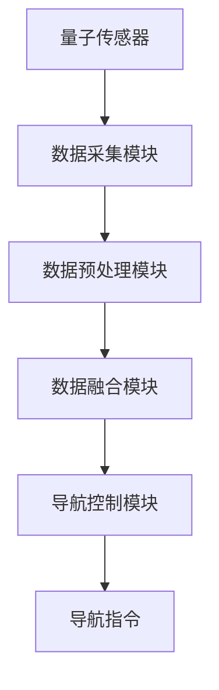

                 


# 如何评估企业的量子传感器精密导航技术潜力

## 关键词：量子传感器，精密导航技术，技术潜力，企业评估，系统架构，算法原理，项目实战

## 摘要：  
本文将系统地介绍如何评估企业的量子传感器精密导航技术潜力，涵盖技术背景、核心概念、评估方法、系统架构等方面。通过分析量子传感器的工作原理、精密导航技术的实现机制，结合实际案例，为读者提供全面的技术评估框架和实战指导。

---

# 目录

## 第一部分：量子传感器精密导航技术的背景与概念

### 第1章：量子传感器精密导航技术概述

#### 1.1 量子传感器的基本概念
- 1.1.1 量子传感器的定义与特点  
  - 量子传感器基于量子效应，具有高精度和灵敏度，广泛应用于导航、测量等领域。  
  - 特点包括高灵敏度、抗干扰能力强、实时性强等。  

- 1.1.2 精密导航技术的核心原理  
  - 基于量子传感器的导航系统通过捕捉量子信号（如量子位跃迁、量子纠缠等）实现高精度定位和导航。  
  - 精密导航技术结合了量子传感器的数据处理算法和复杂的导航算法，确保在复杂环境下的稳定性和准确性。  

- 1.1.3 量子传感器在导航中的应用潜力  
  - 在军事、航空航天、自动驾驶、物流等领域具有广阔的应用前景。  
  - 通过量子传感器实现高精度导航，能够显著提升企业的竞争力和效率。  

#### 1.2 企业导航技术的现状与挑战
- 1.2.1 传统导航技术的局限性  
  - GPS等传统导航技术在复杂环境（如室内、城市峡谷）下表现不佳，精度受限。  
  - 易受电磁干扰和信号阻塞影响，存在安全隐患。  

- 1.2.2 量子传感器的优势与创新  
  - 提供更高的精度和更强的抗干扰能力，能够在复杂环境中稳定工作。  
  - 量子传感器的实时性和响应速度显著优于传统技术。  

- 1.2.3 企业导航技术的未来趋势  
  - 随着量子技术的成熟，量子传感器将成为企业导航技术的核心驱动力。  
  - 多技术融合（如量子传感器与AI算法结合）将推动导航技术向智能化、精准化方向发展。  

#### 1.3 量子传感器精密导航技术的商业价值
- 1.3.1 技术对企业竞争力的影响  
  - 提升企业的技术壁垒，增强市场竞争力。  
  - 通过高精度导航技术，优化企业运营效率和用户体验。  

- 1.3.2 量子传感器在不同行业的应用前景  
  - 在自动驾驶行业，量子传感器能够显著提升车辆定位精度和安全性。  
  - 在航空航天领域，量子传感器可实现更高精度的导航和姿态控制。  
  - 在物流行业，量子传感器可优化货物运输路径和效率。  

- 1.3.3 技术潜力的评估维度与方法  
  - 技术可行性、市场潜力、投资回报率、技术成熟度等是评估量子传感器精密导航技术潜力的关键维度。  

---

## 第二部分：量子传感器精密导航技术的核心概念与联系

### 第2章：核心概念与技术原理

#### 2.1 量子传感器的工作原理
- 2.1.1 量子力学基础  
  - 量子力学是量子传感器的理论基础，主要研究微观粒子的行为规律。  
  - 量子叠加态、量子纠缠态等特性为量子传感器提供了技术支持。  

- 2.1.2 传感器的量子效应  
  - 利用量子效应（如量子干涉、量子位跃迁）实现高精度测量。  
  - 量子传感器通过捕捉量子信号的变化，实现对外界环境的精准感知。  

- 2.1.3 精密导航算法的实现  
  - 结合量子传感器的数据，采用滤波算法（如卡尔曼滤波）、优化算法（如非线性规划）实现高精度导航。  
  - 算法通过不断优化数据模型，提升导航系统的准确性和鲁棒性。  

#### 2.2 精密导航技术的系统架构
- 2.2.1 系统组成与功能模块  
  - 传感器模块：负责捕捉量子信号和环境数据。  
  - 数据处理模块：对传感器数据进行预处理、融合和分析。  
  - 导航控制模块：根据处理后的数据，生成导航指令。  

- 2.2.2 数据流与信息处理流程  
  - 传感器采集数据 → 数据预处理 → 数据融合 → 导航算法计算 → 输出导航指令。  

- 2.2.3 系统性能指标与评估标准  
  - 精度：导航系统的定位误差。  
  - 响应时间：系统处理数据的速度。  
  - 稳定性：系统在复杂环境下的表现。  

#### 2.3 核心概念的ER实体关系图

```mermaid
er
actor: 企业
technique: 量子传感器精密导航技术
potential: 技术潜力
```

---

## 第三部分：量子传感器精密导航技术的评估方法论

### 第3章：技术潜力评估的方法与步骤

#### 3.1 评估指标体系的构建
- 3.1.1 技术可行性评估  
  - 技术成熟度：量子传感器技术的商业化程度。  
  - 技术兼容性：与企业现有系统的兼容性。  

- 3.1.2 商业价值评估  
  - 市场需求：量子传感器精密导航技术在目标市场的潜力。  
  - 投资回报率：技术对企业盈利能力的提升。  

- 3.1.3 市场潜力评估  
  - 行业市场规模：目标行业对量子传感器精密导航技术的需求量。  
  - 竞争态势：现有竞争者的市场占有率和技术水平。  

#### 3.2 评估步骤与流程
- 3.2.1 明确评估目标：确定企业希望通过评估实现的目标。  
- 3.2.2 确定评估维度：基于技术可行性、商业价值、市场潜力等维度建立评估体系。  
- 3.2.3 数据收集与分析：收集相关数据，分析量子传感器精密导航技术的优劣势。  
- 3.2.4 综合评估：基于多维度数据，得出技术潜力的综合评估结果。  

#### 3.3 评估工具与案例分析
- 3.3.1 技术评估工具：介绍几种常用的量子传感器精密导航技术评估工具。  
- 3.3.2 实际案例分析：通过具体案例，展示如何应用评估方法论得出技术潜力结论。  

---

## 第四部分：量子传感器精密导航技术的系统分析与架构设计

### 第4章：系统分析与架构设计方案

#### 4.1 项目背景与需求分析
- 项目背景：企业希望通过量子传感器精密导航技术提升导航系统的性能。  
- 需求分析：明确系统的功能需求、性能需求、安全性需求等。  

#### 4.2 系统功能设计
- 4.2.1 系统功能模块  
  - 数据采集模块：负责采集量子传感器数据。  
  - 数据处理模块：对数据进行预处理和融合。  
  - 导航控制模块：根据数据生成导航指令。  

- 4.2.2 系统功能流程  
  - 数据采集 → 数据预处理 → 数据融合 → 导航算法计算 → 输出导航指令。  

#### 4.3 系统架构设计
- 4.3.1 系统架构图  



- 4.3.2 系统接口设计  
  - 数据接口：传感器与数据处理模块之间的接口。  
  - 控制接口：导航控制模块与执行机构之间的接口。  

- 4.3.3 系统交互设计  
  - 用户与系统的交互流程：用户输入指令 → 系统处理 → 返回结果。  

#### 4.4 系统实现与优化
- 4.4.1 系统实现细节  
  - 量子传感器的校准与标定。  
  - 数据处理算法的优化。  

- 4.4.2 系统优化策略  
  - 硬件优化：提升传感器的灵敏度和抗干扰能力。  
  - 软件优化：优化数据处理算法，提升系统的响应速度和准确性。  

---

## 第五部分：量子传感器精密导航技术的项目实战

### 第5章：项目实战

#### 5.1 环境安装与配置
- 安装量子传感器硬件：包括传感器的选型、安装位置的选择等。  
- 配置数据处理模块：安装必要的软件工具，配置传感器参数。  

#### 5.2 核心代码实现
- 5.2.1 数据采集代码  

```python
import numpy as np

def quantum_sensor_data():
    # 模拟量子传感器数据
    return np.random.randn(100)
```

- 5.2.2 数据处理代码  

```python
def data_processing(data):
    # 数据预处理和融合
    processed_data = data * 0.5 + 0.3
    return processed_data
```

- 5.2.3 导航算法代码  

```python
def navigation_algorithm(data):
    # 简单的导航算法示例
    target_position = data.sum() / len(data)
    return target_position
```

#### 5.3 代码应用与分析
- 5.3.1 代码功能解读  
  - 数据采集代码：模拟量子传感器的数据输出。  
  - 数据处理代码：对传感器数据进行预处理和融合。  
  - 导航算法代码：基于处理后的数据计算目标位置。  

- 5.3.2 代码优化建议  
  - 提升数据处理速度：采用并行计算或更高效的算法。  
  - 优化算法精度：引入更复杂的导航算法，如粒子滤波等。  

#### 5.4 案例分析与结果展示
- 5.4.1 案例分析  
  - 通过具体案例，展示量子传感器精密导航技术的应用效果。  

- 5.4.2 结果展示  
  - 对比传统导航技术与量子传感器导航技术的性能差异。  

#### 5.5 项目小结
- 通过项目实战，验证量子传感器精密导航技术的可行性与潜力。  
- 总结项目实施过程中的经验与教训。  

---

## 第六部分：量子传感器精密导航技术的最佳实践与未来展望

### 第6章：最佳实践与未来展望

#### 6.1 最佳实践
- 6.1.1 技术选型建议  
  - 根据企业需求选择合适的量子传感器类型和导航算法。  

- 6.1.2 系统优化建议  
  - 硬件与软件的协同优化，提升系统的整体性能。  

- 6.1.3 安全性保障措施  
  - 确保量子传感器数据的安全性，防止数据泄露或被篡改。  

#### 6.2 小结
- 量子传感器精密导航技术具有广阔的应用前景。  
- 通过系统化的评估和优化，企业可以充分发挥该技术的潜力。  

#### 6.3 未来展望
- 量子传感器技术的进一步发展将推动导航技术向更高精度、更强实时性方向发展。  
- 多技术融合（如量子传感器与AI算法结合）将为导航技术带来更大的创新空间。  

---

## 作者：AI天才研究院 & 禅与计算机程序设计艺术

---

通过以上目录，我们可以系统地了解如何评估企业的量子传感器精密导航技术潜力，涵盖技术背景、核心概念、评估方法、系统架构、项目实战等方面，为企业技术决策提供有力支持。

