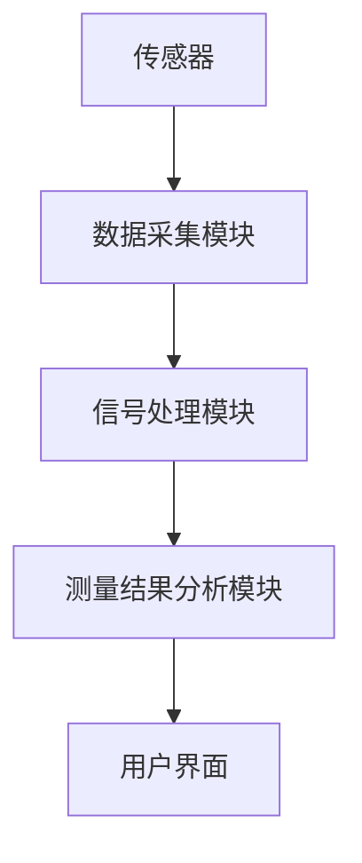

                 


# 如何评估企业的量子传感器精密测量应用

> 关键词：量子传感器、精密测量、企业应用、算法原理、系统架构

> 摘要：本文详细探讨了如何评估企业在量子传感器精密测量中的应用，从基本概念、核心原理到算法实现和系统架构，提供了全面的分析和实践指导，帮助企业优化测量精度和系统性能。

---

## 第一章：量子传感器精密测量应用概述

### 1.1 量子传感器的基本概念

#### 1.1.1 量子传感器的定义
量子传感器是一种基于量子力学原理设计的测量装置，能够以极高的精度检测物理量，如位置、速度、加速度、磁场、重力、压力等。与传统传感器不同，量子传感器利用量子叠加、纠缠和退相干等现象，能够在极微小的尺度上进行精确测量。

#### 1.1.2 量子传感器的工作原理
量子传感器的核心在于利用量子系统的状态变化来反映被测物理量的变化。例如，通过测量量子系统的退相干时间，可以推导出被测物理量的微小变化。这种测量方式具有极高的灵敏度和分辨率。

#### 1.1.3 量子传感器与传统传感器的对比
- **灵敏度**：量子传感器的灵敏度远高于传统传感器，能够检测到更微小的变化。
- **精度**：量子传感器的测量精度更高，适用于高精度要求的场景。
- **抗干扰能力**：量子传感器在某些情况下具有更好的抗干扰能力，尤其是在弱信号检测中。
- **应用领域**：量子传感器广泛应用于精密测量、量子计算、通信等领域，而传统传感器主要用于工业自动化、消费电子等领域。

---

### 1.2 精密测量的定义与应用领域

#### 1.2.1 精密测量的定义
精密测量是指在微米、纳米甚至更小的尺度上进行的高精度测量。它要求测量工具具有极高的灵敏度和稳定性，以确保测量结果的准确性和可靠性。

#### 1.2.2 精密测量的主要应用领域
- **制造业**：精密测量用于零件加工、质量控制等。
- **科研领域**：精密测量用于材料科学、物理学、化学等领域的研究。
- **医疗领域**：精密测量用于医疗设备的校准和诊断。
- **航空航天**：精密测量用于导航、定位和姿态控制。

#### 1.2.3 企业中精密测量的重要性
在企业中，精密测量是确保产品质量、提高生产效率和降低生产成本的重要手段。通过精密测量，企业可以实现对生产过程的实时监控和优化，从而提高产品的市场竞争力。

---

### 1.3 量子传感器在精密测量中的优势

#### 1.3.1 高精度与灵敏度
量子传感器能够检测到极微小的变化，适用于高精度的精密测量场景。

#### 1.3.2 抗干扰能力
量子传感器在某些情况下具有更好的抗干扰能力，能够在复杂环境中保持测量的准确性。

#### 1.3.3 适用的测量场景
量子传感器适用于需要高精度、高灵敏度和高稳定性的测量场景，如量子计算、精密仪器制造等领域。

---

## 第二章：量子传感器精密测量的核心概念与联系

### 2.1 量子传感器精密测量的核心原理

#### 2.1.1 量子传感器的测量原理
量子传感器通过测量量子系统的状态变化来反映被测物理量的变化。例如，通过测量量子系统的退相干时间，可以推导出被测物理量的微小变化。

#### 2.1.2 精密测量的数学模型
精密测量的数学模型通常包括测量误差的表达式、测量精度的优化方法和测量结果的统计分析。

#### 2.1.3 量子传感器与精密测量的关系
量子传感器是实现精密测量的重要工具，精密测量是量子传感器的主要应用场景之一。

---

### 2.2 量子传感器精密测量的核心概念

#### 2.2.1 量子传感器的核心概念
量子传感器的核心概念包括量子叠加、量子纠缠、量子退相干等。

#### 2.2.2 精密测量的核心概念
精密测量的核心概念包括测量误差、测量精度、测量灵敏度等。

#### 2.2.3 量子传感器与精密测量的核心联系
量子传感器通过其高灵敏度和高精度，能够实现精密测量中对微小变化的检测。

---

### 2.3 量子传感器与精密测量的关系

#### 2.3.1 量子传感器在精密测量中的应用
量子传感器广泛应用于精密测量领域，如微米级、纳米级的测量。

#### 2.3.2 精密测量对量子传感器的需求
精密测量对量子传感器的需求包括高精度、高灵敏度、高稳定性等。

#### 2.3.3 量子传感器与精密测量的结合
通过结合量子传感器与精密测量技术，可以实现更高精度、更高灵敏度的测量。

---

## 第三章：量子传感器精密测量的算法原理

### 3.1 量子传感器精密测量的算法原理

#### 3.1.1 量子传感器信号处理算法
量子传感器信号处理算法包括信号滤波、信号放大、信号校正等。

#### 3.1.2 精密测量中的优化算法
精密测量中的优化算法包括非线性优化、最小二乘法、粒子群优化等。

#### 3.1.3 算法实现的代码示例
以下是一个简单的信号滤波算法的Python实现示例：

```python
import numpy as np

def filter_signal(signal, sampling_rate=1000):
    # 低通滤波器设计
    from scipy.signal import butterworth
    # 设计滤波器参数
    cutoff = 100  # 截止频率
    order = 5  # 滤波器阶数
    # 设计滤波器
    b, a = butterworth(order, cutoff / (sampling_rate/2))
    # 应用滤波器
    filtered_signal = np.convolve(signal, b, mode='same')
    return filtered_signal

# 示例数据
signal = np.random.normal(0, 1, 1000)
filtered_signal = filter_signal(signal)

# 绘制信号
import matplotlib.pyplot as plt
plt.figure(figsize=(10, 6))
plt.plot(signal, label='Original Signal')
plt.plot(filtered_signal, label='Filtered Signal')
plt.legend()
plt.show()
```

---

### 3.2 算法实现的数学模型

#### 3.2.1 信号滤波算法的数学模型
信号滤波算法的数学模型通常包括滤波器的传递函数、频率响应等。

#### 3.2.2 非线性优化算法的数学模型
非线性优化算法的数学模型包括目标函数、约束条件、优化变量等。

#### 3.2.3 粒子群优化算法的数学模型
粒子群优化算法的数学模型包括粒子的位置和速度更新规则。

---

## 第四章：量子传感器精密测量的系统分析与架构设计

### 4.1 系统分析

#### 4.1.1 系统需求分析
系统需求分析包括测量精度、测量速度、测量稳定性等。

#### 4.1.2 系统功能分析
系统功能分析包括数据采集、信号处理、测量结果分析等。

#### 4.1.3 系统性能分析
系统性能分析包括系统的响应时间、处理速度、稳定性等。

---

### 4.2 系统架构设计

#### 4.2.1 系统架构图（Mermaid）


#### 4.2.2 系统模块划分
系统模块包括数据采集模块、信号处理模块、测量结果分析模块和用户界面模块。

#### 4.2.3 系统接口设计
系统接口设计包括传感器与数据采集模块的接口、数据采集模块与信号处理模块的接口等。

---

### 4.3 系统实现

#### 4.3.1 系统实现的步骤
系统实现的步骤包括硬件设计、软件设计、系统集成与测试等。

#### 4.3.2 系统实现的代码示例
以下是一个简单的数据采集模块的Python实现示例：

```python
import serial

def read_sensor_data(port, baud_rate=9600):
    ser = serial.Serial(port, baud_rate)
    data = ser.readline().decode().strip()
    ser.close()
    return data

# 示例数据读取
data = read_sensor_data('COM3')
print(data)
```

---

## 第五章：量子传感器精密测量的项目实战

### 5.1 项目背景

#### 5.1.1 项目介绍
本项目旨在通过量子传感器实现精密测量，优化企业的测量精度和效率。

#### 5.1.2 项目目标
项目目标包括提高测量精度、降低测量成本、提高测量效率等。

---

### 5.2 项目实施

#### 5.2.1 项目实施步骤
项目实施步骤包括需求分析、系统设计、系统实现、系统测试与优化等。

#### 5.2.2 项目核心代码实现
以下是一个简单的测量结果分析模块的Python实现示例：

```python
import numpy as np

def analyze_measurement_results(data):
    # 计算平均值
    mean = np.mean(data)
    # 计算标准差
    std = np.std(data)
    return mean, std

# 示例数据分析
data = [1.0, 1.1, 1.2, 1.3, 1.4]
mean, std = analyze_measurement_results(data)
print(f"Mean: {mean}, Standard Deviation: {std}")
```

---

## 第六章：量子传感器精密测量的最佳实践

### 6.1 小结

#### 6.1.1 核心内容总结
量子传感器精密测量的核心内容包括量子传感器的基本概念、精密测量的定义与应用领域、量子传感器在精密测量中的优势等。

#### 6.1.2 项目实施经验总结
通过项目实施，我们总结出以下经验：确保硬件与软件的兼容性、选择合适的算法、优化系统的性能等。

---

### 6.2 注意事项

#### 6.2.1 项目实施中的注意事项
- 确保硬件与软件的兼容性。
- 选择合适的算法。
- 优化系统的性能。

#### 6.2.2 系统维护与优化
- 定期维护系统硬件和软件。
- 根据需求优化系统性能。

---

### 6.3 拓展阅读

#### 6.3.1 推荐的书籍与论文
- 《量子传感器原理与应用》
- 《精密测量技术与方法》

#### 6.3.2 网络资源与工具
- 量子传感器相关的学术论文
- 开源的量子传感器模拟工具

---

## 作者信息

作者：AI天才研究院/AI Genius Institute & 禅与计算机程序设计艺术 /Zen And The Art of Computer Programming

---

通过本文的详细分析和实践指导，读者可以全面了解如何评估企业中的量子传感器精密测量应用，并掌握相关的算法原理和系统架构设计方法。希望本文能为企业在量子传感器精密测量领域的实践提供有价值的参考和指导。

