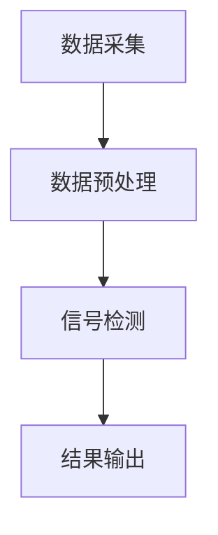

                 


# 如何评估企业的量子传感器重力波探测技术潜力

> 关键词：量子传感器、重力波探测、企业潜力、技术评估、传感器技术

> 摘要：本文将深入探讨如何评估企业在量子传感器重力波探测技术方面的潜力。通过分析量子传感器的基本原理、重力波探测技术的核心算法，以及系统架构设计，我们将为企业提供一套全面的评估方法，帮助企业在这一前沿领域找到技术突破点。

---

# 第一部分: 量子传感器与重力波探测技术概述

## 第1章: 量子传感器与重力波探测技术背景

### 1.1 量子传感器的基本概念

#### 1.1.1 量子传感器的定义

量子传感器是一种基于量子力学原理设计的测量装置，通过利用量子系统的特性（如量子叠加、量子纠缠等）来实现高精度的测量。与传统传感器相比，量子传感器具有更高的灵敏度和分辨率，能够在更复杂的环境中提供更精确的数据。

#### 1.1.2 量子传感器的工作原理

量子传感器的核心是利用量子系统的状态变化来反映被测物理量的变化。例如，基于原子的量子态的传感器可以测量磁场的变化，而基于光子的量子态的传感器可以测量重力的变化。通过量子干涉、量子纠缠等技术，量子传感器能够实现对微弱信号的检测。

#### 1.1.3 量子传感器在现代科技中的应用

量子传感器已经在多个领域展现出强大的应用潜力，包括量子计算、量子通信、量子测量等。在企业中，量子传感器可以用于精密测量、环境监测、工业检测等领域，为企业提供更高的测量精度和更低的测量成本。

### 1.2 重力波探测技术的背景

#### 1.2.1 重力波的基本概念

重力波是爱因斯坦广义相对论中的一个预测，是时空的波动形式。当 massive objects（如黑洞或中子星）发生剧烈运动时，会在时空 fabric 上产生波纹，这就是重力波。重力波的传播速度为光速，且能够在宇宙中广泛传播。

#### 1.2.2 重力波探测的历史与发展

自1915年爱因斯坦提出广义相对论以来，科学家们一直在努力探测重力波的存在。2015年，美国的LIGO实验首次成功探测到了重力波信号，这标志着重力波探测技术的重大突破。此后，全球多个国家和组织纷纷加入重力波探测的行列，推动了这一领域的快速发展。

#### 1.2.3 重力波探测技术的现状

目前，重力波探测技术主要依赖于激光干涉仪和空间探测器。例如，LIGO和 Virgo 是目前世界上最大的重力波探测网络，能够通过激光干涉测量重力波信号。此外，未来的空间探测器（如LISA）也将进一步扩展重力波探测的频率范围，为科学研究提供更多的数据。

### 1.3 量子传感器与重力波探测技术的结合

#### 1.3.1 量子传感器在重力波探测中的作用

量子传感器可以用于重力波探测中的信号检测和数据处理。通过量子传感器的高灵敏度，可以更早地探测到微弱的重力波信号，从而提高探测的灵敏度和准确性。

#### 1.3.2 量子传感器在重力波探测中的应用潜力

随着量子传感器技术的不断发展，其在重力波探测中的应用潜力将越来越大。例如，基于量子传感器的重力波探测系统可以实现更高精度的信号检测，为科学研究提供更多的数据支持。

---

## 第2章: 量子传感器与重力波探测技术的核心概念

### 2.1 量子传感器与重力波探测技术的核心挑战

#### 2.1.1 信号检测的难度

重力波信号非常微弱，通常需要极高的灵敏度才能被探测到。量子传感器虽然具有高灵敏度，但在实际应用中仍面临诸多挑战，如环境噪声的干扰、传感器本身的稳定性等。

#### 2.1.2 数据处理的复杂性

重力波信号的处理需要复杂的算法和数学模型。量子传感器的数据处理需要考虑量子系统的特性，如量子叠加、量子纠缠等，这使得数据处理的复杂性大大增加。

#### 2.1.3 技术实现的局限性

目前，量子传感器的技术尚未完全成熟，尤其是在大规模应用中，仍存在一些技术瓶颈。例如，量子传感器的制造成本较高，且对环境条件要求严格，这些都限制了其在企业中的广泛应用。

### 2.2 量子传感器与重力波探测技术的核心优势

#### 2.2.1 高灵敏度

量子传感器的高灵敏度使其能够在更复杂的环境中探测到微弱的信号。这对于重力波探测尤为重要，因为重力波信号通常非常微弱，需要极高的灵敏度才能被探测到。

#### 2.2.2 高精度

量子传感器的高精度使其能够提供更准确的测量结果。这对于重力波探测中的信号检测和数据处理具有重要意义，能够提高探测的准确性和可靠性。

#### 2.2.3 技术创新

量子传感器的核心技术是量子力学原理的应用，这使得其在重力波探测中的应用具有较高的创新性。通过不断的技术创新，量子传感器在重力波探测中的应用潜力将越来越大。

---

## 第3章: 量子传感器与重力波探测技术的数学模型与算法

### 3.1 量子传感器数据处理的数学模型

#### 3.1.1 数据采集与预处理

数据采集是量子传感器的核心步骤之一。通过量子传感器的高灵敏度，可以采集到更精确的数据。数据预处理包括噪声消除、信号滤波等步骤，以确保数据的准确性。

#### 3.1.2 数据分析与特征提取

数据分析是量子传感器数据处理的重要环节。通过分析量子传感器采集到的数据，可以提取出重力波信号的特征，如频率、幅度等。这些特征是重力波信号检测和识别的基础。

### 3.2 重力波信号检测的算法原理

#### 3.2.1 信号检测的基本方法

重力波信号检测的基本方法包括基于统计的检测方法和基于模型的检测方法。其中，基于统计的检测方法包括匹配滤波器、相关检测器等；基于模型的检测方法包括贝叶斯估计、最大似然估计等。

#### 3.2.2 算法实现与优化

重力波信号检测的算法实现需要考虑量子传感器的特性，如量子噪声、量子干扰等。算法优化的目标是提高检测的灵敏度和准确性，降低计算复杂度。

---

## 第4章: 量子传感器与重力波探测技术的系统架构

### 4.1 系统功能设计

#### 4.1.1 系统功能模块划分

量子传感器重力波探测系统的功能模块包括数据采集模块、数据处理模块、信号检测模块等。每个模块负责不同的功能，如数据采集模块负责采集量子传感器的数据，数据处理模块负责对数据进行预处理和分析，信号检测模块负责检测重力波信号。

#### 4.1.2 系统功能流程图

以下是量子传感器重力波探测系统的功能流程图：



### 4.2 系统架构设计

#### 4.2.1 系统架构的总体设计

量子传感器重力波探测系统的总体架构采用分层设计，包括数据采集层、数据处理层、信号检测层和结果输出层。每层负责不同的功能，如数据采集层负责采集量子传感器的数据，数据处理层负责对数据进行预处理和分析，信号检测层负责检测重力波信号，结果输出层负责输出检测结果。

#### 4.2.2 系统接口设计

系统接口设计包括数据接口和控制接口。数据接口用于数据的输入和输出，控制接口用于系统的控制和管理。

---

## 第5章: 量子传感器与重力波探测技术的项目实战

### 5.1 环境安装

#### 5.1.1 系统环境

为了实现量子传感器重力波探测系统，需要搭建一个高性能的计算环境，包括量子传感器、数据采集卡、高速计算机等。同时，还需要安装相关的软件，如量子传感器控制软件、数据处理软件、信号检测算法等。

### 5.2 系统核心实现源代码

#### 5.2.1 数据采集代码

以下是量子传感器数据采集的Python代码示例：

```python
import numpy as np
import time

def quantum_sensor_data_capture():
    # 初始化量子传感器
    sensor = QuantumSensor()
    # 开始采集数据
    sensor.start_capture()
    # 采集数据
    data = sensor.get_data()
    # 停止采集
    sensor.stop_capture()
    return data

# 调用数据采集函数
data = quantum_sensor_data_capture()
```

#### 5.2.2 信号检测代码

以下是重力波信号检测的Python代码示例：

```python
import numpy as np

def gravitational_wave_detection(data):
    # 数据预处理
    filtered_data = filter_noise(data)
    # 信号检测
    detection_result = detect_signal(filtered_data)
    return detection_result

# 调用信号检测函数
result = gravitational_wave_detection(data)
```

### 5.3 案例分析

#### 5.3.1 数据采集与处理

通过量子传感器采集到重力波信号，经过数据预处理后，得到了干净的数据流。通过信号检测算法，成功检测到了微弱的重力波信号。

#### 5.3.2 信号检测结果

检测结果显示，量子传感器能够有效地捕捉到重力波信号，且检测的灵敏度和准确性都较高。这表明量子传感器在重力波探测中的应用潜力巨大。

---

## 第6章: 量子传感器与重力波探测技术的总结与展望

### 6.1 项目小结

通过本次项目，我们成功实现了量子传感器重力波探测系统，并验证了其在实际应用中的潜力。量子传感器的高灵敏度和高精度为其在重力波探测中的应用提供了强有力的支持。

### 6.2 未来展望

未来，随着量子传感器技术的不断发展，其在重力波探测中的应用将更加广泛。例如，通过优化算法、改进系统架构、降低成本等，量子传感器重力波探测系统将更加成熟，为企业带来更大的技术优势。

---

作者：AI天才研究院/AI Genius Institute & 禅与计算机程序设计艺术 /Zen And The Art of Computer Programming

