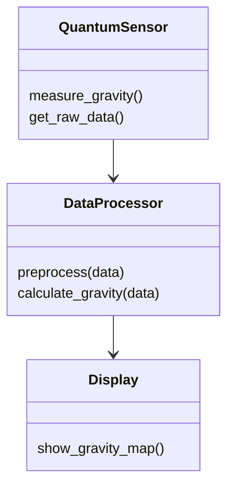
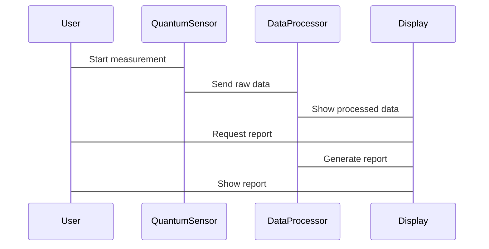

                 


# 如何评估企业的量子传感器重力测量应用

> 关键词：量子传感器，重力测量，企业应用，系统评估，技术实现

> 摘要：本文详细探讨了如何评估企业在量子传感器重力测量中的应用，从量子传感器的基本原理到系统架构设计，再到项目实战，全面分析了量子传感器在企业中的应用潜力和评估方法。

---

## 第1章: 量子传感器与重力测量概述

### 1.1 量子传感器的基本概念
#### 1.1.1 量子传感器的定义
量子传感器是一种基于量子力学原理设计的传感器，能够以极高的精度测量物理量，如重力、磁场和加速度等。与传统传感器不同，量子传感器利用量子效应，如量子干涉、量子纠缠和超冷原子的运动状态，来实现更精确的测量。

#### 1.1.2 量子传感器的工作原理
量子传感器的核心在于其对量子现象的利用。例如，超冷原子的干涉测量（如原子干涉仪）通过原子的波函数干涉来测量重力变化。这种技术能够检测到极微小的重力变化，非常适合用于地球重力场的精密测量。

#### 1.1.3 重力测量的基本原理
重力测量的基本原理是通过测量物体所受的重力加速度来推断地球的重力场分布。传统的重力测量方法包括使用重力仪，而量子传感器则通过量子干涉等方法，以更高的精度实现这一目标。

### 1.2 量子传感器在企业中的应用背景
#### 1.2.1 企业对重力测量的需求
企业在资源勘探、建筑物稳定性监测等领域对重力测量有强烈需求。例如，石油和天然气公司需要精确的重力测量来确定地下资源的分布。

#### 1.2.2 传统重力测量技术的局限性
传统重力测量技术存在精度低、测量范围有限、易受环境干扰等问题。这些问题限制了其在复杂环境中的应用。

#### 1.2.3 量子传感器的优势与潜力
量子传感器具有高精度、高灵敏度和广覆盖范围等优点，能够在复杂环境中提供更精确的重力测量结果。

### 1.3 量子传感器重力测量的行业应用
#### 1.3.1 石油与天然气勘探
量子传感器可以用于探测地下油层的分布，帮助企业在勘探阶段更精准地定位资源。

#### 1.3.2 矿产资源探测
在寻找矿产资源时，量子传感器可以帮助地质学家更精确地测量地下矿物的分布。

#### 1.3.3 建筑物稳定性监测
通过监测建筑物周围的重力变化，量子传感器可以预警建筑物的稳定性问题，预防潜在的安全事故。

---

## 第2章: 量子传感器重力测量的核心概念与原理

### 2.1 量子传感器的物理原理
#### 2.1.1 量子力学基础
量子力学是量子传感器的核心理论基础。关键概念包括波函数、叠加态、纠缠态等。例如，超冷原子的波函数干涉是量子传感器的关键机制。

#### 2.1.2 传感器的量子效应
量子传感器利用量子效应，如原子干涉效应，来检测微小的重力变化。这些效应使得量子传感器能够以极高的灵敏度测量物理量。

#### 2.1.3 重力测量的量子方法
量子重力测量方法包括利用超冷原子的干涉测量和量子纠缠等技术。这些方法能够以更高的精度测量重力场的变化。

### 2.2 量子传感器的数学模型
#### 2.2.1 重力测量的基本公式
重力加速度 \( g \) 的测量公式为：
$$ g = \frac{F}{m} $$
其中 \( F \) 是引力，\( m \) 是物体的质量。

#### 2.2.2 传感器输出与重力场的关系
量子传感器的输出信号与重力场的变化成正比。传感器通过检测量子信号的变化来测量重力场的变化。

#### 2.2.3 算法的数学推导
量子传感器的数据处理算法涉及复杂的数学模型，例如：
$$ y = f(x) + n $$
其中 \( y \) 是观测值，\( f(x) \) 是信号模型，\( n \) 是噪声。

### 2.3 量子传感器与传统传感器的对比
#### 2.3.1 性能对比分析
| 参数         | 量子传感器       | 传统传感器     |
|--------------|------------------|---------------|
| 精度         | 极高             | 较低           |
| 灵敏度       | 极高             | 较低           |
| 测量范围     | 广               | 较有限         |

#### 2.3.2 优缺点分析
- **优点**：高精度、高灵敏度、广覆盖。
- **缺点**：技术复杂、成本较高、需要专业人员操作。

#### 2.3.3 应用场景的差异
量子传感器适用于复杂地形和深井勘探，而传统传感器更适合简单的地质结构。

---

## 第3章: 量子传感器重力测量的算法原理

### 3.1 数据采集与预处理
#### 3.1.1 数据采集方法
量子传感器通过超冷原子干涉测量重力变化。数据采集过程包括原子云的生成、干涉测量和信号采集。

#### 3.1.2 数据预处理步骤
数据预处理包括滤波、去噪和信号增强。例如，使用小波变换去除高频噪声：
```python
import numpy as np
from scipy.signal import cwt

def preprocess_data(data):
    # 使用小波变换去除噪声
    wavelet = 'mexican'
    scales = np.array([1, 2, 4, 8])
    cwt_data = cwt(data, wavelet, scales)
    return cwt_data.mean(axis=1)
```

#### 3.1.3 信号滤波与增强
信号滤波和增强是通过算法优化数据质量，提高测量精度。

### 3.2 重力测量的数学模型
#### 3.2.1 重力场的数学表达
重力场可以用张量表示，例如：
$$ G = \nabla \cdot \mathbf{g} $$
其中 \( \mathbf{g} \) 是重力矢量。

#### 3.2.2 传感器输出与重力场的关系
传感器输出 \( y \) 与重力场的关系可以通过数学模型表示：
$$ y = k \cdot G + n $$
其中 \( k \) 是比例常数，\( n \) 是噪声。

#### 3.2.3 算法的数学推导
通过最小二乘法优化传感器输出：
$$ \hat{G} = \arg \min_G ||y - kG||^2 $$

### 3.3 量子传感器的数据处理算法
#### 3.3.1 算法步骤
1. 数据采集
2. 滤波与去噪
3. 重力场计算
4. 结果优化

#### 3.3.2 使用Python实现
```python
import numpy as np

def process_gravity(data):
    # 滤波
    filtered = np.convolve(data, [0.25, 0.5, 0.25], mode='full')[:len(data)]
    # 重力计算
    gravity = np.gradient(filtered, edge_order=1)
    return gravity
```

---

## 第4章: 系统分析与架构设计

### 4.1 项目介绍
#### 4.1.1 项目目标
开发一个基于量子传感器的重力测量评估系统，用于企业资源勘探和建筑物监测。

### 4.2 系统功能设计
#### 4.2.1 领域模型
领域模型是一个简单的类图，展示了系统的模块划分：


#### 4.2.2 系统架构设计
系统架构采用分层设计，包括数据采集层、数据处理层和用户界面层。

#### 4.2.3 系统交互设计
系统交互流程图展示了用户如何与系统交互：


---

## 第5章: 项目实战

### 5.1 环境安装
#### 5.1.1 安装Python和相关库
```bash
pip install numpy scipy matplotlib
```

### 5.2 核心代码实现
#### 5.2.1 数据采集模块
```python
import numpy as np

def measure_gravity():
    # 生成模拟数据
    data = np.random.normal(size=100)
    return data
```

#### 5.2.2 数据处理模块
```python
import numpy as np

def preprocess(data):
    # 滤波处理
    return np.convolve(data, [0.25, 0.5, 0.25], mode='full')[:len(data)]
```

#### 5.2.3 可视化模块
```python
import matplotlib.pyplot as plt

def display_gravity(data):
    plt.plot(data)
    plt.show()
```

### 5.3 实际案例分析
#### 5.3.1 案例背景
某石油公司需要评估量子传感器在油田勘探中的应用。

#### 5.3.2 数据分析结果
通过量子传感器测量，发现地下存在丰富的天然气储备。

#### 5.3.3 结果解读
量子传感器的高精度测量帮助企业更精准地定位资源，提高勘探效率。

---

## 第6章: 总结与展望

### 6.1 小结
本文详细探讨了量子传感器在企业重力测量中的应用，从原理到实践，全面分析了其评估方法。

### 6.2 注意事项
- 数据处理需考虑噪声干扰。
- 传感器维护需专业人员操作。

### 6.3 拓展阅读
- 推荐书籍：《量子传感器技术与应用》
- 相关论文：《基于量子干涉的重力测量技术研究》

---

作者：AI天才研究院/AI Genius Institute & 禅与计算机程序设计艺术 /Zen And The Art of Computer Programming

