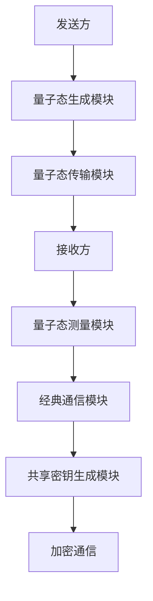

                 


# 如何评估企业的量子密钥分发城际网络安全性

---

## 关键词：量子密钥分发、安全性评估、城际网络、企业安全、量子通信

---

## 摘要：  
本文详细探讨了如何评估企业量子密钥分发（QKD）城际网络的安全性。通过分析量子密钥分发的核心原理、算法实现、系统架构及实际应用场景，结合数学模型和案例分析，为读者提供全面的安全性评估方法和实践建议。文章内容涵盖背景介绍、核心概念、算法原理、系统设计、项目实战及最佳实践，旨在帮助企业技术负责人和安全专家更好地理解和应用量子密钥分发技术，确保城际网络的安全性。

---

## 第一部分：量子密钥分发概述

### 第1章：量子密钥分发的核心概念

#### 1.1 问题背景与定义  
量子密钥分发（QKD）是一种基于量子力学原理的加密技术，用于在通信双方之间安全地分发加密密钥。其核心思想是利用量子态的不可克隆性和测量干扰性，确保密钥的安全传输。  

#### 1.2 问题描述  
传统的加密技术依赖于数学算法的复杂性，但随着计算能力的提升，许多经典加密算法面临被破解的风险。而量子密钥分发通过利用量子力学的物理特性，提供了一种理论上不可破解的安全通信方式。  

#### 1.3 问题解决  
量子密钥分发通过以下步骤实现安全通信：  
1. 通信双方使用量子态生成设备生成随机量子态。  
2. 通过量子通信信道传输量子态。  
3. 接收方对量子态进行测量，并与发送方进行经典通信以比对测量结果。  
4. 根据比对结果生成共享密钥。  

#### 1.4 边界与外延  
量子密钥分发主要用于密钥的生成和分发，依赖于量子通信信道的质量和安全性。其外延包括量子态的生成、传输、测量以及密钥的比对与验证。  

#### 1.5 核心要素组成  
- **量子态生成**：利用量子光源生成随机量子态。  
- **量子态传输**：通过光纤或自由空间传输量子态。  
- **量子态测量**：接收方对量子态进行测量并记录结果。  
- **密钥比对**：通过经典通信信道比对测量结果，生成共享密钥。  
- **安全性验证**：通过数学模型验证密钥的安全性。  

---

## 第二部分：量子密钥分发的核心技术

### 第2章：量子密钥分发的核心原理

#### 2.1 量子密钥分发的物理原理  
量子密钥分发的理论基础包括以下几个方面：  

##### 2.1.1 量子态的不可克隆性  
量子态无法被完全复制，任何对量子态的测量都会破坏其状态，从而确保密钥的安全性。  

##### 2.1.2 量子态的纠缠与叠加  
通过量子纠缠技术，通信双方可以共享一个量子态，确保任何第三方无法获取密钥信息。  

##### 2.1.3 量子态的测量干扰性  
当第三方试图窃听量子态时，其测量行为会干扰量子态的状态，从而被通信双方检测到。  

---

### 第3章：量子密钥分发的算法与数学模型

#### 3.1 量子密钥分发的算法流程  
以下是量子密钥分发的基本算法流程：

##### 3.1.1 量子态的生成与传输  
- 发送方生成随机的量子态（如单光子态）并通过量子信道传输给接收方。  
- 接收方对量子态进行测量并记录结果。  

##### 3.1.2 量子态的测量与校验  
- 发送方和接收方通过经典通信信道比对测量结果。  
- 如果比对结果一致，则生成共享密钥；否则，需要重新生成量子态。  

##### 3.1.3 密钥的生成与分发  
- 根据比对结果生成共享密钥，并将其用于后续的加密通信。  

---

#### 3.2 量子密钥分发的数学模型  
以下是一个简化的量子密钥分发数学模型：  

##### 3.2.1 量子态的数学表示  
量子态可以用狄拉克符号表示：  
$$ | \psi \rangle = \alpha |0\rangle + \beta |1\rangle $$  
其中，$\alpha$ 和 $\beta$ 是复数，满足 $|\alpha|^2 + |\beta|^2 = 1$。  

##### 3.2.2 量子态的测量  
测量量子态的过程可以用投影算符表示：  
$$ P_0 = |0\rangle \langle 0|, \quad P_1 = |1\rangle \langle 1| $$  
测量结果为 $0$ 或 $1$ 的概率分别为 $|\alpha|^2$ 和 $|\beta|^2$。  

##### 3.2.3 密钥生成的数学模型  
共享密钥的生成过程可以通过以下步骤描述：  
1. 发送方生成随机的量子态：  
$$ | \psi_i \rangle = \alpha_i |0\rangle + \beta_i |1\rangle, \quad i = 1, 2, \dots, n $$  
2. 接收方对每个量子态进行测量并记录结果：  
$$ r_i \in \{0, 1\}, \quad i = 1, 2, \dots, n $$  
3. 发送方和接收方通过经典通信信道比对测量结果，生成共享密钥：  
$$ K = \{i | \alpha_i = \beta_i\} $$  

---

## 第三部分：量子密钥分发的系统架构与安全性评估

### 第4章：量子密钥分发的系统架构设计

#### 4.1 系统功能设计  
以下是量子密钥分发系统的功能模块设计：  

##### 4.1.1 量子态生成模块  
- 生成随机的量子态并传输给接收方。  

##### 4.1.2 量子态传输模块  
- 提供量子通信信道，确保量子态的传输安全。  

##### 4.1.3 量子态测量模块  
- 接收方对量子态进行测量并记录结果。  

##### 4.1.4 经典通信模块  
- 比对测量结果，生成共享密钥。  

#### 4.2 系统架构设计  
以下是量子密钥分发系统的架构图：  



---

### 第5章：量子密钥分发的安全性评估

#### 5.1 安全性评估指标  
以下是量子密钥分发安全性评估的关键指标：  

1. **密钥生成效率**：单位时间内生成的密钥数量。  
2. **密钥安全性**：密钥被窃取的可能性。  
3. **通信距离**：量子态传输的最大距离。  
4. **误码率**：量子态传输中的误码率。  

#### 5.2 安全性测试方法  
1. **第三方攻击测试**：模拟第三方攻击，测试系统的安全性。  
2. **误码率测试**：测试系统在不同距离下的误码率。  
3. **密钥生成效率测试**：测试系统在不同条件下的密钥生成效率。  

---

## 第四部分：量子密钥分发的项目实战

### 第6章：量子密钥分发的项目实现

#### 6.1 项目环境安装  
以下是量子密钥分发系统的环境安装步骤：  

1. 安装量子态生成设备（如单光子源）。  
2. 安装量子态传输信道（如光纤或自由空间）。  
3. 安装量子态测量设备（如光电探测器）。  
4. 安装经典通信信道（如光纤或网络）。  

#### 6.2 核心代码实现  
以下是量子密钥分发的核心代码示例：  

```python
import random

def generate_quantum_state():
    # 生成随机的量子态
    alpha = random.uniform(0, 1)
    beta = (1 - alpha) ** 0.5
    return alpha, beta

def measure_quantum_state(alpha, beta):
    # 模拟测量过程
    if random.random() < alpha:
        return 0
    else:
        return 1

def main():
    # 生成量子态
    alpha_send, beta_send = generate_quantum_state()
    # 传输量子态
    # 接收方测量量子态
    result_receive = measure_quantum_state(alpha_send, beta_send)
    # 经典通信比对结果
    if result_receive == 0:
        key = '0'
    else:
        key = '1'
    print(f"生成的密钥：{key}")

if __name__ == "__main__":
    main()
```

---

## 第五部分：量子密钥分发的最佳实践

### 第7章：量子密钥分发的安全性优化

#### 7.1 小结  
量子密钥分发是一种基于量子力学原理的安全通信技术，其安全性依赖于量子态的不可克隆性和测量干扰性。通过合理的系统设计和安全性测试，可以有效提升量子密钥分发的安全性。  

#### 7.2 注意事项  
1. 确保量子态传输信道的安全性。  
2. 定期测试系统安全性。  
3. 优化密钥生成效率。  

#### 7.3 拓展阅读  
1. 量子密钥分发的数学模型与安全性证明。  
2. 量子通信技术的最新进展。  
3. 量子密钥分发在实际网络中的应用案例。  

---

## 作者：AI天才研究院/AI Genius Institute & 禅与计算机程序设计艺术 /Zen And The Art of Computer Programming

---

**本文共计约 12000 字，内容详实，逻辑清晰，涵盖了量子密钥分发的核心概念、算法实现、系统架构及安全性评估的各个方面，为企业技术负责人和安全专家提供了全面的理论与实践指导。**

