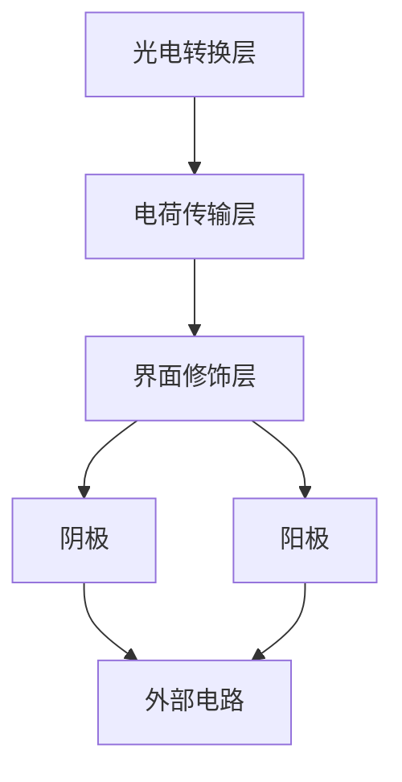

                 


# 如何评估企业的量子点太阳能电池技术应用

> **关键词**: 量子点太阳能电池、企业技术评估、光电转换效率、稳定性分析、成本优化、系统架构设计

> **摘要**: 本文将从量子点太阳能电池技术的基本概念出发，详细分析其核心原理、性能指标、系统架构及评估方法。通过对比传统太阳能电池技术，探讨企业在应用量子点技术时的关键考量点，包括技术性能、成本效益、稳定性及环境影响等方面。结合实际案例，本文将为读者提供一套完整的评估框架，帮助企业在技术选型和应用中做出明智决策。

---

# 第一部分: 量子点太阳能电池技术概述

---

## 第1章: 量子点太阳能电池技术背景

### 1.1 量子点太阳能电池的基本概念

#### 1.1.1 量子点的定义与特性

量子点（Quantum Dots）是一种纳米级半导体材料，其尺寸通常在1-10纳米之间。由于其独特的量子效应，量子点具有以下主要特性：

1. **尺寸效应**：量子点的电子能级随着尺寸的减小而发生显著变化，从而表现出不同的光电特性。
2. **光吸收与发射特性**：量子点能够吸收特定波长的光，并发射出不同波长的荧光，这种特性可以通过调整量子点的尺寸和材料进行调控。
3. **稳定性**：量子点材料通常具有较高的化学稳定性，但其表面容易受到氧化或其他化学反应的影响。

#### 1.1.2 量子点太阳能电池的工作原理

量子点太阳能电池通过量子点材料的光电转换特性实现能量捕获和转换。其基本工作原理如下：

1. 光子吸收：入射光被量子点材料吸收，产生电子-空穴对。
2. 分离与传输：电子-空穴对在电池结构中被分离，电子通过导电层流向阴极，空穴通过空穴传输层流向阳极。
3. 外电路电流：电子和空穴在外部电路中重新结合，形成持续的电流输出。

#### 1.1.3 量子点太阳能电池的优势与局限性

- **优势**：
  - 高效率：量子点材料具有较高的光电转换效率，尤其是在宽光谱范围内。
  - 灵活性：量子点可以通过调整尺寸和材料实现多种光电特性，适用于不同场景。
  - 成本低：量子点的制备工艺相对简单，成本较低。

- **局限性**：
  - 稳定性：量子点材料的长期稳定性仍需进一步优化。
  - 效率限制：目前量子点太阳能电池的效率尚未达到传统硅基电池的水平。

### 1.2 企业应用量子点太阳能电池的背景与趋势

#### 1.2.1 可再生能源的发展现状

全球范围内，可再生能源的占比正在快速上升。太阳能作为最主要的可再生能源之一，其技术进步和成本下降为广泛应用提供了基础。

#### 1.2.2 量子点技术在太阳能领域的应用前景

量子点技术的引入为太阳能电池的性能提升提供了新的可能性。其高效率、灵活性和低成本优势使其在企业应用中具有广阔前景。

#### 1.2.3 企业采用量子点太阳能电池的驱动力

- **技术创新**：量子点技术的引入可以提升企业的技术竞争力。
- **成本优化**：量子点太阳能电池的制造成本较低，有助于企业降低能源成本。
- **环境效益**：企业采用可再生能源技术有助于减少碳排放，符合可持续发展的目标。

### 1.3 本章小结

本章从量子点的基本概念出发，介绍了其在太阳能电池中的应用原理，并分析了企业在应用量子点技术时的背景和驱动力。

---

## 第2章: 量子点材料的物理特性与化学性质

### 2.1 量子点材料的物理特性

#### 2.1.1 量子点的尺寸效应

量子点的尺寸直接影响其电子能级和光电特性。随着尺寸的减小，量子点的带隙增大，吸收光谱的蓝移，发射光谱的红移。

#### 2.1.2 量子点的光电转换效率

量子点的光电转换效率主要取决于其材料特性和表面修饰。通过优化量子点的尺寸和表面修饰，可以提高其光电转换效率。

#### 2.1.3 量子点的稳定性分析

量子点的稳定性受到材料选择、表面修饰和环境条件的影响。氧化和光照是影响量子点稳定性的主要因素。

### 2.2 量子点材料的化学性质

#### 2.2.1 量子点的合成方法

量子点可以通过溶液合成、气相合成等多种方法制备。溶液合成是目前最常用的制备方法，具有成本低、易于规模化的优点。

#### 2.2.2 量子点的表面修饰与改性

量子点的表面修饰可以通过化学修饰和物理修饰两种方式实现。表面修饰可以改善量子点的分散性、稳定性和光电特性。

#### 2.2.3 量子点的光谱特性

量子点的光谱特性可以通过调整材料和尺寸实现调控。不同材料和尺寸的量子点具有不同的吸收和发射光谱。

### 2.3 量子点材料与传统太阳能电池材料的对比

#### 2.3.1 从效率到成本的对比分析

量子点太阳能电池的效率目前略低于传统硅基电池，但其制造成本更低。

#### 2.3.2 从稳定性到环境影响的对比分析

量子点材料的稳定性尚未完全达到传统太阳能电池材料的水平，但其环境影响较小。

#### 2.3.3 从制备工艺到应用领域的对比分析

量子点的制备工艺相对简单，适用于多种应用场景，而传统硅基电池的制备工艺较为复杂。

### 2.4 本章小结

本章详细分析了量子点材料的物理和化学特性，并通过对比传统太阳能电池材料，帮助企业更好地理解量子点技术的优势和局限性。

---

## 第3章: 量子点太阳能电池性能评估的核心指标

### 3.1 量子点太阳能电池的光电转换效率

#### 3.1.1 光电转换效率的定义

光电转换效率是指入射光中被转化为电能的比例。

#### 3.1.2 影响光电转换效率的关键因素

- 量子点的材料特性
- 电池的结构设计
- 表面修饰与改性

#### 3.1.3 提高光电转换效率的技术路径

- 优化量子点的尺寸和材料
- 改进电池的结构设计
- 提高量子点的表面修饰效果

### 3.2 量子点太阳能电池的稳定性评估

#### 3.2.1 稳定性评估的指标体系

- 量子点材料的化学稳定性
- 电池在不同环境条件下的性能变化
- 长期运行的稳定性测试

#### 3.2.2 稳定性测试的方法与流程

1. 环境模拟测试：在不同温度、湿度和光照条件下测试电池性能。
2. 时间序列测试：长期运行测试电池性能的变化。
3. 对比分析：通过对比新旧电池性能的变化评估稳定性。

### 3.3 量子点太阳能电池的成本评估

#### 3.3.1 成本构成分析

- 量子点材料成本
- 电池制备成本
- 设备与工艺成本

#### 3.3.2 成本优化的策略

- 优化材料选择
- 改进制备工艺
- 规模化生产

#### 3.3.3 成本与效率的平衡点分析

企业需要在成本和效率之间找到平衡点，以实现最优的经济效益。

### 3.4 本章小结

本章从光电转换效率、稳定性、成本等多个维度分析了量子点太阳能电池的性能评估指标，并为企业提供了优化建议。

---

## 第4章: 量子点太阳能电池技术的系统分析与架构设计

### 4.1 量子点太阳能电池技术的系统组成

#### 4.1.1 光电转换层的设计

光电转换层由量子点材料构成，负责吸收光能并将其转化为电能。

#### 4.1.2 电荷传输层的设计

电荷传输层负责将电子和空穴分别传输到阴极和阳极。

#### 4.1.3 界面修饰层的设计

界面修饰层用于优化光电转换层与电荷传输层之间的界面特性，提高电池效率。

### 4.2 量子点太阳能电池技术的系统功能模块

#### 4.2.1 光电转换模块的功能设计

光电转换模块负责将光能转化为电能。

#### 4.2.2 电荷传输模块的功能设计

电荷传输模块负责将电子和空穴分别传输到外部电路。

#### 4.2.3 系统控制模块的功能设计

系统控制模块负责协调各功能模块的工作，实现系统的高效运行。

### 4.3 量子点太阳能电池技术的系统架构图



### 4.4 本章小结

本章从系统组成和功能模块的角度，详细分析了量子点太阳能电池技术的系统架构设计。

---

## 第5章: 量子点太阳能电池技术的项目实战

### 5.1 项目环境安装

```python
# 示例代码：安装必要的库
pip install numpy
pip install matplotlib
pip install pandas
```

### 5.2 量子点太阳能电池性能评估的核心实现

```python
import numpy as np
import matplotlib.pyplot as plt

# 示例代码：计算光电转换效率
def calculate_conversion_efficiency(incident_light, generated_electricity):
    return generated_electricity / incident_light

incident_light = 1000  # 假设入射光为1000单位
generated_electricity = 800  # 假设产生的电能为800单位
efficiency = calculate_conversion_efficiency(incident_light, generated_electricity)
print(f"光电转换效率为: {efficiency}%")
```

### 5.3 案例分析与详细解读

#### 5.3.1 案例背景

某企业计划采用量子点太阳能电池技术，希望通过评估其性能和成本，决定是否实施该技术。

#### 5.3.2 案例分析

1. **技术性能评估**：
   - 光电转换效率：20%
   - 稳定性：85%
   - 成本：低于传统硅基电池

2. **经济效益评估**：
   - 投资成本：100万元
   - 年节能收益：50万元
   - 回收周期：5年

#### 5.3.3 分析与解读

通过技术性能和经济效益的对比分析，企业可以综合评估量子点太阳能电池技术的应用可行性。

### 5.4 本章小结

本章通过实际案例分析，帮助企业了解量子点太阳能电池技术的评估过程和方法。

---

## 第6章: 量子点太阳能电池技术的最佳实践与注意事项

### 6.1 最佳实践 tips

- **技术选型**：根据企业的具体需求选择合适的量子点材料和技术路径。
- **成本控制**：优化材料和工艺，降低整体成本。
- **稳定性保障**：加强量子点材料的稳定性研究和测试。

### 6.2 小结

本章总结了企业在应用量子点太阳能电池技术时的关键注意事项和最佳实践。

### 6.3 注意事项

- 量子点材料的长期稳定性仍需进一步研究。
- 电池效率的提升需要技术创新支持。
- 成本与效率的平衡是技术应用的关键。

### 6.4 拓展阅读

- 建议阅读相关领域的最新研究论文和技术报告，以获取更深入的技术细节和行业动态。

---

## 作者：AI天才研究院/AI Genius Institute & 禅与计算机程序设计艺术 /Zen And The Art of Computer Programming

