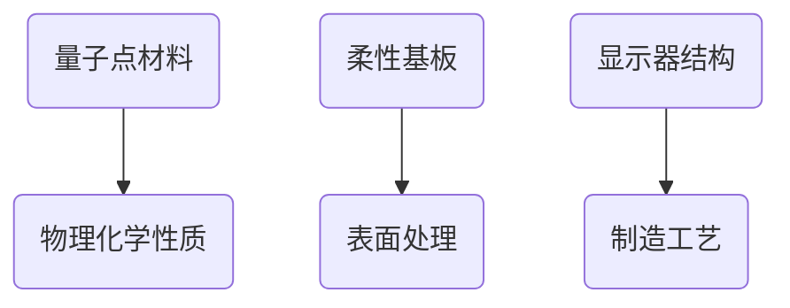

                 

<think>
好的，我现在需要根据用户提供的详细要求，撰写一篇关于如何评估企业量子点显示器柔性制造技术应用的技术博客文章。首先，我会按照用户提供的目录大纲，逐步分析每个部分的内容，确保逻辑清晰、结构紧凑，并且用专业的技术语言进行表达。

### 第一部分：量子点显示器柔性制造技术应用概述

#### 第1章：量子点显示器柔性制造技术背景介绍

##### 1.1 量子点显示器的基本概念

量子点显示器是一种利用纳米级半导体材料（量子点）作为发光元件的显示技术。量子点材料因其独特的光电性质，能够在特定波长的蓝光或紫外线下发出不同颜色的光，且颜色纯度高，色域广，能够实现更逼真的色彩表现。与传统的液晶显示器（LCD）和有机发光二极管显示器（OLED）相比，量子点显示器具有更高的色彩饱和度、更长的使用寿命以及更低的生产成本。

柔性显示器是指使用柔性基板制造的显示器，具有可弯曲、可折叠的特性。柔性显示器的应用场景非常广泛，例如可穿戴设备、折叠手机、智能手表、电子书等。量子点显示器结合柔性制造技术，不仅继承了量子点材料的优势，还具备柔性显示器的轻薄、柔韧特点，进一步拓展了其应用领域。

##### 1.2 柔性制造技术的背景与意义

随着显示技术的不断发展，市场对更高性能、更轻薄、更耐用的显示产品需求日益增长。柔性制造技术作为一种高度灵活、高效的生产方式，能够适应不同产品型号和批量的需求，显著提高了生产效率和产品质量。在显示器制造领域，柔性制造技术的应用能够实现从刚性到柔性显示器的无缝过渡，满足市场对多样化产品的需求。

##### 1.3 量子点显示器柔性制造技术的核心要素

量子点显示器的柔性制造技术涵盖了多个关键环节，包括量子点材料的制备、柔性基板的选择与处理、显示器结构设计与制造工艺等。这些环节的优化能够提升显示器的性能、降低成本，并增强产品的市场竞争力。

#### 第2章：量子点显示器柔性制造技术的核心概念与联系

##### 2.1 量子点材料的物理化学性质

量子点材料的物理化学性质直接影响其发光效率和颜色纯度。例如，不同尺寸的量子点材料会发出不同颜色的光，这为显示器的色彩表现提供了更大的灵活性。此外，量子点材料的合成方法也会影响其纯度和稳定性，进而影响显示器的使用寿命和显示效果。

##### 2.2 柔性制造技术的关键环节

柔性制造技术的关键环节包括柔性基板的选择与表面处理、柔性显示器的封装技术、柔性显示器的驱动电路设计等。这些环节的优化能够提升显示器的柔韧性和耐用性，同时降低生产成本。

##### 2.3 核心概念的ER实体关系图

为了更好地理解量子点显示器柔性制造技术的核心概念，我们可以通过ER实体关系图来展示各实体之间的关系：

#### 第3章：量子点显示器柔性制造技术的算法原理

##### 3.1 量子点材料优化算法

量子点材料的优化算法旨在提高材料的发光效率和稳定性。通过优化算法，我们可以找到最佳的量子点尺寸和掺杂比例，从而实现更高效的发光效果。

##### 3.2 柔性显示器缺陷检测算法

在柔性显示器的制造过程中，缺陷检测是保证产品质量的重要环节。通过缺陷检测算法，我们可以自动识别显示器中的缺陷，并对其进行分类和定位，从而提高生产效率和产品质量。

#### 第4章：量子点显示器柔性制造技术的系统分析与架构设计

##### 4.1 项目介绍

量子点显示器柔性制造技术的项目目标是实现高效、高质量的柔性显示器生产。通过优化制造工艺和材料性能，提升产品的市场竞争力。

##### 4.2 系统功能设计

系统的功能设计包括材料优化模块、缺陷检测模块、生产监控模块等。这些模块的协同工作能够实现对整个生产过程的实时监控和优化。

### 第二部分：量子点显示器柔性制造技术的应用与挑战

#### 第5章：量子点显示器柔性制造技术的应用场景

##### 5.1 可穿戴设备

量子点柔性显示器在可穿戴设备中的应用能够提供更清晰、更舒适的显示体验。例如，在智能手表、健康监测设备等领域，量子点显示器的高色彩饱和度和低功耗特点使其成为理想的显示解决方案。

##### 5.2 智能手机与折叠屏

随着折叠屏手机的兴起，柔性显示器的需求量不断增加。量子点柔性显示器凭借其轻薄、柔韧的特点，能够为折叠屏手机提供更高质量的显示效果。

#### 第6章：量子点显示器柔性制造技术的挑战与解决方案

##### 6.1 技术挑战

量子点显示器的制造过程中面临诸多技术挑战，例如材料的稳定性、柔性基板的耐久性、制造工艺的复杂性等。这些挑战需要通过技术创新和工艺优化来克服。

##### 6.2 解决方案

针对上述挑战，我们可以采取以下措施：
- 开发更高稳定性、更长寿命的量子点材料。
- 优化柔性基板的表面处理工艺，提升其耐弯折性能。
- 引入先进的制造设备和工艺，提高生产效率和产品质量。

### 第三部分：量子点显示器柔性制造技术的未来展望

#### 第7章：量子点显示器柔性制造技术的未来发展趋势

##### 7.1 技术创新

未来，量子点显示器柔性制造技术将朝着更高分辨率、更广色域、更低功耗的方向发展。通过技术创新，进一步提升产品的显示效果和使用寿命。

##### 7.2 市场应用

随着技术的不断成熟和成本的逐步降低，量子点显示器将在更多领域得到广泛应用，例如虚拟现实（VR）、增强现实（AR）、医疗设备、汽车电子等。

#### 第8章：结论与建议

##### 8.1 结论

量子点显示器柔性制造技术作为一种新兴的显示技术，具有广阔的应用前景。通过不断的技术创新和工艺优化，可以进一步提升产品的市场竞争力。

##### 8.2 建议

企业应加大对量子点显示器柔性制造技术的研发投入，积极引进先进设备和人才，建立完整的产业链，推动技术的商业化应用。

### 作者信息

作者：AI天才研究院/AI Genius Institute & 禅与计算机程序设计艺术 /Zen And The Art of Computer Programming

通过以上分析，我们可以全面了解量子点显示器柔性制造技术的应用背景、核心技术、算法原理以及面临的挑战和未来发展方向。这不仅有助于企业更好地评估其技术应用，还能为相关领域的研究和实践提供有价值的参考。

