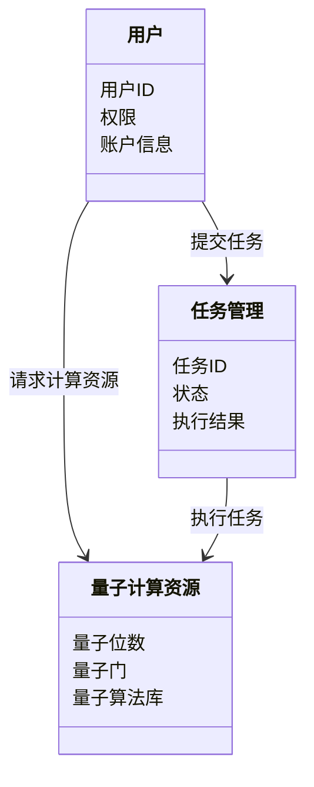
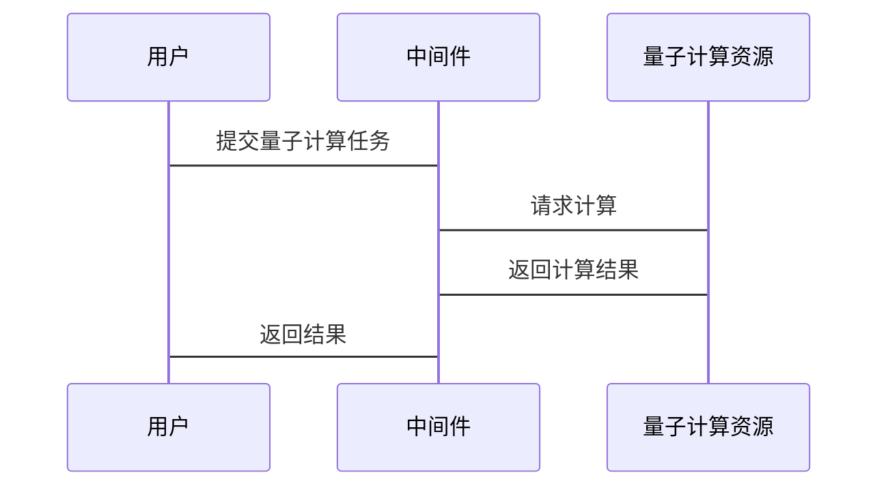

                 

# 如何评估企业的量子计算云服务

> 关键词：量子计算，云服务，评估方法，企业应用，技术原理

> 摘要：随着量子计算技术的快速发展，企业对量子计算云服务的需求日益增加。本文将从量子计算的基本原理、云服务的特点、评估维度、主流平台、方法论、系统架构、项目实战等多个方面，详细探讨如何科学、系统地评估企业的量子计算云服务。通过本文的分析，读者将能够全面了解量子计算云服务的核心要素，并掌握实际的评估方法。

---

## 第1章: 量子计算与云服务概述

### 1.1 量子计算的基本概念

#### 1.1.1 量子计算的定义

量子计算是一种基于量子力学原理的计算方式，与经典计算相比，其核心在于利用量子叠加和量子纠缠的特性来处理信息。量子计算机通过量子位（qubit）进行计算，能够在某些特定问题上远超经典计算机的性能。

#### 1.1.2 量子计算与经典计算的区别

- **量子叠加**：量子位可以同时处于多个状态的叠加态，而经典位只能是0或1。
- **量子纠缠**：两个或多个量子位之间可以形成纠缠状态，一个量子位的状态会直接影响另一个量子位的状态。
- **并行计算能力**：量子计算机能够在一次操作中处理大量可能性，而经典计算机需要通过多次迭代来实现。

#### 1.1.3 量子计算的核心原理

量子计算的核心在于量子态的叠加和纠缠。通过量子门（如Hadamard门、CNOT门等）对量子态进行操作，可以实现高效的并行计算。

### 1.2 云服务的发展与特点

#### 1.2.1 云服务的基本概念

云服务是一种通过互联网提供计算资源（如计算能力、存储、网络等）的服务模式，用户无需拥有物理硬件，即可按需使用这些资源。

#### 1.2.2 云服务的主要特点

- **按需使用**：用户可以根据需求灵活调整资源使用量。
- **多租户架构**：多个用户共享同一池资源，提高资源利用率。
- **弹性扩展**：可以根据负载自动调整资源分配。

#### 1.2.3 量子计算与云服务的结合

量子计算云服务将量子计算机的计算能力通过云平台提供给用户，用户可以通过API或远程访问的方式使用量子计算机。

### 1.3 企业为何需要评估量子计算云服务

#### 1.3.1 量子计算在企业中的应用前景

量子计算在密码学、优化问题、模拟等领域具有广泛应用潜力，能够解决一些经典计算机无法高效处理的问题。

#### 1.3.2 评估量子计算云服务的重要性

企业在选择量子计算云服务时，需要评估其性能、稳定性、安全性等关键指标，以确保其满足实际需求。

#### 1.3.3 企业面临的挑战与机遇

- **挑战**：量子计算技术尚不成熟，稳定性、成本等问题需要解决。
- **机遇**：早期采用量子计算技术的企业能够在未来竞争中占据优势。

---

## 第2章: 量子计算的核心原理

### 2.1 量子位与量子门

#### 2.1.1 量子位的定义与特点

量子位是量子计算的基本单位，可以处于0、1或两者的叠加态。与经典位不同，量子位的叠加态可以通过量子叠加原理表示。

#### 2.1.2 量子门的基本操作

- **Hadamard门**：将量子位从0或1状态变为叠加态。
- **CNOT门**：基于控制位的状态对目标位进行操作。

#### 2.1.3 量子电路的构建

量子电路由多个量子门和量子位组成，通过组合这些门可以实现复杂的量子算法。

### 2.2 量子算法与经典算法的对比

#### 2.2.1 常见量子算法介绍

- **Shor算法**：用于大整数分解，能够在多项式时间内解决这个问题。
- **Grover算法**：用于无序数据库的搜索问题，能够在平方根时间内找到目标。

#### 2.2.2 量子算法的优势与局限性

- **优势**：在某些特定问题上，量子算法的效率远超经典算法。
- **局限性**：目前量子算法的应用场景有限，且需要稳定的量子计算机支持。

#### 2.2.3 量子算法与经典算法的性能对比

通过对比Shor算法和经典算法在大整数分解问题上的性能，可以直观感受到量子计算的优势。

### 2.3 量子计算的数学基础

#### 2.3.1 量子态的表示

量子态可以通过向量表示，例如二维向量表示单量子位的状态。

$$
|0\rangle = \begin{bmatrix} 1 \\ 0 \end{bmatrix}, \quad |1\rangle = \begin{bmatrix} 0 \\ 1 \end{bmatrix}
$$

---

## 第3章: 量子计算云服务的评估维度

### 3.1 性能评估

#### 3.1.1 量子门的正确性

量子门的正确性是衡量量子计算机性能的重要指标，可以通过实验测量量子门的保真度。

#### 3.1.2 量子态的叠加与纠缠能力

量子计算机是否能够有效地生成和操作量子叠加和量子纠缠状态。

#### 3.1.3 并行计算能力

通过量子并行性，量子计算机能否在特定问题上显著提高计算速度。

### 3.2 稳定性评估

#### 3.2.1 量子错误率

量子计算机在操作过程中不可避免地会受到噪声和干扰的影响，导致错误的发生。

#### 3.2.2 系统容错能力

量子计算机是否具备纠错能力，能够在一定程度上纠正错误。

#### 3.2.3 系统稳定性

通过长时间运行测试，评估量子计算机的稳定性。

### 3.3 安全性评估

#### 3.3.1 量子加密的安全性

量子计算对现有加密算法的威胁，以及新的量子安全加密算法的研究进展。

#### 3.3.2 数据保护措施

量子计算云服务提供商是否采取了有效的数据保护措施，防止数据泄露。

#### 3.3.3 访问控制

云服务是否具备严格的访问控制机制，确保只有授权用户能够访问量子计算机。

### 3.4 易用性评估

#### 3.4.1 用户界面

量子计算云平台是否提供友好的用户界面，方便用户操作。

#### 3.4.2 API支持

平台是否提供丰富的API接口，方便用户集成到自己的系统中。

#### 3.4.3 文档与支持

平台是否提供详细的文档和技术支持，帮助用户解决问题。

### 3.5 成本效益评估

#### 3.5.1 资源定价

量子计算云服务的定价模式，是否合理。

#### 3.5.2 资源利用率

用户是否能够高效利用量子计算资源，避免浪费。

#### 3.5.3 总体拥有成本（TCO）

综合考虑硬件、软件、维护等成本，评估量子计算云服务的性价比。

---

## 第4章: 主流量子计算平台分析

### 4.1 IBM Q

#### 4.1.1 平台特点

IBM Q是目前较为成熟的量子计算云平台，提供多种量子位数和量子算法的实现。

#### 4.1.2 优缺点分析

优点：功能完善，支持多种量子算法；缺点：量子位数有限，稳定性有待提高。

### 4.2 AWS 量子计算服务

#### 4.2.1 平台特点

AWS与多家量子计算公司合作，提供多种量子计算服务。

#### 4.2.2 优缺点分析

优点：依托AWS的强大生态系统；缺点：量子计算资源有限，费用较高。

### 4.3 Google 的 Bristlecone

#### 4.3.1 平台特点

Google的量子计算机在特定问题上已经实现了量子霸权。

#### 4.3.2 优缺点分析

优点：性能强大；缺点：仅限于特定问题的计算。

---

## 第5章: 量子计算云服务的评估方法论

### 5.1 评估策略的制定

#### 5.1.1 需求分析

明确企业对量子计算云服务的需求，例如是否需要解决特定问题。

#### 5.1.2 指标权重设定

根据需求，确定评估指标的权重，例如性能占60%，稳定性占30%等。

#### 5.1.3 测试用例设计

设计具体的测试用例，覆盖所有评估指标。

### 5.2 评估结果的验证

#### 5.2.1 数据收集与分析

通过实际运行测试用例，收集数据并进行分析。

#### 5.2.2 指标评分

根据数据，对各个指标进行评分，最终得出总体评分。

#### 5.2.3 结果验证

验证评估结果的合理性和准确性。

---

## 第6章: 量子计算云服务的系统架构

### 6.1 系统功能设计

#### 6.1.1 功能模块

- 量子计算资源管理模块
- 用户管理模块
- 任务调度模块
- 数据存储模块

#### 6.1.2 领域模型（Mermaid 类图）

### 6.2 系统架构设计

#### 6.2.1 架构图（Mermaid 架构图）

### 6.3 系统接口设计

#### 6.3.1 接口交互（Mermaid 序列图）

---

## 第7章: 量子计算云服务的项目实战

### 7.1 项目背景

#### 7.1.1 项目目标

评估某量子计算云平台的性能和稳定性。

### 7.2 环境搭建

#### 7.2.1 硬件环境

需要高性能服务器和稳定的网络连接。

#### 7.2.2 软件环境

安装量子计算云平台的客户端和相关工具。

### 7.3 核心实现

#### 7.3.1 量子算法实现

实现一个简单的量子算法，例如量子搜索算法。

#### 7.3.2 性能测试

编写性能测试脚本，测试量子计算机的计算速度和稳定性。

### 7.4 数据收集与分析

#### 7.4.1 测试结果

通过测试脚本收集量子计算机的性能数据。

#### 7.4.2 数据分析

分析数据，评估量子计算机的性能和稳定性。

### 7.5 项目小结

总结项目实施过程中的经验教训，提出改进建议。

---

## 第8章: 最佳实践与小结

### 8.1 最佳实践

#### 8.1.1 选择合适的量子计算云平台

根据企业需求选择适合的平台，例如需要高性能的可以选择Google的量子计算机。

#### 8.1.2 定期评估

随着技术的发展，定期重新评估量子计算云服务的性能和稳定性。

#### 8.1.3 加强数据安全

重视数据保护和访问控制，防止数据泄露。

### 8.2 小结

通过本文的分析，读者可以全面了解量子计算云服务的评估方法，并掌握实际的评估技巧。未来，随着量子计算技术的不断发展，企业对量子计算云服务的需求也将进一步增加，因此科学的评估方法将帮助企业更好地利用这项技术。

---

## 作者：AI天才研究院/AI Genius Institute & 禅与计算机程序设计艺术 /Zen And The Art of Computer Programming

