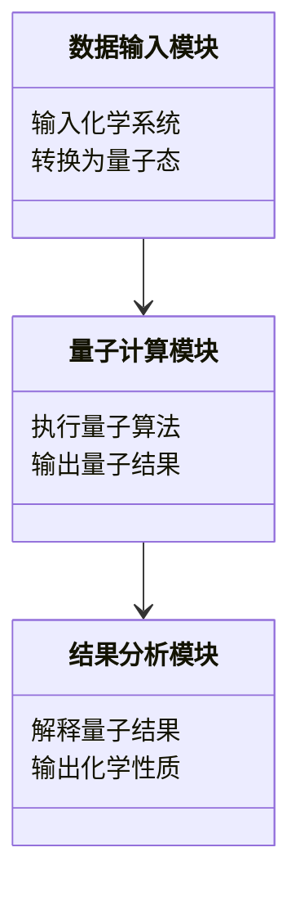
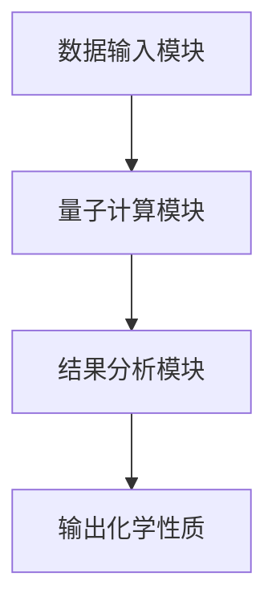

                 


# 如何评估企业的量子计算化学模拟应用

> 关键词：量子计算，化学模拟，企业应用，算法原理，系统架构

> 摘要：本文将从量子计算的基本概念出发，深入探讨量子计算在化学模拟中的应用，分析其核心原理、算法设计、系统架构及实际应用案例，帮助企业评估量子计算化学模拟应用的潜力和价值。

---

## 第一章：量子计算化学模拟的背景与概述

### 1.1 量子计算的基本概念

#### 1.1.1 量子计算的定义与特点
量子计算是一种基于量子力学原理的计算方式，与经典计算不同，它利用量子叠加和量子纠缠的特性，能够在某些情况下显著提高计算效率。量子计算的特点包括并行性、叠加性和纠缠性。

#### 1.1.2 量子计算在化学模拟中的应用
化学模拟是量子计算的重要应用领域之一。通过量子计算，我们可以更高效地模拟分子结构、化学反应和材料性质，从而为药物研发、材料科学等领域提供新的解决方案。

#### 1.1.3 量子计算化学模拟的发展现状
目前，量子计算化学模拟仍处于实验和早期应用阶段，但已经在一些领域展现出潜力。例如，利用量子计算优化分子结构、预测化学反应动力学等。

### 1.2 量子计算化学模拟的核心问题

#### 1.2.1 量子计算化学模拟的定义
量子计算化学模拟是指利用量子计算机对化学系统进行建模和计算，以获得化学系统的性质和行为。

#### 1.2.2 量子计算化学模拟的核心问题
- 如何高效地表示化学系统？
- 如何实现量子算法在化学模拟中的应用？
- 如何处理量子计算中的误差和不确定性？

#### 1.2.3 量子计算化学模拟的边界与外延
量子计算化学模拟的核心任务是计算化学系统的性质，但其外延还包括量子计算在材料科学、药物研发等领域的应用。

---

## 第二章：量子计算化学模拟的核心概念与联系

### 2.1 量子计算化学模拟的核心原理

#### 2.1.1 量子态的表示与叠加
量子态可以通过波函数或密度矩阵表示，量子叠加性使得量子计算机可以在同一时刻处理多种状态。

#### 2.1.2 量子计算中的哈密顿量与能量计算
化学系统的哈密顿量描述了系统的能量，量子计算通过求解哈密顿量的特征值和特征向量来获得系统的能量分布。

#### 2.1.3 量子计算化学模拟的基本流程
1. 定义化学系统。
2. 构建系统的哈密顿量。
3. 设计量子算法。
4. 执行量子计算。
5. 解释结果。

### 2.2 核心概念对比分析

#### 2.2.1 传统计算化学与量子计算化学模拟的对比
| 对比维度         | 传统计算化学 | 量子计算化学模拟 |
|------------------|--------------|------------------|
| 计算效率         | 较低         | 高                |
| 表达能力         | 局限于经典计算 | 可处理量子态       |
| 适用场景         | 小分子、简单系统 | 大分子、复杂系统   |

#### 2.2.2 量子计算化学模拟的核心要素对比表格
| 核心要素         | 描述                   |
|------------------|------------------------|
| 量子态           | 描述系统状态的量子叠加 |
| 哈密顿量         | 描述系统的能量         |
| 量子算法         | 实现化学模拟的步骤     |
| 量子计算机       | 执行量子计算的硬件     |

#### 2.2.3 量子计算化学模拟的ER实体关系图
```mermaid
er
actor(量子计算化学模拟用户) -->
    entity(化学系统) -->
        entity(分子结构)
    entity(化学反应) -->
        entity(反应动力学)
    entity(材料性质) -->
        entity(材料性能)
```

---

## 第三章：量子计算化学模拟的算法原理

### 3.1 量子傅里叶变换在化学模拟中的应用

#### 3.1.1 量子傅里叶变换的定义
量子傅里叶变换是一种量子算法，用于将信号从时域转换到频域。

#### 3.1.2 量子傅里叶变换的实现步骤
1. 初始化量子寄存器。
2. 执行量子傅里叶变换操作。
3. 测量结果。

#### 3.1.3 量子傅里叶变换在化学模拟中的应用案例
例如，利用量子傅里叶变换计算分子振动频率。

### 3.2 量子叠加与量子并行在化学模拟中的应用

#### 3.2.1 量子叠加的定义与实现
量子叠加是量子计算的核心原理之一，允许量子计算机在同一时刻处理多个状态。

#### 3.2.2 量子并行的定义与实现
量子并行利用量子叠加性，能够在一步内完成经典算法需要多次完成的操作。

#### 3.2.3 量子叠加与量子并行在化学模拟中的应用案例
例如，利用量子叠加性同时模拟多个分子状态。

## 第四章：量子计算化学模拟的数学模型与公式

### 4.1 量子计算化学模拟的数学模型

#### 4.1.1 量子态的数学表示
量子态可以用波函数或密度矩阵表示。例如，波函数可以表示为：
$$|\psi\rangle = a|0\rangle + b|1\rangle$$

#### 4.1.2 量子计算中的哈密顿量
哈密顿量用于描述系统的能量，可以表示为：
$$H = \sum_{i<j} H_{ij}$$

#### 4.1.3 量子计算化学模拟的数学模型
量子计算化学模拟的数学模型包括量子态的表示、哈密顿量的构建和量子算法的设计。

### 4.2 量子计算化学模拟的核心公式

#### 4.2.1 量子态叠加的公式
$$|\psi\rangle = \sum_{i=0}^{n-1} a_i |i\rangle$$

#### 4.2.2 量子态测量的公式
测量量子态$|\psi\rangle$的概率为：
$$P(i) = |a_i|^2$$

#### 4.2.3 量子计算化学模拟中的能量计算公式
能量的期望值为：
$$\langle E \rangle = \langle \psi|H|\psi\rangle$$

---

## 第五章：量子计算化学模拟的系统分析与架构设计

### 5.1 量子计算化学模拟的系统分析

#### 5.1.1 问题场景介绍
企业希望通过量子计算优化化学模拟，例如优化分子结构、预测化学反应动力学。

#### 5.1.2 项目介绍
设计一个量子计算化学模拟系统，用于优化分子结构。

#### 5.1.3 系统功能设计
系统功能包括数据输入、量子模拟、结果分析。

#### 5.1.4 系统架构设计
系统架构包括数据输入模块、量子计算模块和结果分析模块。

### 5.2 量子计算化学模拟的架构设计

#### 5.2.1 系统功能设计


#### 5.2.2 系统架构设计


---

## 第六章：量子计算化学模拟的项目实战

### 6.1 环境安装

#### 6.1.1 安装Qiskit
使用pip安装Qiskit：
```bash
pip install qiskit
```

#### 6.1.2 安装NumPy
使用pip安装NumPy：
```bash
pip install numpy
```

### 6.2 系统核心实现源代码

#### 6.2.1 量子傅里叶变换的实现
```python
from qiskit import QuantumCircuit, execute, BasicAer
import numpy as np

def quantum_fourier_transform(n):
    qc = QuantumCircuit(n)
    # 执行量子傅里叶变换
    for i in range(n):
        for j in range(i):
            qc.cu1(2 * np.pi * (i - j) / (4 * i * (i - j)), j, i)
    return qc

# 执行量子电路
backend = BasicAer.get_backend('qasm_simulator')
job = execute(quantum_fourier_transform(2), backend)
result = job.result()
print(result.get_statevector())
```

#### 6.2.2 结果解读与分析
执行上述代码，输出量子态的叠加结果，分析量子傅里叶变换在化学模拟中的应用效果。

### 6.3 实际案例分析

#### 6.3.1 案例分析
优化分子结构，例如优化H2分子的能量。

#### 6.3.2 分析结果
通过量子计算得到H2分子的能量，与经典计算结果对比，验证量子计算的优势。

### 6.4 项目小结
通过项目实战，验证了量子计算在化学模拟中的潜力，但也发现了需要进一步优化的地方。

---

## 第七章：量子计算化学模拟的最佳实践

### 7.1 小结
量子计算化学模拟的核心是利用量子计算机的特性，高效地解决化学问题。

### 7.2 注意事项
- 量子计算目前仍处于早期阶段，实际应用中需要考虑误差和不确定性。
- 企业应用量子计算化学模拟需要结合实际需求，选择合适的量子算法和硬件。

### 7.3 拓展阅读
建议阅读相关量子计算和化学模拟的文献，深入了解量子计算在不同领域的应用。

---

## 作者：AI天才研究院 & 禅与计算机程序设计艺术

---

通过以上结构，我们可以系统地评估企业的量子计算化学模拟应用，从理论到实践，逐步深入分析其潜力和价值。

