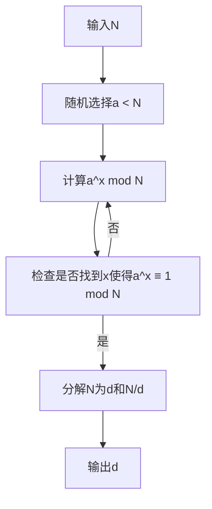
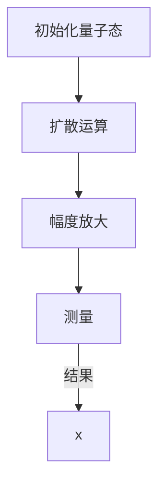

                 


# 如何评估企业的量子计算密码学应用

> 关键词：量子计算、密码学、安全性、加密算法、企业应用

> 摘要：本文详细探讨了如何评估企业在量子计算密码学应用中的安全性，包括量子计算的基本原理、核心算法、系统架构设计、项目实战案例以及未来发展趋势。通过深入分析，为企业在量子计算时代的密码学应用提供指导和建议。

---

## 第一部分: 量子计算密码学应用的背景与基础

### 第1章: 量子计算的基本概念

#### 1.1 量子计算的定义与特点
- **量子计算的定义**: 量子计算利用量子力学原理进行计算，主要依赖于量子位（qubit）的状态。
- **量子位的特点**: 量子位可以同时处于多个状态（叠加态），并通过量子纠缠实现信息的高效处理。
- **与经典计算的区别**: 量子计算在某些特定问题上的计算速度远超经典计算机，尤其是因式分解和搜索问题。

#### 1.2 密码学的基本概念
- **密码学的定义**: 研究信息加密、解密、签名等技术的学科。
- **对称加密与非对称加密的区别**: 对称加密使用相同的密钥加密和解密，非对称加密使用公钥和私钥，提供更高的安全性。
- **常见加密算法**: RSA、AES、椭圆曲线加密等。

#### 1.3 量子计算对密码学的影响
- **现有加密算法的威胁**: Shor算法可以高效分解大数，破坏RSA等基于因式分解的加密算法。
- **量子安全加密的需求**: 需要开发抗量子攻击的加密算法，如格密钥加密和代码签名加密。

---

### 第2章: 量子计算密码学的核心原理

#### 2.1 量子位与经典位的对比
- **量子位的叠加态**: $|0\rangle$, $|1\rangle$, $|+\rangle = \frac{1}{\sqrt{2}}(|0\rangle + |1\rangle)$, $|-\rangle = \frac{1}{\sqrt{2}}(|0\rangle - |1\rangle)$。
- **经典位的确定性**: 只能是0或1，无叠加态。

#### 2.2 量子算法在密码学中的应用
- **Shor算法**: 用于因式分解和大数分解，是量子计算攻击RSA的主要工具。
- **Grover算法**: 用于优化无结构问题的搜索，可能影响基于哈希的加密算法。
- **量子哈希算法**: 用于生成不可逆的哈希值，提供更高的安全性。

#### 2.3 量子计算密码学的安全性分析
- **量子密钥分发（QKD）**: 利用量子叠加和纠缠实现安全通信，理论上不可被窃听。
- **抗量子加密算法**: 需要通过数学证明确保其抗量子攻击能力，如NIST推荐的抗量子算法。

---

## 第二部分: 量子计算密码学的核心算法与数学模型

### 第3章: Shor算法的数学模型与流程图

#### 3.1 Shor算法的数学模型
- **Shor算法的数学模型**: 
  - 输入：整数N，求其因数分解。
  - 输出：随机找到一个因数d。
- **模运算**: 计算$a^x \mod N$，寻找x使得$a^x \equiv 1 \mod N$，从而分解N。

#### 3.2 Shor算法的流程图


#### 3.3 Grover算法的流程图


### 第4章: 量子计算密码学的系统架构与设计

#### 4.1 系统功能设计
- **需求分析**: 企业需要评估现有加密算法的抗量子攻击能力。
- **系统功能**: 包括加密算法的选择、安全性评估、系统迁移等。
- **领域模型**: 使用mermaid类图表示系统模块，如密钥管理、加密算法选择等。

#### 4.2 系统架构设计
- **分层架构**: 包括应用层、业务逻辑层、数据访问层。
- **模块设计**: 采用微服务架构，提供独立的服务如密钥生成、加密解密等。

#### 4.3 系统接口设计
- **API设计**: 提供RESTful API，如`/api/quantum-encryption/generate-key`。
- **交互过程**: 使用mermaid序列图描述用户与系统之间的交互流程。

---

## 第三部分: 量子计算密码学的项目实战

### 第5章: 项目环境与核心实现

#### 5.1 环境搭建
- **量子计算模拟器**: 使用Qiskit、Cirq等库搭建量子计算环境。
- **Python代码实现**: 安装必要的库如Qiskit、NumPy、Matplotlib。

#### 5.2 核心功能实现
- **Shor算法的实现**: 使用Qiskit编写量子因式分解代码。
  ```python
  from qiskit import QuantumCircuit, execute, Aer
  from qiskit.circuit import QuantumRegister, ClassicalRegister
  def shor_algorithm(N):
      n = (N.bit_length() + 1)
      a = 2
      qc = QuantumCircuit(n, n)
      # 实现Shor算法的量子部分
      # ...
      return qc
  ```

#### 5.3 代码解读与分析
- **代码结构**: 通过量子寄存器和经典寄存器实现Shor算法。
- **量子门操作**: 使用Hadamard、CNOT等门实现量子叠加和纠缠。

### 第6章: 案例分析与优化

#### 6.1 案例分析
- **案例背景**: 某企业使用RSA加密，评估其抗量子攻击能力。
- **评估过程**: 使用Shor算法模拟攻击，发现其因数分解时间显著缩短。
- **优化措施**: 迁移到抗量子加密算法，如格密钥加密。

#### 6.2 优化建议
- **技术路线**: 分阶段实施，先替换关键模块，再逐步迁移。
- **资源规划**: 投资于抗量子加密算法的研究和开发。

---

## 第四部分: 总结与展望

### 第7章: 总结

#### 7.1 核心内容总结
- 量子计算的快速发展对现有密码学提出了严峻挑战。
- 企业需要评估现有加密算法的抗量子能力，并提前部署抗量子算法。

#### 7.2 最佳实践
- 制定量子安全策略，逐步迁移系统。
- 加强量子计算人才培养，提升技术储备。

### 第8章: 未来展望

#### 8.1 量子计算密码学的发展趋势
- 抗量子加密算法的研究将加速。
- 量子计算与经典计算的结合将更加紧密。

#### 8.2 技术挑战
- 抗量子算法的标准化问题。
- 量子计算硬件的性能提升与成本降低。

---

## 作者：AI天才研究院/AI Genius Institute & 禅与计算机程序设计艺术 /Zen And The Art of Computer Programming

---

这篇文章通过详细分析量子计算密码学的核心原理、系统架构设计和实际案例，为企业提供了评估和应用量子计算密码学的实用指南。从基础概念到技术实现，再到项目实战，全面覆盖了企业在量子计算时代面临的挑战和解决方案。

