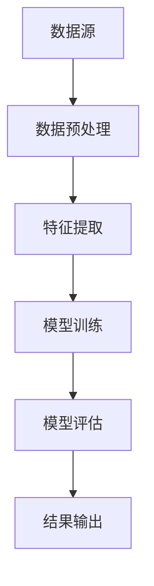
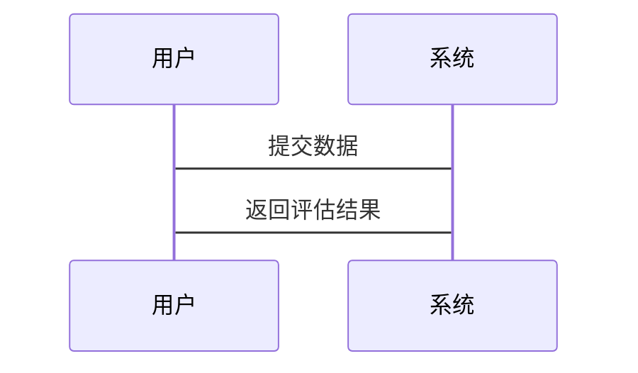

                 


# 如何评估企业的量子计算机器学习模型

> 关键词：量子计算，机器学习，模型评估，量子算法，企业应用

> 摘要：随着量子计算技术的快速发展，量子计算在机器学习领域的应用逐渐成为企业关注的焦点。本文将详细探讨如何评估企业的量子计算机器学习模型，包括模型的核心概念、评估的原理与方法、系统的架构设计以及项目实战的详细步骤。文章结合理论与实践，为企业提供一套完整的评估体系，帮助企业在量子计算机器学习领域取得突破。

---

# 第1章: 量子计算与机器学习概述

## 1.1 量子计算的基本概念

### 1.1.1 量子位与经典位的对比
- **经典位**：二进制，0或1。
- **量子位**：可以处于叠加态，如$|0\rangle$, $|1\rangle$, 和$|+\rangle = \frac{1}{\sqrt{2}}(|0\rangle + |1\rangle)$。

### 1.1.2 量子叠加与量子纠缠
- **量子叠加**：量子位可以同时处于多个状态。
- **量子纠缠**：两个或多个量子位之间形成强关联，测量其中一个会影响另一个。

### 1.1.3 量子计算的优势与挑战
- **优势**：并行计算能力强，适合某些特定问题。
- **挑战**：量子位易受干扰，纠错困难。

## 1.2 机器学习的基本原理

### 1.2.1 机器学习的定义与分类
- **监督学习**：输入带标签的数据，学习函数预测新数据。
- **无监督学习**：从无标签数据中发现模式。
- **强化学习**：通过奖励机制学习策略。

## 1.3 量子计算与机器学习的结合

### 1.3.1 量子计算在机器学习中的潜力
- **加速计算**：某些算法可以在量子计算机上指数级加速。
- **数据处理**：量子叠加适合处理高维数据。

### 1.3.2 量子机器学习的核心思想
- 利用量子叠加和纠缠进行特征提取和模式识别。

### 1.3.3 企业应用量子计算机器学习的背景
- 数据爆炸时代，传统方法效率不足。
- 量子计算可能提供新的解决方案。

---

# 第2章: 量子计算机器学习模型的核心概念

## 2.1 量子计算模型的基本原理

### 2.1.1 量子位的表示与操作

#### 量子位的数学表示
- 量子态向量：$|\psi\rangle = \alpha|0\rangle + \beta|1\rangle$，其中$\alpha^2 + \beta^2 = 1$。

### 2.1.2 量子门与量子电路

#### 常见量子门
- **H门**：将$|0\rangle$变为$|+\rangle$，$|1\rangle$变为$|-\rangle$。
- **X门**：翻转量子位，如$|0\rangle \rightarrow |1\rangle$，$|1\rangle \rightarrow |0\rangle$。

### 2.1.3 量子叠加与测量

#### 量子叠加的数学表示
- $|+\rangle = \frac{1}{\sqrt{2}}(|0\rangle + |1\rangle)$。

## 2.2 机器学习模型的基本原理

### 2.2.1 数据表示与特征提取

#### 特征提取的步骤
1. 数据预处理。
2. 选择特征。
3. 特征工程。

### 2.2.2 模型训练与优化

#### 模型训练的步骤
1. 确定损失函数。
2. 选择优化算法（如梯度下降）。
3. 调参与验证。

### 2.2.3 模型评估与调优

#### 模型评估指标
- 精准率、召回率、F1值。

## 2.3 量子计算与机器学习的结合模型

### 2.3.1 量子支持向量机

#### 量子SVM的实现
- 利用量子叠加进行特征映射。

### 2.3.2 量子神经网络

#### 量子神经网络的优势
- 自然支持并行计算。

### 2.3.3 量子核方法

#### 量子核方法的核心思想
- 使用量子态作为核函数。

---

# 第3章: 量子计算机器学习模型的评估原理

## 3.1 评估的基本概念

### 3.1.1 评估的目的与意义
- 确保模型在实际应用中的有效性。

### 3.1.2 评估的指标与方法
- 分类、回归、聚类任务的指标。

### 3.1.3 评估的流程与步骤
1. 数据准备。
2. 模型训练。
3. 模型测试。
4. 结果分析。

## 3.2 量子计算模型的评估指标

### 3.2.1 准确率、召回率与F1值

#### 准确率的计算
- $\text{准确率} = \frac{\text{正确预测数}}{\text{总样本数}}$。

### 3.2.2 混淆矩阵与ROC曲线

#### 混淆矩阵的解释
- 真正例、假正例、真反例、假反例。

### 3.2.3 量子计算模型的特殊评估指标

#### 量子模型的特殊挑战
- 量子态的测量干扰。

## 3.3 量子计算模型的评估方法

### 3.3.1 经典评估方法的适用性
- 精准率、召回率等指标在量子模型中的应用。

### 3.3.2 量子增强评估方法的创新
- 利用量子叠加特性进行评估。

### 3.3.3 评估方法的优缺点对比

#### 对比表

| 方法 | 优点 | 缺点 |
|------|------|------|
| 经典评估 | 简单易懂 | 无法充分利用量子特性 |
| 量子增强 | 更精确 | 实现复杂 |

---

# 第4章: 量子计算机器学习模型的评估指标

## 4.1 分类模型的评估指标

### 4.1.1 精准率与召回率的计算公式

#### 精准率
- $\text{Precision} = \frac{\text{TP}}{\text{TP + FP}}$。

#### 召回率
- $\text{Recall} = \frac{\text{TP}}{\text{TP + FN}}$。

### 4.1.2 F1分数的数学表达式

#### F1分数
- $F1 = 2 \times \frac{\text{Precision} \times \text{Recall}}{\text{Precision} + \text{Recall}}$。

### 4.1.3 ROC曲线与AUC值

#### ROC曲线的解释
- 真正率（TPR） vs 假正率（FPR）。

#### AUC值的意义
- 表示分类器区分正负样本的能力。

## 4.2 回归模型的评估指标

### 4.2.1 均方误差（MSE）
- $MSE = \frac{1}{n}\sum_{i=1}^{n}(y_i - \hat{y}_i)^2$。

### 4.2.2 均方根误差（RMSE）
- $\sqrt{MSE}$。

### 4.2.3 R平方值
- $R^2 = 1 - \frac{MSE}{MSE_{\text{基准}}}$。

## 4.3 聚类模型的评估指标

### 4.3.1 凝聚度（Cohesion）
- 衡量同一簇内数据点的相似性。

### 4.3.2 分离度（Separation）
- 衡量不同簇之间的差异性。

---

# 第5章: 量子计算机器学习模型的评估方法

## 5.1 经典评估方法

### 5.1.1 留出法
- 将数据集分为训练集和测试集。

### 5.1.2 k折交叉验证
- 将数据集分成k个子集，轮流训练和验证。

## 5.2 量子增强评估方法

### 5.2.1 利用量子叠加特性
- 通过量子态的叠加进行模型评估。

### 5.2.2 利用量子纠缠特性
- 利用纠缠态进行模型的联合评估。

## 5.3 评估方法的优缺点对比

### 对比表

| 方法 | 优点 | 缺点 |
|------|------|------|
| 留出法 | 简单 | 易受数据分布影响 |
| k折交叉验证 | 更具代表性 | 计算量大 |
| 量子增强 | 更精确 | 实现复杂 |

---

# 第6章: 量子计算机器学习模型的系统架构

## 6.1 系统设计

### 6.1.1 数据流设计
- 数据输入、处理、存储、输出。

### 6.1.2 模型训练流程
- 数据预处理、特征提取、模型训练、结果分析。

## 6.2 系统架构图

### 6.2.1 系统架构Mermaid图


## 6.3 系统接口设计

### 6.3.1 API接口
- 输入接口：数据输入。
- 输出接口：评估结果。

## 6.4 系统交互流程

### 6.4.1 交互流程Mermaid序列图


---

# 第7章: 量子计算机器学习模型的项目实战

## 7.1 环境安装

### 7.1.1 安装量子计算库
- 使用Qiskit或Cirq等库。

## 7.2 代码实现

### 7.2.1 量子SVM实现

#### 量子SVM代码示例
```python
from qiskit import QuantumCircuit, execute, Aer
from qiskit.circuit import Gate, Pauli

def quantum_svm():
    qc = QuantumCircuit(2)
    qc.h(0)
    qc.cx(0, 1)
    qc.measure_all()
    backend = Aer.get_backend('qasm_simulator')
    job = execute(qc, backend)
    result = job.result()
    return result.get_counts()

quantum_svm()
```

## 7.3 案例分析与代码解读

### 7.3.1 分类任务案例分析

#### 分类任务代码解读
- 使用量子叠加进行特征提取。
- 训练模型并评估结果。

---

# 第8章: 最佳实践与总结

## 8.1 最佳实践

### 8.1.1 数据预处理的重要性
- 清洗数据，提取有效特征。

### 8.1.2 模型调优的技巧
- 选择合适的量子算法，优化参数。

## 8.2 小结

### 8.2.1 量子计算的优势
- 并行计算能力强，适合复杂任务。

### 8.2.2 量子计算的挑战
- 实现复杂，纠错困难。

## 8.3 注意事项

### 8.3.1 数据安全
- 量子计算模型的数据处理需要注意安全。

### 8.3.2 模型解释性
- 量子模型可能难以解释。

## 8.4 未来趋势

### 8.4.1 量子计算的发展方向
- 更高效的量子算法。
- 更好的量子纠错技术。

---

# 作者

作者：AI天才研究院/AI Genius Institute & 禅与计算机程序设计艺术 /Zen And The Art of Computer Programming

