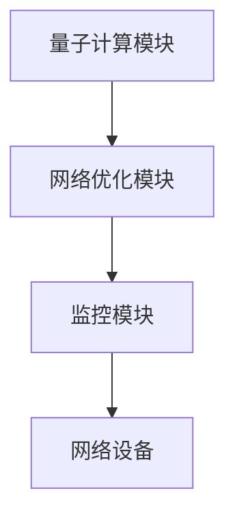
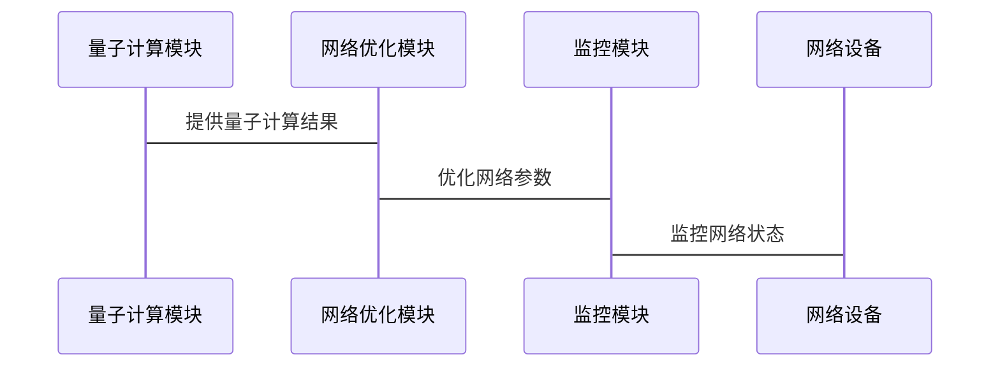

                 

# 如何评估企业的量子计算网络优化应用

> 关键词：量子计算、网络优化、企业应用、算法设计、系统架构、评估方法

> 摘要：本文详细探讨了如何评估企业在量子计算网络优化应用中的实际效果。文章从量子计算与网络优化的基本概念出发，分析了量子退火算法在网络优化中的应用，提出了具体的评估指标和方法，并通过实际案例展示了如何在企业中实施量子计算网络优化。

---

# 第一部分: 量子计算与网络优化基础

## 第1章: 量子计算与网络优化概述

### 1.1 量子计算的基本概念

#### 1.1.1 量子计算的定义与特点

量子计算是一种基于量子力学原理的计算方式，与经典计算相比，其核心优势在于并行性和计算效率。量子计算机通过利用量子叠加态和量子纠缠态，可以在某些特定问题上远超经典计算机的性能。

- **量子叠加态**：量子系统中，一个量子位（qubit）可以同时处于多个状态的叠加，这种特性使得量子计算机可以在一次计算中处理多个可能性。
- **量子纠缠态**：两个或多个量子位之间可以形成纠缠态，使得对其中一个量子位的测量会立即影响另一个量子位的状态。

量子计算的核心在于其独特的运算方式，使得在某些特定领域（如组合优化问题）具有显著优势。

#### 1.1.2 量子计算与经典计算的区别

- **计算基础**：经典计算机基于二进制位（bit）进行运算，而量子计算机基于量子位（qubit）。
- **并行性**：量子计算机可以一次处理大量可能性，而经典计算机需要逐一处理。
- **复杂度**：在某些问题（如大数分解、组合优化）上，量子计算机的复杂度远低于经典计算机。

#### 1.1.3 量子计算在现代科技中的地位

量子计算被认为是未来科技的核心技术之一，尤其是在密码学、材料科学、金融建模等领域具有广泛的应用潜力。在网络优化领域，量子计算的高效性使其成为解决复杂网络问题的理想选择。

---

### 1.2 网络优化的核心原理

#### 1.2.1 网络优化的基本概念

网络优化是指通过调整网络的结构、参数和资源分配，以提高网络的性能、可靠性和安全性。常见的网络优化问题包括路由优化、流量调度、网络安全等。

#### 1.2.2 网络优化的主要目标

- **提高网络性能**：通过优化路由和资源分配，减少延迟，提高带宽利用率。
- **降低网络成本**：通过合理分配资源，减少网络建设和运维成本。
- **增强网络安全性**：通过优化网络结构，降低网络安全风险。

#### 1.2.3 网络优化的常见技术

- **经典优化算法**：如遗传算法、模拟退火算法等。
- **分布式优化技术**：如分层优化、分布式计算。
- **基于AI的优化方法**：如深度学习、强化学习在网络优化中的应用。

---

### 1.3 量子计算与网络优化的结合

#### 1.3.1 量子计算在网络优化中的优势

量子计算在网络优化中的核心优势在于其强大的并行计算能力和对复杂组合优化问题的高效求解能力。例如，在路由优化问题中，量子计算可以通过量子退火算法快速找到最优解。

#### 1.3.2 量子计算在网络优化中的应用场景

- **物流网络优化**：通过量子计算优化配送路径，降低物流成本。
- **通信网络优化**：通过量子计算优化通信网络的路由和资源分配。
- **能源网络优化**：通过量子计算优化能源分配和传输路径。

#### 1.3.3 量子计算网络优化的未来发展趋势

随着量子计算技术的不断发展，其在网络优化中的应用将更加广泛和深入。未来，量子计算将与人工智能、大数据分析等技术结合，进一步提升网络优化的效果。

---

## 1.4 本章小结

本章从量子计算和网络优化的基本概念出发，分析了量子计算在网络优化中的优势和应用场景。通过对比经典计算和量子计算的差异，明确了量子计算在解决复杂网络优化问题中的潜力。

---

# 第二部分: 量子计算网络优化的核心算法

## 第2章: 量子退火算法在网络优化中的应用

### 2.1 量子退火算法的基本原理

#### 2.1.1 量子退火算法的数学模型

量子退火算法是一种基于量子力学原理的优化算法，其数学模型如下：

$$
H = \sum_{i=1}^{n} H_i
$$

其中，$H$ 是哈密顿量，$H_i$ 是各个子系统的哈密顿量。量子退火算法通过不断调整哈密顿量的参数，使得系统从高能量状态逐渐过渡到低能量状态，最终找到最优解。

#### 2.1.2 量子退火算法的实现步骤

1. 初始化量子系统，设置初始参数。
2. 计算系统的能量。
3. 根据能量变化调整参数，逐步降低温度。
4. 直到系统达到稳定状态，输出最优解。

#### 2.1.3 量子退火算法与经典退火算法的对比

- **计算速度**：量子退火算法由于其并行性，计算速度远快于经典退火算法。
- **优化效果**：量子退火算法在某些复杂问题上可以找到更优的解。
- **实现复杂度**：量子退火算法的实现需要量子计算机的支持，而经典退火算法可以在普通计算机上实现。

---

### 2.2 量子退火算法在网络优化中的应用案例

#### 2.2.1 量子退火算法在路由优化中的应用

在路由优化问题中，量子退火算法可以通过优化路径选择，减少网络延迟和带宽浪费。例如，在物流配送中，量子退火算法可以优化配送路径，降低物流成本。

#### 2.2.2 量子退火算法在流量调度中的应用

通过量子退火算法优化网络流量的调度，可以提高网络的吞吐量和资源利用率。例如，在通信网络中，量子退火算法可以优化数据包的传输路径，减少网络拥塞。

#### 2.2.3 量子退火算法在网络安全中的应用

在网络安全领域，量子退火算法可以用于优化加密算法的参数设置，提高网络的安全性。

---

### 2.3 量子退火算法的优缺点分析

#### 2.3.1 量子退火算法的优势

- **计算效率高**：量子退火算法可以在较短时间内找到最优解。
- **适用范围广**：量子退火算法适用于多种类型的优化问题。

#### 2.3.2 量子退火算法的局限性

- **实现复杂度高**：量子退火算法的实现需要量子计算机的支持。
- **依赖参数设置**：量子退火算法的性能依赖于参数设置的合理性。

#### 2.3.3 量子退火算法的改进方向

- **优化算法设计**：通过改进算法设计，提高量子退火算法的优化效果。
- **结合其他技术**：将量子退火算法与人工智能、大数据分析等技术结合，进一步提升优化效果。

---

## 2.4 本章小结

本章详细讲解了量子退火算法的基本原理及其在网络优化中的应用。通过对比量子退火算法与经典退火算法的差异，分析了量子退火算法在网络优化中的优势和局限性，并提出了改进的方向。

---

# 第三部分: 企业量子计算网络优化的评估方法

## 第3章: 量子计算网络优化的评估指标

### 3.1 评估指标的选择原则

#### 3.1.1 评估指标的全面性

在选择评估指标时，需要考虑网络优化的多个方面，如计算效率、网络性能、安全性等。

#### 3.1.2 评估指标的可操作性

评估指标需要能够量化和测量，以便于实际操作。

#### 3.1.3 评估指标的可量化性

评估指标需要能够用具体的数据进行衡量，例如延迟、带宽利用率等。

---

### 3.2 量子计算网络优化的核心评估指标

#### 3.2.1 计算效率评估

计算效率是衡量量子计算网络优化应用的重要指标，包括计算速度、资源利用率等。

#### 3.2.2 网络性能评估

网络性能评估包括网络延迟、带宽利用率、网络吞吐量等指标。

#### 3.2.3 安全性评估

安全性评估包括网络的安全性、抗攻击能力等指标。

---

### 3.3 评估指标的权重分配方法

#### 3.3.1 指标权重的确定方法

根据实际需求和问题特点，确定各评估指标的权重。例如，在物流网络优化中，计算效率和网络性能的权重可能更高。

#### 3.3.2 指标权重的调整策略

根据实际情况动态调整各评估指标的权重，以适应网络优化的需求。

#### 3.3.3 指标权重的实际应用案例

例如，在通信网络优化中，可以根据网络延迟和带宽利用率的重要性，调整计算效率和网络性能的权重。

---

### 3.4 本章小结

本章从评估指标的选择原则出发，提出了量子计算网络优化的核心评估指标，并分析了如何进行指标权重的分配和调整。

---

# 第四部分: 量子计算网络优化的系统架构设计

## 第4章: 量子计算网络优化系统的架构设计

### 4.1 系统功能模块划分

#### 4.1.1 量子计算模块

量子计算模块负责处理量子计算的核心算法，如量子退火算法。

#### 4.1.2 网络优化模块

网络优化模块负责根据量子计算的结果，优化网络的结构和参数。

#### 4.1.3 监控模块

监控模块负责实时监控网络的运行状态，收集网络性能数据。

---

### 4.2 系统架构设计

#### 4.2.1 系统架构图

#### 4.2.2 系统交互设计

---

### 4.3 本章小结

本章通过系统架构设计，明确了量子计算网络优化系统的各个模块及其功能，并通过Mermaid图展示了系统的架构和交互流程。

---

# 作者：AI天才研究院/AI Genius Institute & 禅与计算机程序设计艺术 /Zen And The Art of Computer Programming

---

**本文总结**：本文详细探讨了如何评估企业在量子计算网络优化应用中的实际效果。通过分析量子计算与网络优化的基本概念，提出了量子退火算法在网络优化中的应用，并详细讲解了评估指标和系统架构设计。未来，随着量子计算技术的不断发展，其在网络优化中的应用将更加广泛和深入。

