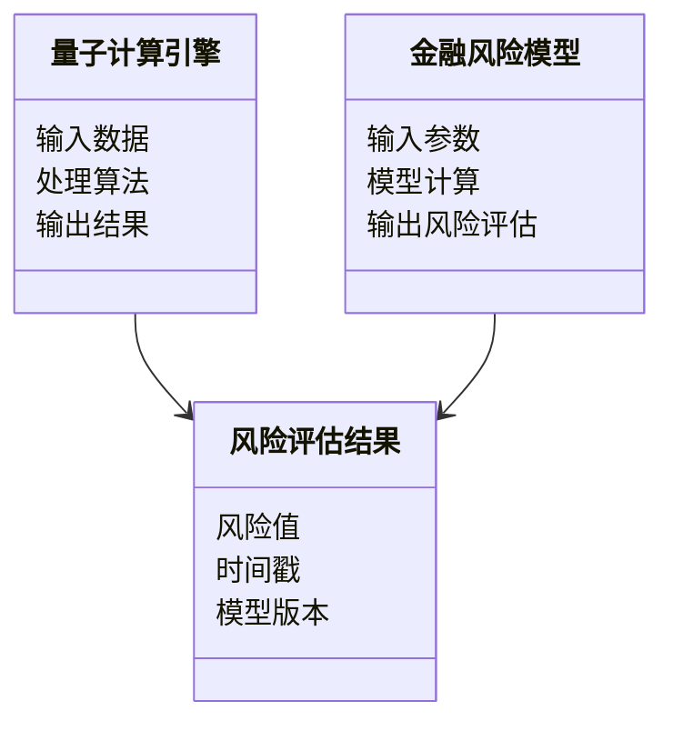

                 


# 如何评估企业的量子计算金融风险建模应用

> 关键词：量子计算、金融风险建模、企业评估、风险管理、技术实现

> 摘要：本文将深入探讨如何评估企业量子计算在金融风险建模中的应用。通过详细分析量子计算的核心原理、金融风险建模的方法以及两者结合的实际应用，本文旨在为企业提供一套系统化的评估框架，帮助企业在实际应用中最大化量子计算的优势，降低金融风险。

---

## 第一部分: 量子计算与金融风险建模的背景介绍

### 第1章: 量子计算的背景与现状

#### 1.1 量子计算的基本概念
量子计算是一种基于量子力学原理的计算方式，与经典计算相比，其核心优势在于并行计算能力和对某些复杂问题的指数级加速能力。量子计算的基本单元是量子位（qubit），它可以同时处于多个状态的叠加态。

#### 1.2 量子计算的优势与挑战
量子计算的优势在于其强大的并行计算能力，能够在某些领域（如因式分解、优化问题）显著优于经典计算。然而，量子计算的实现仍然面临诸多挑战，包括量子噪声、纠错技术不成熟以及硬件实现的复杂性。

#### 1.3 量子计算在金融领域的应用潜力
金融领域是量子计算最早被关注的应用领域之一。量子计算在金融风险评估、投资组合优化、市场预测等方面具有巨大潜力，尤其是在处理海量数据和复杂模型时，量子计算的优势更加明显。

### 第2章: 金融风险建模的基本原理

#### 2.1 金融风险的定义与分类
金融风险通常指在金融活动中由于市场波动、信用违约、流动性风险等因素导致的损失。主要的金融风险包括市场风险、信用风险、流动性风险和操作风险。

#### 2.2 传统金融风险建模方法
传统的金融风险建模方法主要包括VaR（Value at Risk）模型和CVaR（Conditional Value at Risk）模型。这些方法基于历史数据和统计模型，能够较好地描述金融市场的波动性，但在处理复杂非线性关系时存在局限性。

#### 2.3 量子计算在金融风险建模中的应用前景
量子计算的引入为金融风险建模提供了新的可能性，尤其是在处理高维问题和复杂非线性关系时，量子计算的优势更加突出。通过量子算法，可以显著提高风险评估的精度和效率。

---

## 第二部分: 量子计算与金融风险建模的核心概念

### 第3章: 量子计算的核心概念与原理

#### 3.1 量子叠加
量子叠加是指量子系统处于多个状态的叠加态，例如著名的双缝实验中，光子可以同时通过两条路径。在量子计算中，叠加态可以表示多个可能的计算路径。

$$ | \psi \rangle = \alpha |0\rangle + \beta |1\rangle $$

其中，$|\alpha|^2 + |\beta|^2 = 1$。

#### 3.2 量子纠缠
量子纠缠是指两个或多个量子系统之间存在强关联，其中一个系统的状态会直接影响另一个系统的状态。纠缠态是量子计算的核心资源之一。

$$ | \psi \rangle = \frac{1}{\sqrt{2}} (|01\rangle + |10\rangle) $$

#### 3.3 量子测量
量子测量是指对量子系统进行观测并获得确定性结果的过程。测量会破坏量子叠加态，使得系统坍缩到一个特定的状态。

#### 3.4 量子算法的分类与特点
量子算法可以分为确定性和概率性两类。确定性算法在多项式时间内保证正确结果，而概率性算法则需要多次运行以提高正确性。量子算法在某些问题（如因式分解、优化问题）上的计算复杂度显著低于经典算法。

### 第4章: 量子计算在金融建模中的应用

#### 4.1 量子线性方程组求解
量子线性方程组求解算法（如HHL算法）可以在量子计算机上以对数时间复杂度解决问题。这对于金融建模中的大规模线性方程组求解非常有用，例如在信用风险评估中。

$$ A|x\rangle = |b\rangle $$

#### 4.2 量子傅里叶变换
量子傅里叶变换（QFT）是量子计算中的一个重要工具，广泛应用于信号处理和加密算法中。在金融建模中，QFT可以用于频谱分析和信号处理。

#### 4.3 量子优化算法
量子优化算法（如量子模拟退火）在处理组合优化问题时表现优异，适用于投资组合优化、路径规划等问题。

---

## 第三部分: 量子计算金融风险建模的算法原理

### 第5章: 量子算法的数学模型

#### 5.1 量子傅里叶变换的数学表达
量子傅里叶变换的变换矩阵可以表示为：

$$ QFT = \frac{1}{\sqrt{2^n}} \sum_{x=0}^{2^n-1} e^{2\pi i xk/2^n} |x\rangle \langle k| $$

其中，$n$是量子位数，$k$是频率索引。

#### 5.2 量子线性方程组求解的算法步骤
HHL算法的步骤如下：
1. 将线性方程组表示为量子态形式。
2. 对输入态进行量子变换，得到解的量子态。
3. 测量结果，得到解。

#### 5.3 量子优化算法的实现
量子模拟退火算法通过量子叠加和量子跳跃进行状态变换，最终收敛到最优解。

---

## 第四部分: 量子计算金融风险建模的系统架构设计

### 第6章: 系统功能设计

#### 6.1 领域模型设计
以下是金融风险建模的领域模型类图：



#### 6.2 系统架构设计
以下是系统的架构图：


---

## 第五部分: 项目实战与总结

### 第7章: 项目实战

#### 7.1 环境安装
需要安装Qiskit库：

```bash
pip install qiskit
```

#### 7.2 核心实现代码
以下是一个量子线性方程组求解的示例代码：

```python
from qiskit import QuantumCircuit, Aer, execute
from qiskit.aqua import QuantumAlgorithm, aqua_circuits
from qiskit.aqua.algorithms import HHL

# 设置参数
n = 2
A = [[2, 1], [1, 2]]
b = [3, 4]

# 定义量子算法
hhl = HHL(n, A, b)

# 执行计算
backend = Aer.get_backend('qasm_simulator')
job = execute(hhl.create_circuit(), backend)
result = job.result()

# 获取结果
print(result)
```

#### 7.3 案例分析
通过上述代码，可以计算出线性方程组的解，并应用于金融风险评估中。

### 第8章: 总结与展望

#### 8.1 总结
本文详细介绍了如何评估企业量子计算在金融风险建模中的应用，从理论基础到实际应用，为读者提供了全面的指导。

#### 8.2 展望
随着量子计算技术的不断发展，未来在金融风险建模中的应用将更加广泛和深入。企业需要持续关注技术进展，优化模型和系统架构，以充分发挥量子计算的优势。

---

## 作者：AI天才研究院 & 禅与计算机程序设计艺术

