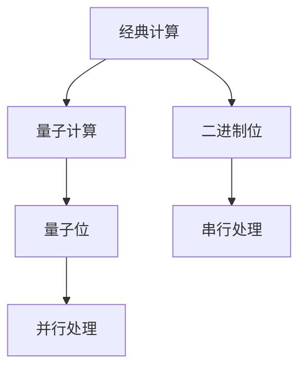
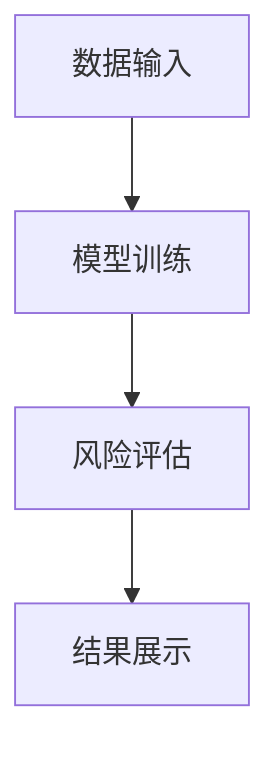

                 


# 如何评估企业的量子计算金融风险模型

**关键词**：量子计算、金融风险模型、风险评估、量子算法、金融优化

**摘要**：随着量子计算技术的快速发展，其在金融领域的应用潜力逐渐显现。本文旨在探讨如何评估企业中的量子计算金融风险模型，从量子计算的基本原理、金融风险模型的构建、量子计算在金融风险评估中的应用，到具体的评估方法和系统架构设计，逐步展开分析。通过结合理论与实践，本文为企业在量子计算金融风险模型的评估和应用中提供系统的指导和参考。

---

## 第一部分: 量子计算与金融风险评估的背景

### 第1章: 量子计算的基本概念

#### 1.1 量子计算的定义与特点
量子计算是一种基于量子力学原理的计算方式，与经典计算相比，其核心优势在于量子叠加和量子纠缠的特性。量子计算机能够在某些特定问题上远超经典计算机的计算能力，尤其是在处理复杂金融问题时展现出巨大潜力。

#### 1.2 量子计算与经典计算的区别
| 特性       | 经典计算                     | 量子计算                     |
|------------|------------------------------|-------------------------------|
| 基础       | 二进制位（0或1）             | 量子位（可以是0、1或两者叠加）|
| 并行计算    | 串行处理                    | 并行处理（量子叠加）          |
| 处理速度    | 受摩尔定律限制               | 在某些问题上指数级加速        |

#### 1.3 量子计算的优势与挑战
- **优势**：能够处理复杂的金融优化问题，如组合优化、风险管理等。
- **挑战**：量子计算的硬件实现难度大，且目前仍处于早期发展阶段。

### 第2章: 金融风险模型的构建与评估

#### 2.1 金融风险模型的定义
金融风险模型是用来量化和预测金融资产或投资组合在不同市场条件下的风险程度的工具。常见的金融风险模型包括VaR（Value at Risk）和CVaR（Conditional Value at Risk）等。

#### 2.2 金融风险模型的构建过程
1. **数据收集**：收集历史市场数据、资产价格波动等。
2. **模型选择**：选择合适的金融风险模型（如VaR、CVaR）。
3. **参数设置**：根据数据设定模型参数。
4. **模型训练与验证**：通过历史数据训练模型，并验证其准确性。

### 第3章: 量子计算在金融领域的应用

#### 3.1 量子计算在金融中的潜力
量子计算在金融领域的应用主要体现在以下方面：
- **优化问题**：如投资组合优化、资产分配等。
- **风险管理**：通过量子算法提高风险模型的计算效率和准确性。

#### 3.2 量子计算与金融风险评估的结合
量子计算可以通过其强大的并行计算能力，显著提高金融风险模型的评估效率。例如，利用量子算法优化VaR或CVaR模型，能够在更短的时间内找到最优解。

---

## 第二部分: 量子计算的核心原理与数学模型

### 第4章: 量子计算的核心原理

#### 4.1 量子叠加与量子纠缠
- **量子叠加**：量子位可以同时处于多个状态的叠加态，这使得量子计算机能够并行处理大量可能性。
- **量子纠缠**：多个量子位之间可以形成纠缠态，使得其中一个量子位的状态能够直接影响另一个量子位的状态。

#### 4.2 量子计算的核心概念对比


### 第5章: 量子计算的数学模型

#### 5.1 量子态的数学表示
量子态可以表示为向量空间中的向量，例如：
$$
|\psi\rangle = a|0\rangle + b|1\rangle
$$
其中，$a$ 和 $b$ 是复数，满足归一化条件 $|a|^2 + |b|^2 = 1$。

#### 5.2 量子门与量子电路
- **Hadamard门**：用于生成量子叠加态，其矩阵表示为：
$$
H = \frac{1}{\sqrt{2}} \begin{bmatrix}
1 & 1 \\
1 & -1
\end{bmatrix}
$$

#### 5.3 量子算法的数学模型
例如，量子傅里叶变换（QFT）用于量子相位估计，其核心思想是将问题转化为寻找特定频率的分量。

---

## 第三部分: 金融风险模型的构建与评估方法

### 第6章: 金融风险模型的构建

#### 6.1 金融风险因素的分析
- **市场风险**：资产价格波动对投资组合的影响。
- **信用风险**：债务人违约的可能性。
- **操作风险**：内部操作失误导致的损失。

#### 6.2 金融风险模型的构建过程
1. **数据预处理**：清洗和归一化数据。
2. **模型选择**：选择适合的金融风险模型。
3. **参数调优**：通过回测优化模型参数。

### 第7章: 量子计算在金融风险评估中的应用

#### 7.1 量子计算在金融风险评估中的优势
- **计算速度**：量子计算机能够快速处理复杂的金融模型。
- **优化能力**：量子算法能够优化投资组合，降低风险。

#### 7.2 量子计算与金融风险模型的结合
- **量子优化算法**：用于寻找最优投资组合。
- **量子模拟算法**：用于模拟复杂的金融市场行为。

---

## 第四部分: 系统架构设计与项目实战

### 第8章: 系统架构设计

#### 8.1 系统功能设计
- **数据输入模块**：接收金融市场数据。
- **模型训练模块**：构建和训练量子金融风险模型。
- **风险评估模块**：输出风险评估结果。
- **结果展示模块**：可视化风险评估结果。

#### 8.2 系统架构设计


### 第9章: 项目实战

#### 9.1 环境安装
- **量子计算库**：如Qiskit或Cirq。
- **金融数据源**：如Yahoo Finance API。

#### 9.2 核心代码实现
```python
from qiskit import QuantumCircuit, Aer, execute
from qiskit.finance import PortfolioOptimization

# 定义量子电路
qc = QuantumCircuit(2)
qc.h(0)
qc.cx(0, 1)
qc.measure_all()

# 执行量子计算
backend = Aer.get_backend('qasm_simulator')
job = execute(qc, backend)
result = job.result()
print(result.counts)
```

#### 9.3 案例分析
假设我们有一个包含3种资产的投资组合，目标是最小化VaR。通过量子算法，我们可以在更短的时间内找到最优的投资组合配置。

---

## 第五部分: 总结与展望

### 第10章: 总结与展望

#### 10.1 总结
量子计算在金融风险模型中的应用前景广阔，其强大的计算能力能够显著提升金融风险评估的效率和准确性。

#### 10.2 展望
随着量子计算技术的不断发展，未来将会有更多量子算法应用于金融风险模型的评估，推动金融行业向更高效、更精准的方向发展。

---

**作者：AI天才研究院/AI Genius Institute & 禅与计算机程序设计艺术 /Zen And The Art of Computer Programming**

