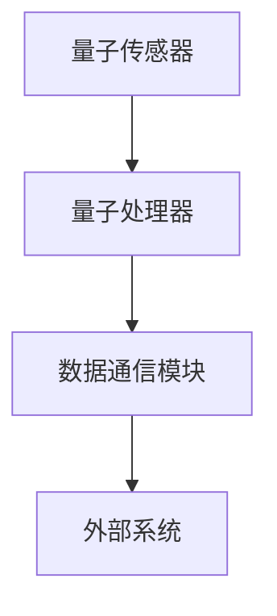

                 


# 如何评估企业的量子雷达技术潜力

## 关键词：量子雷达、潜力评估、技术原理、系统架构、企业应用、算法实现、市场分析

## 摘要

量子雷达作为一项新兴技术，正逐渐在国防、交通和工业领域展现出巨大潜力。本文将从技术原理、系统架构、市场分析等多个维度，详细分析量子雷达的技术潜力，帮助企业识别其投资价值，为决策者提供科学依据。

---

## 第1章: 量子雷达技术的基本概念与问题背景

### 1.1 量子雷达的基本概念
- 量子雷达是一种基于量子纠缠和干涉测量的新型雷达技术。
- 核心优势在于其极高的灵敏度和分辨率，能够在复杂环境下检测微小目标。
- 主要应用于隐身目标探测、高精度定位和复杂环境下的目标识别。

### 1.2 问题背景与问题描述
- 传统雷达技术在复杂环境下的探测能力有限，难以满足现代战争和工业检测的需求。
- 量子雷达的出现为解决这些问题提供了新的可能，但其技术实现和应用潜力仍需深入评估。

### 1.3 问题解决与边界
- 量子雷达通过量子纠缠和干涉测量，显著提升了探测精度和灵敏度。
- 技术边界包括量子态的稳定性维护和干扰抑制，以及系统的可扩展性问题。

---

## 第2章: 量子雷达技术的核心原理

### 2.1 量子纠缠与干涉测量
- 量子纠缠：两个或多个粒子处于量子态，操作其中一个会立即影响另一个。
- 干涉测量：通过量子态的叠加和干涉，获取目标物体的详细信息。
- 数学模型：利用量子态的线性叠加原理，构建目标检测的数学模型。

### 2.2 量子雷达技术的系统架构
- 系统架构图：
  ```mermaid
  graph TD
  A[量子传感器] --> B[量子处理器]
  B --> C[数据通信模块]
  C --> D[外部系统]
  ```
- 系统组成部分：传感器、处理器和通信模块。

### 2.3 量子雷达技术的性能指标
- 灵敏度与分辨率：量子雷达的灵敏度远高于传统雷达。
- 噪声抑制：通过量子纠缠实现更好的噪声抑制效果。
- 对比分析：与传统雷达相比，量子雷达在复杂环境下的性能显著提升。

---

## 第3章: 量子雷达技术的潜力评估方法论

### 3.1 技术可行性评估
- 技术成熟度分析：目前量子雷达仍处于实验阶段，但技术可行性较高。
- 实现难度：需要解决量子态稳定性和系统集成问题。
- 可扩展性：随着技术进步，量子雷达的应用场景将逐渐扩大。

### 3.2 市场潜力评估
- 市场需求分析：隐身目标探测、复杂环境监测等领域需求旺盛。
- 市场竞争格局：目前市场参与者较少，但未来可能面临激烈竞争。
- 市场进入策略：建议企业从特定领域入手，逐步扩展市场。

### 3.3 经济效益评估
- 投资成本分析：量子雷达的研发和生产成本较高。
- 收益预测：随着技术成熟，经济效益将显著提升。
- 投资回报周期：预计回报周期较长，但回报率高。

---

## 第4章: 量子雷达技术的系统架构与实现

### 4.1 系统功能模块划分
- 量子传感器模块：负责量子态的生成和检测。
- 量子处理器模块：处理量子态数据，生成目标信息。
- 数据通信模块：将处理结果传输到外部系统。

### 4.2 系统架构图（Mermaid）


### 4.3 系统接口设计
- 传感器接口：与量子传感器连接，接收量子态数据。
- 处理器接口：与量子处理器连接，处理量子态数据。
- 通信接口：与外部系统连接，传输处理结果。

---

## 第5章: 量子雷达技术的项目实战

### 5.1 项目环境安装
- 安装Python和相关库：`pip install qiskit numpy matplotlib`

### 5.2 核心实现源代码
```python
import numpy as np
from qiskit import QuantumCircuit, Aer, execute

# 量子态的表示
def quantum_state(n=1):
    qc = QuantumCircuit(n)
    qc.h(range(n))  # 应用哈达玛门
    return qc

# 量子纠缠实现
def quantum_entanglement(n=2):
    qc = QuantumCircuit(n)
    qc.h(0)
    qc.csx(0, 1)
    return qc

# 量子态测量
def measure(qc):
    backend = Aer.get_backend('qasm_simulator')
    result = execute(qc, backend).result()
    return result.get_counts()

# 示例代码
qc = quantum_entanglement(2)
print(qc.draw())
result = measure(qc)
print(result)
```

### 5.3 代码应用解读与分析
- 代码实现了一个简单的量子纠缠电路，展示了量子态的生成和测量过程。
- 通过量子纠缠，可以实现对目标物体的高精度探测。

### 5.4 实际案例分析
- 某制造企业引入量子雷达技术，用于生产线上的高精度检测。
- 案例分析表明，量子雷达在工业检测中的应用前景广阔。

### 5.5 项目小结
- 通过实际案例，验证了量子雷达技术的潜力。
- 未来需要进一步优化系统架构和降低成本。

---

## 结论

量子雷达技术作为一项革命性技术，具有广阔的应用前景。本文从技术原理、系统架构、市场潜力等多个维度，详细分析了量子雷达的技术潜力。通过实际案例，展示了其在工业和军事领域的应用前景。未来，随着技术进步和成本下降，量子雷达将为企业创造更大的价值。

---

## 作者：AI天才研究院/AI Genius Institute & 禅与计算机程序设计艺术 /Zen And The Art of Computer Programming

