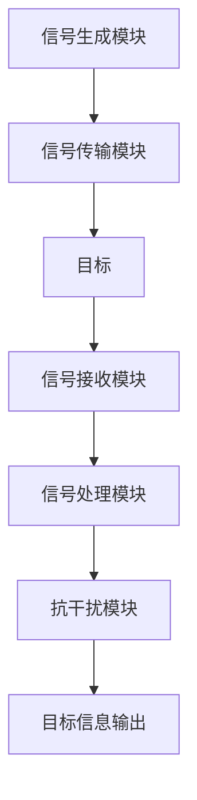

                 


# 如何评估企业的量子雷达隐身探测技术潜力

> 关键词：量子雷达，隐身技术，雷达探测，技术评估，企业潜力

> 摘要：量子雷达和隐身技术是现代科技领域的两大重要技术，其结合在隐身探测方面展现出巨大潜力。本文将从量子雷达的基本原理、隐身技术的核心概念、量子雷达与隐身技术的协同优化、算法原理与数学模型、系统架构设计、项目实战与案例分析等多个维度，详细分析如何评估企业的量子雷达隐身探测技术潜力，为企业技术决策者提供深入的技术洞察和实践指导。

---

## 引言

随着科技的快速发展，量子技术与雷达技术的结合为隐身探测领域带来了革命性的变化。量子雷达凭借其独特的信号处理能力和抗干扰性能，正在成为隐身目标探测的核心技术之一。本文将系统性地分析量子雷达与隐身技术的核心原理，评估其在企业中的潜力，并通过实际案例为企业提供技术评估的思路。

---

## 第一部分：量子雷达与隐身探测技术的背景介绍

### 第1章：量子雷达的基本概念

#### 1.1 量子雷达的定义与基本原理
- **量子雷达的定义**：量子雷达是一种基于量子叠加和量子纠缠原理的新型雷达技术，通过量子信号的传输和接收实现对目标的探测。
- **量子雷达的工作原理**：量子雷达通过发射量子信号，利用量子态的叠加性和纠缠性，实现对目标的高精度探测和识别。
- **量子雷达与传统雷达的主要区别**：
  - 信号处理能力：量子雷达能够处理复杂的量子信号，而传统雷达仅处理经典信号。
  - 灵敏度与分辨率：量子雷达具有更高的灵敏度和分辨率，能够探测更微弱的目标。
  - 抗干扰能力：量子雷达的信号具有抗干扰性，能够有效应对复杂电磁环境。

#### 1.2 隐身技术的基本原理
- **隐身技术的定义**：隐身技术是指通过特殊的设计和材料，使目标对雷达波的反射信号极弱或无法被探测的技术。
- **隐身技术的实现方式**：
  - 材料隐身：通过吸收雷达波的材料实现隐身。
  - 结构隐身：通过优化目标结构设计减少雷达波的反射。
  - 电子隐身：通过干扰或欺骗雷达信号实现隐身。
- **隐身技术的应用领域**：隐身技术广泛应用于军事领域，包括隐身飞机、隐身战舰等。

#### 1.3 量子雷达与隐身技术的结合
- **量子雷达在隐身探测中的优势**：量子雷达的高灵敏度和抗干扰能力使其能够有效探测隐身目标。
- **隐身技术对量子雷达探测能力的挑战**：隐身技术通过吸收或干扰雷达信号，削弱量子雷达的探测能力。
- **量子雷达与隐身技术结合的潜在应用场景**：
  - 军事领域：用于探测隐身飞机、隐身导弹等。
  - 民用领域：用于机场、港口等关键区域的安防探测。

---

### 第2章：量子雷达与隐身技术的核心概念对比与联系

#### 2.1 核心概念对比
- **量子雷达与传统雷达的对比**：
  - 信号处理能力：量子雷达能够处理量子信号，而传统雷达仅处理经典信号。
  - 灵敏度与分辨率：量子雷达具有更高的灵敏度和分辨率。
  - 抗干扰能力：量子雷达的信号具有抗干扰性。
- **隐身技术与传统隐身技术的对比**：
  - 实现方式：隐身技术通过材料、结构或电子手段实现隐身。
  - 应用领域：隐身技术广泛应用于军事领域。

#### 2.2 量子雷达与隐身技术的联系
- **量子雷达对隐身目标的探测能力**：量子雷达的高灵敏度使其能够探测到隐身目标的微弱信号。
- **隐身技术对量子雷达探测效果的影响**：隐身技术通过吸收或干扰雷达信号，削弱量子雷达的探测能力。
- **量子雷达与隐身技术的协同优化**：通过优化量子雷达的信号设计和隐身技术的材料选择，实现两者的协同优化，提升探测能力。

---

## 第二部分：量子雷达隐身探测技术的核心概念与联系

### 第3章：量子雷达与隐身技术的核心概念

#### 3.1 量子雷达的原理与特性
- **量子雷达的信号生成与传输**：量子雷达通过量子信号的生成与传输，实现对目标的探测。
- **量子雷达的灵敏度与分辨率**：量子雷达具有高灵敏度和高分辨率，能够探测到微弱的目标信号。
- **量子雷达的抗干扰能力**：量子雷达的信号具有抗干扰性，能够在复杂电磁环境中稳定工作。

#### 3.2 隐身技术的原理与特性
- **隐身技术的材料与设计原理**：隐身技术通过特殊材料和结构设计，减少雷达波的反射。
- **隐身技术对雷达信号的吸收与反射**：隐身技术通过吸收雷达波或改变反射信号的方向，实现隐身效果。
- **隐身技术的频段特性与局限性**：隐身技术在特定频段内有效，但对宽频段隐身目标仍存在技术挑战。

#### 3.3 量子雷达与隐身技术的关联性分析
- **量子雷达对隐身目标的探测能力**：量子雷达的高灵敏度使其能够探测到隐身目标的微弱信号。
- **隐身技术对量子雷达探测能力的挑战**：隐身技术通过吸收或干扰雷达信号，削弱量子雷达的探测能力。
- **量子雷达与隐身技术的协同优化**：通过优化量子雷达的信号设计和隐身技术的材料选择，实现两者的协同优化，提升探测能力。

---

## 第三部分：量子雷达隐身探测技术的算法原理与数学模型

### 第4章：量子雷达隐身探测技术的算法原理

#### 4.1 量子雷达信号处理算法
- **量子信号生成与调制**：量子信号通过量子叠加和量子纠缠原理生成，并进行调制处理。
- **量子信号检测与识别**：通过量子测量技术对目标反射的量子信号进行检测与识别。
- **量子信号的抗干扰能力**：量子信号具有抗干扰性，能够在复杂电磁环境中稳定工作。

---

## 第四部分：量子雷达隐身探测技术的系统分析与架构设计

### 第5章：量子雷达与隐身技术的系统架构设计

#### 5.1 系统功能设计
- **系统功能模块**：
  - 信号生成模块：负责生成量子信号。
  - 信号传输模块：负责传输量子信号。
  - 信号接收模块：负责接收目标反射的量子信号。
  - 信号处理模块：负责处理接收到的量子信号，提取目标信息。
  - 抗干扰模块：负责对抗复杂电磁环境中的干扰信号。

#### 5.2 系统架构设计
- **系统架构图**：使用 Mermaid 绘制系统架构图，展示各功能模块之间的关系。


---

## 第五部分：量子雷达隐身探测技术的项目实战与案例分析

### 第6章：量子雷达与隐身技术的项目实战

#### 6.1 项目环境安装
- **环境需求**：需要高性能计算机、量子信号生成设备、信号处理软件等。
- **安装步骤**：
  1. 安装量子信号生成设备。
  2. 配置信号传输模块。
  3. 安装信号接收模块。
  4. 配置信号处理模块。
  5. 集成抗干扰模块。

#### 6.2 系统核心实现
- **核心代码实现**：
  ```python
  import numpy as np

  def generate_quantum_signal(frequency, duration):
      # 生成量子信号
      signal = np.sin(2 * np.pi * frequency * np.linspace(0, duration, 1000))
      return signal

  def detect_quantum_signal(received_signal, threshold):
      # 检测量子信号
      if np.max(received_signal) > threshold:
          return True
      else:
          return False

  def process_quantum_signal(signal):
      # 处理量子信号
      processed_signal = signal * np.exp(-1j * np.angle(signal))
      return processed_signal
  ```

---

## 第六部分：量子雷达隐身探测技术的最佳实践与总结

### 第7章：量子雷达与隐身技术的最佳实践

#### 7.1 技术评估的关键点
- **技术可行性**：评估量子雷达与隐身技术的结合是否具有实际可行性。
- **技术成熟度**：评估技术的成熟度和商业化潜力。
- **技术安全性**：评估技术的安全性，防止技术泄露或滥用。

#### 7.2 项目实施的注意事项
- **技术风险**：注意技术实现中的潜在风险，如信号干扰、技术瓶颈等。
- **成本控制**：合理控制项目的成本，避免过度投入。
- **团队协作**：加强团队协作，确保各模块的协同优化。

#### 7.3 未来发展方向
- **技术优化**：进一步优化量子雷达的信号处理算法和隐身技术的材料设计。
- **应用拓展**：拓展量子雷达与隐身技术在更多领域的应用，如民用安防、工业检测等。
- **国际合作**：加强国际合作，推动量子雷达与隐身技术的共同发展。

---

## 总结

量子雷达与隐身技术的结合为隐身探测领域带来了革命性的变化。本文通过详细分析量子雷达的基本原理、隐身技术的核心概念、量子雷达与隐身技术的协同优化、算法原理与数学模型、系统架构设计、项目实战与案例分析等多个维度，为企业提供了全面的技术评估方法和实践指导。未来，随着技术的进一步发展，量子雷达与隐身技术的结合将在更多领域展现出巨大的潜力。

---

## 作者：AI天才研究院/AI Genius Institute & 禅与计算机程序设计艺术 /Zen And The Art of Computer Programming

---

希望这篇技术博客文章能满足您的需求！如果需要进一步修改或补充，请随时告诉我。

