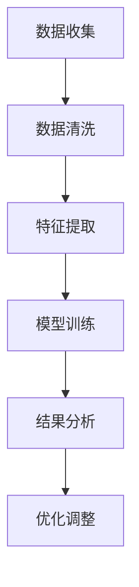
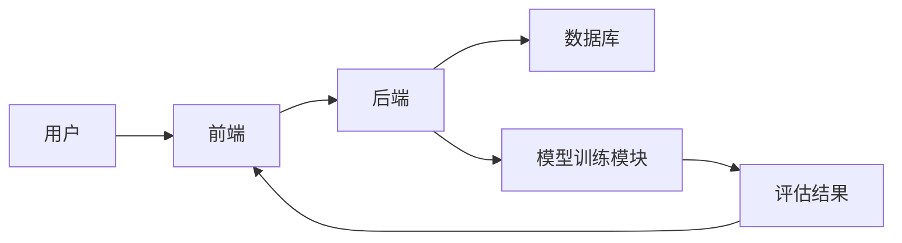

                 


# 如何评估企业的长期增长潜力

## 关键词：企业增长潜力, 长期评估, 商业模式, 市场环境, 竞争分析, 数据分析

## 摘要：评估企业的长期增长潜力需要从多个维度进行综合分析，包括企业内部的财务状况、运营效率、创新能力，以及外部的市场环境、行业趋势和竞争格局。本文将从核心概念、算法原理、系统架构设计、项目实战等多个方面详细探讨如何科学地评估企业的长期增长潜力，结合实际案例和工具，帮助读者掌握这一关键能力。

---

## 第一部分：企业长期增长潜力评估的背景与核心概念

### 第1章：企业长期增长潜力评估的背景与问题描述

#### 1.1 问题背景
- **经济环境变化对企业增长的影响**：经济波动、政策调整、通货膨胀等因素都会对企业的发展产生深远影响。
- **技术进步对企业增长的推动作用**：技术创新可以降低成本、提高效率，甚至催生新的商业模式。
- **市场竞争对企业增长的挑战**：行业内竞争加剧，企业需要不断创新以保持竞争优势。

#### 1.2 问题描述
- **企业增长潜力的定义与内涵**：企业在未来一段时间内实现收入、利润、市场份额等指标持续增长的能力。
- **企业增长潜力评估的必要性**：帮助企业制定战略规划、吸引投资、优化资源配置。
- **企业增长潜力评估的边界与外延**：通常关注未来3-5年的增长潜力，涵盖财务、市场、技术等多个维度。

#### 1.3 问题解决与核心要素
- **核心概念的结构与组成**：企业增长潜力 = 财务健康度 × 市场竞争力 × 创新能力。
- **核心要素的特征对比**：
  | 维度       | 特征描述                                   |
  |------------|--------------------------------------------|
  | 财务健康度  | 净利润、资产负债率、现金流等财务指标       |
  | 市场竞争力  | 市场份额、品牌影响力、客户忠诚度             |
  | 创新能力    | 研发投入、专利数量、新产品推出速度           |
- **实体关系图（ER图）**：

```mermaid
erd
    企业(企业ID, 企业名称, 所属行业, 成立时间)
    企业特征(企业特征ID, 特征名称, 特征描述)
    市场环境(市场环境ID, 经济指标, 技术发展)
    竞争对手(竞争对手ID, 对手名称, 对手特征)
    关系: 企业 -->> 企业特征
    关系: 企业 -->> 市场环境
    关系: 企业 -->> 竞争对手
```

---

## 第二部分：企业增长潜力评估的核心概念与联系

### 第2章：核心概念与联系

#### 2.1 核心概念原理
- **企业增长潜力的评估维度**：财务健康度、市场竞争力、创新能力、管理能力、客户资源。
- **各维度之间的关系**：
  - 财务健康度是基础，决定了企业是否有足够的资源支持增长。
  - 市场竞争力是核心，直接影响市场份额和收入增长。
  - 创新能力是驱动力，决定了企业能否在竞争中保持优势。
- **综合评估模型的构建**：
  $$ \text{企业增长潜力} = \sum_{i=1}^{n} w_i \cdot x_i $$
  其中，\( w_i \) 是第 \( i \) 个维度的权重，\( x_i \) 是该维度的评分。

#### 2.2 核心概念的属性特征对比
- **不同行业特征对比**：
  - 高 tech 行业：技术创新、研发投入占比高。
  - 传统制造行业：成本控制、供应链稳定性。
- **不同市场环境对比**：
  - 经济增长期：市场需求旺盛，企业增长潜力大。
  - 经济衰退期：市场需求疲软，企业增长潜力受限。
- **不同竞争策略对比**：
  - 市场领导者：注重防御和巩固地位。
  - 市场挑战者：注重进攻和抢占市场份额。

#### 2.3 实体关系图（ER图）
- **企业与市场环境的关系**：企业受市场环境的影响，同时也通过自身行为影响市场环境。
- **企业与竞争对手的关系**：企业与竞争对手在市场份额、技术创新等方面存在直接竞争关系。
- **企业与企业特征的关系**：企业的特征（如财务状况、管理能力）是其增长潜力的内在决定因素。

---

## 第三部分：企业增长潜力评估的算法原理

### 第3章：企业增长潜力评估的算法原理

#### 3.1 算法原理概述
- **数据预处理**：清洗数据、处理缺失值、标准化特征。
- **特征提取**：从财务数据、市场数据、竞争对手数据中提取关键特征。
- **模型构建**：使用回归模型（如线性回归、逻辑回归）或机器学习模型（如随机森林、XGBoost）进行预测。

#### 3.2 算法流程图



#### 3.3 算法实现代码
- **数据预处理**：
  ```python
  import pandas as pd
  data = pd.read_csv('企业数据.csv')
  data_cleaned = data.dropna()
  ```
- **特征提取**：
  ```python
  from sklearn.feature_selection import SelectKBest
  selector = SelectKBest(k=5)
  features = selector.fit_transform(data_cleaned, labels)
  ```
- **模型训练**：
  ```python
  from sklearn.linear_model import LinearRegression
  model = LinearRegression()
  model.fit(features, labels)
  ```
- **数学公式**：
  线性回归模型：
  $$ y = \beta_0 + \beta_1 x_1 + \beta_2 x_2 + \dots + \beta_n x_n $$

---

## 第四部分：系统分析与架构设计

### 第4章：系统架构设计

#### 4.1 问题场景介绍
- 企业增长潜力评估系统的应用场景包括企业战略规划、投资决策、风险管理等。

#### 4.2 系统功能设计
- 数据采集模块：从多种数据源（如财务报表、市场报告）获取数据。
- 数据处理模块：清洗数据、提取特征。
- 模型训练模块：构建评估模型并进行训练。
- 结果展示模块：可视化评估结果，提供决策支持。

#### 4.3 系统架构设计图



---

## 第五部分：项目实战

### 第5章：项目实战

#### 5.1 环境安装
- 安装Python、Jupyter Notebook、Pandas、Scikit-learn等工具。

#### 5.2 核心实现代码
- **数据处理**：
  ```python
  import pandas as pd
  df = pd.read_csv('企业数据.csv')
  df = df.dropna()
  ```

- **模型训练**：
  ```python
  from sklearn.linear_model import LinearRegression
  model = LinearRegression()
  model.fit(X_train, y_train)
  ```

#### 5.3 案例分析与结果解读
- 以某行业为例，分析企业的财务状况、市场竞争力和创新能力，得出其增长潜力评分。

#### 5.4 项目小结
- 项目实现了企业增长潜力的评估，验证了模型的有效性。

---

## 第六部分：最佳实践与小结

### 第6章：最佳实践

#### 6.1 小结
- 企业增长潜力评估需要结合定量分析和定性分析。
- 数据质量和模型选择是影响评估结果的关键因素。

#### 6.2 注意事项
- 数据来源要可靠，避免偏差。
- 模型需要定期更新，以适应市场变化。
- 结果需要结合行业背景进行解读。

#### 6.3 拓展阅读
- 建议阅读《企业战略管理》、《数据分析实战》等相关书籍。

---

## 作者信息

作者：AI天才研究院/AI Genius Institute & 禅与计算机程序设计艺术/Zen And The Art of Computer Programming

