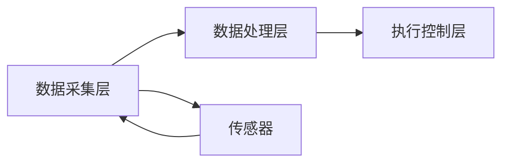
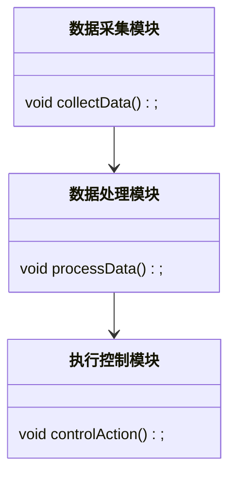

                 


# 如何评估企业的高级驾驶辅助系统

> 关键词：高级驾驶辅助系统（ADAS）、系统评估、传感器技术、算法原理、国际标准

> 摘要：高级驾驶辅助系统（ADAS）作为汽车智能化的核心技术，其评估对企业安全和性能至关重要。本文从ADAS的基本概念出发，详细探讨其核心技术、评估标准、系统架构以及数学模型，为企业提供全面的评估方法和建议。

---

## 第1章: 高级驾驶辅助系统（ADAS）的基本概念

### 1.1 ADAS的定义

高级驾驶辅助系统（ADAS）是一系列先进的技术，旨在辅助驾驶员进行车辆控制、减少交通事故风险并提高驾驶舒适性。这些系统通常包括传感器、摄像头、雷达和算法，能够实时感知环境并做出反应。

#### 1.1.1 ADAS的核心功能

1. **车道保持辅助（LKA）**：帮助车辆保持在车道内，减少偏离风险。
2. **自适应巡航控制（ACC）**：自动调整车速以保持与前车的安全距离。
3. **自动紧急制动（AEB）**：在检测到潜在碰撞时自动刹车。
4. **盲点监测（BSM）**：监测车辆盲区，提醒驾驶员潜在的碰撞风险。

### 1.2 ADAS的技术发展背景

随着汽车智能化的推进，ADAS技术从简单的单一功能逐步发展为复杂的多传感器融合系统。从早期的单一传感器应用到如今的多传感器融合，ADAS的功能越来越强大，应用范围也不断扩大。

### 1.3 ADAS评估的重要性

企业需要评估ADAS系统以确保其安全性和性能。通过评估，可以确保系统在各种条件下稳定运行，并符合国际标准。评估不仅能提高驾驶安全性，还能提升企业的技术竞争力。

---

## 第2章: 高级驾驶辅助系统（ADAS）的核心技术

### 2.1 传感器技术

传感器是ADAS的核心，负责收集环境数据。常见的传感器包括摄像头、雷达和激光雷达（LiDAR）。

#### 2.1.1 传感器类型与功能

| 传感器类型 | 功能描述 |
|------------|----------|
| 摄像头     | 视觉识别，检测车道、行人和障碍物 |
| 雷达       | 测距和速度检测，用于自适应巡航控制 |
| LiDAR     | 高精度三维环境建模，用于复杂场景识别 |

#### 2.1.2 传感器性能指标

- **分辨率**：传感器的图像或信号清晰度。
- **响应时间**：传感器从检测到反应的时间。
- **检测距离**：传感器的有效工作范围。

### 2.2 ADAS算法原理

算法是ADAS的“大脑”，负责处理传感器数据并做出决策。

#### 2.2.1 基于视觉的算法

基于摄像头的视觉算法通常使用深度学习模型，如卷积神经网络（CNN）进行目标检测和语义分割。

**目标检测流程：**

1. **图像采集**：摄像头捕捉环境图像。
2. **预处理**：调整图像亮度、对比度等。
3. **特征提取**：提取图像中的关键特征。
4. **目标检测**：识别图像中的目标（如行人、车辆）。
5. **决策**：根据检测结果采取相应措施。

**代码示例：**

```python
import tensorflow as tf
model = tf.keras.models.load_model('adas_model.h5')
image = cv2.imread('input.jpg')
prediction = model.predict(image)
```

#### 2.2.2 基于雷达的算法

雷达算法主要用于测距和速度检测，通常采用FMCW（连续波调频）技术。

**FMCW信号处理流程：**

1. **信号发射**：发送连续调频信号。
2. **信号接收**：接收反射信号。
3. **信号处理**：计算目标距离和速度。

**数学模型：**

$$
\text{距离} = \frac{c \cdot \Delta f}{2f_0}
$$

其中，\( c \) 是光速，\( \Delta f \) 是频移，\( f_0 \) 是载波频率。

### 2.3 ADAS系统架构

ADAS系统架构通常包括数据采集、数据处理和执行控制三个部分。

#### 2.3.1 系统架构设计

- **数据采集层**：负责采集环境数据。
- **数据处理层**：对数据进行融合和处理。
- **执行控制层**：根据处理结果控制车辆动作。

**系统架构图：**



---

## 第3章: ADAS系统的评估标准与方法

### 3.1 国际标准与规范

国际标准为ADAS评估提供了统一的依据。

#### 3.1.1 ISO 21482标准

ISO 21482定义了自动驾驶车辆的测试方法和评估指标，包括安全性和性能测试。

### 3.2 功能测试与验证

功能测试是确保ADAS系统正常运行的关键。

#### 3.2.1 测试场景设计

测试场景应覆盖各种驾驶条件，如直线行驶、弯道行驶、紧急制动等。

**测试场景示例：**

1. **正常行驶**：车辆在良好路况下正常行驶。
2. **紧急情况**：突然出现障碍物，系统应立即采取措施。

### 3.3 性能评估指标

性能评估指标用于量化系统表现。

#### 3.3.1 传感器性能指标

- **检测精度**：传感器的准确率。
- **响应时间**：传感器的反应速度。

#### 3.3.2 算法性能指标

- **识别准确率**：算法的正确识别率。
- **处理速度**：算法的运行效率。

---

## 第4章: ADAS系统架构与设计

### 4.1 系统架构设计

系统架构设计决定了系统的稳定性和扩展性。

#### 4.1.1 模块划分

- **数据采集模块**：负责收集环境数据。
- **数据处理模块**：对数据进行融合和处理。
- **执行控制模块**：根据处理结果控制车辆动作。

**模块划分图：**



### 4.2 接口设计

接口设计确保系统各部分高效协同。

#### 4.2.1 系统内部接口

内部接口用于模块间的通信，如数据采集模块向数据处理模块传递数据。

#### 4.2.2 系统外部接口

外部接口用于与其他系统（如车载系统）通信。

---

## 第5章: ADAS系统评估的数学模型与算法

### 5.1 算法原理

算法是ADAS的核心，数学模型是算法的基础。

#### 5.1.1 传感器数据融合

传感器数据融合是将多个传感器的数据进行整合，提高系统的准确性和可靠性。

**数据融合流程：**

1. **数据采集**：获取各传感器的数据。
2. **数据预处理**：对数据进行清洗和标准化。
3. **数据融合**：使用融合算法（如加权融合）整合数据。
4. **结果输出**：输出融合后的数据。

**加权融合公式：**

$$
w_1x_1 + w_2x_2 + \dots + w_nx_n
$$

其中，\( w_i \) 是权重，\( x_i \) 是传感器数据。

---

## 结论

评估企业的高级驾驶辅助系统是一个复杂但关键的任务。通过本文的详细分析，企业可以系统地评估其ADAS系统，确保其安全性和性能。未来，随着技术的发展，ADAS的评估方法和标准也将不断进步。

---

## 作者

作者：AI天才研究院/AI Genius Institute & 禅与计算机程序设计艺术 /Zen And The Art of Computer Programming

---

希望这篇文章能满足您的需求！如果需要进一步修改或补充，请随时告诉我。

