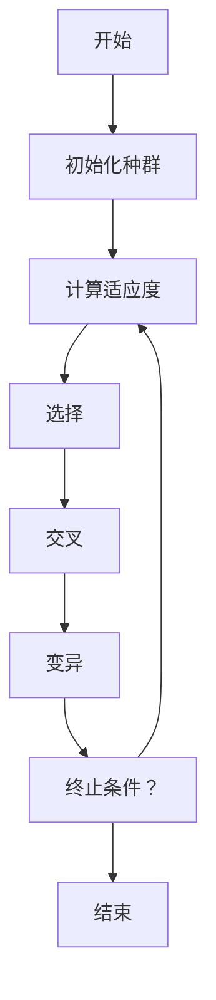
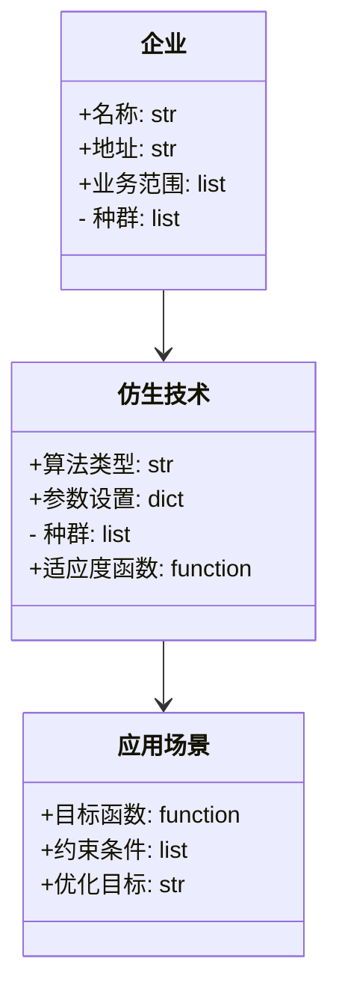
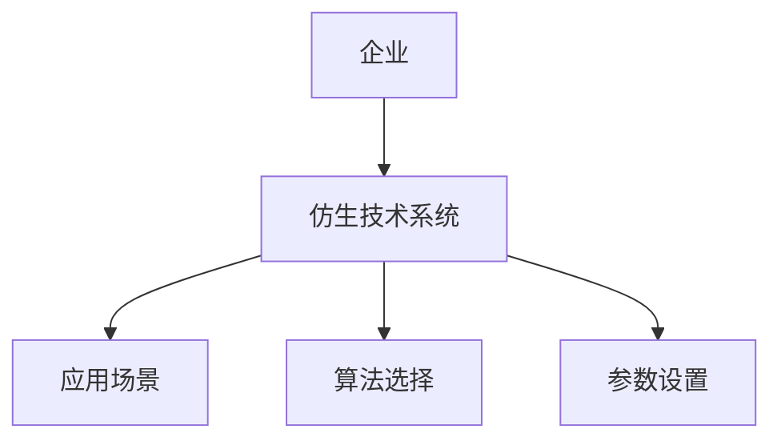
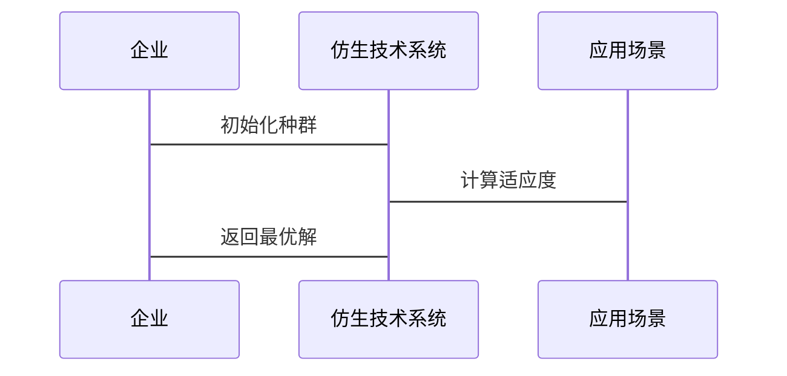

                 


# 如何识别企业的仿生技术优势

## 文章关键词

仿生技术, 企业优势, 技术识别, 算法原理, 系统架构, 项目实战

## 摘要

仿生技术是一种模仿生物结构和功能的技术，广泛应用于多个领域。本文详细分析了如何识别企业的仿生技术优势，从核心概念、算法原理到系统架构设计，再到项目实战，最后给出最佳实践和总结，帮助读者全面理解和应用仿生技术的优势。

## 第一部分: 仿生技术与企业优势概述

## 第1章: 仿生技术的基本概念

### 1.1 仿生技术的定义与特点

#### 1.1.1 仿生技术的定义
仿生技术是模仿生物的结构和功能，应用于技术系统中的一种技术。

#### 1.1.2 仿生技术的核心特点
- **自然启发性**：模仿生物的自然特性。
- **适应性**：能适应环境变化。
- **高效性**：运行效率高。

#### 1.1.3 仿生技术与传统技术的区别
| 特性 | 仿生技术 | 传统技术 |
|------|----------|-----------|
| 原理 | 自然启发 | 确定性规则 | 

### 1.2 企业仿生技术的优势

#### 1.2.1 提高企业竞争力
通过模仿生物的高效性，提升企业的市场竞争力。

#### 1.2.2 优化企业运营效率
采用仿生算法优化流程，提高效率。

#### 1.2.3 提升企业创新能力
仿生技术提供新的思路，促进企业创新。

## 第2章: 仿生技术在企业中的应用背景

### 2.1 仿生技术的发展历程

#### 2.1.1 仿生技术的起源
20世纪50年代，生物学家和工程师开始研究生物系统。

#### 2.1.2 仿生技术的发展阶段
从简单模仿到复杂系统应用。

#### 2.1.3 仿生技术的现状
广泛应用于机器人、医疗设备等领域。

### 2.2 企业仿生技术的应用场景

#### 2.2.1 制造业中的仿生技术
用于自动化生产、质量控制。

#### 2.2.2 服务业中的仿生技术
应用于客户服务、物流管理。

#### 2.2.3 信息技术中的仿生技术
用于数据处理、网络安全。

## 第3章: 仿生技术的核心概念与联系

### 3.1 仿生技术的核心原理

#### 3.1.1 仿生技术的基本原理
通过模拟生物行为，解决问题。

#### 3.1.2 仿生技术的核心算法
- 遗传算法
- 模拟退火算法
- 禁忌搜索算法

#### 3.1.3 仿生技术的实现步骤
1. 确定目标函数。
2. 设计适应度函数。
3. 选择优化算法。

### 3.2 仿生技术的核心概念对比

#### 3.2.1 仿生技术与人工智能的对比
- **仿生技术**：模拟生物行为。
- **人工智能**：模拟人类智能。

#### 3.2.2 仿生技术与机器学习的对比
- **仿生技术**：基于生物启发。
- **机器学习**：基于数据模式。

#### 3.2.3 仿生技术与大数据分析的对比
- **仿生技术**：注重自然启发。
- **大数据分析**：注重数据处理。

### 3.3 仿生技术的ER实体关系图

```mermaid
er
actor: 企业
technique: 仿生技术
application: 应用场景
```

## 第4章: 仿生技术的算法原理

### 4.1 仿生技术的核心算法

#### 4.1.1 遗传算法



#### 4.1.2 模拟退火算法

#### 4.1.3 禁忌搜索算法

### 4.2 仿生技术的数学模型

#### 4.2.1 遗传算法的数学模型

$$f(x) = x^2$$

### 4.3 仿生技术算法的实现

```python
import random

def fitness(x):
    return x**2

def evolve(population_size, mutation_rate):
    population = [random.random() for _ in range(population_size)]
    for _ in range(100):
        fitness_list = [fitness(x) for x in population]
        parents = [x for x in population if fitness(x) > max(fitness_list)/2]
        new_population = []
        for _ in range(population_size):
            p1 = random.choice(parents)
            p2 = random.choice(parents)
            child = (p1 + p2)/2
            if random.random() < mutation_rate:
                child += random.gauss(0, 0.1)
            new_population.append(child)
        population = new_population
    return population

result = evolve(10, 0.1)
print(result)
```

## 第二部分: 企业仿生技术系统分析与架构设计

## 第5章: 系统分析与架构设计方案

### 5.1 应用场景介绍

#### 5.1.1 制造业中的仿生技术应用
用于生产线优化。

#### 5.1.2 服务业中的仿生技术应用
应用于客户服务系统优化。

### 5.2 项目介绍

#### 5.2.1 项目背景
企业希望通过仿生技术优化物流。

#### 5.2.2 项目目标
实现物流路径优化。

### 5.3 系统功能设计

#### 5.3.1 领域模型类图



#### 5.3.2 系统架构设计



### 5.4 系统接口设计

#### 5.4.1 输入接口
- 种群大小：integer
- 变异率：float

#### 5.4.2 输出接口
- 最优解：float
- 适应度值：float

### 5.5 系统交互设计



## 第三部分: 项目实战

## 第6章: 项目实战

### 6.1 项目环境安装

#### 6.1.1 安装Python
```
pip install python
```

#### 6.1.2 安装必要的库
```
pip install numpy matplotlib
```

### 6.2 项目核心代码实现

#### 6.2.1 适应度函数

```python
def fitness(x):
    return x**2
```

#### 6.2.2 遗传算法实现

```python
def evolve(population_size, mutation_rate):
    population = [random.random() for _ in range(population_size)]
    for _ in range(100):
        fitness_list = [fitness(x) for x in population]
        parents = [x for x in population if fitness(x) > max(fitness_list)/2]
        new_population = []
        for _ in range(population_size):
            p1 = random.choice(parents)
            p2 = random.choice(parents)
            child = (p1 + p2)/2
            if random.random() < mutation_rate:
                child += random.gauss(0, 0.1)
            new_population.append(child)
        population = new_population
    return population
```

### 6.3 项目案例分析与实现解读

#### 6.3.1 案例分析
应用于物流路径优化，选择遗传算法。

#### 6.3.2 代码实现解读
详细解释代码实现，包括种群初始化、适应度计算、选择、交叉和变异。

## 第四部分: 最佳实践与总结

## 第7章: 最佳实践与总结

### 7.1 问题解决小结
仿生技术在企业中的应用优势明显，能有效提升竞争力和效率。

### 7.2 注意事项
- 确保算法参数设置合理。
- 定期更新算法模型以适应变化。

### 7.3 拓展阅读
建议阅读相关书籍，深入理解仿生算法的应用。

## 作者

作者：AI天才研究院 & 禅与计算机程序设计艺术

---

这篇文章系统地介绍了如何识别企业的仿生技术优势，从理论到实践，结合具体案例，帮助读者全面理解和应用仿生技术的优势。

