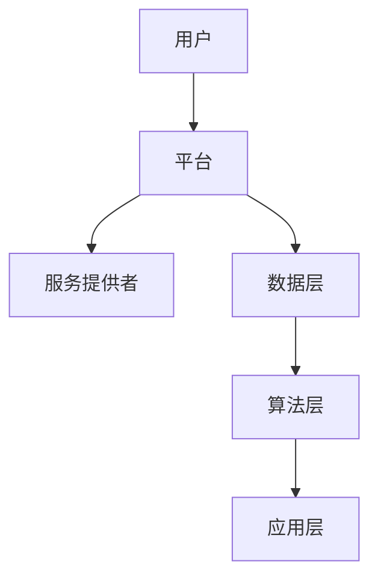
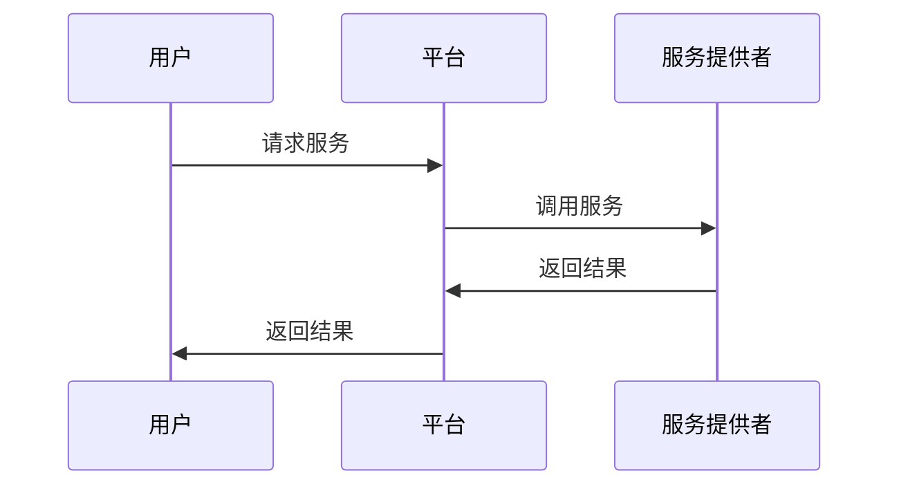

                 


# 如何识别企业的平台战略优势

> 关键词：平台战略，企业优势，网络效应，生态系统，系统架构，协同过滤

> 摘要：企业平台战略是通过构建双边或多边平台，利用网络效应和生态系统优势，实现业务增长和竞争优势的重要战略。本文将从平台战略的核心概念、系统架构、算法原理、项目实战等多个方面，深入分析如何识别和构建企业的平台战略优势。

---

## 第一部分：企业平台战略优势概述

### 第1章：平台战略的核心概念

#### 1.1 平台战略的定义与背景

- **问题背景**：在数字化转型的今天，企业竞争已不再是单纯的产品竞争，而是平台生态的竞争。平台战略通过构建双边或多边市场，利用网络效应和生态系统优势，为企业创造新的增长点。

- **问题描述**：许多企业在尝试转型时，往往只关注单一产品的优化，而忽视了平台战略的系统性优势。这种短视的策略可能导致企业难以在激烈的市场竞争中脱颖而出。

- **问题解决**：通过构建平台战略，企业可以实现用户与服务提供者的高效匹配，降低交易成本，提升用户体验，从而形成强大的竞争优势。

- **边界与外延**：平台战略的边界在于其核心的双边或多边市场结构，而其外延则包括生态系统中的合作伙伴、用户群体和技术支持。

- **核心要素**：平台战略的核心要素包括用户群体、服务提供者、数据和技术架构。

---

#### 1.2 平台战略的核心概念

- **平台模式**：平台模式的核心在于通过连接供需双方，降低交易成本，创造新的价值。例如，滴滴出行通过连接司机和乘客，构建了一个高效的双边平台。

- **平台生态系统**：平台生态系统是一个多方参与、互相依存的系统。例如，苹果的App Store通过连接开发者和用户，形成了一个强大的生态系统。

- **网络效应**：网络效应是指随着用户数量的增加，平台的价值呈指数级增长。例如，微信通过社交网络效应，形成了强大的用户粘性。

---

#### 1.3 平台战略的优势与劣势

- **主要优势**：
  - 成本优势：通过平台模式，企业可以实现规模效应，降低边际成本。
  - 效率优势：平台能够高效匹配供需，提升整体效率。
  - 资源聚合优势：平台能够吸引更多的资源和合作伙伴，形成强大的生态系统。

- **主要劣势**：
  - 初期投入大：平台建设需要大量的资金和技术支持。
  - 竞争激烈：平台市场往往存在多个竞争对手，容易陷入价格战。
  - 用户获取成本高：平台需要持续吸引用户，这会增加企业的市场推广成本。

---

### 第2章：平台战略的核心概念与联系

#### 2.1 平台战略的核心原理

- **平台模式的经济学原理**：平台通过降低交易成本，创造双边网络效应，实现多方共赢。

- **平台网络效应的数学模型**：网络效应可以通过数学公式量化。例如，用户数量的增长可以用指数函数表示：

  $$ 用户增长 = e^{k \cdot t} $$

  其中，\( k \) 是增长率，\( t \) 是时间。

- **平台生态系统的动态平衡**：平台生态系统需要保持动态平衡，才能实现长期稳定发展。

---

#### 2.2 平台战略的核心要素对比

- **平台模式与传统业务模式对比表格**

| 对比维度 | 平台模式 | 传统业务模式 |
|----------|----------|--------------|
| 业务模式 | 双边或多边 | 单边         |
| 用户关系 | 高粘性    | 低粘性       |
| 成本结构 | 规模效应   | 单件成本     |

---

#### 2.3 平台战略的系统架构

- **系统架构图**：



- **系统交互图**：



---

### 第3章：平台战略的算法原理

#### 3.1 平台战略的核心算法

- **协同过滤算法**：协同过滤算法通过分析用户行为数据，推荐相关内容或服务。例如，一个音乐平台可以基于用户的听歌习惯，推荐相似的歌曲。

  ```mermaid
  graph TD
  A[用户] --> B[平台]
  B --> C[服务提供者]
  A --> C
  ```

- **算法实现**：以下是协同过滤算法的Python代码示例：

  ```python
  import numpy as np

  def collaborative_filtering(user_matrix):
      # 计算用户相似度
      user_similarity = np.dot(user_matrix, user_matrix.T)
      # 找出相似度最高的用户
      similar_users = np.argsort(user_similarity, axis=0)[::-1]
      # 推荐服务
      recommendations = np.sum(user_matrix[0, :]) / user_matrix.shape[0]
      return recommendations

  # 示例数据
  user_matrix = np.array([[1, 0, 1], [0, 1, 1], [1, 1, 0]])
  print(collaborative_filtering(user_matrix))
  ```

---

## 第二部分：平台战略的系统架构与实战

### 第4章：平台战略的系统架构设计

#### 4.1 系统功能设计

- **领域模型**：以下是领域模型的Mermaid图：

  ```mermaid
  classDiagram
  class 用户 {
      用户ID
      用户名
      密码
  }
  class 服务提供者 {
      提供者ID
      提供者名
      服务类型
  }
  class 平台 {
      平台ID
      平台名称
      用户管理
      服务管理
  }
  ```

- **系统架构设计**：

  ```mermaid
  graph TD
  用户 --> 平台
  服务提供者 --> 平台
  平台 --> 数据层
  数据层 --> 算法层
  算法层 --> 应用层
  ```

---

### 第5章：平台战略的项目实战

#### 5.1 环境安装

- **安装Python和依赖库**：
  ```bash
  pip install numpy
  pip install matplotlib
  ```

#### 5.2 核心代码实现

- **协同过滤算法实现**：

  ```python
  import numpy as np

  def collaborative_filtering(user_matrix):
      user_similarity = np.dot(user_matrix, user_matrix.T)
      similar_users = np.argsort(user_similarity, axis=0)[::-1]
      recommendations = np.sum(user_matrix[0, :]) / user_matrix.shape[0]
      return recommendations

  # 示例数据
  user_matrix = np.array([[1, 0, 1], [0, 1, 1], [1, 1, 0]])
  print(collaborative_filtering(user_matrix))
  ```

---

### 第6章：平台战略的总结与展望

#### 6.1 总结

- 平台战略的核心在于构建双边或多边平台，利用网络效应和生态系统优势，实现业务增长和竞争优势。
- 通过系统架构设计、算法实现和项目实战，我们可以更好地识别和构建企业的平台战略优势。

#### 6.2 最佳实践

- **选择合适的平台模式**：根据企业的实际情况，选择适合的平台模式和生态系统。
- **注重用户体验**：平台的成功离不开用户的高度参与，因此用户体验设计至关重要。
- **持续优化**：平台战略需要持续优化和迭代，才能保持竞争优势。

---

## 作者

作者：AI天才研究院/AI Genius Institute  
& 禅与计算机程序设计艺术 /Zen And The Art of Computer Programming

