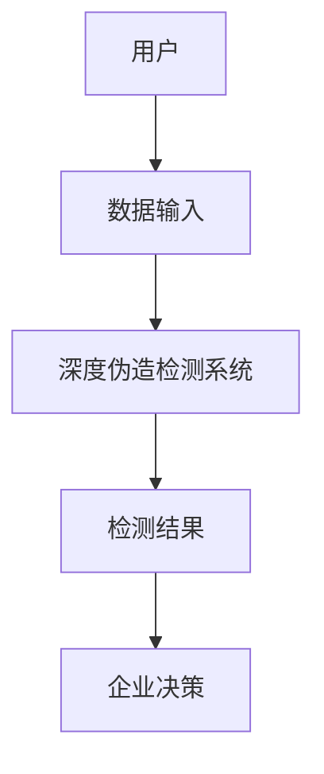
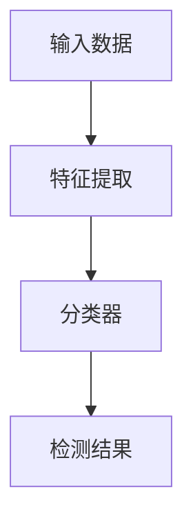

                 


# 如何识别企业的深度伪造检测技术优势

**关键词**：深度伪造检测技术、企业安全、人工智能、图像处理、数据分析、系统架构设计、技术优势识别

**摘要**：深度伪造技术近年来迅速发展，给企业带来了巨大的挑战和风险。本文旨在帮助企业识别深度伪造检测技术的优势，从技术原理、算法设计、系统架构到实际应用进行全面解析。通过详细的技术分析和案例研究，本文将揭示深度伪造检测技术的核心优势，并为企业提供实用的建议和指导。

---

## 第一部分：深度伪造检测技术背景与核心概念

### 第1章：深度伪造检测技术概述

#### 1.1 深度伪造技术的背景与问题背景

- **1.1.1 深度伪造技术的起源与发展**  
  深度伪造技术（Deepfake）起源于2017年，最初由OpenAI的研究人员提出，用于生成逼真的图像和视频。随着技术的进步，深度伪造技术逐渐被应用于企业安全、媒体传播和社交工程等领域。

- **1.1.2 深度伪造对企业的影响**  
  深度伪造技术可以被用于伪造企业高管的语音、伪造企业财报、篡改企业视频资料等，对企业声誉、财务安全和法律合规性造成严重威胁。

- **1.1.3 企业面临的主要问题与挑战**  
  企业需要识别和防范深度伪造技术带来的风险，但目前市场上存在多种深度伪造检测技术，如何选择适合自身需求的技术是企业的主要挑战。

#### 1.2 深度伪造技术的核心概念与问题描述

- **1.2.1 深度伪造技术的定义与特征**  
  深度伪造技术是一种利用生成对抗网络（GAN）生成逼真图像、视频或音频的技术。其核心特征包括高真实度、难以被肉眼察觉和强大的生成能力。

- **1.2.2 企业深度伪造检测的需求与目标**  
  企业需要通过深度伪造检测技术来识别和阻止深度伪造内容的传播，保护企业资产和声誉。

- **1.2.3 深度伪造检测的边界与外延**  
  深度伪造检测技术不仅局限于图像和视频，还包括音频、文本等多模态数据的检测。

#### 1.3 深度伪造检测技术的核心要素与组成

- **1.3.1 深度伪造检测技术的关键技术**  
  包括生成对抗网络（GAN）、图像处理技术、特征提取技术和分类器设计。

- **1.3.2 深度伪造检测技术的核心要素**  
  包括数据输入、特征提取、分类器和检测结果输出。

- **1.3.3 深度伪造检测技术的系统架构**  
  深度伪造检测系统通常包括数据采集模块、特征提取模块、分类器模块和结果输出模块。

#### 1.4 本章小结  
  本章通过介绍深度伪造技术的背景、核心概念和系统架构，为后续内容奠定了基础。

---

### 第2章：深度伪造检测技术的核心概念与联系

#### 2.1 深度伪造检测技术的原理与特点

- **2.1.1 深度伪造检测技术的原理**  
  深度伪造检测技术通过分析图像或视频的特征，识别出深度伪造的痕迹，例如纹理不一致、光照异常和运动模糊等。

- **2.1.2 深度伪造检测技术的特点**  
  深度伪造检测技术具有高精度、实时性和可扩展性等特点。

- **2.1.3 深度伪造检测技术与传统图像处理的区别**  
  传统图像处理主要针对图像增强和修复，而深度伪造检测技术专注于识别和阻止深度伪造内容。

#### 2.2 深度伪造检测技术的核心概念对比

- **2.2.1 深度伪造检测技术与图像识别的对比**  
  图像识别主要识别图像中的物体或场景，而深度伪造检测技术专注于识别图像或视频的伪造痕迹。

- **2.2.2 深度伪造检测技术与视频分析的对比**  
  视频分析关注视频内容的理解和分析，而深度伪造检测技术专注于视频的真实性验证。

- **2.2.3 深度伪造检测技术与自然语言处理的对比**  
  自然语言处理关注文本的理解和生成，而深度伪造检测技术关注文本的真伪验证。

#### 2.3 深度伪造检测技术的ER实体关系图



#### 2.4 本章小结  
  本章通过对比分析深度伪造检测技术与其他技术的区别，进一步明确了其核心概念和应用范围。

---

## 第三部分：深度伪造检测技术的算法原理与数学模型

### 第3章：深度伪造检测技术的算法原理与数学模型

#### 3.1 深度伪造检测算法的原理与流程

- **3.1.1 基于生成对抗网络（GAN）的深度伪造检测**  
  GAN模型由生成器和判别器组成，生成器用于生成伪造内容，判别器用于检测伪造内容。

- **3.1.2 基于对抗检测的深度伪造检测**  
  对抗检测模型通过分析图像特征，识别出深度伪造的痕迹。

- **3.1.3 基于自监督学习的深度伪造检测**  
  自监督学习模型通过无标签数据的特征提取，进一步提升检测精度。

#### 3.2 深度伪造检测算法的数学模型与公式

- **3.2.1 GAN模型的数学表达**  
  $$ G(z) = D_{\text{生成器}}(z) $$
  $$ D(x) = \text{判别器}(x) $$

- **3.2.2 对抗检测模型的数学表达**  
  $$ L_{\text{检测}} = -\log(D(x)) $$

- **3.2.3 自监督学习模型的数学表达**  
  $$ L_{\text{自监督}} = \text{损失函数} $$

#### 3.3 深度伪造检测算法的流程图



#### 3.4 本章小结  
  本章通过数学模型和流程图，详细介绍了深度伪造检测技术的算法原理和实现流程。

---

### 第4章：深度伪造检测技术的系统分析与架构设计

#### 4.1 深度伪造检测系统的功能设计

- **4.1.1 数据采集模块**  
  数据采集模块负责接收输入的图像或视频数据。

- **4.1.2 特征提取模块**  
  特征提取模块通过卷积神经网络提取图像或视频的特征。

- **4.1.3 分类器模块**  
  分类器模块基于提取的特征，判断输入数据是否为深度伪造。

- **4.1.4 结果输出模块**  
  结果输出模块将检测结果输出给用户或企业系统。

#### 4.2 深度伪造检测系统的架构设计

- **4.2.1 分布式架构设计**  
  分布式架构适用于大规模数据处理和高并发场景。

- **4.2.2 微服务架构设计**  
  微服务架构适合模块化开发和灵活部署。

- **4.2.3 高可用性设计**  
  通过冗余设计和负载均衡，确保系统的高可用性。

#### 4.3 深度伪造检测系统的接口设计

- **4.3.1 API接口设计**  
  提供RESTful API接口，方便与其他系统集成。

- **4.3.2 数据接口设计**  
  支持多种数据格式的输入，如JPEG、PNG、MP4等。

- **4.3.3 用户接口设计**  
  提供友好的用户界面，方便用户操作。

#### 4.4 深度伪造检测系统的交互设计

- **4.4.1 用户与系统的交互流程**  
  用户上传数据 -> 系统进行检测 -> 输出检测结果。

- **4.4.2 系统与第三方服务的交互流程**  
  系统调用第三方API进行特征提取和分类。

#### 4.5 本章小结  
  本章通过系统架构设计，展示了深度伪造检测技术在实际应用中的实现方式。

---

### 第5章：深度伪造检测技术的项目实战

#### 5.1 项目环境与工具安装

- **5.1.1 环境要求**  
  需要安装Python 3.8及以上版本、TensorFlow、Keras和OpenCV等工具。

- **5.1.2 工具安装**  
  使用pip安装相关依赖：`pip install numpy tensorflow keras opencv-python`。

#### 5.2 系统核心实现源代码

```python
import tensorflow as tf
from tensorflow.keras.layers import Dense, Conv2D, MaxPooling2D, Flatten
from tensorflow.keras.models import Model

def build_generator(input_shape):
    generator = tf.keras.Sequential([
        Dense(256, activation='relu', input_shape=input_shape),
        Dense(256, activation='relu'),
        Dense(1, activation='sigmoid')
    ])
    return generator

def build_discriminator(input_shape):
    discriminator = tf.keras.Sequential([
        Conv2D(32, (3,3), activation='relu', input_shape=input_shape),
        MaxPooling2D((2,2)),
        Flatten(),
        Dense(128, activation='relu'),
        Dense(1, activation='sigmoid')
    ])
    return discriminator

def buildGAN(generator, discriminator):
    discriminator.trainable = False
    input_z = tf.keras.Input(shape=generator.input_shape)
    fake_output = generator(input_z)
    discriminator_output = discriminator(fake_output)
    model = Model(inputs=input_z, outputs=discriminator_output)
    return model
```

#### 5.3 代码实现与功能解读

- **代码实现**  
  上述代码实现了生成器和判别器的构建，以及GAN模型的搭建。

- **功能解读**  
  生成器用于生成深度伪造内容，判别器用于检测深度伪造内容，GAN模型通过对抗训练提升检测精度。

#### 5.4 实际案例分析与详细解读

- **案例分析**  
  使用深度伪造检测技术检测一段伪造的视频，输出检测结果。

- **详细解读**  
  通过分析视频的特征，识别出深度伪造的痕迹，并输出检测结果。

#### 5.5 本章小结  
  本章通过实际案例分析和代码实现，展示了深度伪造检测技术在实际应用中的具体操作和实现细节。

---

### 第6章：深度伪造检测技术的总结与展望

#### 6.1 总结与最佳实践

- **总结**  
  深度伪造检测技术在企业中的应用越来越广泛，其优势在于能够快速识别和阻止深度伪造内容的传播。

- **最佳实践**  
  企业应选择适合自身需求的深度伪造检测技术，定期更新检测模型，加强员工培训，提升安全意识。

#### 6.2 小结

- **小结**  
  深度伪造检测技术是企业安全的重要组成部分，选择合适的技术和方法能够有效降低企业的风险。

#### 6.3 注意事项

- **注意事项**  
  深度伪造检测技术并非万能的，企业需要结合自身需求和实际情况，选择合适的检测方案。

#### 6.4 拓展阅读

- **拓展阅读**  
  推荐阅读《深度学习实战》、《生成对抗网络（GAN）入门与实践》等书籍，进一步提升对深度伪造检测技术的理解。

---

## 作者

**作者：AI天才研究院/AI Genius Institute & 禅与计算机程序设计艺术 /Zen And The Art of Computer Programming**

---

以上是一个详细的思考过程和对如何识别企业深度伪造检测技术优势的全面解析。通过背景介绍、核心概念、算法原理、系统架构和项目实战的详细分析，帮助企业更好地理解和应用深度伪造检测技术。

