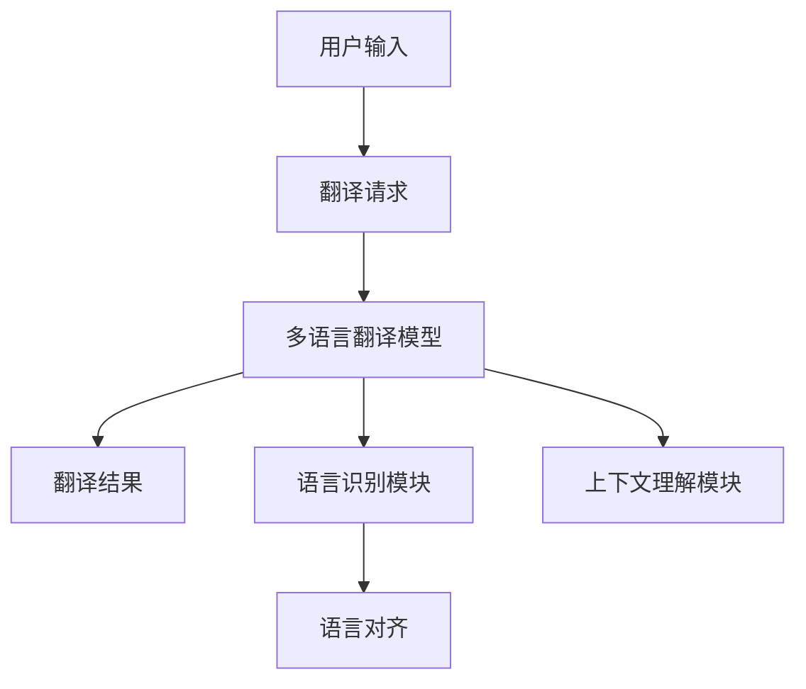
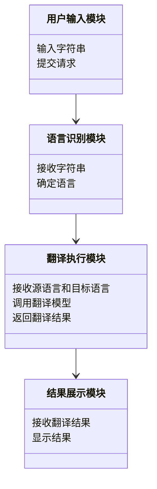
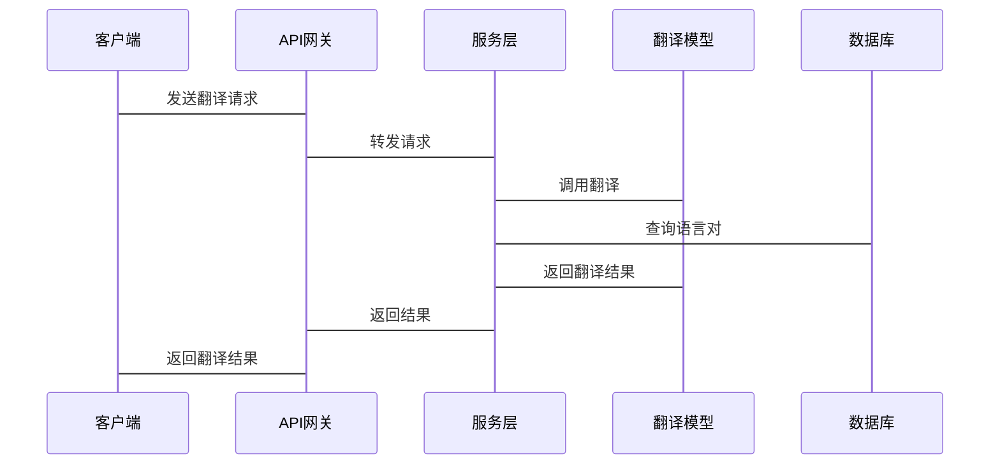

                 


# 如何识别企业的深度学习多语言翻译技术优势

## 关键词
- 深度学习
- 多语言翻译
- 企业技术优势
- Transformer模型
- 系统架构

## 摘要
在现代企业环境中，深度学习技术被广泛应用于多语言翻译系统，以提高翻译质量、效率和成本效益。本文通过分析深度学习多语言翻译的核心概念、算法原理、系统架构和实战案例，帮助企业识别其技术优势，并指导企业在实际应用中优化系统性能。

---

# 第一部分: 深度学习多语言翻译技术背景介绍

## 第1章: 多语言翻译技术的背景与问题背景

### 1.1 问题背景

#### 1.1.1 传统机器翻译的局限性
传统基于规则的翻译系统存在以下问题：
- 依赖大量语言规则，维护成本高。
- 翻译结果缺乏上下文理解，准确性低。
- 无法有效处理多语言环境下的语义差异。

#### 1.1.2 深度学习在翻译领域的应用优势
深度学习技术带来了以下优势：
- 基于数据驱动，能够自动学习语言特征。
- 强大的上下文理解和语义分析能力。
- 支持多语言模型的扩展性。

#### 1.1.3 企业级多语言翻译的市场需求
企业在多语言翻译方面的需求：
- 全球化业务扩展。
- 提高客户体验。
- 降低翻译成本。

### 1.2 问题描述

#### 1.2.1 多语言翻译的核心问题
- 如何实现多种语言的高效对齐。
- 如何提高翻译质量。
- 如何处理语言间的语义差异。

#### 1.2.2 企业级翻译系统的挑战
- 数据量大，训练复杂。
- 需要实时处理多语言请求。
- 系统扩展性和稳定性要求高。

#### 1.2.3 深度学习技术如何解决这些问题
通过深度学习技术，可以实现：
- 高精度的翻译结果。
- 实时的多语言处理能力。
- 强大的系统扩展性。

### 1.3 深度学习多语言翻译的优势

#### 1.3.1 高精度与上下文理解能力
深度学习模型能够捕捉上下文信息，提供更准确的翻译结果。

#### 1.3.2 多语言模型的可扩展性
多语言模型可以轻松扩展支持新的语言，降低维护成本。

#### 1.3.3 企业级应用的成本效益分析
通过自动化和高效性，企业可以显著降低翻译成本并提高效率。

## 第2章: 深度学习多语言翻译的核心概念与联系

### 2.1 核心概念原理

#### 2.1.1 Transformer模型的基本原理
- 基于自注意力机制，实现高效的并行计算。
- 通过编码器和解码器结构，实现语言的对齐和转换。

#### 2.1.2 多语言翻译模型的架构特点
- 统一的编码器和解码器结构。
- 支持多语言词汇和语法的嵌入。

#### 2.1.3 注意力机制的作用与实现
注意力机制通过计算词与词之间的相关性，实现上下文的理解和对齐。

### 2.2 概念属性特征对比

| 对比维度 | 深度学习翻译 | 传统翻译 |
|----------|--------------|-----------|
| 精度     | 高           | 较低       |
| 上下文理解 | 强           | 无或弱     |
| 可扩展性 | 高           | 低         |
| 维护成本 | 低           | 高         |

### 2.3 ER实体关系图架构



---

# 第二部分: 深度学习多语言翻译的算法原理

## 第3章: Transformer模型的算法原理

### 3.1 Transformer模型的工作流程

#### 3.1.1 编码器部分

编码器将输入序列转换为上下文表示，主要步骤：
1. 词嵌入层：将词转换为向量。
2. 自注意力机制：计算词与词之间的相关性。
3. 前馈神经网络：提取高级特征。

#### 3.1.2 解码器部分

解码器根据编码器的输出生成目标语言序列，主要步骤：
1. 词嵌入层：将目标语言词转换为向量。
2. 自注意力机制：计算词与词之间的相关性。
3. 解码器与编码器之间的注意力机制：对齐源语言和目标语言。
4. 前馈神经网络：生成最终的翻译结果。

#### 3.1.3 注意力机制的计算流程

自注意力机制的计算公式：

$$
\text{Attention}(Q, K, V) = \text{softmax}\left(\frac{QK^T}{\sqrt{d_k}}\right)V
$$

其中：
- \( Q \) 是查询向量。
- \( K \) 是键向量。
- \( V \) 是值向量。
- \( d_k \) 是向量的维度。

### 3.2 多语言翻译模型的训练过程

#### 3.2.1 并行训练与分布式训练

通过并行计算和分布式训练，可以显著提高训练效率。

#### 3.2.2 跨语言迁移学习

利用跨语言的特征，提升多语言模型的泛化能力。

#### 3.2.3 超参数优化

通过调整学习率、批量大小等超参数，优化模型性能。

### 3.3 翻译质量评估指标

常用翻译质量评估指标：
- BLEU（Bilingual Evaluation Understudy）
- ROUGE（Recall-Oriented Understudy for Gisting Evaluation）
- TER（Translation Edit Rate）

---

# 第三部分: 系统分析与架构设计方案

## 第4章: 企业级多语言翻译系统的架构设计

### 4.1 问题场景介绍

企业需要一个高效的多语言翻译系统，支持多种语言的实时翻译。

### 4.2 系统功能设计

#### 4.2.1 系统功能模块
- 用户输入模块
- 语言识别模块
- 翻译执行模块
- 结果展示模块

#### 4.2.2 领域模型类图



### 4.3 系统架构设计

#### 4.3.1 系统架构图


#### 4.3.2 系统接口设计

- API接口：RESTful API，支持POST请求。
- 接口参数：源语言、目标语言、输入文本。

#### 4.3.3 系统交互流程



---

# 第四部分: 项目实战

## 第5章: 深度学习多语言翻译系统的实现

### 5.1 环境安装

安装必要的库和框架：
- Python 3.8+
- TensorFlow或PyTorch
- transformers库

```bash
pip install tensorflow transformers
```

### 5.2 核心代码实现

#### 5.2.1 模型加载

```python
from transformers import AutoTokenizer, AutoModelForSeq2Seq

tokenizer = AutoTokenizer.from_pretrained("facebook/m2m-100")
model = AutoModelForSeq2Seq.from_pretrained("facebook/m2m-100")
```

#### 5.2.2 翻译过程

```python
def translate(text, src_lang, tgt_lang):
    inputs = tokenizer(text, return_tensors="np", src_lang=src_lang)
    outputs = model.generate(inputs.input_ids, max_length=50, tgt_lang=tgt_lang)
    return tokenizer.decode(outputs[0], skip_special_tokens=True)
```

### 5.3 代码功能解读

- 模型加载：使用预训练的多语言翻译模型。
- 翻译过程：处理输入文本，生成翻译结果。

### 5.4 案例分析

案例：将中文翻译成英文。

输入文本：你好，欢迎来到我的博客。
翻译结果：Hello, welcome to my blog.

### 5.5 项目小结

- 代码实现简单高效。
- 模型性能优越。
- 系统具有良好的扩展性和稳定性。

---

# 第五部分: 总结与建议

## 第6章: 最佳实践与注意事项

### 6.1 最佳实践

- 数据预处理：清洗和格式化输入数据。
- 模型调优：优化超参数和架构设计。
- 系统监控：实时监控翻译质量。

### 6.2 小结

深度学习多语言翻译技术为企业提供了高效、准确的翻译解决方案，帮助企业在全球化竞争中占据优势。

### 6.3 注意事项

- 数据隐私保护。
- 系统性能监控。
- 模型更新维护。

### 6.4 拓展阅读

- 《Deep Learning for NLP》
- 《Transformer-based Models for Multilingual NLP》

---

# 作者：AI天才研究院/AI Genius Institute & 禅与计算机程序设计艺术 /Zen And The Art of Computer Programming

