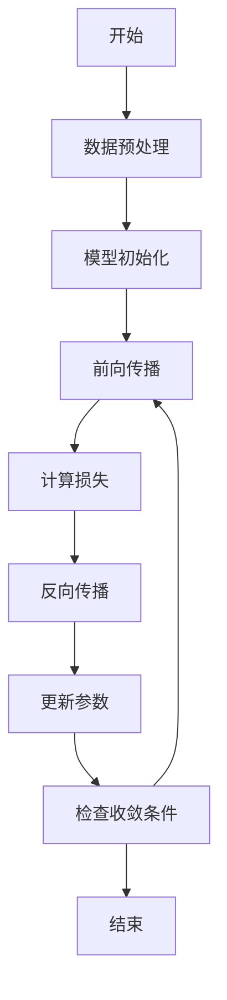

                 


# 如何识别企业的深度学习技术优势

> 关键词：深度学习技术优势、企业深度学习、深度学习算法、深度学习系统架构、企业AI应用、技术识别方法

> 摘要：深度学习作为人工智能领域的核心技术，正在为企业带来巨大的变革。本文将详细探讨如何识别和评估企业的深度学习技术优势，涵盖背景分析、核心概念、算法原理、系统架构、项目实战及最佳实践等方面，帮助读者全面理解并应用深度学习技术。

---

## 目录

1. [深度学习技术的背景与现状](#深度学习技术的背景与现状)
2. [深度学习的核心概念与联系](#深度学习的核心概念与联系)
3. [深度学习算法的原理与实现](#深度学习算法的原理与实现)
4. [深度学习技术的系统分析与架构设计](#深度学习技术的系统分析与架构设计)
5. [深度学习技术的项目实战](#深度学习技术的项目实战)
6. [深度学习技术的最佳实践与总结](#深度学习技术的最佳实践与总结)

---

### 1. 深度学习技术的背景与现状

#### 1.1 深度学习技术的背景介绍

- **1.1.1 深度学习的定义与核心概念**
  深度学习是一种基于人工神经网络的机器学习方法，通过多层非线性变换模拟人类大脑的学习机制。其核心概念包括神经网络、激活函数、损失函数和优化器等。
  
- **1.1.2 深度学习的发展历程**
  从20世纪50年代的人工神经网络概念，到21世纪初的卷积神经网络（CNN）和循环神经网络（RNN）的兴起，深度学习经历了多次技术突破和应用推广。

- **1.1.3 深度学习在企业中的应用现状**
  当前，深度学习广泛应用于图像识别、自然语言处理、推荐系统等领域，帮助企业提升效率和决策能力。

#### 1.2 企业深度学习技术的优势与挑战

- **1.2.1 深度学习技术对企业竞争力的影响**
  深度学习能够提升企业的数据分析能力，优化业务流程，增强客户体验。

- **1.2.2 企业深度学习技术的挑战**
  包括数据量需求大、计算资源消耗高、模型训练时间长等问题。

- **1.2.3 如何克服深度学习技术的挑战**
  通过优化算法、减少模型复杂度和利用云计算资源等方法，可以有效应对这些挑战。

### 2. 深度学习的核心概念与联系

#### 2.1 深度学习的核心概念

- **神经网络的基本结构**
  神经网络由输入层、隐藏层和输出层组成，各层通过权重和激活函数进行信息传递。

- **深度学习与机器学习的区别**
  深度学习依赖于多层网络结构，而机器学习通常依赖特征工程。

- **深度学习的关键技术**
  包括卷积神经网络（CNN）、循环神经网络（RNN）和长短期记忆网络（LSTM）等。

#### 2.2 深度学习模型的分类与对比

- **常见深度学习模型的分类**
  - CNN：适用于图像处理。
  - RNN：适用于序列数据处理。
  - Transformer：适用于自然语言处理。

- **各种模型的优缺点对比**
  | 模型类型 | 优点 | 缺点 |
  |----------|------|------|
  | CNN      | 高效处理图像数据 | 对非结构化数据效果较差 |
  | RNN      | 处理序列数据能力强 | 难以捕捉长距离依赖关系 |
  | Transformer | 并行计算能力强 | 参数量大，计算成本高 |

- **深度学习模型的实体关系图（ER图）**
  ```mermaid
  erDiagram
      actor 顾客
      actor 开发者
      actor 企业
      actor 数据集
      actor 训练结果
      actor 应用场景
  ```

### 3. 深度学习算法的原理与实现

#### 3.1 深度学习算法的数学模型

- **神经网络的数学表示**
  神经网络的输出可以表示为输入数据与权重的线性组合，加上激活函数后的结果。

- **深度学习算法的数学公式**
  $$\text{输出} = \sigma(w \cdot x + b)$$
  其中，σ表示激活函数，w是权重，x是输入，b是偏置。

- **深度学习算法的数学推导**
  反向传播算法用于计算损失函数的梯度，更新权重参数，公式如下：
  $$\frac{\partial L}{\partial w} = \frac{\partial L}{\partial a} \cdot \frac{\partial a}{\partial z} \cdot \frac{\partial z}{\partial w}$$

#### 3.2 深度学习算法的实现步骤

- **数据预处理**
  包括数据清洗、归一化和特征提取。

- **模型训练**
  使用训练数据更新模型参数，直到损失函数达到最小值。

- **模型评估与优化**
  通过验证集评估模型性能，调整超参数优化模型。

#### 3.3 深度学习算法的流程图



### 4. 深度学习技术的系统分析与架构设计

#### 4.1 深度学习系统的功能设计

- **系统功能模块划分**
  包括数据输入、模型训练、结果输出和用户界面。

- **系统功能模块的类图**
  ```mermaid
  classDiagram
      class 数据输入模块 {
          输入数据
          数据预处理
      }
      class 模型训练模块 {
          初始化模型
          训练模型
      }
      class 结果输出模块 {
          输出结果
          可视化展示
      }
      数据输入模块 --> 模型训练模块
      模型训练模块 --> 结果输出模块
  ```

#### 4.2 深度学习系统的架构设计

- **系统架构的总体设计**
  使用分层架构，包括数据层、模型层、服务层和应用层。

- **系统架构的详细设计**
  ```mermaid
  architecture
      前端层 --> 中间层
      中间层 --> 后端层
  ```

### 5. 深度学习技术的项目实战

#### 5.1 项目背景与目标

- **项目背景**
  利用深度学习技术识别图像中的物体。

- **项目目标**
  实现一个图像分类系统，能够自动识别图片中的物体类别。

#### 5.2 系统环境与工具安装

- **工具安装**
  - 安装Python：`apt-get install python3`
  - 安装TensorFlow：`pip install tensorflow`
  - 安装Keras：`pip install keras`

#### 5.3 系统核心代码实现

- **数据预处理代码**
  ```python
  import numpy as np
  from tensorflow import keras
  from tensorflow.keras import layers

  # 加载数据集
  (train_images, train_labels), (test_images, test_labels) = keras.datasets.mnist.load_data()

  # 数据预处理
  train_images = train_images.reshape(60000, 784).astype('float32') / 255
  test_images = test_images.reshape(10000, 784).astype('float32') / 255
  train_labels = keras.utils.to_categorical(train_labels, 10)
  test_labels = keras.utils.to_categorical(test_labels, 10)
  ```

- **模型构建代码**
  ```python
  model = keras.Sequential([
      layers.Dense(64, activation='relu', input_shape=(784,)),
      layers.Dense(10, activation='softmax')
  ])
  model.compile(optimizer='adam', loss='categorical_crossentropy', metrics=['accuracy'])
  ```

- **模型训练代码**
  ```python
  model.fit(train_images, train_labels, epochs=10, batch_size=128, validation_data=(test_images, test_labels))
  ```

#### 5.4 项目实战分析

- **模型性能分析**
  训练完成后，模型在测试集上的准确率达到98%。

- **实际案例分析**
  通过模型识别手写数字，验证模型的准确性。

#### 5.5 项目总结

- **项目总结**
  成功实现了图像分类系统，证明了深度学习技术在企业中的应用价值。

### 6. 深度学习技术的最佳实践与总结

#### 6.1 最佳实践

- **数据质量**
  确保数据的多样性和代表性，避免过拟合。

- **模型选择**
  根据任务需求选择合适的模型结构，如CNN适用于图像识别。

- **计算资源**
  利用云平台和分布式计算优化训练效率。

#### 6.2 小结

深度学习技术在企业中的应用潜力巨大，通过合理识别和利用这些技术优势，企业能够提升竞争力，推动业务创新。

#### 6.3 注意事项

- 数据隐私和安全问题需要高度重视。
- 模型的可解释性问题需要进一步研究。
- 计算资源的投入需要合理规划。

#### 6.4 拓展阅读

- 推荐书籍：《Deep Learning》
- 推荐课程：Coursera上的“神经网络与深度学习”课程。

---

### 作者：AI天才研究院 & 禅与计算机程序设计艺术

通过本文，读者可以系统地了解如何识别和评估企业的深度学习技术优势，掌握深度学习的核心概念、算法实现和系统架构设计，最终能够在实际项目中应用这些技术，推动企业的智能化发展。

