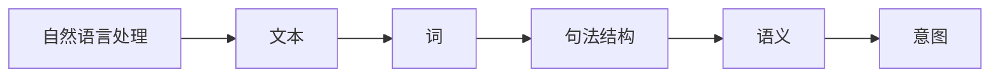
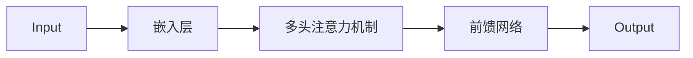
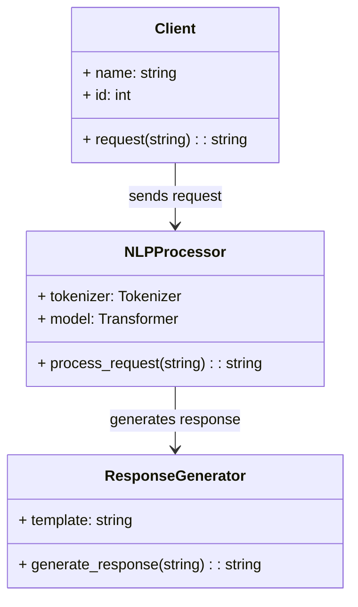
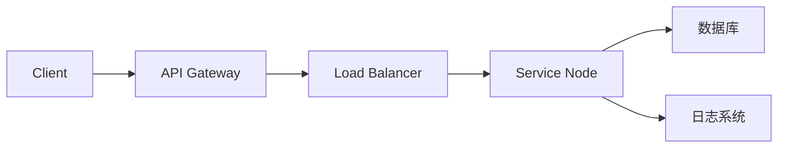
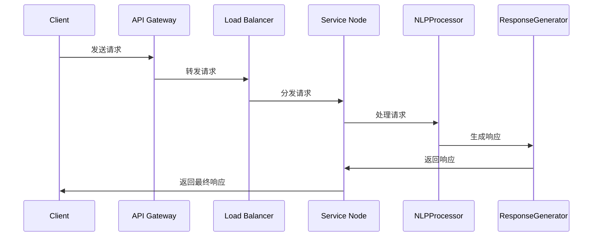

                 


# 如何识别企业的深度学习自然语言处理优势

## 关键词：
深度学习、自然语言处理、企业应用、技术优势、算法原理、系统架构、项目实战

## 摘要：
本文旨在帮助读者识别企业在深度学习自然语言处理（NLP）中的优势。通过分析NLP的核心概念、算法原理、系统架构及项目实战，我们将探讨如何在企业中有效应用这些技术，提升竞争力。

---

## 第一部分：背景介绍

### 第1章：深度学习与自然语言处理的背景

#### 1.1 什么是自然语言处理（NLP）

自然语言处理（NLP）是人工智能（AI）的一个分支，旨在使计算机能够理解、解析和生成人类语言。从语言学和计算机科学的结合中演进，NLP的目标是让计算机像人类一样处理语言。

- **发展历程**：从基于规则的系统到统计学习，再到深度学习的崛起。
- **技术特点**：结合了语言学知识和机器学习技术，能够处理复杂的语言结构。
- **应用场景**：文本分类、信息提取、机器翻译、对话系统等。

#### 1.2 企业中的NLP优势

在企业中，NLP技术可以帮助提升客户体验、优化业务流程和提高效率。

- **提升客户体验**：通过智能客服系统提供更精准的服务。
- **优化业务流程**：自动化处理文档，减少人工干预。
- **提高效率**：快速分析大量文本数据，提取有价值的信息。

#### 1.3 问题背景与挑战

企业应用NLP技术面临的主要挑战包括数据质量、模型训练成本和算法的可解释性。

- **数据问题**：需要大量高质量的标注数据。
- **计算成本**：深度学习模型训练需要高性能计算资源。
- **可解释性**：复杂的模型往往难以解释其决策过程。

---

## 第二部分：核心概念与联系

### 第2章：自然语言处理的核心概念

#### 2.1 NLP的关键技术与模型

- **词嵌入（Word Embedding）**：将词语转换为低维向量，如Word2Vec和GloVe。
- **语言模型（Language Model）**：预测下一个词的模型，如n-gram和Transformer。
- **注意力机制（Attention）**：在序列模型中引入权重，关注重要的位置。
- **知识图谱（Knowledge Graph）**：结构化知识的表示，用于信息检索和推理。

#### 2.2 核心概念的对比分析

- **表格对比**：以下表格展示了NLP中不同技术的特点和应用场景。

| 技术         | 特点                           | 应用场景                     |
|--------------|--------------------------------|------------------------------|
| 词嵌入       | 将词语向量化，捕捉语义信息       | 文本分类、情感分析           |
| 语言模型     | 预测下一个词，处理序列数据       | 机器翻译、对话生成         |
| 注意力机制   | 关注序列中重要的位置             | Transformer模型             |
| 知识图谱     | 结构化知识，支持推理             | 实体识别、信息检索         |

- **Mermaid图**：NLP实体关系图



---

## 第三部分：算法原理讲解

### 第3章：主流NLP算法与深度学习模型

#### 3.1 Transformer模型的原理

- **Mermaid图**：Transformer架构



- **代码示例**：简单的Transformer模型实现

```python
import torch
import torch.nn as nn

class Transformer(nn.Module):
    def __init__(self, d_model, nhead, dropout=0.1):
        super(Transformer, self).__init__()
        self.embedding = nn.Linear(d_model, d_model)
        self.transformer = nn.Transformer(d_model=d_model, nhead=nhead, dropout=dropout)
        self.dropout = nn.Dropout(dropout)
    
    def forward(self, x):
        x = self.embedding(x)
        x = self.transformer(x)
        x = self.dropout(x)
        return x
```

- **数学模型**：注意力机制的公式

$$
\text{Attention}(Q, K, V) = \text{softmax}\left(\frac{QK^T}{\sqrt{d_k}}\right)V
$$

---

## 第四部分：系统分析与架构设计方案

### 第4章：企业级NLP系统架构

#### 4.1 问题场景介绍

- **项目介绍**：构建一个智能客服系统，用于自动理解和回复客户咨询。

#### 4.2 系统功能设计

- **领域模型**：类图展示系统功能模块



#### 4.3 系统架构设计

- **架构图**：展示系统的分层结构



#### 4.4 系统接口设计

- **序列图**：展示系统交互流程



---

## 第五部分：项目实战

### 第5章：企业级NLP项目的实战

#### 5.1 环境安装

- **安装Python和必要的库**

```bash
pip install torch transformers
```

#### 5.2 系统核心实现源代码

- **实现简单的文本分类器**

```python
from transformers import BertTokenizer, BertModel
import torch

tokenizer = BertTokenizer.from_pretrained('bert-base-uncased')
model = BertModel.from_pretrained('bert-base-uncased')

def classify_text(text):
    inputs = tokenizer(text, return_tensors='pt')
    outputs = model(**inputs)
    return outputs.last_hidden_state
```

#### 5.3 实际案例分析

- **案例分析**：通过客服对话数据，训练一个文本分类模型，识别客户情绪。

---

## 第六部分：最佳实践

### 第6章：NLP项目的最佳实践

#### 6.1 小结

- 深度学习和NLP的结合为企业带来了巨大的优势，但需要克服数据和计算的挑战。

#### 6.2 注意事项

- **数据质量**：确保数据的标注和清洗。
- **模型可解释性**：选择易于解释的模型。
- **计算资源**：合理分配资源以优化训练效率。

#### 6.3 拓展阅读

- 推荐阅读《Deep Learning for NLP》和《Transformer-based Models in Practice》。

---

## 作者

作者：AI天才研究院 & 禅与计算机程序设计艺术

--- 

这篇文章详细介绍了如何识别和应用企业的深度学习自然语言处理优势，涵盖了从理论到实践的各个方面，帮助读者全面理解并应用这些技术。

