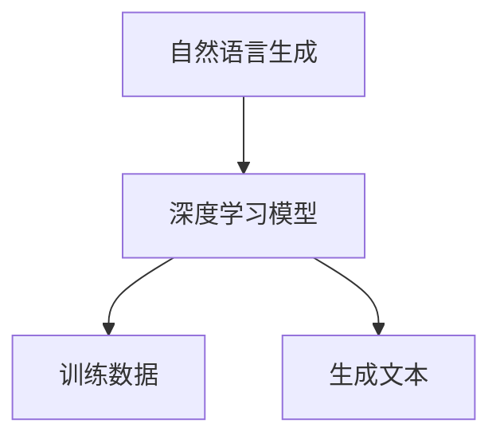
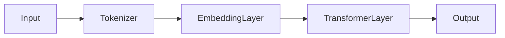
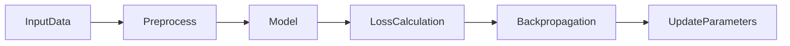
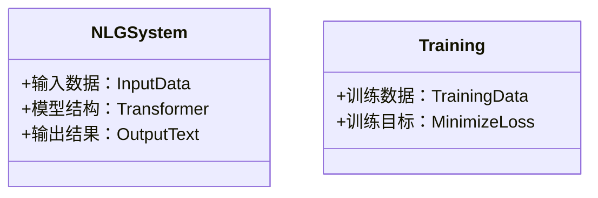

                 


# 如何识别企业的深度学习自然语言生成技术优势

> 关键词：深度学习，自然语言生成，技术优势，企业应用，算法原理

> 摘要：本文将从技术背景、核心概念、算法原理、系统架构、项目实战和最佳实践等多个维度，详细阐述如何识别和评估企业的深度学习自然语言生成技术优势。通过理论分析与实际案例相结合的方式，帮助读者全面理解该技术的核心要点，并掌握如何在实际项目中识别和应用这些优势。

---

## 第一部分: 深度学习自然语言生成技术概述

### 第1章: 背景介绍

#### 1.1 问题背景
自然语言生成（Natural Language Generation, NLG）是人工智能领域的重要分支，旨在使计算机能够生成符合人类语言习惯的文本。随着深度学习技术的发展，NLG在企业中的应用越来越广泛，如智能客服、机器翻译、内容生成等。

#### 1.2 问题描述
企业在应用NLG技术时，通常面临以下挑战：
1. **数据质量**：生成文本的质量依赖于训练数据的质量和多样性。
2. **模型复杂性**：深度学习模型通常需要大量的计算资源和时间进行训练。
3. **应用场景的多样性**：不同业务场景对生成文本的要求不同，需要定制化解决方案。

#### 1.3 问题解决
深度学习通过以下方式解决了传统NLG技术的局限性：
1. **端到端学习**：深度学习模型可以直接从原始数据中学习生成文本，无需手动特征提取。
2. **上下文理解**：通过序列建模，模型可以更好地理解上下文关系。
3. **可扩展性**：深度学习模型可以通过并行计算加速训练和推理过程。

#### 1.4 概念结构与核心要素
- **输入数据**：文本、结构化数据或图像。
- **模型结构**：如Transformer、LSTM等。
- **训练目标**：最小化生成文本与真实文本的差异。
- **评估指标**：如BLEU、ROUGE等。

---

### 第2章: 核心概念与联系

#### 2.1 核心概念原理
- **自然语言生成**：通过模型生成符合语法和语义的文本。
- **深度学习模型**：如BERT、GPT等，用于捕捉语言的复杂模式。

#### 2.2 核心概念对比
| 技术 | 优点 | 缺点 |
|------|------|------|
| RNN   | 简单 | 长距离依赖处理差 |
| LSTM  | 改善长距离依赖 | 计算复杂 |
| Transformer | 并行计算能力强 | 显存占用高 |

#### 2.3 实体关系图


---

### 第3章: 算法原理讲解

#### 3.1 模型结构


#### 3.2 训练过程


#### 3.3 数学公式
- **损失函数**：交叉熵损失函数
  $$ \mathcal{L} = -\sum_{i=1}^{n} \log p(y_i|x) $$
- **注意力机制**：
  $$ \text{Attention}(Q, K, V) = \text{softmax}\left(\frac{QK^T}{\sqrt{d_k}}\right)V $$

---

### 第4章: 系统分析与架构设计

#### 4.1 项目场景
- **智能客服**：生成回复文本。
- **新闻生成**：基于数据生成新闻稿。

#### 4.2 系统功能设计


#### 4.3 系统架构设计


---

### 第5章: 项目实战

#### 5.1 环境搭建
- **工具**：Python、TensorFlow、Keras。
- **库**：NLTK、PyTorch。

#### 5.2 核心实现
```python
import torch
import torch.nn as nn

class SimpleGenerator(nn.Module):
    def __init__(self, vocab_size):
        super().__init__()
        self.lm_head = nn.Linear(768, vocab_size)

    def forward(self, input_ids):
        outputs = self.lm_head(input_ids)
        return outputs

model = SimpleGenerator(vocab_size=10000)
```

#### 5.3 案例分析
- **训练数据**：文本语料库。
- **生成结果**：根据输入生成文本。

---

### 第6章: 最佳实践与总结

#### 6.1 小结
- 深度学习在NLG中的优势：端到端学习、上下文理解、可扩展性。
- 关键技术：模型结构、训练方法、评估指标。

#### 6.2 注意事项
- 数据预处理：确保数据质量。
- 模型选择：根据场景选择合适模型。
- 资源分配：合理配置计算资源。

#### 6.3 未来展望
- 更复杂的模型：如多模态生成。
- 更高效的训练方法：如分布式训练。

---

作者：AI天才研究院/AI Genius Institute & 禅与计算机程序设计艺术 /Zen And The Art of Computer Programming

