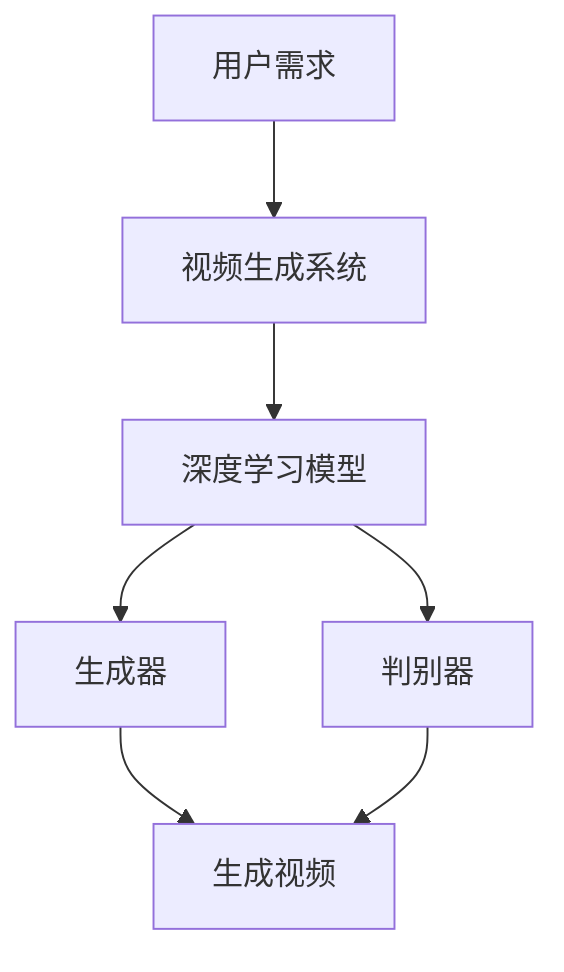

                 


# 如何识别企业的深度学习视频生成技术优势

> 关键词：深度学习，视频生成，生成对抗网络，变分自编码器，企业应用，技术优势

> 摘要：本文将从技术背景、核心原理、系统架构、算法实现、项目实战等多个维度，深入剖析深度学习视频生成技术的优势与特点，帮助企业技术管理者和开发者快速识别和评估相关技术的潜力与应用场景。

---

## 第一部分: 深度学习视频生成技术背景与核心概念

### 第1章: 深度学习视频生成技术概述

#### 1.1 深度学习视频生成技术的背景
- 1.1.1 传统视频生成技术的局限性
  - 传统视频生成依赖于手动编辑和后期处理，效率低且成本高。
  - 传统方法难以处理复杂场景和高维数据。
  
- 1.1.2 深度学习技术的崛起
  - 深度学习在图像生成领域的成功（如GAN、VAE）为视频生成提供了新思路。
  - 计算机视觉和自然语言处理的结合推动了视频生成技术的发展。
  
- 1.1.3 企业级应用的潜力与挑战
  - 在企业营销、教育培训、虚拟试用等领域具有广阔应用前景。
  - 技术复杂性和计算资源需求对企业提出了较高要求。

#### 1.2 深度学习视频生成的核心问题
- 1.2.1 视频生成的定义与目标
  - 通过深度学习模型生成连续帧序列，构建动态视频内容。
  - 确保生成视频的连贯性、真实性和可控制性。
  
- 1.2.2 深度学习在视频生成中的优势
  - 能够自动学习数据中的复杂模式。
  - 支持高效率的批量生成和个性化定制。
  
- 1.2.3 企业应用场景的特殊性
  - 需要兼顾生成效率和生成质量。
  - 对模型的可解释性和稳定性有较高要求。

#### 1.3 深度学习视频生成技术的边界与外延
- 1.3.1 技术边界
  - 专注于生成高质量的视频内容，不涉及视频编辑和后期处理。
  - 以生成模型为核心，不涵盖其他类型的内容生成（如音频、3D模型）。
  
- 1.3.2 应用场景的外延
  - 可扩展至虚拟现实、增强现实等新兴领域。
  - 在医疗、金融等行业的特殊应用中具有潜力。
  
- 1.3.3 与其他技术的关联
  - 与计算机视觉、自然语言处理等技术深度融合。
  - 需要结合云计算和边缘计算优化资源利用率。

#### 1.4 核心概念组成
- 1.4.1 深度学习模型
  - GAN（生成对抗网络）和VAE（变分自编码器）是主流模型。
  - 模型的训练目标和损失函数是关键。
  
- 1.4.2 视频生成的特征
  - 视频的连贯性、真实感和多样性。
  - 模型的生成效率和可扩展性。
  
- 1.4.3 企业需求的匹配性
  - 需要根据企业需求调整模型参数和生成策略。
  - 考虑企业的技术基础和资源投入。

---

## 第2章: 深度学习视频生成技术的核心原理

### 2.1 深度学习视频生成的核心算法
- 2.1.1 生成对抗网络（GAN）
  - 生成器与判别器的对抗训练。
  - GAN在视频生成中的改进方法（如条件GAN、3D GAN）。
  
- 2.1.2 变分自编码器（VAE）
  - 通过编码器-解码器结构生成视频。
  - VAE在视频生成中的应用特点。
  
- 2.1.3 其他生成模型
  - 如Flow-based models、Diffusion models等。

### 2.2 算法原理对比分析
- 2.2.1 GAN与VAE的对比
  | 特性    | GAN                          | VAE                          |
  |---------|------------------------------|----------------------------|
  | 原理    | 对抗训练，生成器与判别器博弈 | 基于概率建模，优化重构损失 |
  | 优点    | 高生成质量，多样化输出      | 稳定性高，易于控制           |
  | 缺点    | 训练不稳定，难调试           | 生成质量较低，多样性不足     |

- 2.2.2 不同算法的优缺点
  - GAN：生成质量高，但训练过程不稳定。
  - VAE：生成过程稳定，但质量较低。
  - Diffusion models：生成质量介于两者之间，训练过程较长。

- 2.2.3 算法选择的依据
  - 生成质量要求：选择GAN。
  - 稳定性和控制性要求：选择VAE。
  - 综合考虑：使用混合模型或改进算法。

### 2.3 核心概念的ER实体关系图


---

## 第三部分: 深度学习视频生成技术的系统分析与架构设计方案

### 第3章: 深度学习视频生成系统的架构设计

#### 3.1 问题场景介绍
- 企业视频生成系统需要满足以下需求：
  - 支持大规模数据处理。
  - 提供高效率的生成能力。
  - 具备良好的可扩展性和可维护性。

#### 3.2 系统功能设计
- 3.2.1 领域模型
  ```mermaid
  classDiagram
      class 用户需求 {
          提交生成任务
          获取生成视频
      }
      class 视频生成系统 {
          接收任务
          调用模型
          返回结果
      }
      class 深度学习模型 {
          生成器
          判别器
      }
      用户需求 --> 视频生成系统
      视频生成系统 --> 深度学习模型
  ```

- 3.2.2 系统架构设计
  ```mermaid
  architecture
      客户端 --> 视频生成系统
      视频生成系统 --> 深度学习模型
      深度学习模型 --> 训练模块
      深度学习模型 --> 生成模块
  ```

- 3.2.3 接口设计和交互流程
  ```mermaid
  sequenceDiagram
      participant 用户
      participant 视频生成系统
      participant 深度学习模型
      用户 ->> 视频生成系统: 提交生成任务
      视频生成系统 ->> 深度学习模型: 调用生成接口
      深度学习模型 ->> 视频生成系统: 返回生成视频
      视频生成系统 ->> 用户: 传输生成视频
  ```

---

## 第四部分: 深度学习视频生成技术的项目实战

### 第4章: 深度学习视频生成技术的实现

#### 4.1 环境安装与配置
- 安装Python、TensorFlow、Keras等开发环境。
- 配置GPU加速环境。

#### 4.2 核心代码实现
- 使用GAN实现简单视频生成模型。
- 示例代码如下：

```python
import tensorflow as tf
from tensorflow.keras import layers

# 定义生成器
def build_generator():
    model = tf.keras.Sequential()
    model.add(layers.Dense(256, activation='relu', input_dim=100))
    model.add(layers.Dense(128, activation='relu'))
    model.add(layers.Dense(64, activation='relu'))
    model.add(layers.Dense(32, activation='relu'))
    model.add(layers.Dense(16, activation='relu'))
    model.add(layers.Dense(8, activation='relu'))
    model.add(layers.Dense(3*32*32, activation='sigmoid'))
    model.add(layers.Reshape((32, 32, 3)))
    return model

# 定义判别器
def build_discriminator():
    model = tf.keras.Sequential()
    model.add(layers.Conv2D(64, (3,3), activation='relu', input_shape=(32,32,3)))
    model.add(layers.Conv2D(128, (3,3), activation='relu'))
    model.add(layers.Flatten())
    model.add(layers.Dense(256, activation='relu'))
    model.add(layers.Dense(1, activation='sigmoid'))
    return model

# 定义损失函数和优化器
generator = build_generator()
discriminator = build_discriminator()

cross_entropy = tf.keras.losses.BinaryCrossentropy()
generator_optimizer = tf.keras.optimizers.Adam(0.0002)
discriminator_optimizer = tf.keras.optimizers.Adam(0.0002)

# 训练过程
def train_step(real_images, generator, discriminator, generator_optimizer, discriminator_optimizer):
    noise = tf.random.normal([batch_size, 100])
    generated_images = generator(noise)

    real_output = discriminator(real_images)
    generated_output = discriminator(generated_images)

    gen_loss = cross_entropy(tf.ones_like(real_output), generated_output)
    disc_loss = cross_entropy(tf.zeros_like(real_output), generated_output) + cross_entropy(tf.ones_like(real_output), real_output)

    generator_loss = gen_loss
    discriminator_loss = disc_loss

    generator_optimizer.minimize(generator_loss, generator.trainable_variables)
    discriminator_optimizer.minimize(discriminator_loss, discriminator.trainable_variables)

# 训练循环
for epoch in range(num_epochs):
    for batch in dataset:
        train_step(batch, generator, discriminator, generator_optimizer, discriminator_optimizer)
```

#### 4.3 代码解读与分析
- 生成器通过多层感知机（MLP）将噪声映射为图像。
- 判别器通过卷积神经网络（CNN）判别图像的真实性。
- 损失函数和优化器定义了模型的训练目标和优化策略。
- 训练过程中，生成器和判别器交替优化，逐步提升生成质量。

#### 4.4 实际案例分析
- 使用上述模型生成简单的GIF动图。
- 分析生成结果的质量、连贯性和多样性。
- 调整模型参数（如网络层数、学习率）优化生成效果。

---

## 第五部分: 总结与展望

### 第5章: 深度学习视频生成技术的优势与挑战

#### 5.1 最佳实践 tips
- 根据企业需求选择合适的生成模型。
- 合理配置计算资源，优化生成效率。
- 定期更新模型参数，保持生成质量。

#### 5.2 小结
- 深度学习视频生成技术在企业中的应用前景广阔。
- 通过合理的技术选型和系统设计，可以显著提升企业的视频生成能力。

#### 5.3 未来趋势与展望
- 混合模型（如GAN+VAE）将更加流行。
- 算法的可解释性和稳定性将得到进一步优化。
- 视频生成技术将与虚拟现实、增强现实等技术深度融合。

#### 5.4 拓展阅读
- 推荐阅读《生成对抗网络：理论与实践》。
- 关注学术论文（如arXiv上最新的视频生成技术论文）。

---

## 作者：AI天才研究院/AI Genius Institute & 禅与计算机程序设计艺术 /Zen And The Art of Computer Programming

