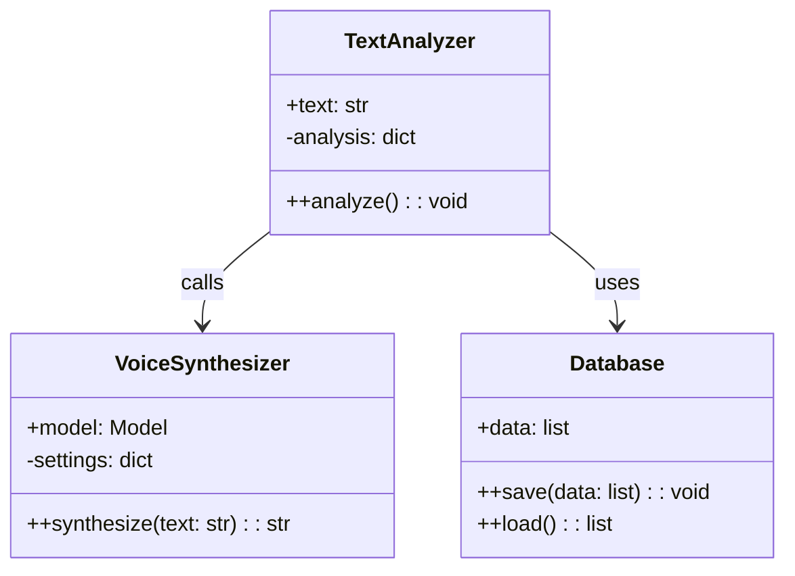
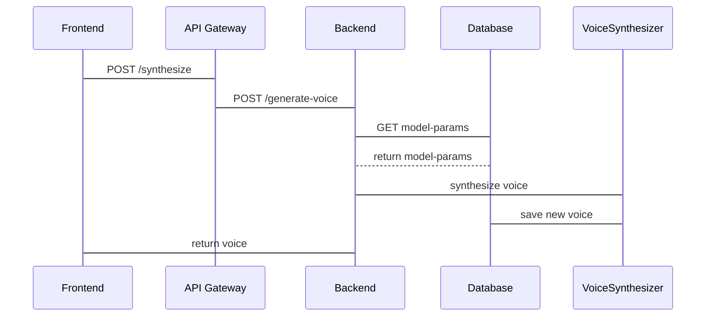

                 


# 如何识别企业的深度学习语音合成技术优势

---

## 关键词

- 深度学习
- 语音合成
- TTS（Text-to-Speech）
- 神经网络
- 语音识别

---

## 摘要

深度学习语音合成技术正在 revolutionize 各个行业，通过生成自然流畅的语音，为企业带来显著的效率提升和用户体验优化。本文将从技术背景、核心原理、系统架构到实际应用，全面分析深度学习语音合成的优势，帮助企业识别和应用这一技术。

---

# 第1章：深度学习语音合成技术背景

## 1.1 语音合成技术概述

### 1.1.1 语音合成的定义

语音合成是将文本转换为语音的过程，通过技术手段模拟人类语音输出。传统语音合成技术基于规则和模板，但受限于自然度和多样性。

### 1.1.2 深度学习在语音合成中的应用

深度学习通过神经网络模型，学习大规模语音数据，生成高质量语音。TTS（Text-to-Speech）系统利用深度学习模型，将文本转换为自然语音。

### 1.1.3 企业中的语音合成技术

企业广泛应用于客服系统、教育、车载系统等领域，提升效率和用户体验。

---

## 1.2 深度学习语音合成的优势

### 1.2.1 高准确性

深度学习模型通过大量数据训练，生成准确的语音，减少错误率。

### 1.2.2 多样性

支持多种语调、语速和语音风格，满足不同场景需求。

### 1.2.3 实时性

现代模型优化后，可实现实时语音生成，满足实时应用需求。

---

## 1.3 企业应用中的语音合成技术

### 1.3.1 客服系统

自动语音应答系统生成自然语音，提升客户体验。

### 1.3.2 教育培训

个性化语音教学，提供多样化的学习资源。

### 1.3.3 车载系统

提供实时导航语音，提升驾驶安全和用户体验。

---

# 第2章：深度学习语音合成的核心概念

## 2.1 语音合成的基本原理

### 2.1.1 文本到语音（TTS）流程

TTS系统包括文本分析、语音合成、语音生成三个阶段。

### 2.1.2 声学模型

声学模型将文本转换为声学特征，如Mel谱，作为语音生成的基础。

### 2.1.3 语言模型

语言模型用于预测下一个词或字符，提升语音的流畅度和自然度。

---

## 2.2 深度学习模型在语音合成中的应用

### 2.2.1 Transformer架构

基于Transformer的模型，如Tacotron，通过自注意力机制，捕捉文本中的长距离依赖关系。

### 2.2.2 图像处理技术

深度学习技术在语音合成中的应用，如图像处理技术用于生成语音波形。

---

## 2.3 深度学习语音合成的优势与挑战

### 2.3.1 优势分析

高准确性和多样性是深度学习语音合成的主要优势。

### 2.3.2 挑战与解决方案

数据需求大、计算资源消耗高是主要挑战，解决方案包括数据增强和模型优化。

---

# 第3章：深度学习语音合成的算法原理

## 3.1 端到端语音合成模型

### 3.1.1 Tacotron模型

基于Char-RNN和自注意力机制的端到端语音合成模型。

### 3.1.2 FastSpeech模型

基于Transformer的快速语音合成模型，提升生成效率。

### 3.1.3 Hugging Face的语音合成库

开源工具库，方便开发者快速实现语音合成功能。

---

## 3.2 深度学习语音合成的训练过程

### 3.2.1 数据预处理

对数据进行清洗、标注和格式化处理，确保模型训练效率。

### 3.2.2 模型训练

利用GPU加速训练，优化模型参数，提升生成质量。

### 3.2.3 模型优化

通过调整超参数和模型架构，进一步提升语音合成效果。

---

## 3.3 语音合成的数学模型

### 3.3.1 Mel谱与声学参数的关系

Mel谱表示语音的频域特征，声学参数描述语音的时域特征，两者相互关联。

### 3.3.2 损失函数的计算

使用交叉熵损失函数，衡量生成语音与目标语音的差异。

### 3.3.3 语音波形的生成过程

通过逆向转换，将Mel谱转换为语音波形，生成最终的语音输出。

---

# 第4章：深度学习语音合成的系统架构

## 4.1 系统架构概述

### 4.1.1 前端系统

接收输入文本，进行文本分析和预处理。

### 4.1.2 后端系统

运行深度学习模型，生成语音信号。

### 4.1.3 数据库

存储训练数据和模型参数，支持系统的持续优化。

---

## 4.2 系统功能设计

### 4.2.1 领域模型

使用Mermaid类图展示系统功能模块及其交互关系。



---

## 4.3 系统架构设计

### 4.3.1 系统架构图

使用Mermaid绘制系统架构图，展示前端、后端和数据库的交互关系。

```mermaid
graph TD
    Frontend --> API Gateway
    API Gateway --> Backend
    Backend --> Database
    Database --> Backend
```

---

## 4.4 系统接口设计

### 4.4.1 接口设计

定义RESTful API接口，如：

- POST /synthesize
- GET /settings
- PUT /update-model

---

## 4.5 系统交互流程

使用Mermaid序列图展示系统交互流程。



---

# 第5章：项目实战

## 5.1 环境安装

### 5.1.1 安装Python

安装Python 3.8或更高版本，确保支持深度学习库。

### 5.1.2 安装深度学习库

安装TensorFlow和Keras：

```bash
pip install tensorflow keras
```

---

## 5.2 系统核心实现

### 5.2.1 模型实现

基于Tacotron模型实现语音合成系统。

```python
import tensorflow as tf
from tensorflow import keras

# 定义Tacotron模型
def build_model():
    input_text = keras.Input(shape=(None, 128))  # 假设词向量维度为128
    x = keras.layers.Conv1D(128, 5, padding='same')(input_text)
    x = keras.layers.MaxPooling1D(pool_size=2)(x)
    x = keras.layers.RepeatVector(16)(x)
    x = keras.layers.Conv1DTranspose(128, 5, padding='same')(x)
    output = keras.layers.Dense(161)(x)  # 输出Mel谱
    model = keras.Model(inputs=input_text, outputs=output)
    return model
```

### 5.2.2 训练过程

定义损失函数和训练步骤。

```python
def loss(y_true, y_pred):
    return tf.keras.losses.sparse_categorical_crossentropy(y_true, y_pred)

model = build_model()
model.compile(optimizer='adam', loss=loss)
model.fit(x_train, y_train, epochs=10, batch_size=32)
```

---

## 5.3 项目小结

项目实战部分通过具体代码实现，展示了深度学习语音合成技术的实现过程和关键步骤。

---

# 第6章：最佳实践

## 6.1 技术选型

选择合适的模型和工具库，如开源模型或自定义模型。

## 6.2 性能优化

优化模型结构和训练参数，提升生成效率和质量。

## 6.3 安全性考虑

保护用户隐私，确保数据安全。

## 6.4 未来趋势

关注前沿技术，如多模态语音合成和实时语音生成。

---

# 结语

深度学习语音合成技术正在改变企业应用的方式，通过本文的分析，读者可以全面了解其优势和实现过程，为企业技术决策提供参考。

---

## 作者

作者：AI天才研究院/AI Genius Institute  
联系方式：[email protected]  
个人简介：专注于人工智能和自然语言处理领域，致力于推动深度学习技术的创新与应用。

---

