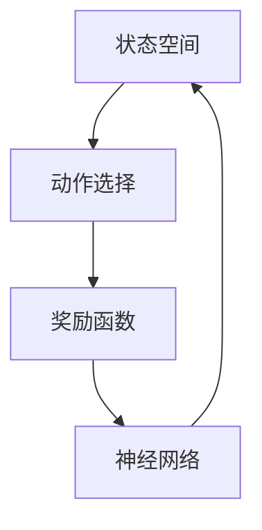
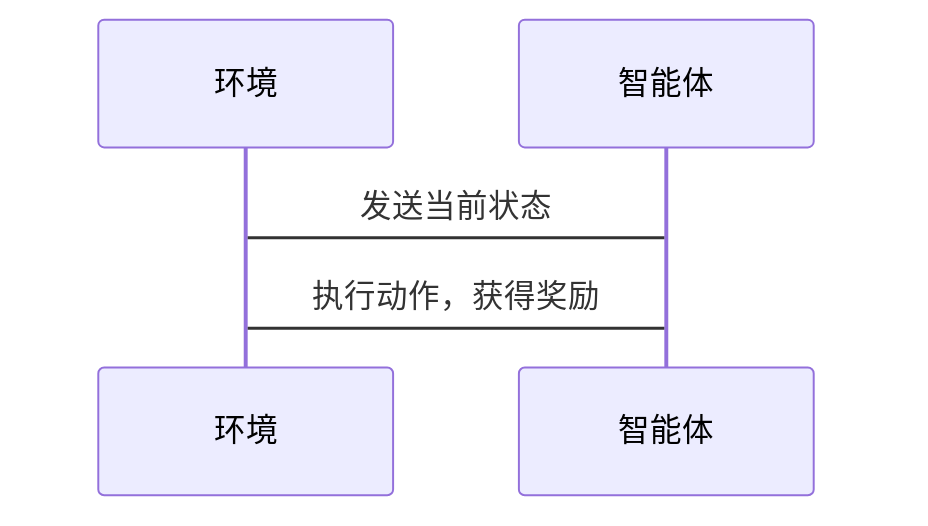

                 


# 如何识别企业的深度强化学习技术优势

## 关键词：深度强化学习，企业技术优势，算法原理，系统架构，项目实战

## 摘要：本文将从深度强化学习的基本概念、核心算法、系统架构设计、项目实战以及最佳实践等多个方面，系统地分析如何识别和利用企业的深度强化学习技术优势。通过详细讲解相关理论和实际案例，帮助读者掌握深度强化学习的核心原理，从而在企业中更好地应用这一技术。

---

# 目录

## 第一部分: 深度强化学习技术基础

### 第1章: 深度强化学习概述

#### 1.1 深度强化学习的基本概念

##### 1.1.1 什么是深度强化学习
深度强化学习（Deep Reinforcement Learning, DRL）是人工智能领域的一个重要分支，它结合了深度学习和强化学习的优势，通过神经网络来学习复杂的决策策略。

##### 1.1.2 深度强化学习的核心要素
- 状态（State）：环境中的当前情况。
- 动作（Action）：智能体可以执行的操作。
- 奖励（Reward）：智能体执行动作后获得的反馈。
- 策略（Policy）：智能体在给定状态下选择动作的概率分布。
- 价值函数（Value Function）：评估某个状态下采取某个动作的价值。

##### 1.1.3 深度强化学习与传统机器学习的区别
| 特性                | 传统机器学习          | 深度强化学习          |
|---------------------|----------------------|----------------------|
| 数据需求            | 需要大量标注数据      | 数据少，通过与环境互动获得 |
| 学习目标            | 预测或分类           | 决策优化             |
| 应用场景            | 图像分类、回归        | 自动驾驶、游戏AI      |

#### 1.2 深度强化学习的原理

##### 1.2.1 状态、动作、奖励的定义
- **状态**：智能体所处的环境状态，例如在游戏中的角色位置。
- **动作**：智能体可以执行的动作，例如在迷宫中选择“向上”移动。
- **奖励**：智能体执行动作后获得的反馈，例如移动到宝藏位置后获得+1奖励。

##### 1.2.2 策略与价值函数的关系
- **策略**：决定在某个状态下选择哪个动作。
- **价值函数**：评估某个状态下采取某个动作的价值。

##### 1.2.3 探索与利用的平衡
- 探索：尝试新的动作以发现更好的策略。
- 利用：根据当前最佳策略采取动作以获得最大奖励。

#### 1.3 深度强化学习的应用场景

##### 1.3.1 游戏AI的发展历程
从早期的基于规则的AI到现代的深度强化学习在《星际争霸》和《Dota 2》中的应用。

##### 1.3.2 深度强化学习在机器人控制中的应用
例如波士顿动力的机器人通过深度强化学习实现平衡和跳跃。

##### 1.3.3 深度强化学习在金融投资中的应用
通过分析市场数据，制定最优的投资策略。

#### 1.4 本章小结
- 深度强化学习的核心概念：状态、动作、奖励、策略和价值函数。
- 深度强化学习在游戏、机器人和金融等领域的广泛应用。

---

### 第2章: 深度强化学习的核心算法

#### 2.1 Q-learning算法

##### 2.1.1 Q-learning的基本原理
- Q-learning是一种基于值函数的强化学习算法，通过更新Q表来学习最优策略。

##### 2.1.2 Q-learning的数学模型
$$ Q(s, a) = Q(s, a) + \alpha (r + \gamma \max Q(s', a') - Q(s, a)) $$

##### 2.1.3 Q-learning的优缺点
- 优点：简单易实现。
- 缺点：在高维状态空间中表现不佳。

#### 2.2 策略梯度方法

##### 2.2.1 策略梯度的基本概念
- 策略梯度方法直接优化策略，通过梯度上升或下降来调整参数。

##### 2.2.2 策略梯度的数学推导
$$ \nabla \theta \leftarrow \nabla J(\theta) $$

##### 2.2.3 策略梯度的应用场景
- 适用于连续动作空间的问题。

#### 2.3 深度Q网络（DQN）

##### 2.3.1 DQN的提出背景
- 为了解决Q-learning在高维状态空间中的问题。

##### 2.3.2 DQN的算法流程
1. 环境返回当前状态s。
2. 神经网络输出Q值。
3. 执行动作a，获得奖励r和新状态s'。
4. 更新Q值网络。

##### 2.3.3 DQN的实际应用案例
- 在 Atari 游戏中的应用。

#### 2.4 本章小结
- Q-learning、策略梯度和DQN是深度强化学习中的核心算法。

---

### 第3章: 深度强化学习的数学模型与公式

#### 3.1 状态值函数

##### 3.1.1 状态值函数的定义
- 状态值函数 \( V(s) \) 表示在状态s下采取最优策略的期望奖励。

##### 3.1.2 状态值函数的数学表达式
$$ V(s) = \max_a Q(s,a) $$

#### 3.2 动作值函数

##### 3.2.1 动作值函数的定义
- 动作值函数 \( Q(s,a) \) 表示在状态s下执行动作a的期望奖励。

##### 3.2.2 动作值函数的数学表达式
$$ Q(s,a) = r + \gamma \max_{a'} Q(s',a') $$

#### 3.3 策略函数

##### 3.3.1 策略函数的定义
- 策略函数 \( \pi(a|s) \) 表示在状态s下选择动作a的概率。

##### 3.3.2 策略函数的数学表达式
$$ \pi(a|s) = \text{softmax}(Q(s,a)) $$

#### 3.4 深度强化学习的优化目标
- 最大化累积奖励
- 最小化损失函数
$$ \text{Loss} = \mathbb{E}[ (Q(s,a) - y)^2 ] $$

---

### 第4章: 深度强化学习的系统架构设计

#### 4.1 系统功能设计

##### 4.1.1 状态空间的定义
- 状态空间是智能体所处环境的所有可能状态的集合。

##### 4.1.2 动作空间的定义
- 动作空间是智能体可以执行的所有动作的集合。

##### 4.1.3 奖励函数的设计
- 奖励函数定义了智能体执行动作后获得的奖励。

#### 4.2 系统架构图


#### 4.3 系统接口设计
- 状态输入接口
- 动作输出接口
- 奖励反馈接口

#### 4.4 系统交互设计


---

## 第五部分: 项目实战

### 第5章: 深度强化学习项目实战

#### 5.1 环境安装
```bash
pip install gym numpy tensorflow
```

#### 5.2 系统核心实现源代码
```python
import numpy as np
import gym
import tensorflow as tf

# 定义DQN网络
class DQNetwork:
    def __init__(self, state_size, action_size, hidden_size=256):
        self.state_size = state_size
        self.action_size = action_size
        self.hidden_size = hidden_size
        
        self.model = tf.keras.Sequential([
            tf.keras.layers.Dense(hidden_size, activation='relu', input_shape=(state_size,)),
            tf.keras.layers.Dense(action_size, activation='linear')
        ])
        
    def call(self, state):
        return self.model(state)
    
    def get_action(self, state, epsilon=0.1):
        if np.random.random() < epsilon:
            return np.random.randint(self.action_size)
        q_values = self.model.predict(state)
        return np.argmax(q_values[0])
    
# 环境初始化
env = gym.make('CartPole-v1')
state_size = env.observation_space.shape[0]
action_size = env.action_space.n

# 初始化DQN
dqn = DQNetwork(state_size, action_size)

# 训练过程
for episode in range(1000):
    state = env.reset()
    state = state.reshape(1, -1)
    total_reward = 0
    done = False
    while not done:
        action = dqn.get_action(state)
        next_state, reward, done, _ = env.step(action)
        next_state = next_state.reshape(1, -1)
        # 更新Q值
        target = reward + (1 - done) * 0.99 * np.max(dqn.model.predict(next_state)[0])
        target = target.reshape(-1, action_size)
        with tf.GradientTape() as tape:
            q_values = dqn.model(state)
            loss = tf.keras.losses.mean_squared_error(target, q_values)
        grads = tape.gradient(loss, dqn.model.trainable_variables)
        optimizer = tf.keras.optimizers.Adam(learning_rate=0.001)
        optimizer.apply_gradients(zip(grads, dqn.model.trainable_variables))
        total_reward += reward
    print(f"Episode: {episode}, Total Reward: {total_reward}")
```

#### 5.3 代码应用解读与分析
- 代码实现了一个简单的DQN算法，用于解决CartPole问题。
- 包括状态空间、动作空间、神经网络定义、动作选择和Q值更新等部分。

#### 5.4 实际案例分析
- 在CartPole问题中，智能体通过与环境互动，逐步学习如何平衡杆子。

#### 5.5 项目小结
- 通过实际项目，掌握深度强化学习的核心算法和实现细节。

---

## 第六部分: 最佳实践与总结

### 第6章: 深度强化学习的最佳实践

#### 6.1 选择合适的算法
- 根据具体问题选择Q-learning、DQN或策略梯度方法。

#### 6.2 设计合理的奖励函数
- 奖励函数的设计对算法性能影响重大，需要精心设计。

#### 6.3 系统优化
- 通过神经网络优化和经验回放等技术提升算法性能。

#### 6.4 持续学习
- 深度强化学习是一个不断优化的过程，需要持续调整参数和策略。

#### 6.5 小结
- 深度强化学习在企业中的应用潜力巨大，但需要结合具体场景和需求进行定制化设计。

---

## 作者：AI天才研究院/AI Genius Institute & 禅与计算机程序设计艺术 /Zen And The Art of Computer Programming

---

通过以上目录和内容框架，您可以开始撰写具体的章节内容，逐步展开每个部分的详细讲解和分析。

