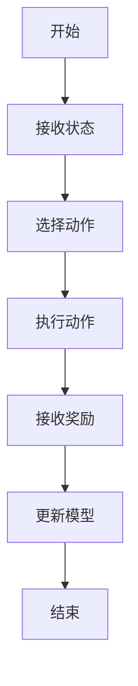
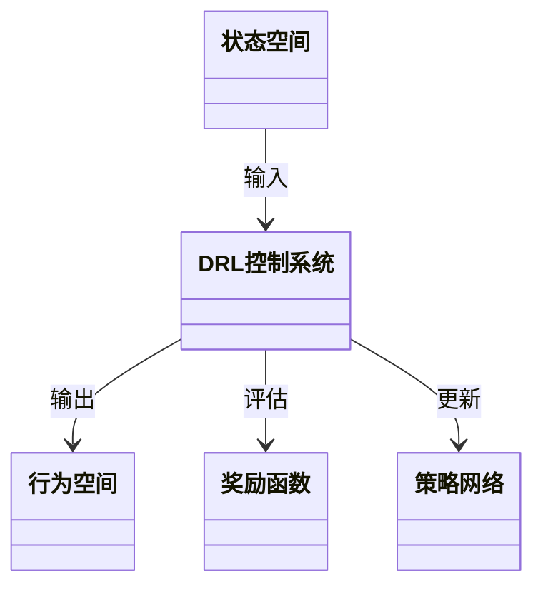
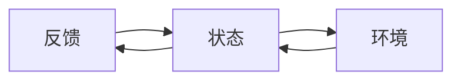
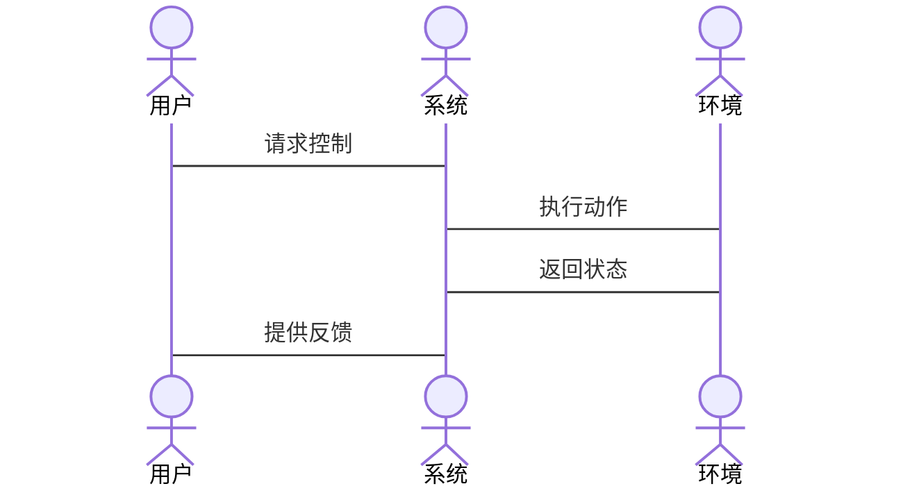

                 


# 如何识别企业的深度强化学习控制系统优势

## 关键词：深度强化学习、控制系统、企业优势、系统架构、算法原理、项目实战

## 摘要：本文深入探讨了企业在采用深度强化学习控制系统时的优势识别方法，从背景介绍、核心概念、算法原理、系统架构到项目实战，全面解析了该技术的应用价值和实际案例，帮助企业更好地理解和应用深度强化学习控制系统。

---

## 第1章: 深度强化学习控制系统背景介绍

### 1.1 问题背景
传统的企业控制系统依赖于规则和模型，难以应对动态变化的环境和复杂的决策问题。深度强化学习（Deep Reinforcement Learning, DRL）通过模拟人类学习方式，能够在复杂环境中优化决策，解决传统方法的局限性。

### 1.2 问题描述
传统控制系统依赖于预定义的规则和模型，缺乏灵活性和自适应性。在面对动态变化的市场和复杂环境时，传统方法难以做出最优决策，导致效率低下和资源浪费。

### 1.3 问题解决
深度强化学习通过强化学习机制和深度神经网络的结合，能够从经验中学习并优化决策策略，适应复杂的动态环境。DRL在企业控制系统中的应用可以显著提升效率和决策质量。

### 1.4 边界与外延
DRL控制系统适用于需要动态决策和复杂策略优化的企业场景，如生产调度、资源分配和供应链管理等。其边界在于高度动态和非线性的问题，而外延则包括结合其他技术（如大数据和物联网）的应用。

### 1.5 核心要素组成
DRL控制系统的核心要素包括数据、模型、决策和反馈机制。数据是输入，模型是处理单元，决策是输出，反馈机制用于优化模型。

---

## 第2章: 深度强化学习控制系统的核心概念与联系

### 2.1 核心概念原理
DRL结合了深度学习和强化学习，通过神经网络近似策略或价值函数，实现动态环境中的最优决策。

### 2.2 核心概念属性特征对比
| 对比维度 | 传统控制系统 | 深度强化学习控制系统 |
|----------|---------------|-----------------------|
| 决策方式 | 基于规则和模型 | 基于经验学习和优化 |
| 灵活性   | 较低           | 较高                  |
| 适应性   | 较差           | 较强                  |
| 数据需求 | 较低           | 较高                  |

### 2.3 ER实体关系图
使用Mermaid绘制的实体关系图如下：
```mermaid
erDiagram
    actor 用户
    actor 系统
    actor 环境
    actor 反馈
    用户 --> 系统: 发出请求
    系统 --> 环境: 执行操作
    环境 --> 系统: 返回状态
    系统 --> 用户: 提供反馈
```

---

## 第3章: 深度强化学习控制系统的算法原理

### 3.1 算法原理概述
DRL算法通过与环境交互，利用奖励机制优化策略。常见的算法包括Deep Q-Learning、Policy Gradient和Actor-Critic方法。

### 3.2 算法流程图
使用Mermaid绘制的算法流程图如下：


### 3.3 算法实现代码
以下是一个简单的Deep Q-Learning算法的Python代码示例：
```python
import numpy as np
import tensorflow as tf

class DQN:
    def __init__(self, state_space, action_space, learning_rate=0.01):
        self.state_space = state_space
        self.action_space = action_space
        self.learning_rate = learning_rate
        self.model = self.build_model()
    
    def build_model(self):
        model = tf.keras.Sequential([
            tf.keras.layers.Dense(24, activation='relu', input_dim=self.state_space),
            tf.keras.layers.Dense(self.action_space, activation='linear')
        ])
        model.compile(optimizer=tf.keras.optimizers.Adam(lr=self.learning_rate), loss='mse')
        return model
    
    def get_action(self, state):
        prediction = self.model.predict(np.array([state]))
        return np.argmax(prediction[0])
    
    def train(self, state, action, reward, next_state):
        target = reward + self.model.predict(np.array([next_state]))[0][action]
        self.model.fit(np.array([state]), np.array([target]), epochs=1, verbose=0)
```

### 3.4 数学模型与公式
深度强化学习的核心是优化策略函数：
$$ \theta_{t+1} = \theta_t + \alpha (\nabla_\theta J(\theta_t)) $$
其中，$\theta$ 是模型参数，$\alpha$ 是学习率，$J$ 是目标函数。

---

## 第4章: 深度强化学习控制系统架构设计

### 4.1 系统分析
企业控制系统需要处理动态变化的环境，DRL架构能够实时调整策略以适应变化。

### 4.2 系统功能设计
使用Mermaid绘制的领域模型类图如下：


### 4.3 系统架构设计
使用Mermaid绘制的系统架构图如下：


### 4.4 系统交互设计
使用Mermaid绘制的交互序列图如下：


---

## 第5章: 深度强化学习控制系统项目实战

### 5.1 环境安装
需要安装Python、TensorFlow和Keras等工具：
```bash
pip install numpy tensorflow keras
```

### 5.2 核心实现
基于DRL算法实现企业控制系统的优化：
```python
# 示例代码：DRL算法实现
class DRLController:
    def __init__(self, state_dim, action_dim):
        self.state_dim = state_dim
        self.action_dim = action_dim
        self.model = self.build_model()
    
    def build_model(self):
        model = tf.keras.Sequential([
            tf.keras.layers.Dense(32, activation='relu', input_dim=self.state_dim),
            tf.keras.layers.Dense(self.action_dim, activation='softmax')
        ])
        model.compile(optimizer=tf.keras.optimizers.Adam(learning_rate=0.01), loss='sparse_categorical_crossentropy')
        return model
    
    def get_action(self, state):
        prediction = self.model.predict(np.array([state]))
        return np.argmax(prediction)
    
    def train(self, state, action, reward, next_state):
        target = reward + self.model.predict(np.array([next_state]))[0][action]
        self.model.fit(np.array([state]), np.array([target]), epochs=1, verbose=0)
```

### 5.3 案例分析
以供应链管理为例，DRL控制系统能够优化库存和物流，降低运营成本。

### 5.4 项目小结
项目成功的关键在于数据质量、算法选择和系统架构设计。DRL在企业控制系统中的应用前景广阔。

---

## 第6章: 深度强化学习控制系统的最佳实践

### 6.1 最佳实践 tips
- 数据是关键，确保数据质量和多样性。
- 选择合适的算法，根据问题类型调整模型结构。
- 定期更新模型，适应环境变化。

### 6.2 注意事项
- 避免过拟合，保持模型泛化能力。
- 重视反馈机制，及时调整策略。

### 6.3 拓展阅读
推荐阅读相关论文和书籍，深入理解DRL的理论和应用。

---

## 作者：AI天才研究院/AI Genius Institute & 禅与计算机程序设计艺术 /Zen And The Art of Computer Programming

