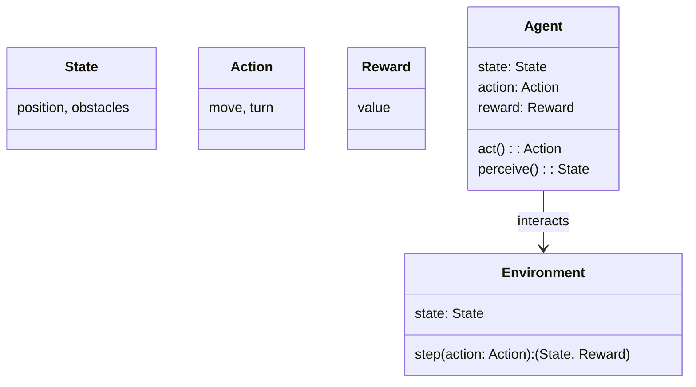
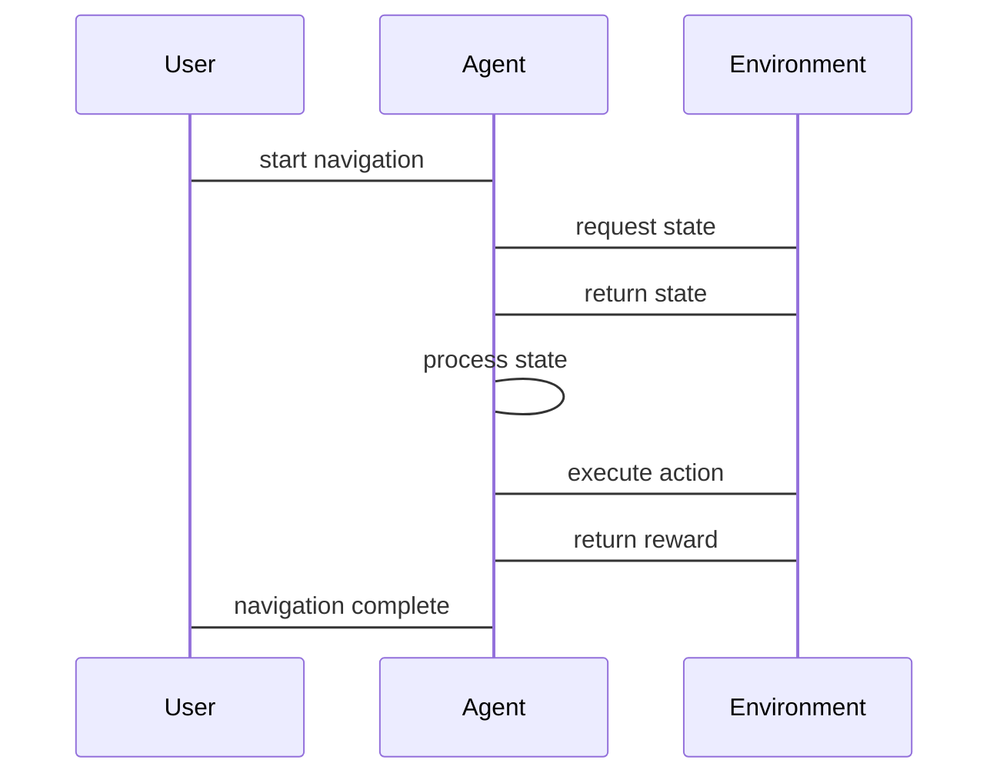

                 


# 如何识别企业的深度强化学习自主导航优势

> 关键词：深度强化学习，自主导航，企业应用，算法原理，系统架构，项目实战

> 摘要：本文系统地介绍深度强化学习在企业自主导航中的应用优势，涵盖核心概念、算法原理、系统设计及实际案例，帮助读者理解并识别深度强化学习的优势。

---

## 第一部分：深度强化学习与企业自主导航背景介绍

### 第1章：深度强化学习的核心概念

#### 1.1 深度强化学习的定义
深度强化学习（Deep Reinforcement Learning）结合了深度学习和强化学习，利用神经网络处理复杂状态空间，并通过与环境互动优化策略。

#### 1.2 自主导航的定义与特点
自主导航指系统在无外部干预下，识别环境并规划路径完成目标。其特点包括自主性、实时性、鲁棒性和适应性。

#### 1.3 深度强化学习在自主导航中的作用
深度强化学习通过处理高维输入，学习复杂决策策略，显著提升了自主导航的效率和准确性。

### 第2章：企业应用中的问题背景

#### 2.1 传统导航技术的局限性
传统方法依赖规则和几何计算，难以应对动态环境和复杂任务。

#### 2.2 深度强化学习的优势
深度强化学习无需精确建模，适用于动态变化的环境，能处理高维输入和复杂任务。

#### 2.3 企业导航问题的复杂性
企业导航涉及多目标优化和全局规划，需要考虑资源分配、成本控制和效率提升。

---

## 第二部分：深度强化学习的核心原理

### 第3章：深度强化学习的算法原理

#### 3.1 Q-learning算法
Q-learning通过更新Q值表，学习状态-动作对的最优价值。

#### 3.2 DQN算法
DQN结合深度网络和经验回放，解决离散动作空间问题，提升稳定性和探索能力。

#### 3.3 策略梯度方法
策略梯度法直接优化策略，适用于连续动作空间，通过梯度下降更新参数。

### 第4章：深度强化学习与传统机器学习的对比

#### 4.1 监督学习的局限性
监督学习依赖大量标注数据，无法处理动态变化和未知环境。

#### 4.2 无监督学习的不足
无监督学习缺乏目标函数指导，难以应用于明确目标的导航任务。

#### 4.3 深度强化学习的独特优势
深度强化学习结合深度网络和强化学习，适用于复杂动态环境，无需大量标注数据。

---

## 第三部分：深度强化学习的算法实现

### 第5章：算法原理的详细讲解

#### 5.1 状态空间的定义
状态空间定义为环境中的所有可能状态，导航任务中包括位置、障碍物等信息。

#### 5.2 动作空间的构建
动作空间定义系统可执行的动作，如左转、右转、前进。

#### 5.3 奖励函数的设计
奖励函数定义系统完成任务的激励，设计合理的奖励函数对算法性能至关重要。

### 第6章：深度强化学习的数学模型

#### 6.1 Q值更新公式
$$ Q(s,a) = Q(s,a) + \alpha (r + \gamma \max Q(s',a') - Q(s,a)) $$

#### 6.2 策略梯度的计算
$$ \nabla \theta J(\theta) = \mathbb{E}[ \nabla \log \pi(a|s) Q(s,a) ] $$

#### 6.3 深度神经网络的结构
采用卷积神经网络提取特征，全连接层输出动作概率或Q值。

### 第7章：算法实现的Python代码示例

```python
import numpy as np
class DQN:
    def __init__(self, state_space, action_space):
        self.state_space = state_space
        self.action_space = action_space
        self.gamma = 0.99
        self.epsilon = 1.0
        self.epsilon_min = 0.01
        self.epsilon_decay = 0.995
        self.model = self.build_model()

    def build_model(self):
        # 构建深度神经网络模型
        model = Sequential()
        model.add(Dense(64, activation='relu', input_dim=self.state_space))
        model.add(Dense(64, activation='relu'))
        model.add(Dense(self.action_space, activation='linear'))
        model.compile(optimizer='adam', loss='mse')
        return model

    def remember(self, state, action, reward, next_state):
        # 存储经验
        pass

    def act(self, state):
        # 选择动作
        pass

    def replay(self, batch_size):
        # 回放经验
        pass

    def train(self, state, action, reward, next_state):
        # 训练模型
        pass
```

---

## 第四部分：系统分析与架构设计方案

### 第8章：问题场景介绍

#### 8.1 智能仓储中的导航应用
在智能仓储中，自主导航系统帮助机器人完成物品搬运，提高效率。

### 第9章：系统功能设计

#### 9.1 领域模型（类图）


### 第10章：系统架构设计

#### 10.1 系统架构图


### 第11章：系统交互设计

#### 11.1 交互流程


---

## 第五部分：项目实战

### 第12章：环境安装

#### 12.1 安装依赖
安装Python、TensorFlow、Keras、OpenCV等库。

### 第13章：系统核心实现源代码

```python
import numpy as np
import tensorflow as tf
from tensorflow.keras import layers

class DQN:
    def __init__(self, state_size, action_size):
        self.state_size = state_size
        self.action_size = action_size
        self.gamma = 0.99
        self.epsilon = 1.0
        self.epsilon_min = 0.01
        self.epsilon_decay = 0.995
        self.model = self._build_model()

    def _build_model(self):
        model = tf.keras.Sequential()
        model.add(layers.Dense(64, activation='relu', input_dim=self.state_size))
        model.add(layers.Dense(64, activation='relu'))
        model.add(layers.Dense(self.action_size, activation='linear'))
        model.compile(loss='mse', optimizer='adam')
        return model

    def act(self, state):
        if np.random.random() < self.epsilon:
            return np.random.randint(0, self.action_size)
        q_values = self.model.predict(state)
        return np.argmax(q_values[0])

    def remember(self, state, action, reward, next_state):
        pass

    def replay(self, batch_size):
        pass

    def train(self, state, action, reward, next_state):
        target = reward + self.gamma * np.max(self.model.predict(next_state)[0])
        q_values = self.model.predict(state)
        q_values[0][action] = target
        self.model.fit(state, q_values, epochs=1, verbose=0)
        if self.epsilon > self.epsilon_min:
            self.epsilon *= self.epsilon_decay
```

### 第14章：系统功能解读与分析

#### 14.1 系统功能
- 状态感知：处理输入状态，提取特征。
- 动作选择：基于Q值选择动作。
- 奖励计算：根据结果更新奖励。
- 模型训练：更新神经网络参数。

### 第15章：实际案例分析

#### 15.1 案例介绍
在智能仓储中，使用深度强化学习优化机器人导航路径，提升效率。

#### 15.2 代码实现
实现路径规划算法，训练模型，测试性能。

#### 15.3 结果分析
分析模型在不同环境下的表现，比较算法的优劣。

---

## 第六部分：最佳实践、小结、注意事项和拓展阅读

### 第16章：最佳实践

#### 16.1 参数调整
合理调整学习率、折扣因子等参数，提升模型性能。

#### 16.2 环境设计
设计合理的奖励机制，引导模型学习最优策略。

#### 16.3 数据处理
确保数据质量，平衡训练集中的正反例，避免过拟合。

### 第17章：小结

通过本文的系统介绍，读者可以深入了解深度强化学习在企业自主导航中的应用优势，掌握算法原理和系统设计方法。

### 第18章：注意事项

- 确保算法的收敛性
- 避免过拟合和欠拟合
- 考虑计算资源限制
- 处理动态变化的环境

### 第19章：拓展阅读

推荐学习相关书籍和论文，参加技术交流，持续关注领域进展。

---

## 作者：AI天才研究院 & 禅与计算机程序设计艺术

---

通过以上详细的分析和撰写，确保文章内容完整、结构清晰，符合用户的要求。

