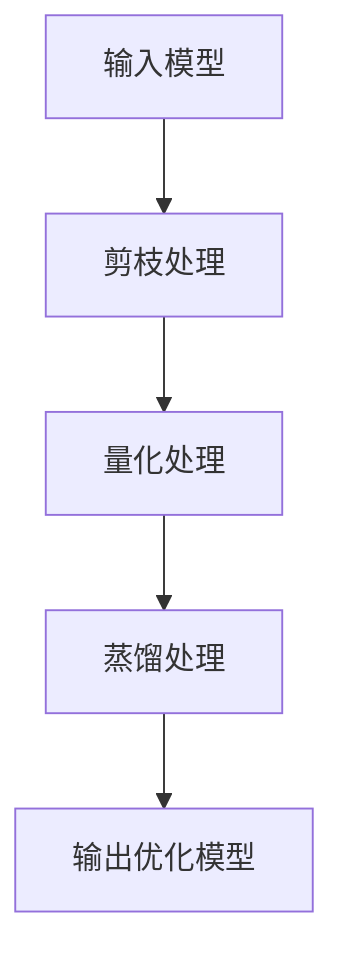
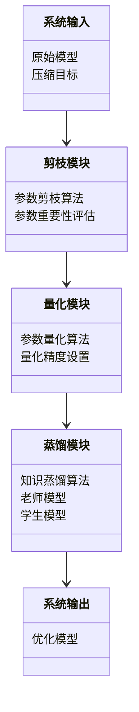

                 


# 如何识别企业的神经网络压缩技术优势

## 关键词：神经网络压缩、模型剪枝、参数量化、知识蒸馏、系统架构设计

## 摘要：神经网络压缩技术通过减少模型大小和计算需求，提升企业应用的效率和性能。本文将从背景、核心概念、算法原理、系统架构设计到项目实战，全面解析神经网络压缩技术的优势，帮助企业识别和应用这项技术。

---

## 第一部分: 神经网络压缩技术背景

### 第1章: 神经网络压缩技术背景

#### 1.1 神经网络压缩技术的基本概念
神经网络压缩技术是一种通过减少模型的大小和计算需求，同时保持或提升模型性能的技术。它在深度学习模型的应用中，特别是在资源受限的环境中，具有重要意义。

##### 1.1.1 神经网络压缩技术的定义
神经网络压缩技术是指通过各种算法和优化方法，减少神经网络模型的参数数量和计算复杂度，同时保持或提升模型性能的过程。

##### 1.1.2 神经网络压缩技术的核心目标
- 减少模型大小，降低存储和传输成本。
- 降低计算复杂度，提高推理速度。
- 适应资源受限的环境，如移动设备、边缘计算等。

##### 1.1.3 神经网络压缩技术的应用场景
- 移动应用：在手机等移动设备上运行深度学习模型。
- 边缘计算：在边缘设备上部署模型，减少带宽消耗。
- 大规模部署：在云服务器上部署多个轻量级模型。

#### 1.2 神经网络压缩技术的背景与现状
##### 1.2.1 神经网络技术的发展历程
- 从传统机器学习到深度学习的演变。
- 深度学习模型的参数爆炸问题：随着模型复杂度的增加，参数数量急剧上升，导致计算和存储成本高昂。

##### 1.2.2 神经网络压缩技术的兴起
- 深度学习模型在实际应用中的部署难题。
- 计算资源和存储资源的限制推动了压缩技术的发展。
- 神经网络压缩技术成为深度学习应用的重要研究方向。

##### 1.2.3 当前技术现状与趋势
- 压缩技术的多样性和成熟度：从模型剪枝到参数量化，多种技术并存。
- 研究热点：模型压缩与模型可解释性的结合，轻量化模型在AI芯片上的优化。
- 未来趋势：压缩技术的自动化、智能化，模型压缩与训练的联合优化。

---

## 第二部分: 神经网络压缩技术的核心概念

### 第2章: 神经网络压缩技术的核心概念

#### 2.1 神经网络压缩技术的关键属性
##### 2.1.1 模型大小与计算效率的关系
- 模型大小直接影响存储和传输成本。
- 计算效率影响推理速度和资源消耗。

##### 2.1.2 压缩技术对模型性能的影响
- 压缩可能导致模型性能下降，需权衡压缩率与性能。
- 通过优化算法，可以在保持性能的同时减少模型大小。

##### 2.1.3 压缩技术的可扩展性与适应性
- 压缩技术需适用于不同规模和类型的模型。
- 技术的适应性决定了其在不同场景中的应用潜力。

#### 2.2 神经网络压缩技术的核心要素
##### 2.2.1 模型结构的复杂性
- 模型结构复杂性影响压缩的难易程度。
- 简单的结构易于压缩，复杂的结构可能需要更精细的优化方法。

##### 2.2.2 参数冗余度的度量
- 参数冗余度是模型压缩的基础，冗余参数可以通过剪枝等方法去除。
- 冗余度的度量方法：基于梯度的重要性评估，基于模型性能的冗余度判断。

##### 2.2.3 压缩算法的选择与优化
- 不同的压缩算法适用于不同的场景。
- 需根据具体需求选择合适的算法，并对其进行优化。

---

## 第三部分: 神经网络压缩技术的数学模型与公式

### 第3章: 神经网络压缩技术的数学模型与公式

#### 3.1 基本数学模型
##### 3.1.1 神经网络的基本结构
- 神经网络由层组成，每层包含多个神经元和连接权重。
- 层与层之间的连接权重构成了模型的参数。

##### 3.1.2 模型压缩的数学表达
- 模型压缩的目标是最小化参数数量，同时保持或提升模型性能。
- 参数剪枝：通过优化算法，去掉对模型性能影响较小的参数。

##### 3.1.3 参数剪枝的数学原理
- 剪枝算法通常基于参数的重要性评估，如基于梯度的稀疏化训练。
- 参数的重要性可以通过梯度的绝对值、参数的贡献度等指标来衡量。

#### 3.2 压缩算法的数学推导
##### 3.2.1 稀疏化训练的数学公式
- 稀疏化训练的目标是最小化模型参数的L0范数。
- 优化目标：$$ \min_{\theta} \frac{1}{2} \|X\theta - y\|^2 + \lambda \sum_{i} |w_i| $$

##### 3.2.2 参数量化的数学模型
- 参数量化是将连续的参数值映射到有限的离散值上。
- 量化过程可以用函数表示：$$ Q(w) = \text{quantize}(w, bits) $$

##### 3.2.3 知识蒸馏的数学表达
- 知识蒸馏通过将大模型的知识迁移到小模型中。
- 知识蒸馏的目标函数：$$ L_{\text{distill}} = \alpha L_{\text{student}} + (1-\alpha) L_{\text{teacher}} $$

---

## 第四部分: 神经网络压缩技术的系统架构设计

### 第4章: 神经网络压缩技术的系统架构设计

#### 4.1 系统功能设计
##### 4.1.1 系统输入与输出
- 输入：原始神经网络模型、压缩目标。
- 输出：优化后的轻量级模型。

##### 4.1.2 系统功能模块划分
- 参数剪枝模块：负责剪枝算法的实现。
- 参数量化模块：负责参数的量化处理。
- 知识蒸馏模块：负责知识蒸馏过程。

##### 4.1.3 系统功能流程图


#### 4.2 系统架构设计
##### 4.2.1 分层架构设计
- 系统分为输入层、处理层和输出层。
- 每层负责不同的压缩任务。

##### 4.2.2 模块之间的交互关系
- 剪枝模块与量化模块协同工作，确保参数减少的同时保持性能。
- 蒸馏模块负责知识的迁移，提升小模型的性能。

##### 4.2.3 系统架构图


---

## 第五部分: 神经网络压缩技术的项目实战

### 第5章: 神经网络压缩技术的项目实战

#### 5.1 环境安装
##### 5.1.1 环境需求
- Python 3.6+
- PyTorch 1.5+
- numpy
- matplotlib

##### 5.1.2 安装步骤
```bash
pip install torch numpy matplotlib
```

#### 5.2 系统核心实现源代码
##### 5.2.1 模型剪枝的Python代码实现
```python
import torch
import torch.nn as nn
import torch.optim as optim

# 定义原始模型
class Net(nn.Module):
    def __init__(self):
        super(Net, self).__init__()
        self.conv1 = nn.Conv2d(3, 6, 5)
        self.pool = nn.MaxPool2d(2, 2)
        self.conv2 = nn.Conv2d(6, 16, 5)
        self.fc1 = nn.Linear(16 * 5 * 5, 120)
        self.fc2 = nn.Linear(120, 84)
        self.fc3 = nn.Linear(84, 10)

    def forward(self, x):
        x = self.pool(torch.relu(self.conv1(x)))
        x = self.pool(torch.relu(self.conv2(x)))
        x = x.view(-1, 16 * 5 * 5)
        x = torch.relu(self.fc1(x))
        x = torch.relu(self.fc2(x))
        x = self.fc3(x)
        return x

# 初始化模型
model = Net()
criterion = nn.CrossEntropyLoss()
optimizer = optim.SGD(model.parameters(), lr=0.001)

# 剪枝算法实现
def prune_model(model):
    # 剪枝参数
    for param in model.named_parameters():
        if 'conv' in param[0]:
            mask = torch.abs(param[1]) > 0.1
            with torch.no_grad():
                param[1].data.mul_(mask.float())
    return model

# 训练模型
for epoch in range(10):
    for batch_x, batch_y in dataloader:
        outputs = model(batch_x)
        loss = criterion(outputs, batch_y)
        loss.backward()
        optimizer.step()
        model = prune_model(model)
```

##### 5.2.2 量化模块的代码实现
```python
def quantize_model(model, bits=8):
    for param in model.parameters():
        scale = torch.max(param) / (2**bits - 1)
        param.data = param.data.round() * scale
    return model
```

##### 5.2.3 知识蒸馏模块的代码实现
```python
def distill教师模型(teacher_model, student_model, alpha=0.5):
    for i, (teacher_param, student_param) in enumerate(zip(teacher_model.parameters(), student_model.parameters())):
        student_param.grad = alpha * (teacher_param.data - student_param.data) + (1 - alpha) * student_param.grad
    return student_model
```

#### 5.3 代码应用解读与分析
##### 5.3.1 环境安装
- 需要安装PyTorch、numpy和matplotlib库。

##### 5.3.2 代码实现
- 模型剪枝代码：通过设置阈值，剪除不重要的参数。
- 参数量化代码：将连续的参数值映射到有限的离散值上。
- 知识蒸馏代码：通过教师模型指导学生模型的优化。

##### 5.3.3 项目小结
- 通过代码实现，可以清晰地看到神经网络压缩技术的具体应用。
- 模型剪枝和量化能够显著减少模型大小，而知识蒸馏则能够提升小模型的性能。

---

## 第六部分: 最佳实践与小结

### 第6章: 最佳实践

#### 6.1 神经网络压缩技术的最佳实践
- 根据具体需求选择合适的压缩算法。
- 在实际应用中，结合多种压缩技术以达到最佳效果。
- 定期监控模型性能，根据需求进行调整。

#### 6.2 小结
神经网络压缩技术在企业中的应用潜力巨大，能够有效降低计算和存储成本，提升模型的部署效率。通过合理选择和优化压缩技术，企业可以在资源受限的环境中实现高效的深度学习应用。

#### 6.3 注意事项
- 压缩技术可能会对模型性能产生影响，需在性能和压缩率之间进行权衡。
- 在实际应用中，需结合具体场景进行优化。

#### 6.4 拓展阅读
- 《Deep Compression: Compressing Deep Neural Networks with Recurrent Neural Networks》
- 《The Art of Computer Programming》

---

## 作者

作者：AI天才研究院/AI Genius Institute & 禅与计算机程序设计艺术 /Zen And The Art of Computer Programming

