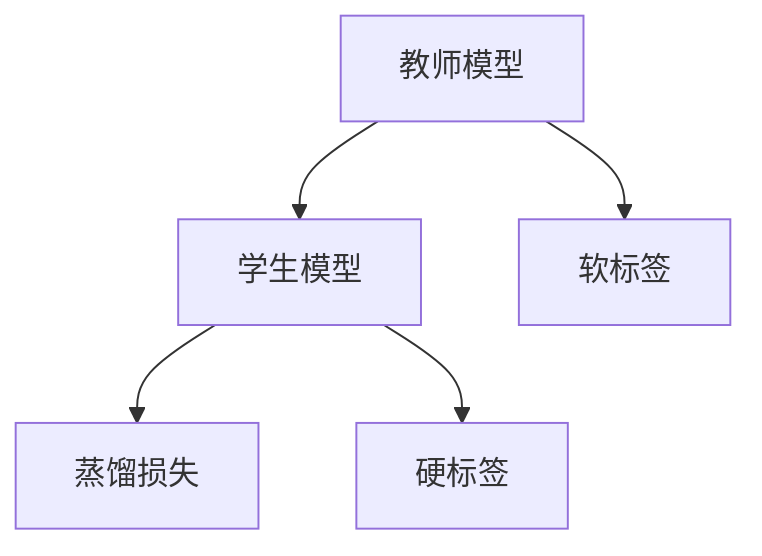
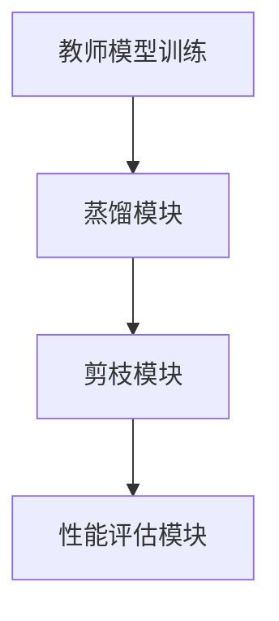

                 


# 如何识别企业的神经网络模型蒸馏技术优势

> 关键词：神经网络模型蒸馏技术、企业应用、模型压缩、知识蒸馏、模型剪枝

> 摘要：神经网络模型蒸馏技术是一种通过压缩和简化复杂模型来提高效率和性能的技术，本文将从核心概念、算法原理、系统架构、项目实战等多方面详细分析，帮助读者识别和理解企业在应用神经网络模型蒸馏技术时的优势。

---

## 第一部分：神经网络模型蒸馏技术背景与基础

### 第1章：神经网络模型蒸馏技术概述

#### 1.1 问题背景与定义
- **问题背景**：随着深度学习模型的复杂性不断增加，企业在部署和应用这些模型时面临计算资源和运行效率的挑战。模型蒸馏技术作为一种轻量化技术，能够有效解决这些问题。
- **定义**：神经网络模型蒸馏技术是指通过将大型复杂模型（教师模型）的知识迁移到较小的简单模型（学生模型）中，从而实现模型的压缩和简化。
- **特点**：
  - 降低模型复杂度
  - 提高模型推理效率
  - 保持或提升模型性能
- **主流技术**：
  - 知识蒸馏（Knowledge Distillation）
  - 模型压缩（Model Compression）
  - 模型剪枝（Model Pruning）
- **优势与挑战**：
  - 优势：提升模型运行效率、减少资源消耗、适用于边缘计算。
  - 挑战：如何平衡模型压缩与性能损失、如何选择合适的蒸馏策略。

#### 1.2 神经网络模型蒸馏技术的核心目标
- 提供一种高效的方法，将复杂的深度学习模型转换为更小、更快的模型，同时保持或提升性能。
- 适用于资源受限的场景，如移动设备、嵌入式系统等。

#### 1.3 神经网络模型蒸馏技术的应用场景
- **移动应用**：在手机等移动设备上运行深度学习模型。
- **边缘计算**：在边缘设备上进行实时推理。
- **云计算**：优化云端模型的推理速度和资源利用率。

---

## 第二部分：神经网络模型蒸馏技术的核心概念与联系

### 第2章：神经网络模型蒸馏技术的核心原理

#### 2.1 知识蒸馏（Knowledge Distillation）
- **定义**：通过将教师模型的输出概率分布迁移到学生模型，使学生模型能够学习教师模型的决策边界。
- **实现流程**：
  1. 训练教师模型。
  2. 使用教师模型的输出作为软标签，指导学生模型的训练。
  3. 优化学生模型，使其预测结果与教师模型的软标签一致。
- **数学模型**：
  - 教师模型输出：$P_{teacher}(y|x)$
  - 学生模型输出：$P_{student}(y|x)$
  - 蒸馏损失：$L_{distill} = -\sum_{y} P_{teacher}(y|x) \log P_{student}(y|x)$

#### 2.2 模型压缩（Model Compression）
- **定义**：通过量化、低秩分解等方法，减少模型参数的数量。
- **实现方法**：
  - 量化：将模型参数从浮点数转换为较低精度的整数。
  - 低秩分解：将权重矩阵分解为低秩矩阵的乘积，减少参数数量。
- **优缺点**：
  - 优点：显著减少模型大小，降低存储和传输成本。
  - 缺点：可能引入精度损失，影响模型性能。

#### 2.3 模型剪枝（Model Pruning）
- **定义**：通过删除模型中冗余的神经元或权重，减少计算量。
- **实现步骤**：
  1. 训练教师模型。
  2. 计算每个神经元的重要性，选择重要性较低的神经元进行剪枝。
  3. 重新训练剪枝后的模型，恢复其性能。
- **优缺点**：
  - 优点：减少计算量，提高推理速度。
  - 缺点：需要重新训练剪枝后的模型，可能增加额外的训练成本。

#### 2.4 神经网络模型蒸馏技术的ER实体关系图


---

## 第三部分：神经网络模型蒸馏技术的算法原理与数学模型

### 第3章：神经网络模型蒸馏技术的数学模型

#### 3.1 知识蒸馏的数学公式
- 蒸馏损失函数：
  $$ L_{distill} = -\sum_{y} P_{teacher}(y|x) \log P_{student}(y|x) $$
- 总损失函数：
  $$ L_{total} = L_{cls} + \alpha L_{distill} $$
  其中，$\alpha$ 是蒸馏系数，$L_{cls}$ 是分类损失。

#### 3.2 模型压缩的数学模型
- 低秩分解：
  $$ W = W_1 W_2 $$
  其中，$W_1 \in \mathbb{R}^{d \times r}$，$W_2 \in \mathbb{R}^{r \times m}$，$r$ 是秩。

#### 3.3 模型剪枝的数学模型
- 神经元重要性评估：
  $$ importance = \sum_{i=1}^{n} |w_i| $$
  其中，$w_i$ 是第 $i$ 个神经元的权重。

---

## 第四部分：神经网络模型蒸馏技术的系统架构与设计

### 第4章：神经网络模型蒸馏技术的系统架构

#### 4.1 系统功能设计
- **教师模型训练模块**：负责训练教师模型。
- **蒸馏模块**：负责将教师模型的知识迁移到学生模型。
- **剪枝模块**：负责剪枝和优化模型。
- **性能评估模块**：负责评估蒸馏后的模型性能。

#### 4.2 系统架构设计


---

## 第五部分：神经网络模型蒸馏技术的项目实战

### 第5章：神经网络模型蒸馏技术的项目实战

#### 5.1 项目环境安装
```bash
pip install numpy torch matplotlib
```

#### 5.2 核心实现代码
```python
import torch
import torch.nn as nn
import torch.optim as optim

# 定义教师模型
class TeacherModel(nn.Module):
    def __init__(self):
        super(TeacherModel, self).__init__()
        self.fc = nn.Linear(10, 5)
        
    def forward(self, x):
        return self.fc(x)

# 定义学生模型
class StudentModel(nn.Module):
    def __init__(self):
        super(StudentModel, self).__init__()
        self.fc = nn.Linear(10, 5)
        
    def forward(self, x):
        return self.fc(x)

# 训练教师模型
def train_teacher():
    teacher = TeacherModel()
    optimizer = optim.SGD(teacher.parameters(), lr=0.1)
    criterion = nn.MSELoss()
    for epoch in range(100):
        inputs = torch.randn(10,10)
        labels = torch.randn(10,5)
        outputs = teacher(inputs)
        loss = criterion(outputs, labels)
        optimizer.zero_grad()
        loss.backward()
        optimizer.step()
    return teacher

# 知识蒸馏
def distill(teacher, student):
    teacher.eval()
    student.train()
    optimizer = optim.SGD(student.parameters(), lr=0.1)
    criterion = nn.KLDivLoss(reduction='batchmean')
    for epoch in range(100):
        inputs = torch.randn(10,10)
        with torch.no_grad():
            teacher_outputs = teacher(inputs)
        student_outputs = student(inputs)
        loss = criterion(torch.log(F.softmax(student_outputs, dim=1)), torch.log(F.softmax(teacher_outputs, dim=1)))
        optimizer.zero_grad()
        loss.backward()
        optimizer.step()
    return student
```

---

## 第六部分：总结与最佳实践

### 第6章：总结与最佳实践

#### 6.1 总结
- 神经网络模型蒸馏技术是一种高效的技术，能够帮助企业优化模型性能，降低资源消耗。
- 通过知识蒸馏、模型压缩和剪枝等方法，可以在保证性能的前提下，显著提高模型的运行效率。

#### 6.2 最佳实践
- **选择合适的蒸馏策略**：根据具体场景选择知识蒸馏、模型压缩或剪枝。
- **优化蒸馏过程**：通过调整蒸馏系数 $\alpha$ 和训练参数，找到最佳的蒸馏策略。
- **结合其他优化技术**：将蒸馏技术与其他优化技术（如量化、剪枝）结合使用，进一步提升性能。

#### 6.3 小结
神经网络模型蒸馏技术在企业中的应用前景广阔，通过合理选择和优化蒸馏策略，企业可以在保证性能的前提下，显著提高模型的运行效率和资源利用率。

---

## 作者信息

作者：AI天才研究院/AI Genius Institute  
作者简介：专注于人工智能领域的研究与实践，致力于通过技术创新为企业提供高效的解决方案。

