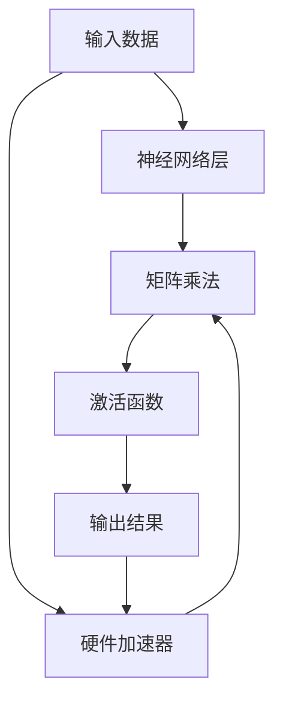
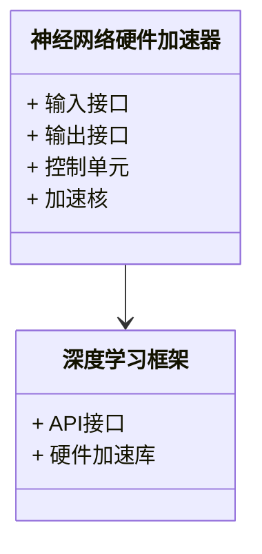
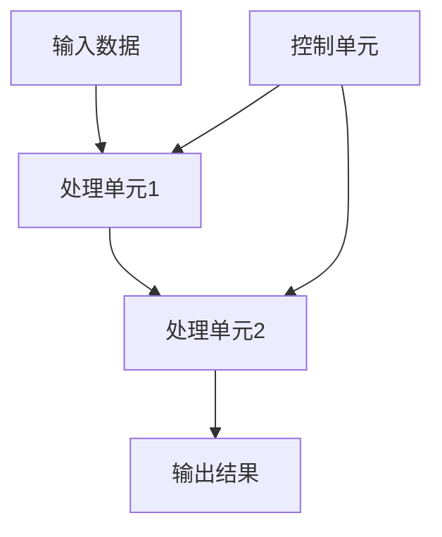

                 


# 如何识别企业的神经网络硬件加速器优势

> 关键词：神经网络硬件加速器，AI芯片，GPU，TPU，FPGA，硬件加速，性能优化

> 摘要：随着人工智能技术的飞速发展，神经网络硬件加速器在企业中的应用日益广泛。本文将深入探讨如何识别和评估企业中神经网络硬件加速器的优势，帮助企业更好地选择和部署适合的硬件加速器，从而提升计算效率和性能。通过分析硬件加速器的核心原理、系统架构、算法优化以及实际项目案例，本文为技术人员和企业提供了一套全面的方法论。

---

## 第一部分: 神经网络硬件加速器背景与概念

### 第1章: 神经网络硬件加速器概述

#### 1.1 神经网络硬件加速器的基本概念

##### 1.1.1 神经网络硬件加速器的定义
神经网络硬件加速器是一种专为加速神经网络计算设计的硬件设备，通过并行计算和专用指令集提升AI模型的训练和推理效率。

##### 1.1.2 神经网络硬件加速器的核心特征
- **专用架构**：针对矩阵运算和并行计算优化。
- **高能效**：相比通用CPU，功耗更低，性能更强。
- **可扩展性**：支持多种模型和规模。

##### 1.1.3 神经网络硬件加速器的分类与应用场景
- **GPU**：通用性高，适合复杂模型。
- **TPU（张量处理单元）**：专为深度学习设计，适合大规模训练。
- **FPGA（现场可编程门阵列）**：灵活，适合特定任务优化。
- **专用AI芯片**：如Google的TPU、NVIDIA的GPU、寒武纪的MLU系列。

#### 1.2 神经网络硬件加速器的技术背景

##### 1.2.1 神经网络计算的需求增长
- AI模型复杂度不断提高，对计算资源的需求激增。
- 数据量和模型规模的指数级增长推动硬件加速器的发展。

##### 1.2.2 硬件加速器在AI计算中的作用
- 硬件加速器通过并行计算和专用指令集显著提升计算效率。
- 减少计算时间，降低能源消耗，提高性价比。

##### 1.2.3 神经网络硬件加速器的演进历程
- 早期：GPU被发现适合深度学习（如NVIDIA的CUDA）。
- 现阶段：专用加速器（如TPU）成为主流，FPGA和AI芯片多样化发展。

#### 1.3 神经网络硬件加速器的市场现状

##### 1.3.1 当前主流硬件加速器厂商与产品
- **NVIDIA**：以GPU（如A100、H100）为主，占据市场主导地位。
- **Google**：TPU广泛应用于Google的AI服务。
- **AMD**：通过收购Intel的Xilinx，整合FPGA和GPU技术。
- **寒武纪（Cambricon）**：中国市场的代表性企业，MLU系列芯片。
- **Intel**：通过收购Nervana和Athena，布局AI芯片市场。

##### 1.3.2 硬件加速器市场的竞争格局
- NVIDIA占据主导地位，TPU和FPGA在特定领域有优势。
- 中国市场的崛起，寒武纪、华为昇腾等企业逐渐崭露头角。
- 未来趋势：专用AI芯片与通用GPU的融合，FPGA的灵活性和可编程性成为重要补充。

##### 1.3.3 硬件加速器技术的未来发展趋势
- 更高的能效比：通过优化架构设计降低功耗。
- 更强的可扩展性：支持更大规模和更复杂的模型。
- 更智能化的硬件：通过动态调整适应不同任务需求。

#### 1.4 企业对神经网络硬件加速器的需求

##### 1.4.1 企业AI计算的核心需求
- **高效计算**：提升模型训练和推理速度。
- **降低成本**：减少计算资源消耗，降低运营成本。
- **灵活性**：支持多种模型和任务需求。

##### 1.4.2 硬件加速器对企业计算效率的提升
- 通过并行计算加速模型训练，缩短开发周期。
- 降低推理延迟，提升用户体验。
- 支持实时AI处理，满足企业对快速响应的需求。

##### 1.4.3 硬件加速器在企业中的应用边界与外延
- 边界：适用于深度学习和神经网络相关任务，对传统计算任务效果有限。
- 外延：结合边缘计算、物联网等技术，扩展应用场景。

---

### 第2章: 神经网络硬件加速器的核心概念与联系

#### 2.1 神经网络硬件加速器的核心原理

##### 2.1.1 神经网络计算的基本原理
神经网络通过输入数据，通过层间传递，最终输出结果。计算过程涉及大量的矩阵乘法和非线性激活函数。

##### 2.1.2 硬件加速器的加速机制
硬件加速器通过以下方式加速神经网络计算：
- **并行计算**：利用多核并行处理能力，提升计算速度。
- **专用指令集**：针对矩阵运算优化指令，减少指令开销。
- **数据流优化**：通过流水线处理提升数据吞吐量。

##### 2.1.3 硬件加速器与软件框架的协同工作
- 硬件加速器需要与深度学习框架（如TensorFlow、PyTorch）深度集成。
- 通过硬件特定的API和库，优化模型在加速器上的执行效率。

#### 2.2 神经网络硬件加速器的关键技术特征

##### 2.2.1 硬件加速器的技术原理对比
| 技术特性 | GPU | TPU | FPGA | 专用AI芯片 |
|----------|-----|-----|------|------------|
| 并行计算能力 | 强 | 更强 | 较强 | 专用优化 |
| 矩阵运算能力 | 好 | 优秀 | 可编程 | 顶尖 |
| 能耗效率 | 较高 | 高 | 较低 | 极高 |
| 灵活性 | 高 | 较低 | 高 | 低 |

##### 2.2.2 神经网络硬件加速器的系统架构


##### 2.2.3 硬件加速器与AI模型的协同优化
硬件加速器通过对模型进行剪枝、量化等技术，进一步提升计算效率。

---

### 第3章: 神经网络硬件加速器的算法原理

#### 3.1 硬件加速器的加速算法

##### 3.1.1 矩阵乘法的并行优化
矩阵乘法是神经网络的核心计算，通过并行计算和流水线处理优化性能。

##### 3.1.2 硬件加速器中的流水线处理
流水线处理将计算过程分解为多个阶段，提升数据吞吐量。

##### 3.1.3 硬件加速器中的数据流优化
通过高效的缓存管理和数据传输，减少数据访问开销。

#### 3.2 硬件加速器中的数学模型

##### 3.2.1 矩阵乘法的优化
矩阵乘法的计算复杂度为$O(n^3)$，通过并行计算可以显著降低计算时间。

##### 3.2.2 神经网络中的向量化运算
向量化运算通过 SIMD（单指令多数据）技术，提升计算效率。

#### 3.3 硬件加速器中的并行计算示例

##### 3.3.1 GPU中的并行计算
GPU通过 CUDA 并行计算模型，将任务分解为多个线程，提升计算效率。

##### 3.3.2 TPU中的并行计算
TPU通过张量核心加速矩阵运算，实现高效的并行计算。

---

### 第4章: 神经网络硬件加速器的系统分析与架构设计

#### 4.1 系统分析

##### 4.1.1 系统功能设计


##### 4.1.2 系统架构设计


##### 4.1.3 系统接口设计
硬件加速器通过标准接口（如PCIe）与主机系统通信，支持多种深度学习框架。

#### 4.2 系统架构设计

##### 4.2.1 硬件加速器的架构图


##### 4.2.2 系统交互图
```mermaid
sequenceDiagram
    用户 --> 系统：提交任务
    系统 --> 硬件加速器：执行计算
    硬件加速器 --> 系统：返回结果
    用户 <-- 系统：获取结果
```

---

### 第5章: 神经网络硬件加速器的项目实战

#### 5.1 环境安装

##### 5.1.1 硬件加速器的环境要求
- 硬件：支持硬件加速器的主板和接口。
- 软件：安装对应的驱动和深度学习框架。

##### 5.1.2 硬件加速器的驱动安装
以NVIDIA GPU为例，安装NVIDIA驱动和CUDA toolkit。

##### 5.1.3 深度学习框架的配置
在TensorFlow或PyTorch中配置硬件加速器。

#### 5.2 系统核心实现

##### 5.2.1 硬件加速器的代码实现
```python
import tensorflow as tf
# 加载硬件加速器
gpus = tf.config.list_physical_devices('GPU')
tf.config.set_visible_devices(gpus[0], 'GPU')
# 创建模型
model = tf.keras.Sequential([
    tf.keras.layers.Conv2D(32, (3,3), activation='relu', input_shape=(224,224,3)),
    tf.keras.layers.MaxPooling2D((2,2)),
    tf.keras.layers.Conv2D(64, (3,3), activation='relu'),
    tf.keras.layers.MaxPooling2D((2,2)),
    tf.keras.layers.Flatten(),
    tf.keras.layers.Dense(128, activation='relu'),
    tf.keras.layers.Dense(10, activation='softmax')
])
# 编译模型
model.compile(optimizer='adam', loss='sparse_categorical_crossentropy', metrics=['accuracy'])
```

##### 5.2.2 硬件加速器的性能优化
通过调整批次大小、优化算法（如Adam）和模型剪枝等技术提升性能。

##### 5.2.3 硬件加速器的模型训练
```python
# 训练模型
model.fit(train_images, train_labels, epochs=10, batch_size=32)
```

#### 5.3 案例分析

##### 5.3.1 案例背景
某企业需要训练一个图像分类模型，选择NVIDIA GPU加速训练过程。

##### 5.3.2 案例实现
通过TensorFlow框架配置NVIDIA GPU，训练时间从数小时缩短到数分钟。

##### 5.3.3 案例结果
模型训练速度提升显著，推理延迟降低，用户体验提升。

---

### 第6章: 神经网络硬件加速器的最佳实践

#### 6.1 硬件加速器的选择与部署

##### 6.1.1 硬件加速器的选择策略
- 根据任务需求选择合适的加速器。
- 考虑企业的预算和资源限制。

##### 6.1.2 硬件加速器的部署步骤
1. 硬件准备：选择支持的硬件加速器。
2. 软件安装：安装驱动和深度学习框架。
3. 模型优化：调整模型以适应硬件加速器。
4. 测试与验证：验证加速效果。

#### 6.2 硬件加速器的优化与维护

##### 6.2.1 硬件加速器的性能优化技巧
- 模型剪枝和量化。
- 并行计算优化。

##### 6.2.2 硬件加速器的维护与更新
- 定期更新驱动和软件框架。
- 关注硬件加速器的技术发展，及时升级硬件。

#### 6.3 硬件加速器的注意事项

##### 6.3.1 硬件加速器的局限性
- 专用性强，不适合所有任务。
- 维护和更新成本较高。

##### 6.3.2 硬件加速器的未来趋势
- 更高的能效比。
- 更强的灵活性和可扩展性。

---

### 小结

神经网络硬件加速器在企业中的应用日益广泛，通过选择合适的硬件加速器并合理部署，可以显著提升企业的计算效率和性能。本文从背景、原理、系统架构到项目实战，全面探讨了如何识别和利用神经网络硬件加速器的优势，为企业提供了实用的指导和建议。

---

### 作者

作者：AI天才研究院/AI Genius Institute & 禅与计算机程序设计艺术 /Zen And The Art of Computer Programming

