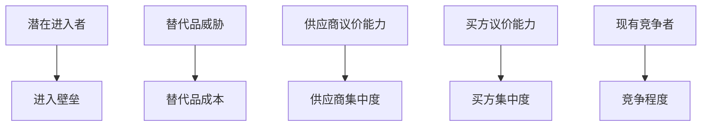

                 


# 如何识别企业的竞争优势

## 关键词：竞争优势识别，企业战略，资源分析，核心竞争力，战略定位，五力分析模型

## 摘要：  
识别企业的竞争优势是企业在复杂市场环境中生存和发展的关键。本文从竞争优势的基本概念出发，结合实际案例和工具，系统地分析了竞争优势的核心要素、分析方法、战略定位以及竞争优势的构建与优化。通过层次分析法（AHP）、五力分析模型、SWOT分析、价值链分析和波斯顿矩阵等工具，本文深入探讨了如何科学地识别和评估企业的竞争优势，并提供了实际应用的步骤和建议。此外，本文还结合项目实战，详细解读了竞争优势识别的工具实现和案例分析，为企业的竞争优势识别提供了全面的方法论支持。

---

# 第一部分: 企业的竞争优势概述

## 第1章: 企业的竞争优势基本概念

### 1.1 什么是企业的竞争优势

#### 1.1.1 企业的竞争优势定义  
竞争优势是指企业在市场上相对于竞争对手所拥有的独特优势，包括资源、能力、技术、品牌、成本、质量、服务等多个方面。竞争优势是企业在市场中获得超额利润的核心来源。

#### 1.1.2 竞争优势的核心要素  
竞争优势的核心要素可以分为以下几类：
1. **资源要素**：包括人力资源、财务资源、技术资源、信息资源等。
2. **能力要素**：包括研发能力、生产效率、创新能力、营销能力等。
3. **品牌要素**：包括品牌知名度、品牌忠诚度、品牌影响力等。
4. **成本要素**：包括生产成本、运营成本、管理成本等。

#### 1.1.3 竞争优势的类型与特点  
竞争优势可以分为以下几种类型：
1. **成本优势**：通过优化成本结构，降低生产成本，提供价格优势。
2. **差异化优势**：通过提供独特的产品或服务，满足特定客户需求。
3. **技术优势**：通过技术创新，提高产品或服务的技术含量和附加值。
4. **品牌优势**：通过强大的品牌形象，增强客户忠诚度和市场影响力。
5. **网络优势**：通过广泛的销售网络或合作伙伴关系，扩大市场覆盖。

### 1.2 竞争优势的背景与重要性

#### 1.2.1 当前商业环境的竞争态势  
在当今全球化和信息化的商业环境中，市场竞争日益激烈。企业需要不断优化自身的优势，以应对市场的变化和竞争对手的挑战。

#### 1.2.2 企业竞争优势的核心作用  
竞争优势是企业生存和发展的核心，决定了企业的市场份额、盈利能力和发展潜力。竞争优势不仅能够帮助企业在竞争中占据优势地位，还能为企业创造长期价值。

#### 1.2.3 竞争优势与企业长期发展的关系  
竞争优势是企业长期发展的基石。通过识别和优化竞争优势，企业可以更好地适应市场变化，抓住机遇，应对挑战。

### 1.3 竞争优势的边界与外延

#### 1.3.1 竞争优势的边界界定  
竞争优势的边界需要明确企业的核心能力和资源，避免将次要因素纳入竞争优势的范畴。

#### 1.3.2 竞争优势的外延扩展  
竞争优势的外延包括企业外部的市场环境、客户需求、技术趋势等因素，这些因素会影响竞争优势的实现和应用。

#### 1.3.3 竞争优势与企业战略的关系  
竞争优势是企业战略的核心内容，企业战略的制定和实施需要以竞争优势为基础。

### 1.4 竞争优势的核心要素组成

#### 1.4.1 资源与能力的构成  
企业的资源和能力是竞争优势的核心要素。资源包括人力资源、财务资源、技术资源等，能力包括研发能力、生产效率、创新能力等。

#### 1.4.2 核心竞争力的定义  
核心竞争力是指企业能够为客户创造独特价值的关键能力。核心竞争力是企业竞争优势的核心，决定了企业的长期发展潜力。

#### 1.4.3 竞争优势的动态变化  
竞争优势是一个动态变化的过程，随着市场环境的变化和竞争对手的调整，竞争优势需要不断优化和更新。

---

## 第2章: 竞争优势的分析框架

### 2.1 竞争优势的分析方法

#### 2.1.1 五力分析模型  
五力分析模型由迈克尔·波特提出，包括潜在进入者、替代品威胁、供应商议价能力、买方议价能力和现有竞争者之间的竞争程度。通过五力分析模型，企业可以全面评估市场环境中的竞争优势和劣势。



#### 2.1.2 SWOT分析法  
SWOT分析法是一种常用的战略分析工具，通过分析企业的优势（Strengths）、劣势（Weaknesses）、机会（Opportunities）和威胁（Threats），帮助企业识别竞争优势和劣势。

#### 2.1.3 价值链分析法  
价值链分析法通过分解企业的价值创造过程，识别企业内部的关键活动和资源，从而发现竞争优势。

### 2.2 竞争优势的层次结构

#### 2.2.1 产品层次的竞争优势  
产品层次的竞争优势是指企业在产品设计、质量、功能等方面的独特优势。

#### 2.2.2 过程层次的竞争优势  
过程层次的竞争优势是指企业在生产、研发、管理等过程中的效率和创新能力。

#### 2.2.3 战略层次的竞争优势  
战略层次的竞争优势是指企业在市场定位、战略选择、资源整合等方面的整体优势。

### 2.3 竞争优势的动态分析

#### 2.3.1 竞争优势的动态变化规律  
竞争优势是一个动态变化的过程，随着时间的推移，竞争优势可能会逐渐削弱或增强。

#### 2.3.2 竞争优势的周期性分析  
竞争优势的周期性分析包括竞争优势的形成、发展、成熟和衰退阶段。

#### 2.3.3 竞争优势的可持续性评估  
竞争优势的可持续性评估包括竞争优势的稳定性、可复制性和可扩展性。

---

## 第3章: 竞争优势的战略定位

### 3.1 竞争优势与战略定位的关系

#### 3.1.1 战略定位的定义  
战略定位是指企业在市场中确定自身的位置和目标，通过优化资源配置和能力，实现竞争优势。

#### 3.1.2 竞争优势与战略定位的互动  
竞争优势是战略定位的基础，战略定位是竞争优势实现的路径。

#### 3.1.3 战略定位对竞争优势的影响  
战略定位决定了竞争优势的方向和范围，影响竞争优势的实现效果。

### 3.2 竞争优势的战略选择

#### 3.2.1 基于资源的企业战略选择  
基于资源的战略选择强调企业利用自身资源和能力，构建竞争优势。

#### 3.2.2 基于能力的战略选择  
基于能力的战略选择强调企业通过优化能力，提升竞争优势。

#### 3.2.3 基于市场的战略选择  
基于市场的战略选择强调企业通过市场定位和客户关系，实现竞争优势。

### 3.3 竞争优势的实现路径

#### 3.3.1 资源优化配置  
资源优化配置包括人力资源、财务资源和技术资源的合理分配，以实现竞争优势的最大化。

#### 3.3.2 能力提升  
能力提升包括研发能力、生产效率和创新能力的提升，以增强竞争优势。

#### 3.3.3 战略调整  
战略调整包括市场定位、竞争策略和合作伙伴关系的调整，以适应市场变化和竞争对手的挑战。

---

## 第4章: 竞争优势的评估与分析

### 4.1 竞争优势的评估指标

#### 4.1.1 财务指标  
财务指标包括净利润率、毛利率、资产回报率等，用于衡量企业的盈利能力。

#### 4.1.2 市场指标  
市场指标包括市场份额、品牌知名度、客户忠诚度等，用于衡量企业的市场地位。

#### 4.1.3 运营指标  
运营指标包括生产效率、库存周转率、订单处理速度等，用于衡量企业的运营能力。

### 4.2 竞争优势的分析工具

#### 4.2.1 价值链分析  
价值链分析通过分解企业的价值创造过程，识别关键活动和资源，优化竞争优势。

#### 4.2.2 波斯顿矩阵  
波斯顿矩阵通过分析产品的市场增长率和市场份额，帮助企业识别核心产品和问题产品。

#### 4.2.3 核心竞争力评估  
核心竞争力评估通过分析企业的核心能力和资源，识别竞争优势的核心要素。

---

## 第5章: 竞争优势的构建与优化

### 5.1 竞争优势的构建策略

#### 5.1.1 培育核心竞争力  
核心竞争力是竞争优势的核心，企业需要通过技术创新、人才培养和资源整合，培育核心竞争力。

#### 5.1.2 建立差异化优势  
差异化优势是通过提供独特的产品或服务，满足特定客户需求，增强竞争优势。

#### 5.1.3 提升运营效率  
提升运营效率包括优化生产流程、降低管理成本、提高库存周转率等，以增强成本优势。

### 5.2 竞争优势的优化路径

#### 5.2.1 持续创新  
持续创新包括产品创新、技术创新和管理创新，以保持竞争优势的领先地位。

#### 5.2.2 战略调整  
战略调整包括市场定位、竞争策略和合作伙伴关系的调整，以适应市场变化和竞争对手的挑战。

#### 5.2.3 资源优化  
资源优化包括人力资源、财务资源和技术资源的优化配置，以实现竞争优势的最大化。

---

## 第6章: 项目实战——竞争优势识别工具实现

### 6.1 环境配置

#### 6.1.1 系统运行环境  
本工具需要在Windows或Linux系统上运行，支持Python 3.6及以上版本。

#### 6.1.2 工具依赖  
工具依赖包括Python、Pandas、Matplotlib和Scikit-learn等库。

### 6.2 系统核心实现源代码

```python
import pandas as pd
import numpy as np
import matplotlib.pyplot as plt
from sklearn.metrics import pairwise_distances

# 定义竞争优势评估函数
def competitive_advantage_assessment(data, weight):
    # 计算竞争优势得分
    score = np.dot(data, weight)
    return score

# 示例数据：假设企业资源数据
data = pd.DataFrame({
    '资源': [0.8, 0.6, 0.9],
    '能力': [0.7, 0.5, 0.8],
    '品牌': [0.6, 0.4, 0.7],
    '成本': [0.9, 0.8, 0.7]
})

# 示例权重：资源、能力、品牌、成本的权重
weight = [0.4, 0.3, 0.2, 0.1]

# 计算竞争优势得分
score = competitive_advantage_assessment(data, weight)
print("竞争优势得分：\n", score)

# 可视化展示
plt.bar(range(len(score)), score)
plt.xticks(range(len(score)), ['企业1', '企业2', '企业3'])
plt.title('企业竞争优势得分')
plt.show()
```

### 6.3 工具应用解读与分析

#### 6.3.1 数据收集与处理  
数据收集包括企业资源、能力、品牌和成本等方面的数据，数据处理包括数据清洗和标准化。

#### 6.3.2 竞争优势评估  
通过竞争优势评估函数，计算企业的竞争优势得分，并根据得分进行排序。

#### 6.3.3 竞争优势可视化  
通过柱状图或雷达图等可视化工具，展示企业的竞争优势得分，帮助企业直观识别竞争优势。

### 6.4 实际案例分析

#### 6.4.1 案例背景介绍  
某企业希望通过识别竞争优势，优化市场定位和战略选择。

#### 6.4.2 数据分析与处理  
通过收集和处理企业的资源、能力和成本数据，评估竞争优势。

#### 6.4.3 竞争优势识别与优化  
根据竞争优势评估结果，优化企业资源和能力，提升竞争优势。

### 6.5 项目小结

#### 6.5.1 核心代码实现  
通过Python代码实现竞争优势评估函数，计算竞争优势得分。

#### 6.5.2 工具应用总结  
竞争优势识别工具通过数据收集、处理和分析，帮助企业识别竞争优势，并优化资源和能力。

#### 6.5.3 项目经验总结  
竞争优势识别是一个动态过程，需要结合企业的实际情况，不断优化和调整。

---

## 第七章: 总结与启示

### 7.1 本章总结

#### 7.1.1 核心内容回顾  
竞争优势是企业在市场中生存和发展的核心，识别竞争优势需要结合企业的资源、能力和市场环境。

#### 7.1.2 关键工具与方法  
五力分析模型、SWOT分析法、价值链分析和波斯顿矩阵等工具是识别竞争优势的重要方法。

### 7.2 启示与建议

#### 7.2.1 竞争优势识别的重要性  
竞争优势识别是企业战略管理的核心内容，决定了企业的长期发展。

#### 7.2.2 竞争优势的动态优化  
竞争优势是一个动态变化的过程，企业需要不断优化和调整竞争优势。

#### 7.2.3 竞争优势的可持续性  
竞争优势的可持续性是企业长期发展的关键，企业需要通过创新和优化，保持竞争优势的领先地位。

### 7.3 未来趋势

#### 7.3.1 数字化与智能化  
随着数字化和智能化的发展，企业竞争优势将更加依赖于技术创新和数据驱动。

#### 7.3.2 全球化与本地化  
全球化和本地化的趋势要求企业具备全球视野和本地化能力，以适应不同市场的竞争环境。

#### 7.3.3 可持续发展  
可持续发展是未来竞争优势的重要组成部分，企业需要通过绿色生产和社会责任，提升竞争优势。

---

## 作者：AI天才研究院/AI Genius Institute & 禅与计算机程序设计艺术 /Zen And The Art of Computer Programming

---

**注意事项：**  
竞争优势识别是一个复杂的过程，需要结合企业的实际情况和市场环境。企业需要根据自身特点，选择合适的工具和方法，不断优化和调整竞争优势，以应对市场变化和竞争对手的挑战。

**最佳实践 tips：**  
1. 定期评估竞争优势，及时调整战略和资源分配。
2. 结合企业的实际情况，选择合适的竞争优势识别工具。
3. 建立动态竞争优势评估机制，及时发现和应对市场竞争的变化。

