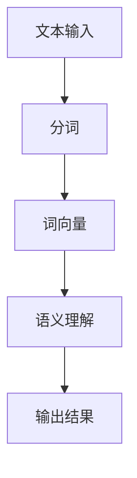
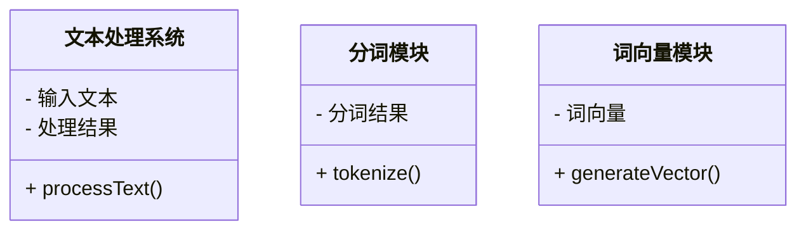

                 


# 如何识别企业的自然语言处理优势

> 关键词：自然语言处理，企业优势，算法原理，系统架构，项目实战

> 摘要：本文将详细探讨如何识别企业的自然语言处理优势。从背景介绍到算法原理，从系统架构设计到项目实战，全面解析自然语言处理在企业中的应用，帮助企业更好地利用NLP技术提升竞争力。

---

## 第一部分：背景介绍

### 第1章：自然语言处理的背景与概念

#### 1.1 问题背景

随着企业数字化转型的推进，语言数据在企业中的作用日益重要。企业每天都会产生大量的文本数据，如客户邮件、社交媒体评论、内部文档等。如何有效处理这些数据，提取有价值的信息，成为企业面临的重要挑战。自然语言处理（NLP）作为人工智能的核心技术之一，能够帮助企业从海量文本中提取关键信息，优化业务流程，提升客户体验。

**企业应用NLP的优势：**

1. **自动化处理**：NLP可以自动化处理大量文本数据，减少人工成本。
2. **信息提取**：从非结构化文本中提取关键信息，如情感分析、实体识别等。
3. **提升效率**：通过NLP技术优化客户服务、内容管理等流程，提升企业效率。

**NLP的核心问题：**

- 文本理解：如何让计算机理解人类语言。
- 文本生成：如何让计算机生成符合人类语言习惯的文本。

**NLP的应用边界：**

- 语言理解的准确性问题。
- 数据隐私和安全问题。
- 模型训练的计算资源需求。

#### 1.2 核心概念与联系

**NLP核心概念原理：**

- 分词：将文本分割成有意义的词语或短语。
- 词向量：将词语转换为向量表示，便于计算机处理。
- 语义理解：通过上下文理解词语的含义。

**NLP技术属性特征对比表：**

| 技术 | 输入 | 输出 | 示例 |
|------|------|------|------|
| 分词 | 文本 | 单词列表 | "Hello world" → ["Hello", "world"] |
| 词向量 | 单词 | 向量表示 | "hello" → [0.2, 0.5, ...] |
| 语义理解 | 文本 | 意义表示 | "I love programming" → 积极情感 |

**NLP实体关系图（Mermaid流程图）：**



---

## 第二部分：自然语言处理算法原理

### 第2章：NLP核心算法与模型

#### 2.1 常见NLP算法

**词袋模型（Bag of Words）：**

词袋模型是一种简单有效的文本表示方法，它将文本表示为单词的集合，不考虑单词的顺序。

**公式：**

$$\text{概率} = \frac{\text{词频}}{\text{总词数}}$$

**优缺点：**

- 优点：简单易实现，适合处理短文本。
- 缺点：不考虑词语顺序，忽略语法结构。

**应用场景：**

- 文本分类：如垃圾邮件检测、情感分析。

**代码示例：**

```python
from sklearn.feature_extraction.text import CountVectorizer

vectorizer = CountVectorizer()
text = ["Hello world", "world is nice"]
X = vectorizer.fit_transform(text)
print(X.toarray())
```

---

**词嵌入模型（Word Embedding）：**

词嵌入模型将词语映射到低维连续向量空间中，常用技术包括Word2Vec、GloVe。

**公式：**

$$\text{向量} = [\text{词1}, \text{词2}, \dots, \text{词n}]$$

**优缺点：**

- 优点：捕捉词语语义关系，适合处理长文本。
- 缺点：需要大量数据训练，计算资源消耗大。

**应用场景：**

- 实体识别：如从文本中提取人名、地名。

**代码示例：**

```python
from gensim.models import Word2Vec

model = Word2Vec([["hello", "world"], ["world", "is", "nice"]], vector_size=10, window=2, min_count=1, workers=2)
print(model.wv["world"])
```

---

**深度学习模型（如RNN、LSTM、Transformer）：**

深度学习模型在NLP领域取得了显著成果，尤其是Transformer模型的出现，推动了NLP技术的进一步发展。

**注意力机制公式：**

$$\text{注意力权重} = \text{查询} \cdot \text{键}^T / \sqrt{d}$$

**优缺点：**

- 优点：捕捉长距离依赖，适合处理复杂语义。
- 缺点：计算复杂度高，需要大量计算资源。

**应用场景：**

- 机器翻译：如将英文翻译成中文。
- 文本生成：如智能客服的自动回复。

---

## 第三部分：企业NLP系统分析与架构设计

### 第3章：企业NLP系统分析

#### 3.1 问题场景介绍

**企业内部文档处理：**

- 问题：如何处理大量内部文档，提取关键信息。
- 解决：使用NLP技术进行文本分类、关键词提取。

**客户交互中的语言数据：**

- 问题：如何分析客户反馈，提升服务质量。
- 解决：利用情感分析、实体识别技术，识别客户情绪和关键需求。

**业务流程中的NLP应用：**

- 问题：如何优化业务流程，提高效率。
- 解决：通过NLP技术实现自动化处理，如自动回复客户邮件。

---

#### 3.2 系统功能设计

**领域模型（Mermaid类图）：**



---

#### 3.3 系统架构设计

**系统架构图（Mermaid架构图）：**


---

## 第四部分：项目实战

### 第4章：企业NLP项目实战

#### 4.1 环境安装与配置

**安装Python与NLP库：**

```bash
pip install numpy
pip install pandas
pip install spacy
pip install scikit-learn
```

**配置开发环境：**

- 安装Jupyter Notebook：`pip install jupyter`

---

#### 4.2 核心代码实现

**分词代码：**

```python
import spacy

nlp = spacy.load("en_core_web_sm")
text = "Hello world, how are you?"
doc = nlp(text)
for token in doc:
    print(token.text)
```

**词向量代码：**

```python
from gensim.models import Word2Vec

model = Word2Vec([["hello", "world"], ["world", "is", "nice"]], vector_size=10, window=2, min_count=1, workers=2)
print(model.wv["world"])
```

---

#### 4.3 案例分析

**情感分析案例：**

```python
from textblob import TextBlob

text = "I love this product!"
blob = TextBlob(text)
print(blob.sentiment.polarity)
```

---

## 第五部分：最佳实践与总结

### 5.1 最佳实践

- **数据预处理：** 仔细清洗和标注数据，确保模型训练质量。
- **模型调优：** 使用交叉验证和网格搜索优化模型参数。
- **结果分析：** 定期监控模型性能，及时调整和优化。

### 5.2 小结

通过本文的详细讲解，我们了解了如何识别企业的自然语言处理优势。从背景介绍到算法原理，从系统架构设计到项目实战，全面解析了NLP在企业中的应用。希望本文能为企业在NLP领域的实践提供有价值的指导。

---

## 作者：AI天才研究院 & 禅与计算机程序设计艺术

本文由AI天才研究院与禅与计算机程序设计艺术团队共同撰写，旨在为企业和技术人员提供深入的技术指导和实践建议。如需进一步了解或合作，请访问我们的官方网站或联系相关工作人员。

---

**结语：** 自然语言处理技术正在迅速发展，企业需要紧跟技术潮流，充分利用NLP的优势，提升竞争力。希望本文能为您提供有价值的参考和启发。

