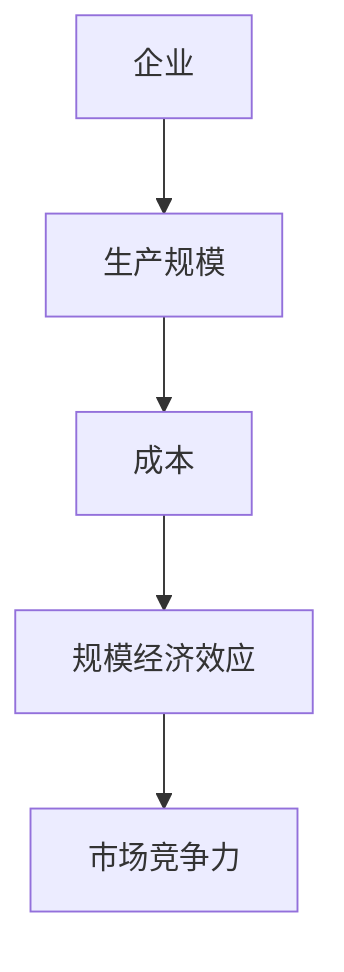
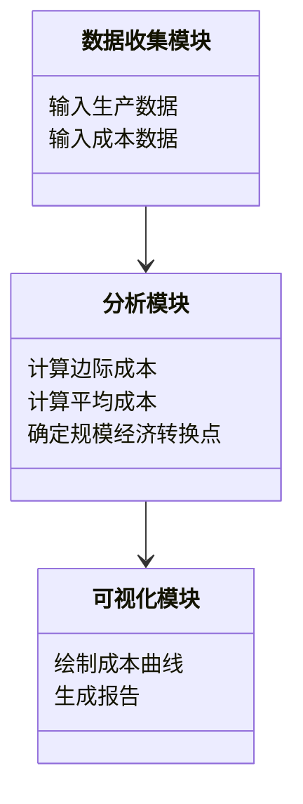
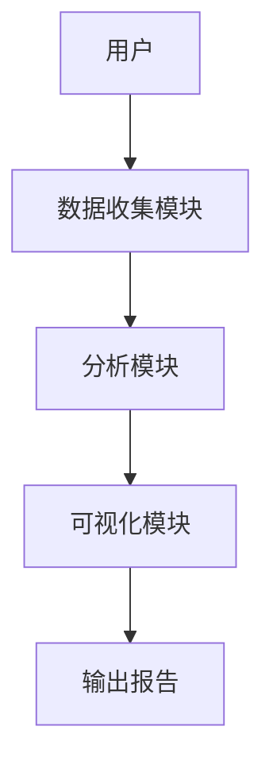
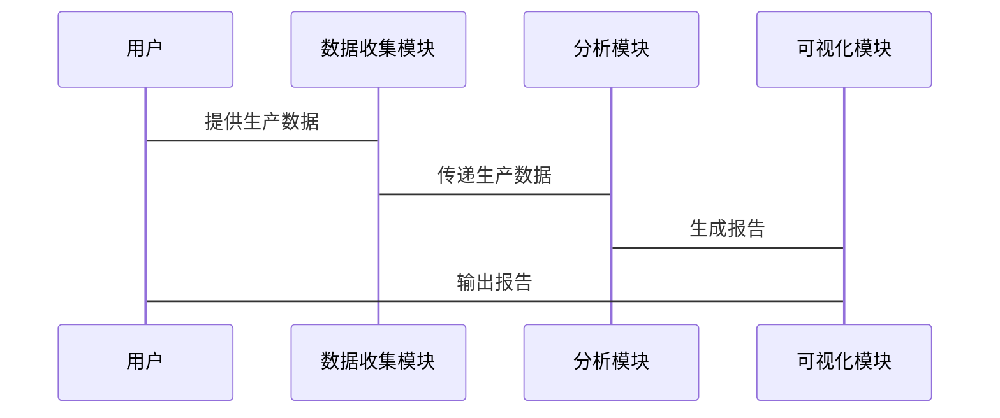

                 


# 如何识别企业的规模经济效应

> 关键词：规模经济效应、企业识别、成本分析、数学模型、系统架构、项目实战

> 摘要：规模经济效应是企业在扩大规模过程中成本下降的现象，本文章将从背景、核心概念、算法原理、系统架构、项目实战等角度详细讲解如何识别企业规模经济效应。

---

## 第一部分: 企业的规模经济效应概述

### 第1章: 规模经济效应的定义与背景

#### 1.1 规模经济效应的定义
- 1.1.1 什么是规模经济效应
  - 规模经济效应是指随着企业规模的扩大，单位产品成本下降的现象。
  - 例如，制造业企业随着生产量的增加，设备利用率提高，单位产品成本降低。
  
- 1.1.2 规模经济效应的形成原因
  - 规模经济效应通常由生产规模扩大带来的效率提升引起，如固定成本的分摊、技术进步等。
  
- 1.1.3 规模经济效应的边界与外延
  - 规模经济效应并非无限，企业规模过大可能导致边际成本上升，需找到最佳规模点。

#### 1.2 识别规模经济效应的重要性
- 1.2.1 企业为什么要识别规模经济效应
  - 识别规模经济效应有助于企业优化生产规模，降低成本，提高利润。
  
- 1.2.2 规模经济效应对企业竞争力的影响
  - 规模经济效应使企业能够在价格竞争中更具优势，从而扩大市场份额。
  
- 1.2.3 规模经济效应与企业成长的关系
  - 企业通过识别规模经济效应，能够制定更合理的增长策略，实现可持续发展。

#### 1.3 识别规模经济效应的挑战
- 1.3.1 数据收集的难度
  - 需要收集大量的生产数据、成本数据等，数据的准确性和完整性是关键。
  
- 1.3.2 方法选择的复杂性
  - 不同企业可能适用不同的识别方法，选择合适的方法需要深入分析企业的具体情况。
  
- 1.3.3 行业差异的影响
  - 不同行业的规模经济效应表现形式不同，需要考虑行业特点和市场环境。

#### 1.4 本章小结
- 总结本章内容，强调规模经济效应的重要性及其对企业的影响。

---

## 第2章: 规模经济效应的核心概念与联系

#### 2.1 规模经济效应的核心原理
- 2.1.1 边际成本递减规律
  - 边际成本递减是指随着产量增加，单位产品的边际成本逐渐降低的现象。
  - 例如，当产量从100增加到200时，边际成本从$10下降到$8。
  
- 2.1.2 规模收益递增与递减的转换点
  - 规模收益递增是指产量增加导致成本下降，规模收益递减则是指产量继续增加导致成本上升。
  - 企业应找到规模收益递增向递减的转换点，以确定最佳生产规模。
  
- 2.1.3 规模经济效应的数学模型
  - 使用数学公式表示规模经济效应，例如：
    - 边际成本函数：$MC = \frac{dC}{dq}$
    - 平均成本函数：$AC = \frac{C}{q}$
    - 规模经济指数：$S$

#### 2.2 核心概念对比分析
- 2.2.1 规模经济与范围经济的对比
  - 规模经济关注企业内部效率，范围经济关注企业内外部效率。
  - 例如，扩大生产规模降低单位成本是规模经济，而多样化生产产品降低成本是范围经济。
  
- 2.2.2 规模经济与市场结构的关系
  - 市场结构影响企业的规模经济效应，垄断市场更容易实现规模经济。
  
- 2.2.3 规模经济与企业规模的关系
  - 企业规模与规模经济效应密切相关，但过大的规模可能导致边际成本上升。

#### 2.3 实体关系图
- 使用Mermaid流程图展示企业规模经济效应的实体关系：


#### 2.4 本章小结
- 总结本章内容，强调规模经济效应的核心概念和其与其他概念的关系。

---

## 第3章: 规模经济效应的数学模型与算法原理

#### 3.1 规模经济效应的数学模型
- 3.1.1 边际成本函数
  - 边际成本函数表示每增加一单位产量的额外成本。
  - 例如，边际成本函数可以表示为：$MC(q) = a + bq$，其中$a$和$b$为常数。
  
- 3.1.2 平均成本函数
  - 平均成本函数表示每单位产量的平均成本。
  - 例如，平均成本函数可以表示为：$AC(q) = \frac{a}{q} + bq$。
  
- 3.1.3 规模经济指数
  - 规模经济指数用于衡量规模经济效应的强弱。
  - 例如，规模经济指数可以表示为：$SEI = \frac{MC(q)}{AC(q)}$。

#### 3.2 规模经济效应的算法原理
- 3.2.1 使用Python进行成本分析
  - 使用Python编写成本分析代码，计算边际成本和平均成本。
  - 例如：
    ```python
    def calculate_cost(q):
        return 100 + 5*q
    def marginal_cost(q):
        return calculate_cost(q+1) - calculate_cost(q)
    def average_cost(q):
        return calculate_cost(q) / q
    ```
  
- 3.2.2 使用数学公式进行规模经济效应分析
  - 通过数学公式计算规模经济效应的转换点。
  - 例如，找到边际成本等于平均成本的点，即：
    $$MC(q) = AC(q)$$

#### 3.3 算法流程图
- 使用Mermaid流程图展示算法步骤：
```mermaid
graph TD
    A[开始] --> B[输入产量q]
    B --> C[计算总成本C(q)]
    C --> D[计算边际成本MC(q)]
    D --> E[计算平均成本AC(q)]
    E --> F[判断MC(q)是否等于AC(q)]
    F --> G[是，输出规模经济转换点]
    F --> H[否，继续计算]
```

#### 3.4 本章小结
- 总结本章内容，强调数学模型和算法原理在识别规模经济效应中的应用。

---

## 第4章: 规模经济效应的系统分析与架构设计方案

#### 4.1 问题场景介绍
- 介绍如何识别企业规模经济效应的实际问题场景。
- 例如，某制造企业希望优化生产规模，降低成本。

#### 4.2 项目介绍
- 介绍项目目标和范围。
- 例如，开发一个基于成本分析的规模经济效应识别系统。

#### 4.3 系统功能设计
- 使用Mermaid类图展示系统功能模块：


#### 4.4 系统架构设计
- 使用Mermaid架构图展示系统架构：


#### 4.5 系统接口设计
- 描述系统接口及其交互流程。
- 例如，用户输入生产数据，系统输出规模经济转换点。

#### 4.6 系统交互流程图
- 使用Mermaid序列图展示系统交互：


#### 4.7 本章小结
- 总结本章内容，强调系统分析和架构设计在识别规模经济效应中的作用。

---

## 第5章: 项目实战

#### 5.1 环境安装
- 介绍项目所需环境和工具的安装步骤。
- 例如，安装Python、NumPy、Matplotlib等库。

#### 5.2 系统核心实现源代码
- 提供Python代码实现规模经济效应识别的核心算法。
  ```python
  import numpy as np
  import matplotlib.pyplot as plt

  def calculate_cost(q):
      return 100 + 5*q

  def marginal_cost(q):
      return calculate_cost(q+1) - calculate_cost(q)

  def average_cost(q):
      return calculate_cost(q) / q

  q_values = np.arange(1, 100)
  mc = [marginal_cost(q) for q in q_values]
  ac = [average_cost(q) for q in q_values]

  plt.plot(q_values, mc, label='边际成本')
  plt.plot(q_values, ac, label='平均成本')
  plt.xlabel('产量(q)')
  plt.ylabel('成本')
  plt.legend()
  plt.show()
  ```

#### 5.3 代码应用解读与分析
- 解读代码的功能和作用。
- 例如，上述代码计算并绘制了边际成本和平均成本曲线，帮助识别规模经济转换点。

#### 5.4 实际案例分析和详细讲解剖析
- 使用实际案例分析规模经济效应的识别过程。
- 例如，分析某制造企业生产数据，确定最佳生产规模。

#### 5.5 本章小结
- 总结本章内容，强调项目实战在识别规模经济效应中的应用。

---

## 第6章: 最佳实践、小结、注意事项、拓展阅读

#### 6.1 最佳实践
- 提供识别规模经济效应的最佳实践建议。
- 例如，建议企业在识别规模经济效应时，结合行业特点和企业实际情况，选择合适的分析方法。

#### 6.2 小结
- 总结全文内容，强调规模经济效应识别的重要性及其对企业的影响。

#### 6.3 注意事项
- 提醒读者在识别规模经济效应时需要注意的问题。
- 例如，注意数据的准确性和完整性，避免选择错误的分析方法。

#### 6.4 拓展阅读
- 推荐相关领域的书籍和资源，供读者进一步学习。

---

## 作者：AI天才研究院/AI Genius Institute & 禅与计算机程序设计艺术 /Zen And The Art of Computer Programming

---

希望这个目录大纲能满足您的需求。如果需要进一步修改或补充，请随时告知！

