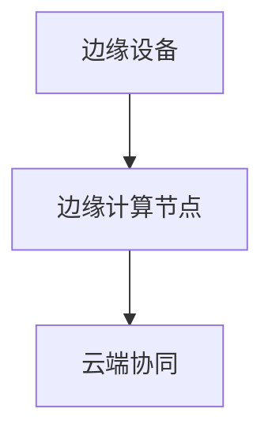
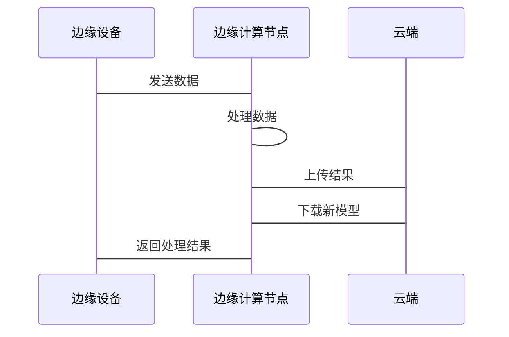

                 


# 如何识别企业的边缘AI芯片优势

> **关键词**: 边缘AI芯片, 企业优势, 技术原理, 算法优化, 系统设计, 实际应用

> **摘要**: 本文深入探讨了边缘AI芯片的核心优势，从技术背景、核心概念、算法原理到系统设计和项目实战，全面解析如何识别和利用边缘AI芯片的优势。通过详细分析，帮助读者理解边缘AI芯片在企业中的应用场景和实际价值，为企业技术决策提供参考。

---

# 第一部分: 边缘AI芯片的背景与概念

## 第1章: 边缘AI芯片概述

### 1.1 边缘计算与AI芯片的结合

#### 1.1.1 边缘计算的基本概念
边缘计算是一种分布式计算范式，将数据处理从中心化云端转移到靠近数据源的边缘设备。其核心优势在于低延迟和实时性，适用于需要快速响应的场景。

#### 1.1.2 AI芯片的核心技术
AI芯片专为加速人工智能任务设计，通过硬件优化和专用指令集提升计算效率。常见类型包括GPU、TPU和专用AI芯片。

#### 1.1.3 边缘AI芯片的定义与特点
边缘AI芯片结合了边缘计算和AI技术，具备低功耗、高能效、实时性强等特点，适用于边缘设备的数据处理和推理任务。

### 1.2 边缘AI芯片的优势

#### 1.2.1 低延迟与实时性
边缘AI芯片能够快速处理数据，减少数据传输到云端的延迟，提升实时响应能力。

#### 1.2.2 高能效与低成本
边缘AI芯片通常设计为低功耗，适合在资源受限的环境中使用，同时降低了整体计算成本。

#### 1.2.3 数据隐私与安全
边缘计算减少了数据传输到云端的需求，提升了数据隐私和安全性，特别是在敏感场景中优势明显。

### 1.3 边缘AI芯片的应用场景

#### 1.3.1 智能制造
在工业自动化中，边缘AI芯片用于实时监控和预测维护，提升生产效率和产品质量。

#### 1.3.2 智慧城市
在交通管理、环境监测等领域，边缘AI芯片支持实时数据处理，优化城市运营效率。

#### 1.3.3 智慧医疗
边缘AI芯片在医疗设备中用于实时数据分析，辅助诊断和治疗决策，提升医疗效率。

### 1.4 本章小结
本章介绍了边缘AI芯片的基本概念、优势及应用场景，为后续章节分析提供了基础。

---

# 第二部分: 边缘AI芯片的核心概念与技术原理

## 第2章: 边缘AI芯片的核心概念

### 2.1 边缘AI芯片的技术特点

#### 2.1.1 硬件加速技术
边缘AI芯片通过专用硬件加速单元（如Tensor Processing Units）提升计算效率。

#### 2.1.2 软件优化技术
优化的软件框架和工具链能够更好地发挥硬件性能，提升计算效率。

#### 2.1.3 芯片架构创新
采用创新的芯片架构设计，如专用指令集和并行计算单元，进一步优化性能。

### 2.2 边缘AI芯片与云计算的关系

#### 2.2.1 边缘计算与云计算的协同工作
边缘AI芯片作为云计算的扩展，负责处理靠近数据源的任务，云计算则负责需要更大算力的任务。

#### 2.2.2 边缘AI芯片在云计算中的应用
通过边缘AI芯片，云计算架构能够更高效地管理资源，提升整体计算效率和响应速度。

### 2.3 边缘AI芯片的性能指标

#### 2.3.1 算力与能效
边缘AI芯片需要在保证算力的同时，具备高能效，以适应边缘设备的功耗限制。

#### 2.3.2 延迟与吞吐量
低延迟和高吞吐量是边缘AI芯片的重要性能指标，直接影响实时性和处理效率。

#### 2.3.3 可扩展性与灵活性
边缘AI芯片需要具备良好的扩展性和灵活性，以适应不同的应用场景和需求变化。

### 2.4 本章小结
本章详细分析了边缘AI芯片的技术特点、与云计算的关系及性能指标，帮助读者全面理解其技术优势。

## 第3章: 边缘AI芯片的核心技术原理

### 3.1 神经网络加速技术

#### 3.1.1 神经网络的硬件加速原理
边缘AI芯片通过硬件加速单元快速执行神经网络的矩阵运算，提升计算速度。

#### 3.1.2 矩阵运算的并行处理
利用并行计算技术，边缘AI芯片能够高效处理大规模矩阵运算，提升计算效率。

#### 3.1.3 稀疏化与量化技术
通过稀疏化和量化技术，减少计算所需的资源，降低能耗和计算成本。

### 3.2 芯片架构优化技术

#### 3.2.1 专用指令集设计
设计专用指令集，优化神经网络运算，提升硬件执行效率。

#### 3.2.2 硬件加速单元的配置
配置专用的加速单元，针对特定任务进行优化，提升计算性能。

#### 3.2.3 能耗优化技术
通过动态电压频率调整等技术，降低芯片能耗，延长设备续航时间。

### 3.3 软件生态与工具链

#### 3.3.1 开发工具与框架
边缘AI芯片通常配套提供开发工具和框架，简化开发流程，提升开发效率。

#### 3.3.2 芯片驱动与SDK
提供专用的驱动和SDK，帮助开发者快速集成边缘AI芯片到现有系统中。

#### 3.3.3 软件兼容性与可扩展性
优化软件的兼容性和可扩展性，确保边缘AI芯片能够适应不同应用场景的需求。

### 3.4 本章小结
本章深入探讨了边缘AI芯片的核心技术原理，包括神经网络加速技术、芯片架构优化和软件生态建设，为后续章节的应用分析奠定了基础。

---

# 第三部分: 边缘AI芯片的算法与系统设计

## 第4章: 边缘AI芯片的算法原理

### 4.1 算法概述

#### 4.1.1 神经网络模型
边缘AI芯片通常采用轻量级神经网络模型，如卷积神经网络（CNN）和循环神经网络（RNN）。

#### 4.1.2 模型压缩与优化
通过模型剪枝、权重量化等技术，减少模型体积，提升运行效率。

### 4.2 算法实现

#### 4.2.1 算法流程
1. 数据预处理：将输入数据转换为适合模型处理的格式。
2. 前向传播：通过神经网络进行特征提取和分类。
3. 后向传播：计算损失并更新模型参数。
4. 推理优化：针对边缘设备优化推理过程，降低计算成本。

#### 4.2.2 算法实现的数学模型

##### 4.2.2.1 梯度下降算法
数学公式：
$$ \theta = \theta - \eta \cdot \nabla_{\theta} J $$
其中，$\theta$ 是参数，$\eta$ 是学习率，$\nabla_{\theta} J$ 是损失函数关于$\theta$的梯度。

##### 4.2.2.2 矩阵乘法
数学公式：
$$ C = A \cdot B $$
其中，$A$ 和 $B$ 是矩阵，$C$ 是结果矩阵。

### 4.3 算法优化

#### 4.3.1 稀疏化技术
通过减少模型中不必要的参数，降低计算量和存储需求。

#### 4.3.2 量化技术
将模型权重和激活值量化为低比特位（如8位或4位），减少存储空间和计算资源。

#### 4.3.3 并行计算
利用边缘AI芯片的并行计算能力，加速算法的执行速度。

### 4.4 本章小结
本章详细分析了边缘AI芯片的算法原理，包括神经网络模型、算法实现和优化技术，为实际应用提供了理论基础。

## 第5章: 边缘AI芯片的系统设计

### 5.1 系统架构设计

#### 5.1.1 边缘AI芯片的系统架构
1. 边缘设备：包括传感器、摄像头等数据采集设备。
2. 边缘计算节点：部署边缘AI芯片，负责数据处理和推理。
3. 云端协同：通过边缘计算节点与云端协同工作，实现数据的上传和模型的更新。

#### 5.1.2 系统功能设计
- 数据采集与预处理：收集原始数据并进行初步处理。
- 模型部署与推理：在边缘AI芯片上部署模型并进行推理。
- 数据上传与协同：将处理结果上传到云端，并与云端进行协同计算。

#### 5.1.3 系统架构图


### 5.2 系统接口设计

#### 5.2.1 边缘计算节点与边缘设备的接口
- 数据传输接口：定义数据格式和传输协议。
- 控制接口：用于配置和管理边缘设备。

#### 5.2.2 边缘计算节点与云端的接口
- 数据上传接口：将处理结果上传到云端。
- 模型更新接口：从云端下载新的模型进行部署。

### 5.3 系统交互流程

#### 5.3.1 边缘设备与边缘计算节点的交互
1. 边缘设备采集数据并发送到边缘计算节点。
2. 边缘计算节点对数据进行处理并返回结果。

#### 5.3.2 边缘计算节点与云端的交互
1. 边缘计算节点将处理结果上传到云端。
2. 云端根据需要将新的模型推送到边缘计算节点。

#### 5.3.3 系统交互流程图


### 5.4 本章小结
本章详细分析了边缘AI芯片的系统架构设计和交互流程，为实际应用提供了系统层面的指导。

---

# 第四部分: 项目实战与总结

## 第6章: 边缘AI芯片的项目实战

### 6.1 项目环境安装

#### 6.1.1 硬件准备
- 边缘计算节点：搭载边缘AI芯片的设备，如树莓派或嵌入式计算板。
- 边缘设备：传感器、摄像头等数据采集设备。

#### 6.1.2 软件安装
- 操作系统：Linux发行版（如Ubuntu）。
- 开发工具：边缘AI芯片提供的SDK和工具链。
- 模型框架：TensorFlow Lite、ONNX等轻量级框架。

### 6.2 系统核心实现

#### 6.2.1 数据采集与预处理
- 使用传感器或摄像头采集数据，进行格式转换和预处理。
- 示例代码：
  ```python
  import numpy as np
  def preprocess_data(data):
      # 数据预处理逻辑
      return processed_data
  ```

#### 6.2.2 模型部署与推理
- 在边缘AI芯片上部署训练好的模型，进行实时推理。
- 示例代码：
  ```python
  def infer(model, input_data):
      # 模型推理逻辑
      return output
  ```

#### 6.2.3 数据上传与协同
- 将处理结果上传到云端，并与云端进行协同计算。
- 示例代码：
  ```python
  import requests
  def upload_result(result, endpoint):
      response = requests.post(endpoint, json=result)
      return response.json()
  ```

### 6.3 项目小结
本章通过实际项目实战，展示了边缘AI芯片的应用流程，从环境准备到数据处理和模型部署，帮助读者掌握实际操作技能。

## 第7章: 总结与展望

### 7.1 本项目的核心优势识别
边缘AI芯片通过低延迟、高能效和实时性，显著提升了企业的数据处理能力和效率。

### 7.2 未来展望
随着技术的发展，边缘AI芯片将在更多领域得到应用，进一步推动智能化和数字化转型。

---

# 作者：AI天才研究院/AI Genius Institute & 禅与计算机程序设计艺术 /Zen And The Art of Computer Programming

---

本文通过详细分析边缘AI芯片的核心概念、技术原理和系统设计，结合实际项目案例，帮助读者全面理解边缘AI芯片的优势识别。从理论到实践，为企业的技术决策提供了有力支持。

