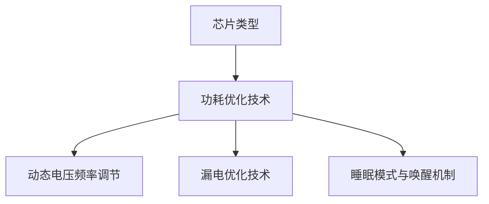
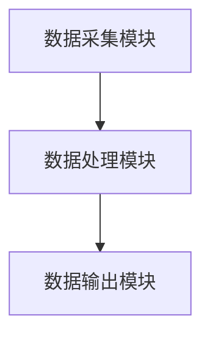

                 


# 如何识别企业的边缘AI芯片低功耗设计优势

## 关键词：边缘AI芯片，低功耗设计，动态电压频率调节，漏电优化，系统架构设计

## 摘要：  
在边缘计算快速发展的背景下，边缘AI芯片的低功耗设计成为企业竞争力的关键因素。本文通过详细分析边缘AI芯片的低功耗设计原理、核心技术与算法优化，帮助读者识别和评估企业在该领域的优势。从动态电压频率调节到漏电优化，从系统架构设计到实际项目实战，本文全面解析了低功耗设计的核心要素，并结合实际案例，为企业提供可操作的建议。

---

# 第一部分: 边缘AI芯片低功耗设计背景与核心概念

## 第1章: 边缘AI芯片与低功耗设计概述

### 1.1 边缘计算的发展与应用
#### 1.1.1 边缘计算的基本概念  
边缘计算是一种分布式计算模式，将数据处理从中心服务器转移到靠近数据源的边缘设备。这种模式能够减少延迟，提高数据处理效率，并支持实时决策。

#### 1.1.2 边缘计算在企业中的应用场景  
在企业中，边缘计算广泛应用于物联网、智能制造、智能安防、智能家居等领域。例如，智能工厂中的传感器数据需要快速处理，以实现实时监控和优化。

#### 1.1.3 边缘AI芯片的基本概念  
边缘AI芯片是专门用于边缘设备的AI加速芯片，能够高效处理图像识别、语音识别等任务。这些芯片通常具有低功耗、高性能的特点。

### 1.2 低功耗设计的重要性  
#### 1.2.1 低功耗设计的背景与意义  
随着边缘设备的普及，功耗问题日益突出。低功耗设计能够延长设备续航时间，减少能源消耗，降低成本。

#### 1.2.2 边缘AI芯片的功耗挑战  
边缘设备通常运行在电池供电或有限能源环境中，因此对功耗控制要求极高。高功耗设计可能导致设备快速耗电，影响正常运行。

#### 1.2.3 低功耗设计对企业竞争力的影响  
低功耗设计能够提升设备的续航能力和稳定性，增强企业的市场竞争力。特别是在物联网和智能设备市场，低功耗设计是核心竞争力之一。

### 1.3 边缘AI芯片的核心技术  
#### 1.3.1 神经网络加速技术  
边缘AI芯片通常采用神经网络加速技术，如卷积神经网络（CNN）加速，以提高计算效率。

#### 1.3.2 动态电压频率调节  
动态电压频率调节（DVFS）是一种通过调整芯片电压和频率来优化功耗的技术。

#### 1.3.3 智能电源管理  
智能电源管理能够根据芯片负载动态调整电源供给，降低功耗。

### 1.4 本章小结  
本章介绍了边缘计算的发展背景、边缘AI芯片的基本概念以及低功耗设计的重要性。低功耗设计是边缘AI芯片的核心竞争力，必须在设计中予以高度重视。

---

## 第2章: 边缘AI芯片低功耗设计的核心概念与原理

### 2.1 低功耗设计的基本原理  
#### 2.1.1 功耗计算模型  
功耗计算模型是低功耗设计的基础。常见的模型包括静态功耗模型和动态功耗模型。

#### 2.1.2 功耗优化的基本方法  
功耗优化的基本方法包括硬件优化、算法优化和系统优化。

#### 2.1.3 低功耗设计的实现路径  
低功耗设计的实现路径包括架构优化、电路设计优化和系统管理优化。

### 2.2 边缘AI芯片的架构特点  
#### 2.2.1 ASIC、FPGA与GPU的对比  
ASIC（专用集成电路）在功耗和性能上具有优势，FPGA（现场可编程门阵列）具有灵活性，GPU（图形处理器）适合并行计算。

#### 2.2.2 神经网络加速器的架构设计  
神经网络加速器的架构设计包括计算单元、缓存单元和控制单元。

#### 2.2.3 模块化设计的优势  
模块化设计能够提高设计效率，降低功耗。

### 2.3 低功耗设计的关键技术  
#### 2.3.1 动态电压频率调节（DVFS）  
动态电压频率调节是一种通过调整芯片电压和频率来优化功耗的技术。公式为：
$$ P = V^2 \times f $$
其中，P表示功耗，V表示电压，f表示频率。

#### 2.3.2 漏电优化技术  
漏电优化技术通过优化电路设计，减少漏电功耗。

#### 2.3.3 睡眠模式与唤醒机制  
睡眠模式与唤醒机制通过动态调整芯片状态，降低功耗。

### 2.4 核心概念对比分析  
#### 2.4.1 芯片类型对比表格  
以下是对ASIC、FPGA和GPU的功耗优化能力对比：

| 芯片类型 | 优势 | 功耗优化能力 |
|----------|-------|-------------|
| ASIC    | 高性能、低功耗 | 强 |
| FPGA     | 灵活性较高 | 中 |
| GPU      | 并行计算能力强 | 低 |

#### 2.4.2 功耗优化技术的ER实体关系图  


### 2.5 本章小结  
本章详细介绍了低功耗设计的核心概念与原理，包括功耗计算模型、芯片架构特点以及关键技术。这些内容为后续的算法优化和系统设计奠定了基础。

---

## 第3章: 边缘AI芯片低功耗设计的算法原理

### 3.1 动态电压频率调节算法  
#### 3.1.1 DVFS算法的基本原理  
动态电压频率调节算法通过动态调整电压和频率，以平衡功耗和性能。

#### 3.1.2 功耗与性能的平衡公式  
功耗与性能的平衡公式为：
$$ P = V^2 \times f $$

#### 3.1.3 动态调节的实现步骤  
动态调节的实现步骤包括负载检测、电压频率调整和状态监控。

### 3.2 漏电优化算法  
#### 3.2.1 漏电优化的基本原理  
漏电优化算法通过优化电路设计，减少漏电功耗。

#### 3.2.2 漏电优化的数学模型  
漏电优化的数学模型为：
$$ I_leak = K \times V^{0.5} \times t $$

### 3.3 睡眠模式与唤醒机制  
#### 3.3.1 睡眠模式的实现原理  
睡眠模式通过关闭部分电路，降低功耗。

#### 3.3.2 唤醒机制的触发条件  
唤醒机制根据负载情况自动启动。

#### 3.3.3 算法流程图  
```mermaid
graph TD
A[开始] --> B[检测到低负载]
B --> C[进入睡眠模式]
C --> D[检测到高负载]
D --> E[退出睡眠模式]
E -->
```

### 3.4 本章小结  
本章详细介绍了动态电压频率调节、漏电优化和睡眠模式等算法原理，为低功耗设计提供了理论支持。

---

## 第4章: 边缘AI芯片低功耗设计的系统架构与实现

### 4.1 系统架构设计  
#### 4.1.1 领域模型设计  
领域模型设计包括数据采集、数据处理和数据输出三个模块。

#### 4.1.2 系统架构设计图  
系统架构设计图展示了各模块之间的关系：



### 4.2 系统接口设计  
#### 4.2.1 接口协议  
系统接口设计包括API接口和硬件接口。

#### 4.2.2 接口实现  
接口实现需要考虑数据格式和通信协议。

### 4.3 系统交互设计  
#### 4.3.1 交互流程图  
系统交互流程图展示了用户与系统之间的交互过程：

```mermaid
graph TD
A[用户] --> B[系统]
B --> C[处理请求]
C --> D[返回结果]
D -->
```

### 4.4 本章小结  
本章详细介绍了系统架构设计、接口设计和交互设计，为低功耗设计提供了系统实现的指导。

---

## 第5章: 边缘AI芯片低功耗设计的项目实战

### 5.1 环境安装  
#### 5.1.1 开发工具安装  
需要安装编译工具、调试工具和仿真工具。

#### 5.1.2 硬件环境配置  
配置开发板、电源供应和测试设备。

### 5.2 核心实现  
#### 5.2.1 动态电压频率调节代码  
以下是动态电压频率调节的代码示例：
```python
def dvfs_adjust():
    # 检测负载
    load = get_load()
    # 调整电压和频率
    if load < threshold:
        reduce_voltage()
        reduce_frequency()
    else:
        increase_voltage()
        increase_frequency()
    return
```

#### 5.2.2 漏电优化代码  
漏电优化代码示例：
```python
def leakage_optimization():
    # 检测漏电
    leakage = detect_leakage()
    if leakage > threshold:
        apply_optimization()
    return
```

### 5.3 实际案例分析  
#### 5.3.1 案例背景  
以某智能摄像头为例，分析低功耗设计的实际效果。

#### 5.3.2 数据分析  
通过数据分析，验证低功耗设计的有效性。

### 5.4 本章小结  
本章通过实际项目实战，展示了低功耗设计的实现过程和效果。

---

## 第6章: 边缘AI芯片低功耗设计的总结与展望

### 6.1 总结  
本章总结了边缘AI芯片低功耗设计的核心内容，包括技术原理、系统架构和项目实现。

### 6.2 注意事项  
在实际应用中，需要注意负载监控、电源管理和热设计等关键问题。

### 6.3 最佳实践 tips  
建议企业在设计边缘AI芯片时，优先考虑低功耗设计，采用动态电压频率调节和漏电优化等技术。

### 6.4 拓展阅读  
推荐相关书籍和论文，供读者深入学习。

---

## 作者：AI天才研究院/AI Genius Institute & 禅与计算机程序设计艺术 /Zen And The Art of Computer Programming

