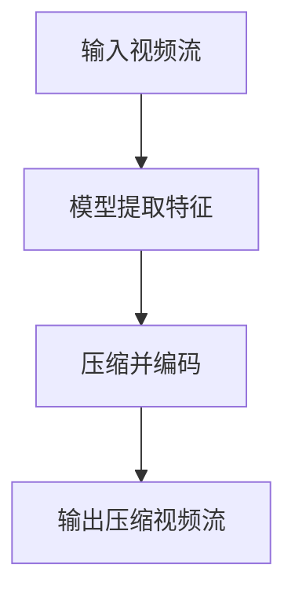
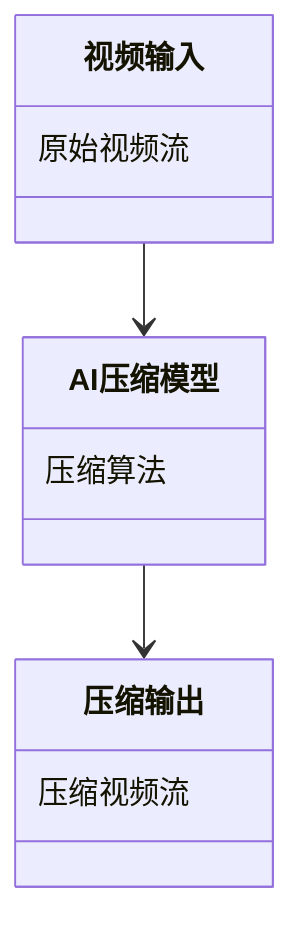
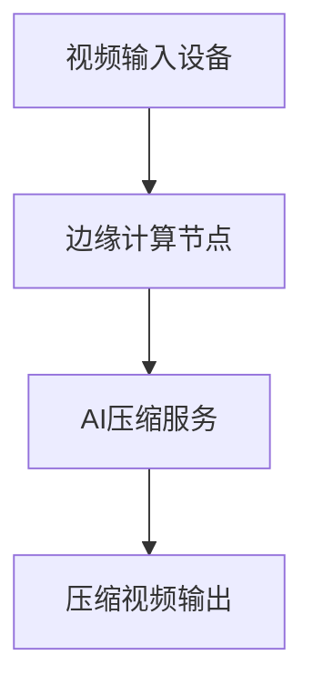
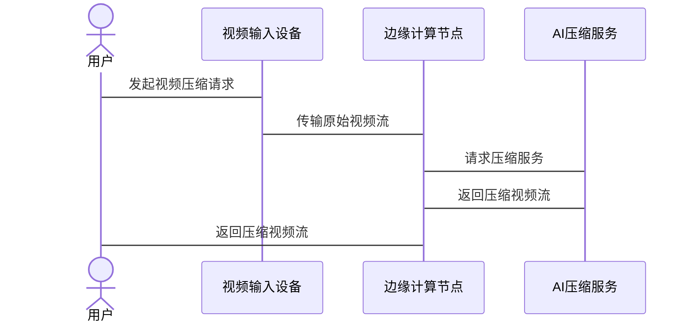

                 


# 如何识别企业的边缘AI视频压缩技术优势

---

## 关键词：边缘AI、视频压缩、边缘计算、人工智能、技术优势

---

## 摘要：  
边缘AI视频压缩技术是一种结合了人工智能与边缘计算的新兴技术，能够在边缘设备上高效地进行视频压缩，降低数据传输和存储成本。本文从背景、原理、算法、系统架构到实战应用，全面解析如何识别和利用企业的边缘AI视频压缩技术优势。

---

## 第1章：边缘AI视频压缩技术的背景与问题背景

### 1.1 边缘AI视频压缩技术的背景

#### 1.1.1 视频压缩技术的发展历程
视频压缩技术从MPEG-2到H.265，经历了数十年的发展，从单纯依赖硬件加速到结合AI算法优化，逐步向智能化方向演进。

#### 1.1.2 边缘计算的崛起与应用
边缘计算将数据处理从云端转移到靠近数据源的边缘设备，减少了延迟，提高了实时性。

#### 1.1.3 AI技术在视频压缩中的作用
AI算法通过深度学习模型优化压缩效率，降低计算复杂度，提升压缩比。

### 1.2 问题背景与问题描述

#### 1.2.1 视频压缩技术的挑战
- 数据量大，传输成本高。
- 传统压缩算法效率不足，难以应对实时性要求。

#### 1.2.2 边缘计算环境下的视频压缩需求
- 低延迟、高实时性的要求。
- 边缘设备资源有限，需优化计算效率。

#### 1.2.3 企业视频压缩技术的现状与痛点
- 传统压缩技术效率不足。
- 边缘计算环境下资源分配不均。

### 1.3 问题解决与技术优势

#### 1.3.1 边缘AI视频压缩的核心优势
- AI算法优化压缩效率，降低资源消耗。
- 边缘计算提升实时性和响应速度。

### 1.4 边界与外延

#### 1.4.1 边缘AI视频压缩的适用范围
适用于实时性要求高、数据量大的场景，如工业监控、自动驾驶等。

#### 1.4.2 技术边界与限制
- 边缘设备计算能力有限。
- AI模型训练需要大量数据支持。

---

## 第2章：边缘AI视频压缩技术的核心概念与联系

### 2.1 边缘AI视频压缩技术的核心原理

#### 2.1.1 AI在视频压缩中的作用
AI通过深度学习模型识别视频中的冗余信息，优化压缩效率。

### 2.2 核心概念的属性特征对比

| **技术特性** | **传统视频压缩** | **边缘AI视频压缩** |
|--------------|------------------|--------------------|
| 压缩效率     | 中等             | 高                 |
| 实时性       | 低               | 高                 |
| 计算资源     | 高               | 低                 |

#### 2.3 ER实体关系图
```mermaid
er
actor: 用户
edge: 边缘设备
model: AI压缩模型
```

---

## 第3章：边缘AI视频压缩技术的算法原理

### 3.1 算法原理概述

#### 3.1.1 基于AI的视频压缩算法
AI算法通过识别视频中的冗余信息，优化压缩过程。

#### 3.1.2 深度学习模型
使用卷积神经网络（CNN）提取视频特征，优化压缩效率。

#### 3.1.3 压缩过程
1. 输入视频流。
2. 模型提取特征。
3. 压缩并编码。
4. 输出压缩视频流。

### 3.2 算法流程图



### 3.3 数学模型与公式

#### 3.3.1 压缩率计算公式
$$ \text{压缩率} = \frac{\text{原始数据大小}}{\text{压缩后数据大小}} $$

#### 3.3.2 模型训练公式
$$ \text{损失函数} = \text{重构误差} + \lambda \times \text{正则化项} $$

### 3.4 代码实现示例

#### 3.4.1 Python代码实现

```python
import numpy as np
import tensorflow as tf

# 定义模型
model = tf.keras.Sequential([
    tf.keras.layers.Conv2D(64, (3,3), activation='relu', input_shape=(256, 256, 3)),
    tf.keras.layers.MaxPooling2D((2,2)),
    tf.keras.layers.Conv2D(128, (3,3), activation='relu'),
    tf.keras.layers.MaxPooling2D((2,2)),
    tf.keras.layers.Flatten(),
    tf.keras.layers.Dense(256, activation='relu'),
    tf.keras.layers.Dense(1, activation='sigmoid')
])

# 编译模型
model.compile(optimizer='adam', loss='binary_crossentropy', metrics=['accuracy'])
```

---

## 第4章：边缘AI视频压缩技术的系统分析与架构设计

### 4.1 问题场景介绍

#### 4.1.1 视频监控系统
在工业监控场景中，实时压缩和传输视频流，减少带宽占用。

### 4.2 系统功能设计

#### 4.2.1 领域模型


### 4.3 系统架构设计



### 4.4 系统接口设计



---

## 第5章：边缘AI视频压缩技术的项目实战

### 5.1 环境安装

```bash
pip install numpy tensorflow keras
```

### 5.2 系统核心实现源代码

#### 5.2.1 Python代码实现

```python
import numpy as np
import tensorflow as tf

# 模型训练
model = tf.keras.Sequential([
    tf.keras.layers.Conv2D(64, (3,3), activation='relu', input_shape=(256, 256, 3)),
    tf.keras.layers.MaxPooling2D((2,2)),
    tf.keras.layers.Conv2D(128, (3,3), activation='relu'),
    tf.keras.layers.MaxPooling2D((2,2)),
    tf.keras.layers.Flatten(),
    tf.keras.layers.Dense(256, activation='relu'),
    tf.keras.layers.Dense(1, activation='sigmoid')
])

model.compile(optimizer='adam', loss='binary_crossentropy', metrics=['accuracy'])

# 训练模型
model.fit(x_train, y_train, epochs=10, batch_size=32)
```

### 5.3 案例分析与详细解读

#### 5.3.1 工业监控案例
在工业监控中，使用边缘AI视频压缩技术实时压缩视频流，减少带宽占用，提升监控效率。

---

## 第6章：边缘AI视频压缩技术的总结与展望

### 6.1 总结

- 边缘AI视频压缩技术的优势：高效压缩、实时性高、资源消耗低。
- 未来发展方向：优化模型、提升压缩效率、扩展应用场景。

### 6.2 最佳实践Tips

- 确保边缘设备有足够的计算能力。
- 定期更新AI模型以提升压缩效率。
- 合理分配资源，优化系统架构。

---

## 作者：AI天才研究院 & 禅与计算机程序设计艺术

