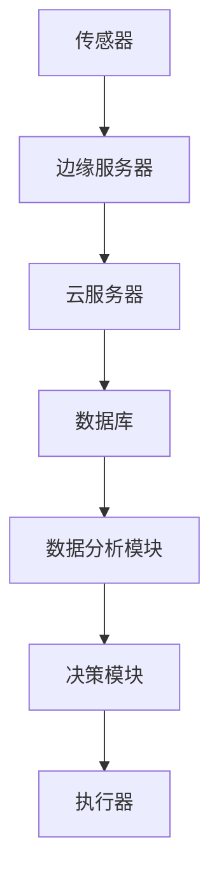
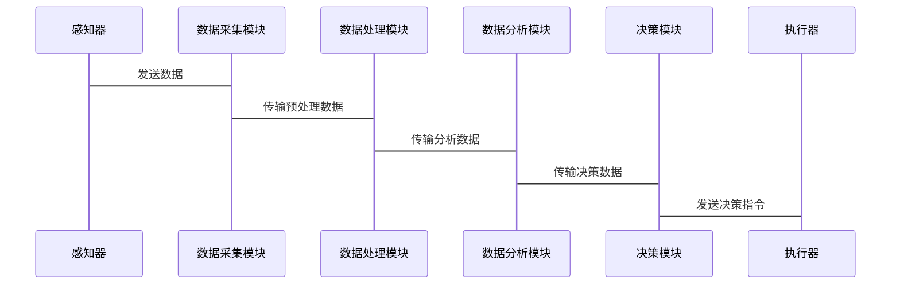

                 


# 如何识别企业的边缘计算实时决策系统优势

> 关键词：边缘计算、实时决策系统、企业优势、算法原理、系统架构

> 摘要：本文将深入探讨如何识别企业边缘计算实时决策系统的优势，涵盖边缘计算的基本概念、实时决策系统的核心要素、算法原理、系统架构设计、项目实战以及最佳实践等内容。通过详细的分析和实际案例，帮助读者理解如何在企业中有效应用边缘计算实时决策系统，以提升决策效率、降低延迟并增强数据隐私性。

---

# 第1章: 边缘计算与实时决策系统背景

## 1.1 边缘计算的基本概念

### 1.1.1 边缘计算的定义

边缘计算（Edge Computing）是一种分布式计算范式，强调将计算能力从传统的中心化云服务器迁移到数据产生的边缘端，如传感器、智能设备和本地服务器等。边缘计算的核心理念是“计算靠近数据源”，以减少延迟并提高数据处理效率。

### 1.1.2 边缘计算的核心特点

1. **分布式架构**：边缘计算通过将计算能力分布到边缘节点，减少对中心化服务器的依赖。
2. **低延迟**：数据在生成时即可进行处理和分析，减少数据传输到云端的时间。
3. **高实时性**：边缘计算能够快速响应实时事件，适用于需要实时决策的应用场景。
4. **数据隐私性**：通过在边缘端处理数据，可以减少敏感数据的传输和存储，提高数据安全性。

### 1.1.3 边缘计算与云计算的区别

边缘计算与云计算（Cloud Computing）有明显的区别。云计算将数据和计算集中在中心化服务器，而边缘计算则将计算能力分散到数据源的附近。边缘计算可以看作是对云计算的补充，二者结合可以实现更高效的数据处理。

---

## 1.2 实时决策系统的核心要素

### 1.2.1 实时决策系统的定义

实时决策系统是指能够在数据生成后立即进行分析和决策的系统。这类系统通常用于需要快速响应的场景，如工业自动化、交通管理、金融交易等领域。

### 1.2.2 实时决策系统的应用场景

1. **工业自动化**：实时监控生产线状态，快速响应故障。
2. **交通管理**：实时调整交通信号灯，优化交通流量。
3. **金融交易**：实时分析市场数据，快速做出交易决策。
4. **智能安防**：实时监控视频流，识别异常事件。

### 1.2.3 实时决策系统的性能要求

1. **低延迟**：数据处理和决策必须在极短的时间内完成。
2. **高可靠性**：系统必须能够稳定运行，确保决策的准确性。
3. **可扩展性**：系统应能够处理大规模数据和复杂场景。

---

## 1.3 企业边缘计算实时决策系统的优势

### 1.3.1 提高决策效率

通过在边缘端进行实时数据处理和分析，企业可以在更短的时间内做出决策，提高整体效率。

### 1.3.2 降低延迟

边缘计算将数据处理和决策过程移到靠近数据源的位置，减少了数据传输到云端的时间，从而降低延迟。

### 1.3.3 增强数据隐私性

边缘计算可以减少敏感数据的传输和存储，从而增强数据隐私性，保护企业的核心数据不被泄露。

---

## 1.4 本章小结

本章介绍了边缘计算的基本概念、实时决策系统的核心要素以及企业边缘计算实时决策系统的优势。通过这些内容，读者可以理解边缘计算和实时决策系统在企业中的重要性，以及它们如何为企业带来竞争优势。

---

# 第2章: 边缘计算实时决策系统的数学模型与算法原理

## 2.1 数据流处理模型

### 2.1.1 数据流的定义

数据流是指在系统中流动的数据，通常以连续的流形式存在。在边缘计算中，数据流可以是传感器传来的实时数据，也可以是其他设备产生的数据。

### 2.1.2 数据流的分类

1. **实时数据流**：数据生成后立即需要处理和分析。
2. **批量数据流**：数据积累到一定量后进行批量处理。
3. **事件驱动数据流**：数据生成后触发特定事件进行处理。

### 2.1.3 数据流的处理流程

1. **数据采集**：从传感器或其他设备获取数据。
2. **数据预处理**：对数据进行清洗、转换和标准化。
3. **数据分析**：对数据进行统计分析、机器学习模型训练等。
4. **决策输出**：根据分析结果生成决策指令。

---

## 2.2 实时决策系统的数学模型

### 2.2.1 数据预处理模型

$$ y = f(x) $$

其中，$x$ 表示原始数据，$y$ 表示预处理后的数据，$f$ 表示预处理函数。

### 2.2.2 数据分析模型

$$ z = g(y) $$

其中，$y$ 表示预处理后的数据，$z$ 表示分析结果，$g$ 表示分析函数。

### 2.2.3 决策模型

$$ d = h(z) $$

其中，$z$ 表示分析结果，$d$ 表示决策指令，$h$ 表示决策函数。

---

## 2.3 算法的实现步骤

### 2.3.1 数据采集

通过传感器或其他设备获取实时数据，例如：

$$ x = \{x_1, x_2, ..., x_n\} $$

其中，$x_i$ 表示第 $i$ 个数据点。

### 2.3.2 数据预处理

对原始数据进行清洗和转换，例如：

$$ y = \{y_1, y_2, ..., y_n\} $$

其中，$y_i = f(x_i)$，$f$ 表示预处理函数。

### 2.3.3 数据分析

使用机器学习模型对预处理后的数据进行分析，例如：

$$ z = g(y) $$

其中，$g$ 表示分析函数。

### 2.3.4 决策输出

根据分析结果生成决策指令，例如：

$$ d = h(z) $$

其中，$h$ 表示决策函数。

---

## 2.4 本章小结

本章详细介绍了边缘计算实时决策系统的数学模型和算法原理，包括数据流的处理流程、数据分析模型以及决策模型的实现步骤。通过这些内容，读者可以理解如何通过数学模型和算法实现实时决策。

---

# 第3章: 边缘计算实时决策系统的系统架构设计

## 3.1 系统架构概述

### 3.1.1 分层架构

边缘计算实时决策系统的典型架构分为三层：

1. **边缘设备层**：包括传感器、智能设备等，负责数据采集和初步处理。
2. **边缘计算层**：包括边缘服务器、网关等，负责数据的处理、分析和决策。
3. **云端层**：包括云服务器、数据库等，负责数据的存储、管理和分析。

### 3.1.2 系统功能设计

- 数据采集模块：负责从传感器或其他设备获取实时数据。
- 数据处理模块：对数据进行清洗、转换和标准化。
- 数据分析模块：对数据进行统计分析和机器学习模型训练。
- 决策模块：根据分析结果生成决策指令。

### 3.1.3 系统架构图



---

## 3.2 系统功能设计

### 3.2.1 数据采集模块

负责从传感器或其他设备获取实时数据，例如：

$$ x = \{x_1, x_2, ..., x_n\} $$

其中，$x_i$ 表示第 $i$ 个数据点。

### 3.2.2 数据处理模块

对原始数据进行清洗和转换，例如：

$$ y = \{y_1, y_2, ..., y_n\} $$

其中，$y_i = f(x_i)$，$f$ 表示预处理函数。

### 3.2.3 数据分析模块

使用机器学习模型对预处理后的数据进行分析，例如：

$$ z = g(y) $$

其中，$g$ 表示分析函数。

### 3.2.4 决策模块

根据分析结果生成决策指令，例如：

$$ d = h(z) $$

其中，$h$ 表示决策函数。

---

## 3.3 系统接口设计

### 3.3.1 数据采集接口

负责与传感器或其他设备进行数据交互，例如：

```python
def get_sensor_data():
    # 获取传感器数据
    return x
```

### 3.3.2 数据处理接口

对原始数据进行清洗和转换，例如：

```python
def preprocess_data(x):
    # 数据预处理
    return y
```

### 3.3.3 数据分析接口

使用机器学习模型对数据进行分析，例如：

```python
def analyze_data(y):
    # 数据分析
    return z
```

### 3.3.4 决策接口

根据分析结果生成决策指令，例如：

```python
def make_decision(z):
    # 生成决策指令
    return d
```

---

## 3.4 系统交互流程图



---

## 3.5 本章小结

本章详细介绍了边缘计算实时决策系统的系统架构设计，包括分层架构、系统功能设计、系统接口设计和系统交互流程图。通过这些内容，读者可以理解如何通过系统架构设计实现实时决策。

---

# 第4章: 边缘计算实时决策系统的项目实战

## 4.1 项目背景

### 4.1.1 项目目标

本项目旨在通过边缘计算技术实现一个实时决策系统，用于智能工厂的实时监控。

### 4.1.2 项目需求

1. 实时监控生产线状态。
2. 快速响应生产线故障。
3. 提高生产效率和产品质量。

---

## 4.2 环境安装

### 4.2.1 安装边缘计算框架

使用Kubernetes、Docker等工具搭建边缘计算环境。

### 4.2.2 安装实时决策系统

安装实时决策系统的软件和依赖库。

### 4.2.3 配置传感器和执行器

配置传感器和执行器的通信协议和接口。

---

## 4.3 核心代码实现

### 4.3.1 数据采集模块

```python
import serial

def get_sensor_data():
    ser = serial.Serial('COM1', 9600)
    data = ser.readline().decode()
    ser.close()
    return data
```

### 4.3.2 数据处理模块

```python
def preprocess_data(x):
    # 数据预处理
    y = x.strip().split(',')
    return y
```

### 4.3.3 数据分析模块

```python
from sklearn import tree

def analyze_data(y):
    # 数据分析
    clf = tree.DecisionTreeClassifier()
    clf.fit(X_train, y_train)
    return clf
```

### 4.3.4 决策模块

```python
def make_decision(z):
    # 生成决策指令
    if z > threshold:
        return '报警'
    else:
        return '正常'
```

---

## 4.4 项目小结

本章通过实际案例详细介绍了如何在智能工厂中应用边缘计算实时决策系统。通过环境安装和核心代码实现，读者可以理解如何将理论知识应用到实际项目中。

---

# 第5章: 边缘计算实时决策系统的最佳实践

## 5.1 小结

通过本文的介绍，读者可以理解如何识别企业边缘计算实时决策系统的优势，包括提高决策效率、降低延迟和增强数据隐私性等方面。

---

## 5.2 注意事项

1. 数据安全：在边缘计算中，必须重视数据隐私性，防止数据泄露。
2. 系统可靠性：确保系统能够稳定运行，避免因系统故障导致决策失误。
3. 系统可扩展性：随着业务发展，系统应能够扩展以处理更多的数据和更复杂的场景。

---

## 5.3 拓展阅读

1. 《边缘计算：原理与实践》
2. 《实时决策系统的算法优化》
3. 《分布式系统的设计与实现》

---

# 作者：AI天才研究院/AI Genius Institute & 禅与计算机程序设计艺术 /Zen And The Art of Computer Programming

