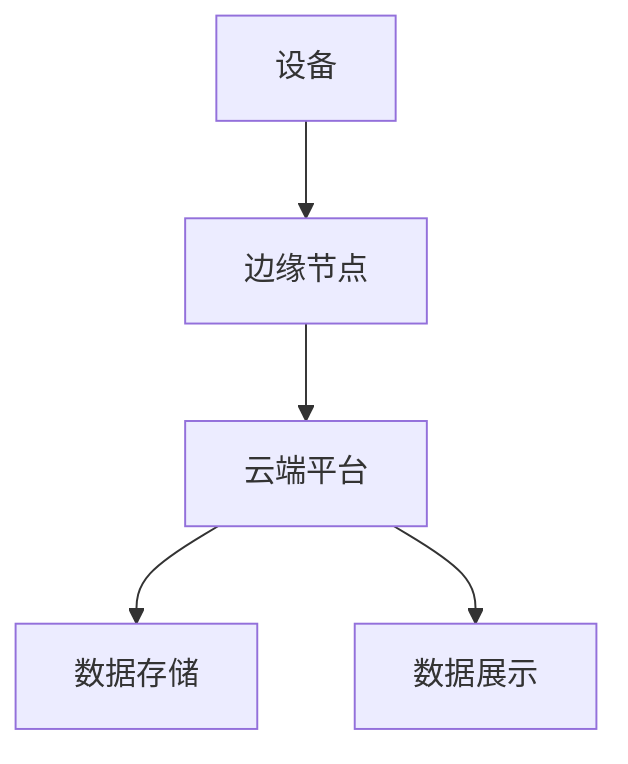
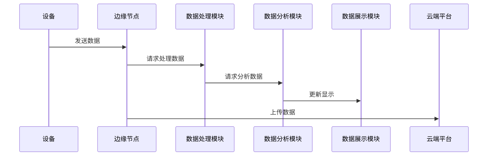

                 


# 如何识别企业的边缘计算实时数据分析优势

## 关键词：边缘计算、实时数据分析、企业优势、技术博客、系统架构

## 摘要：  
在当今快速发展的数字时代，边缘计算和实时数据分析正在成为企业竞争力的重要驱动力。边缘计算通过在数据源附近进行计算，减少延迟，提高数据处理效率，而实时数据分析则通过快速处理和洞察数据，帮助企业做出更明智的决策。本文将深入探讨如何识别企业在边缘计算实时数据分析中的优势，涵盖边缘计算的基本概念、实时数据分析的核心原理、算法与数学模型的详细解析，以及系统架构设计和项目实战等内容。通过本文，读者将能够全面理解边缘计算实时数据分析的优势，并掌握如何在实际项目中应用这些技术。

---

# 第一部分：边缘计算与实时数据分析的背景

## 第1章：边缘计算与实时数据分析的背景

### 1.1 边缘计算的基本概念

#### 1.1.1 边缘计算的定义  
边缘计算（Edge Computing）是指在靠近数据源的地方进行数据处理和计算的技术。与传统的云计算不同，边缘计算将数据处理的任务从云端转移到靠近数据生成的位置，如物联网设备、边缘服务器或网关。

#### 1.1.2 边缘计算的核心特点  
- **低延迟**：数据在生成后立即处理，减少网络传输时间。  
- **带宽优化**：通过在边缘处理数据，减少向云端传输的数据量。  
- **实时性**：能够快速响应和处理实时数据，适用于需要实时反馈的场景。  

#### 1.1.3 边缘计算与云计算的区别  
| 特性 | 边缘计算 | 云计算 |  
|------|----------|--------|  
| 数据处理位置 | 靠近数据源 | 云端 |  
| 延迟 | 低延迟 | 高延迟 |  
| 带宽占用 | 低 | 高 |  
| 适用场景 | 物联网、实时监控 | 数据存储、批量处理 |  

---

### 1.2 实时数据分析的定义与特点

#### 1.2.1 实时数据分析的定义  
实时数据分析是指对数据流进行实时处理和分析，以快速获取洞察和反馈的过程。与传统的批量数据分析不同，实时数据分析强调数据的实时性、连续性和动态性。

#### 1.2.2 实时数据分析的核心优势  
- **快速响应**：能够立即处理数据，提供实时反馈。  
- **动态适应**：能够根据数据变化快速调整分析策略。  
- **实时洞察**：帮助企业快速发现趋势和问题，做出及时决策。  

#### 1.2.3 实时数据分析的挑战  
- 数据量大：实时数据流通常是连续的，数据量大且变化快。  
- 数据质量：数据可能存在噪声、缺失或不一致的问题。  
- 处理复杂性：需要处理多种数据格式和多种分析任务。  

---

### 1.3 边缘计算与实时数据分析的结合

#### 1.3.1 边缘计算在实时数据分析中的作用  
边缘计算通过将数据处理任务迁移到边缘，减少了数据传输的延迟和带宽占用，同时提高了实时数据分析的效率。  

#### 1.3.2 边缘计算与实时数据分析的协同工作  
边缘计算提供数据处理的平台，实时数据分析则利用这些平台快速处理数据，提供实时洞察。两者结合能够实现高效、实时的数据处理和分析。  

#### 1.3.3 边缘计算实时数据分析的应用场景  
- **物联网**：实时监控和管理物联网设备。  
- **工业自动化**：实时分析工业设备数据，优化生产流程。  
- **智慧城市**：实时分析交通、环境等数据，优化城市管理。  

---

### 1.4 本章小结  
本章介绍了边缘计算和实时数据分析的基本概念、核心特点以及它们的结合方式。边缘计算通过在数据源附近进行计算，降低了延迟和带宽占用，而实时数据分析则通过快速处理数据，提供了实时洞察。两者结合为企业提供了高效、实时的数据处理能力。

---

# 第二部分：边缘计算实时数据分析的核心概念

## 第2章：边缘计算实时数据分析的核心原理

### 2.1 边缘计算的架构原理

#### 2.1.1 边缘计算的分层架构  
边缘计算的架构通常分为三层：  
1. **边缘设备层**：包括传感器、摄像头等数据生成设备。  
2. **边缘计算层**：包括边缘服务器、网关等数据处理设备。  
3. **云端层**：用于存储和分析边缘设备上传的数据。  

#### 2.1.2 边缘节点的功能与角色  
边缘节点是边缘计算的核心，负责数据的采集、处理和转发。边缘节点可以是边缘服务器、网关或其他边缘设备。  

#### 2.1.3 边缘计算的数据处理流程  
1. 数据采集：传感器或其他设备生成数据。  
2. 数据预处理：对数据进行清洗、转换和压缩。  
3. 数据分析：对数据进行实时分析，生成洞察。  
4. 数据存储：将数据存储在边缘节点或上传到云端。  

---

### 2.2 实时数据分析的算法原理

#### 2.2.1 流数据处理算法  
流数据处理算法用于实时处理数据流，常见的算法包括滑动窗口算法、基于队列的处理算法等。  

#### 2.2.2 实时数据分析的数学模型  
实时数据分析的数学模型通常用于预测、分类和聚类等任务。例如，时间序列分析模型可以用于预测未来的数据趋势。  

#### 2.2.3 实时数据分析的优化策略  
- 数据压缩：减少数据传输量。  
- 算法优化：通过优化算法提高处理速度。  
- 并行处理：利用多核处理器提高数据处理效率。  

---

### 2.3 边缘计算与实时数据分析的协同机制

#### 2.3.1 数据的实时传输与处理  
边缘节点将数据实时传输到云端或在本地进行处理，实现数据的实时分析。  

#### 2.3.2 边缘计算中的数据压缩与优化  
通过数据压缩和优化策略，减少数据传输量和存储空间占用。  

#### 2.3.3 边缘计算与云平台的交互机制  
边缘节点与云平台之间通过API或消息队列进行交互，实现数据的上传和指令的下达。  

---

### 2.4 本章小结  
本章详细介绍了边缘计算的架构原理和实时数据分析的算法原理。边缘计算通过分层架构实现了数据的高效处理，而实时数据分析通过流数据处理算法和数学模型实现了数据的快速分析。边缘计算与实时数据分析的协同机制进一步提高了数据处理的效率和实时性。

---

# 第三部分：边缘计算实时数据分析的算法与数学模型

## 第3章：边缘计算实时数据分析的算法原理

### 3.1 流数据处理算法

#### 3.1.1 流数据处理的基本概念  
流数据处理是指对连续的数据流进行实时处理，通常用于需要快速响应的场景。  

#### 3.1.2 基于滑动窗口的流数据处理算法  
滑动窗口算法用于处理一定时间范围内的数据流，例如，处理过去5分钟内的数据。  

#### 3.1.3 流数据处理的优化策略  
- 使用队列缓冲数据，避免数据丢失。  
- 通过多线程或异步处理提高数据处理效率。  

#### 3.1.4 滑动窗口算法实现代码  
```python
from collections import deque

def sliding_window(stream, window_size):
    window = deque(maxlen=window_size)
    for data in stream:
        window.append(data)
        if len(window) == window_size:
            process(window)
```

---

### 3.2 实时数据分析的数学模型

#### 3.2.1 时间序列分析模型  
时间序列分析模型用于预测未来的数据趋势，常用的模型包括ARIMA和LSTM。  

#### 3.2.2 基于滑动窗口的统计模型  
滑动窗口统计模型用于计算实时数据流的统计指标，例如均值、标准差等。  

#### 3.2.3 实时数据分析的数学公式  
时间序列预测公式：  
$$ y_{t} = a \cdot y_{t-1} + b \cdot y_{t-2} + \dots + c \cdot y_{t-n} $$  

---

### 3.3 边缘计算与实时数据分析的协同机制

#### 3.3.1 边缘节点与云端的协同处理  
边缘节点负责数据的预处理，云端负责数据的深度分析和存储。  

#### 3.3.2 边缘计算中的数据压缩与优化  
通过数据压缩算法（如Snappy）减少数据传输量。  

#### 3.3.3 边缘计算与云平台的交互机制  
通过API或消息队列实现边缘节点与云端的数据交互。  

---

### 3.4 本章小结  
本章详细介绍了边缘计算实时数据分析的算法原理和数学模型。流数据处理算法和时间序列分析模型是实时数据分析的核心工具，而边缘计算与实时数据分析的协同机制进一步提高了数据处理的效率和准确性。

---

## 第四章：系统分析与架构设计方案

### 4.1 项目介绍  
假设我们正在开发一个实时监控系统，用于监测工业设备的运行状态。  

### 4.2 系统功能设计  
- 数据采集模块：采集设备运行数据。  
- 数据处理模块：对数据进行实时处理和分析。  
- 数据存储模块：存储处理后的数据。  
- 数据展示模块：展示实时数据分析结果。  

### 4.3 系统架构设计  


### 4.4 系统接口设计  
- 边缘节点与设备的接口：UART、RS485等。  
- 边缘节点与云端的接口：HTTP、MQTT等。  

### 4.5 系统交互流程图  


---

## 第五章：项目实战

### 5.1 环境配置  
- 操作系统：Linux  
- 开发工具：Python、Jupyter Notebook  
- 硬件设备：树莓派、传感器  

### 5.2 系统核心实现源代码  
```python
import time

def main():
    while True:
        # 采集数据
        data = read_sensor()
        # 数据预处理
        processed_data = preprocess(data)
        # 数据分析
        result = analyze(processed_data)
        # 数据展示
        display(result)
        time.sleep(1)

if __name__ == "__main__":
    main()
```

### 5.3 代码解读与分析  
- `read_sensor()`：从传感器读取数据。  
- `preprocess()`：对数据进行清洗和转换。  
- `analyze()`：对数据进行实时分析，生成结果。  
- `display()`：将结果展示在界面上。  

### 5.4 案例分析与详细讲解  
通过实际案例分析，展示了如何利用边缘计算和实时数据分析技术实现工业设备的实时监控。  

---

## 第六章：最佳实践、小结、注意事项、拓展阅读

### 6.1 最佳实践  
- **数据压缩**：在边缘节点进行数据压缩，减少带宽占用。  
- **算法优化**：选择适合实时数据分析的算法，提高处理速度。  
- **系统架构**：合理设计系统架构，确保数据的高效处理和传输。  

### 6.2 小结  
通过本文的讲解，读者可以全面理解边缘计算实时数据分析的优势，并掌握如何在实际项目中应用这些技术。  

### 6.3 注意事项  
- **数据安全**：确保数据在传输和处理过程中的安全性。  
- **系统稳定性**：设计可靠的系统架构，避免数据丢失和处理失败。  
- **性能优化**：通过算法优化和系统设计提高数据处理效率。  

### 6.4 拓展阅读  
- 《边缘计算：原理与实践》  
- 《实时数据分析：算法与应用》  

---

## 作者：AI天才研究院/AI Genius Institute & 禅与计算机程序设计艺术/Zen And The Art of Computer Programming  

---

本文通过详细讲解边缘计算实时数据分析的核心概念、算法原理、系统架构设计和项目实战，帮助读者全面理解如何识别企业的边缘计算实时数据分析优势。希望本文能够为企业的技术决策者和开发人员提供有价值的参考和启发。

