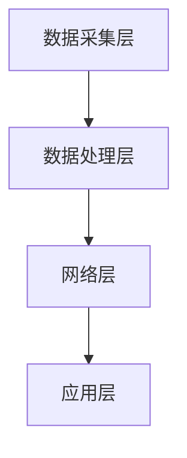
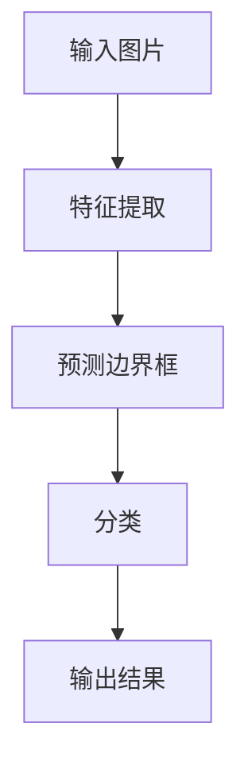
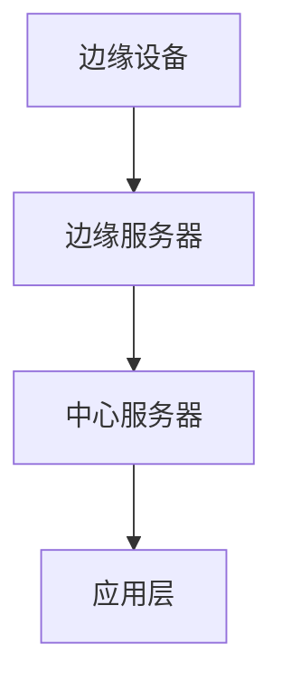

                 


# 如何识别企业的边缘计算实时视频分析优势

## 关键词：边缘计算、实时视频分析、目标检测、系统架构、算法优化

## 摘要：边缘计算在实时视频分析中的应用为企业带来了显著的优势，包括实时性、数据隐私保护和成本效益。本文详细探讨了边缘计算的核心概念、算法原理、系统架构设计以及项目实战，帮助企业识别和利用这些优势。

---

# 第一部分: 边缘计算与实时视频分析概述

## 第1章: 边缘计算与实时视频分析的背景

### 1.1 边缘计算的基本概念
#### 1.1.1 边缘计算的定义
边缘计算是一种分布式计算范式，将数据处理和计算任务从中心服务器转移到靠近数据源的边缘设备上。它强调实时性、低延迟和本地化处理。

#### 1.1.2 边缘计算的核心特点
- **分布式架构**：数据在边缘设备上进行处理，减少对中心服务器的依赖。
- **低延迟**：边缘计算能够快速响应，适用于实时性要求高的场景。
- **隐私保护**：数据在本地处理，减少了数据传输过程中的隐私泄露风险。

#### 1.1.3 边缘计算与云计算的区别
| 特性         | 边缘计算                | 云计算                  |
|--------------|------------------------|------------------------|
| 数据处理位置 | 边缘设备                | 中心服务器              |
| 延迟          | 低延迟                 | 较高延迟               |
| 网络依赖      | 边缘设备依赖本地网络     | 依赖高速网络            |
| 应用场景      | 实时监控、物联网等       | 大数据分析、存储等       |

### 1.2 实时视频分析的定义与特点
#### 1.2.1 实时视频分析的定义
实时视频分析是指在视频流生成的同时对其进行处理和分析，以提取有用的信息，如目标检测、行为识别等。

#### 1.2.2 实时视频分析的核心技术
- **视频采集**：通过摄像头或其他传感器获取视频流。
- **视频处理**：包括视频压缩、编码和解码。
- **目标检测**：识别视频中的目标物体，如人脸、车辆等。
- **行为识别**：分析视频中的行为模式，如异常行为检测。

#### 1.2.3 实时视频分析的应用场景
- **智能监控**：用于商场、车站等公共场所的安全监控。
- **工业检测**：用于工厂生产线的实时质量检测。
- **自动驾驶**：用于车辆对周围环境的实时感知。

### 1.3 边缘计算在实时视频分析中的优势
#### 1.3.1 边缘计算的实时性优势
边缘计算能够在本地快速处理视频数据，减少延迟，提高实时响应能力。

#### 1.3.2 边缘计算的数据隐私优势
通过在边缘设备上进行数据处理，减少了敏感数据传输到云端的可能性，提升了数据隐私保护。

#### 1.3.3 边缘计算的成本优势
边缘计算减少了对云端资源的依赖，降低了带宽和计算资源的消耗，从而降低了成本。

### 1.4 本章小结
本章介绍了边缘计算和实时视频分析的基本概念、特点及其应用场景，并分析了边缘计算在实时视频分析中的优势。

---

## 第2章: 边缘计算与实时视频分析的核心概念

### 2.1 边缘计算的体系结构
#### 2.1.1 边缘计算的分层架构
边缘计算的分层架构包括数据采集层、数据处理层、网络层和应用层。



#### 2.1.2 边缘计算的节点类型
- **边缘设备**：如摄像头、传感器等，负责数据的采集和初步处理。
- **边缘服务器**：用于处理和存储边缘设备上传的数据。
- **中心服务器**：用于全局管理和协调边缘设备的计算任务。

#### 2.1.3 边缘计算的通信机制
边缘计算的通信机制包括设备间的直接通信和设备与云端的通信。

### 2.2 实时视频分析的算法流程
#### 2.2.1 视频采集与预处理
视频采集包括通过摄像头获取视频流，预处理包括去噪、调整亮度等。

#### 2.2.2 视频特征提取
特征提取是将视频转换为可以被算法处理的特征向量。

#### 2.2.3 视频目标检测与识别
目标检测算法（如YOLO）用于识别视频中的目标物体，并进行分类。

### 2.3 边缘计算与实时视频分析的结合
#### 2.3.1 边缘计算在视频分析中的角色
边缘计算在视频分析中负责数据的本地处理和实时响应。

#### 2.3.2 边缘计算与实时视频分析的协同工作
边缘设备与云端服务器协同工作，实现数据的实时处理和全局管理。

#### 2.3.3 边缘计算在实时视频分析中的优化策略
通过算法优化和硬件加速提升视频分析的效率和准确性。

### 2.4 本章小结
本章详细介绍了边缘计算的体系结构、节点类型和通信机制，以及实时视频分析的算法流程和边缘计算在其中的作用。

---

## 第3章: 边缘计算与实时视频分析的核心算法

### 3.1 目标检测算法
#### 3.1.1 YOLO算法介绍
YOLO（You Only Look Once）是一种单-shot目标检测算法，以其高效性和准确性著称。

#### 3.1.2 YOLO算法的实现流程
YOLO的实现流程包括图片输入、特征提取、预测边界框和分类。



#### 3.1.3 YOLO算法的优缺点分析
- **优点**：速度快、精度高。
- **缺点**：对于小目标检测效果较差。

### 3.2 视频流处理算法
#### 3.2.1 基于边缘计算的视频流处理框架
视频流处理框架包括数据采集、预处理、目标检测和结果展示。

#### 3.2.2 视频流处理的关键算法实现
使用YOLO算法进行目标检测，结合边缘计算进行实时处理。

#### 3.2.3 视频流处理的性能优化
通过算法优化和硬件加速提升视频流处理的效率。

### 3.3 边缘计算中的实时视频分析优化
#### 3.3.1 算法加速技术
使用GPU加速提升目标检测的效率。

#### 3.3.2 算法模型轻量化设计
通过模型剪枝和量化技术减少模型的计算量。

#### 3.3.3 算法模型的动态调整
根据实时数据流量动态调整模型参数，提高适应性。

### 3.4 本章小结
本章详细讲解了YOLO算法的实现流程及其优缺点，介绍了视频流处理的关键算法和优化策略。

---

## 第4章: 边缘计算与实时视频分析的系统架构设计

### 4.1 系统架构概述
#### 4.1.1 边缘计算实时视频分析系统的组成
系统包括边缘设备、边缘服务器和中心服务器。

#### 4.1.2 系统的分层架构设计
分层架构包括数据采集层、数据处理层和应用层。

#### 4.1.3 系统的模块划分
系统模块包括视频采集模块、数据处理模块、智能分析模块和结果展示模块。

### 4.2 系统功能设计
#### 4.2.1 视频采集模块
负责采集视频流并进行预处理。

#### 4.2.2 数据处理模块
对视频流进行特征提取和目标检测。

#### 4.2.3 智能分析模块
根据目标检测结果进行行为识别和异常检测。

#### 4.2.4 结果展示模块
将分析结果展示给用户。

### 4.3 系统架构实现
#### 4.3.1 基于边缘计算的实时视频分析架构


#### 4.3.2 系统的通信协议设计
使用MQTT协议进行边缘设备与服务器之间的通信。

#### 4.3.3 系统的容错与恢复机制
通过冗余设计和自动切换实现系统的高可用性。

### 4.4 本章小结
本章详细介绍了边缘计算实时视频分析系统的组成、功能设计和架构实现。

---

## 第5章: 项目实战

### 5.1 环境安装
#### 5.1.1 安装Python和相关库
安装Python 3.8及以上版本，安装深度学习框架（如TensorFlow、PyTorch）和目标检测库（如YOLOv5）。

#### 5.1.2 安装视频流处理库
安装OpenCV、Flask等库。

### 5.2 系统核心实现
#### 5.2.1 视频采集模块实现
使用OpenCV进行视频流采集。

#### 5.2.2 数据处理模块实现
使用YOLOv5进行目标检测。

#### 5.2.3 结果展示模块实现
使用Flask搭建Web界面展示分析结果。

### 5.3 代码实现
#### 5.3.1 视频流采集代码
```python
import cv2

cap = cv2.VideoCapture(0)
while cap.isOpened():
    ret, frame = cap.read()
    cv2.imshow('frame', frame)
    if cv2.waitKey(1) & 0xFF == ord('q'):
        break
cap.release()
cv2.destroyAllWindows()
```

#### 5.3.2 目标检测代码
```python
from ultralytics import YOLO

model = YOLO('yolov5n.pt')
results = model.predict(source='0', show=True, save=True)
```

#### 5.3.3 结果展示代码
```python
from flask import Flask, Response
import cv2

app = Flask(__name__)

def gen_frames():
    cap = cv2.VideoCapture(0)
    while True:
        ret, frame = cap.read()
        if not ret:
            break
        yield (b'--frame\r\n'
               b'Content-Type: image/jpeg\r\n\r\n'
               + bytes(cv2.imencode('.jpg', frame)[1])
               + b'\r\n')

@app.route('/')
def index():
    return '<h1>实时视频分析</h1>'

@app.route('/video_feed')
def video_feed():
    return Response(gen_frames(), mimetype='multipart/x-mixed-replace; boundary=frame')

if __name__ == '__main__':
    app.run(debug=True)
```

### 5.4 案例分析
#### 5.4.1 案例背景
以商场安全监控为例，部署边缘计算实时视频分析系统进行人脸识别和行为识别。

#### 5.4.2 实施过程
部署边缘设备采集视频流，使用YOLOv5进行目标检测，通过Flask展示分析结果。

#### 5.4.3 分析结果
系统能够实时检测商场内的异常行为，并及时发出警报。

### 5.5 本章小结
本章通过实际案例展示了边缘计算实时视频分析系统的实施过程和效果。

---

## 第6章: 最佳实践与注意事项

### 6.1 最佳实践
#### 6.1.1 算法优化
选择适合的算法模型，进行模型剪枝和量化。

#### 6.1.2 数据隐私保护
在边缘设备上进行数据处理，减少数据传输到云端的风险。

#### 6.1.3 系统容错设计
通过冗余设计和自动切换实现系统的高可用性。

### 6.2 注意事项
#### 6.2.1 算法性能
目标检测算法的性能直接影响系统的实时性和准确性。

#### 6.2.2 硬件资源
边缘设备的计算能力和网络带宽影响系统的性能。

#### 6.2.3 数据安全
数据隐私保护是系统设计中的重要考虑因素。

### 6.3 小结
本章总结了边缘计算实时视频分析系统实施中的最佳实践和注意事项。

---

## 作者：AI天才研究院/AI Genius Institute & 禅与计算机程序设计艺术 /Zen And The Art of Computer Programming

---

以上是《如何识别企业的边缘计算实时视频分析优势》的技术博客文章的完整目录和内容大纲。

