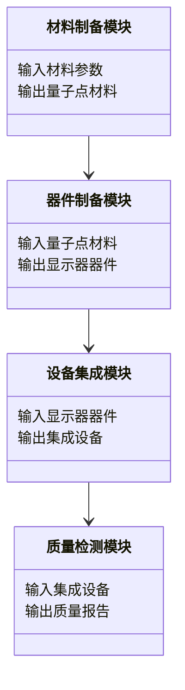
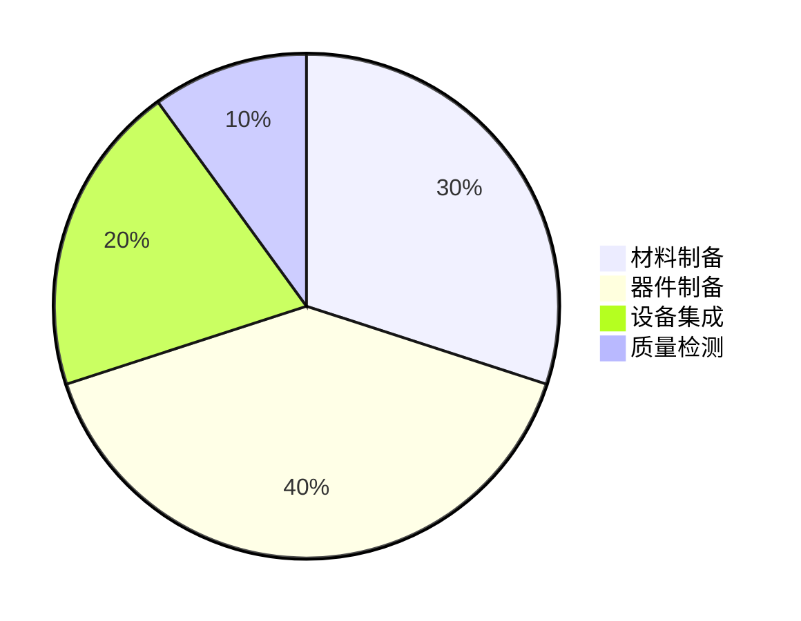
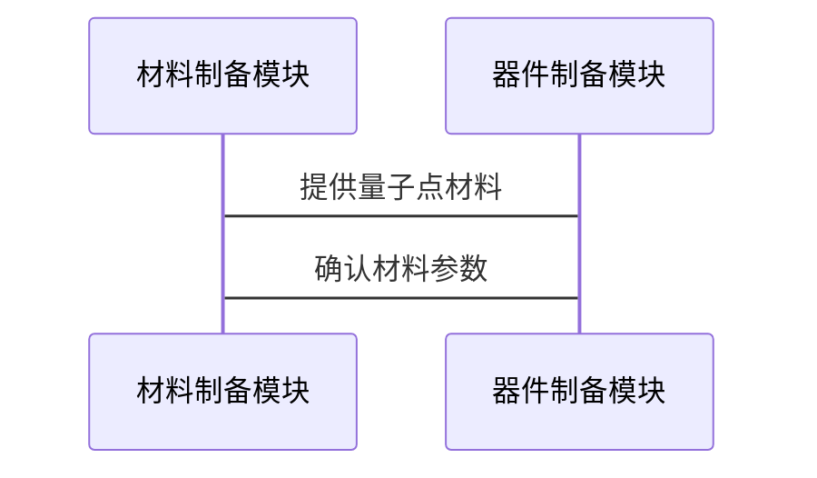

                 


# 如何识别企业的量子点显示器柔性制造技术优势

## 关键词：量子点显示器，柔性制造，技术优势，企业识别，制造技术

## 摘要：本文详细探讨了如何识别企业在量子点显示器柔性制造技术方面的优势。通过分析量子点材料的特性、柔性制造技术的核心概念、相关算法原理以及系统架构设计方案，本文为企业提供了一套识别和评估量子点显示器柔性制造技术优势的方法。文章还结合实际案例，展示了如何在项目中应用这些技术，并提出了相关的最佳实践建议。

---

## 第1章 量子点显示器与柔性制造技术概述

### 1.1 量子点显示器的基本概念
#### 1.1.1 量子点材料的定义与特性
量子点是一种纳米级半导体材料，其发光特性依赖于其尺寸和形状。量子点材料具有高色纯度、高亮度和广色域等特点，能够提供更逼真的色彩表现。

#### 1.1.2 柔性制造技术的定义与特点
柔性制造技术是一种基于高度灵活和自动化的生产方式，能够适应不同产品规格和生产需求。其特点包括高效率、高精度和灵活性。

#### 1.1.3 量子点显示器与柔性制造的结合
将量子点材料应用于柔性显示器的制造，能够实现轻薄、可弯曲和高分辨率的显示效果，满足市场对高性能显示产品的需求。

### 1.2 量子点显示器的优势
#### 1.2.1 高色域与高亮度
量子点材料能够实现接近100%的NTSC色域，提供更丰富的色彩表现。

#### 1.2.2 轻薄与可弯曲特性
柔性制造技术使得显示器可以制成极薄且可弯曲的形式，适用于多种应用场景。

#### 1.2.3 高分辨率与低能耗
量子点显示器具有高分辨率和低能耗的特点，适合用于便携式设备和物联网终端。

### 1.3 柔性制造技术在显示器制造中的应用
#### 1.3.1 柔性制造技术的基本原理
柔性制造技术通过自动化设备和灵活的生产流程，实现高精度和高效率的生产。

#### 1.3.2 柔性制造技术在显示器制造中的具体应用
在量子点显示器的制造中，柔性制造技术用于材料制备、器件制备和设备集成等关键环节。

#### 1.3.3 柔性制造技术的优势与挑战
优势包括高效率、高精度和灵活性；挑战包括技术复杂性和成本问题。

### 1.4 量子点显示器柔性制造技术的市场前景
#### 1.4.1 市场需求分析
随着柔性显示技术的成熟，市场对量子点显示器的需求逐渐增长。

#### 1.4.2 技术发展趋势
量子点材料和柔性制造技术的结合将成为未来显示技术的重要发展方向。

#### 1.4.3 企业竞争优势分析
掌握量子点显示器柔性制造技术的企业将在市场竞争中占据优势地位。

### 1.5 本章小结
本章介绍了量子点显示器和柔性制造技术的基本概念，分析了其优势和市场前景，为企业识别技术优势提供了基础。

---

## 第2章 量子点材料的特性与制造技术

### 2.1 量子点材料的物理化学性质
#### 2.1.1 量子点的发光原理
量子点的发光原理基于其电子结构，通过吸收光能后发出特定波长的光。

#### 2.1.2 量子点的尺寸效应
量子点的发光颜色可以通过调节其尺寸和形状来实现。

#### 2.1.3 量子点的稳定性与寿命
量子点材料具有较长的寿命和较高的稳定性，适合用于显示器制造。

### 2.2 柔性制造技术的关键环节
#### 2.2.1 材料制备技术
量子点材料的制备过程包括合成、纯化和表征等步骤。

#### 2.2.2 器件制备技术
量子点显示器的制备涉及薄膜沉积、器件封装等关键工艺。

#### 2.2.3 设备集成技术
将量子点显示器与其他设备集成，实现功能多样化。

### 2.3 量子点材料与柔性制造技术的协同作用
#### 2.3.1 量子点材料在柔性显示器中的应用
量子点材料用于柔性显示器的发光层，提供高色域和高亮度。

#### 2.3.2 柔性制造技术对量子点材料性能的影响
柔性制造技术能够优化量子点材料的均匀性和一致性。

#### 2.3.3 量子点显示器柔性制造技术的优化策略
通过优化材料制备和器件制备工艺，提升显示器的性能和可靠性。

### 2.4 核心概念对比分析
#### 2.4.1 量子点材料与传统显示材料的对比
量子点材料具有更高的色纯度和更广的色域。

#### 2.4.2 柔性制造技术与传统制造技术的对比
柔性制造技术具有更高的灵活性和效率。

#### 2.4.3 量子点显示器柔性制造技术与其他显示技术的对比
量子点显示器柔性制造技术在性能和应用方面具有独特优势。

### 2.5 本章小结
本章详细分析了量子点材料的特性及其与柔性制造技术的协同作用，为企业识别技术优势提供了关键信息。

---

## 第3章 量子点显示器柔性制造技术的数学模型与算法

### 3.1 量子点材料的光学特性模型
#### 3.1.1 量子点材料的发光效率模型
发光效率与量子点材料的尺寸、浓度和表面修饰等因素有关。

#### 3.1.2 量子点材料的色域覆盖模型
色域覆盖范围与量子点材料的发光波长分布有关。

#### 3.1.3 量子点材料的寿命预测模型
材料寿命受到外界环境和制备工艺的影响。

### 3.2 柔性制造技术的工艺优化算法
#### 3.2.1 基于机器学习的工艺参数优化算法
通过机器学习算法优化材料制备和器件制备的工艺参数。

#### 3.2.2 基于遗传算法的工艺优化
使用遗传算法对制备工艺进行全局优化。

#### 3.2.3 基于模糊逻辑的工艺优化
利用模糊逻辑处理工艺优化中的不确定性问题。

### 3.3 数学公式
#### 3.3.1 量子点材料的发光效率公式
$$ I = I_0 \cdot e^{-\frac{t}{\tau}} $$

#### 3.3.2 量子点材料的色域覆盖公式
$$ C = \frac{I_{max} - I_{min}}{I_{total}} $$

#### 3.3.3 量子点材料的寿命预测公式
$$ L = L_0 \cdot e^{-\frac{E}{kT}} $$

### 3.4 本章小结
本章通过数学模型和算法分析，为企业优化量子点显示器柔性制造技术提供了理论依据。

---

## 第4章 量子点显示器柔性制造技术的系统架构设计方案

### 4.1 量子点显示器柔性制造系统的功能设计
#### 4.1.1 系统功能模块划分
材料制备模块、器件制备模块、设备集成模块和质量检测模块。

#### 4.1.2 领域模型类图


### 4.2 系统架构设计
#### 4.2.1 系统架构图


### 4.3 系统接口设计
#### 4.3.1 系统接口描述
材料制备模块与器件制备模块通过标准接口进行数据交换。

### 4.4 系统交互设计
#### 4.4.1 系统交互序列图


### 4.5 本章小结
本章通过系统架构设计，为企业实现量子点显示器柔性制造技术提供了具体的实施路径。

---

## 第5章 量子点显示器柔性制造技术的项目实战

### 5.1 项目环境安装
#### 5.1.1 系统需求
操作系统：Linux Ubuntu 20.04及以上版本
开发工具：Python 3.8及以上版本，Mermaid工具，Git版本控制

### 5.2 核心代码实现
#### 5.2.1 材料制备模块代码
```python
def prepare_material(parameters):
    # 材料制备过程
    return material
```

#### 5.2.2 器件制备模块代码
```python
def prepare_device(material):
    # 器件制备过程
    return device
```

### 5.3 代码应用解读与分析
#### 5.3.1 代码功能分析
材料制备模块和器件制备模块通过接口进行数据交互，实现显示器的制造过程。

### 5.4 实际案例分析
#### 5.4.1 案例介绍
某企业通过实施量子点显示器柔性制造技术，实现了高效率和高精度的生产。

#### 5.4.2 案例分析
案例分析表明，量子点显示器柔性制造技术能够显著提升企业竞争力。

### 5.5 本章小结
本章通过项目实战，展示了如何在实际应用中实现量子点显示器柔性制造技术。

---

## 第6章 最佳实践、小结、注意事项与拓展阅读

### 6.1 最佳实践
#### 6.1.1 技术选择
企业应根据自身需求选择合适的量子点显示器柔性制造技术。

#### 6.1.2 项目管理
合理规划项目进度和资源分配，确保项目顺利实施。

### 6.2 小结
本文详细探讨了如何识别企业在量子点显示器柔性制造技术方面的优势，为企业提供了理论和实践上的指导。

### 6.3 注意事项
企业在实施量子点显示器柔性制造技术时，应注重技术创新和成本控制。

### 6.4 拓展阅读
建议读者进一步阅读相关领域的学术论文和行业报告，深入了解量子点显示器柔性制造技术的最新发展。

---

## 作者：AI天才研究院/AI Genius Institute & 禅与计算机程序设计艺术 /Zen And The Art of Computer Programming

---

感谢您的阅读！如果对内容有疑问或需要进一步探讨，请随时联系我。

