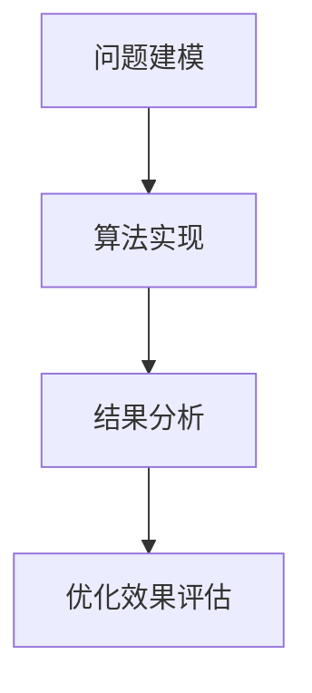

                 


# 如何识别企业的量子计算优化算法优势

> 关键词：量子计算，优化算法，企业应用，系统架构，项目实战

> 摘要：本文将详细探讨如何识别企业在量子计算优化算法方面的优势，涵盖量子计算的基本概念、优化算法的核心原理、企业中的应用场景、系统架构设计以及实际项目案例分析。通过本文，读者将能够理解量子计算优化算法的优势，并学会如何在企业中识别和应用这些算法。

---

## 第1章: 量子计算优化算法概述

### 1.1 量子计算的基本概念

#### 1.1.1 量子计算的定义与特点

量子计算是一种利用量子力学原理进行计算的新型计算方式。与经典计算不同，量子计算使用量子位（qubit）来表示信息，能够利用量子叠加和量子纠缠等特性进行并行计算。量子计算的特点包括：

- **量子叠加**：量子位可以同时处于多个状态的叠加态。
- **量子纠缠**：多个量子位之间可以形成纠缠态，一个量子位的状态会直接影响另一个量子位的状态。
- **量子测量**：测量会破坏量子态，导致量子态坍缩为一个确定的状态。

#### 1.1.2 量子计算与经典计算的区别

经典计算使用的是二进制位（bit），每个位只能是0或1。而量子计算使用的是量子位（qubit），可以同时表示多个状态。这种差异使得量子计算在某些特定问题上具有显著的计算优势。

#### 1.1.3 量子计算在优化算法中的应用潜力

优化问题是企业在运营中常见的问题，如供应链优化、资源分配、金融投资组合优化等。量子计算在这些问题中具有潜力，因为它可以在更短的时间内找到更优的解。

---

### 1.2 优化算法的基本原理

#### 1.2.1 经典优化算法的概述

经典优化算法包括贪心算法、动态规划、模拟退火、遗传算法等。这些算法通过逐步逼近的方式寻找最优解，但在处理复杂问题时，计算时间可能会非常长。

#### 1.2.2 量子优化算法的优势

量子优化算法利用量子叠加和量子退火等特性，能够在更短的时间内找到更优的解。例如，量子退火算法可以在处理NP难问题时显著减少计算时间。

---

## 第2章: 量子计算优化算法的核心概念与原理

### 2.1 量子退火算法

#### 2.1.1 量子退火的定义与特点

量子退火是一种基于量子叠加和量子退火原理的优化算法。它通过逐步降低温度来减少量子态的混乱程度，最终找到最优解。

#### 2.1.2 量子退火的数学模型

量子退火的数学模型可以表示为：

$$
E = \sum_{i=1}^{n} w_{i} x_{i}
$$

其中，\(E\) 是目标函数，\(w_{i}\) 是权重，\(x_{i}\) 是变量。

#### 2.1.3 量子退火与经典退火的区别

量子退火与经典退火的主要区别在于，量子退火利用了量子叠加特性，可以在多个状态之间同时进行搜索，而经典退火只能逐个状态进行搜索。

---

### 2.2 量子模拟退火算法

#### 2.2.1 量子模拟退火的定义与特点

量子模拟退火是一种结合了量子叠加和模拟退火原理的优化算法。它通过模拟量子态的演化过程来寻找最优解。

#### 2.2.2 量子模拟退火的实现步骤

1. 初始化量子态。
2. 进行量子态的演化。
3. 测量最终的量子态，得到最优解。

---

## 第3章: 企业中的量子计算优化算法应用

### 3.1 优化算法在企业中的应用场景

#### 3.1.1 供应链优化

供应链优化是企业常见的问题之一，量子计算可以通过优化物流路径来降低成本。

#### 3.1.2 资源分配优化

资源分配优化，如人力资源分配、设备分配等，可以通过量子计算优化算法来提高效率。

#### 3.1.3 金融投资组合优化

金融投资组合优化是量子计算在金融领域的典型应用，可以通过量子计算找到最优的投资组合。

---

### 3.2 识别量子计算优化算法优势的方法

#### 3.2.1 分析企业问题类型

识别企业中的问题类型，确定哪些问题可以通过量子计算优化算法来解决。

#### 3.2.2 评估量子计算的优势

评估量子计算在特定问题上的优势，如计算速度、优化效果等。

#### 3.2.3 比较经典算法与量子算法的性能

通过比较经典算法与量子算法在特定问题上的性能，确定量子算法的优势。

---

## 第4章: 量子计算优化算法的系统架构设计

### 4.1 系统架构设计的核心要素

#### 4.1.1 问题建模

将企业的优化问题转化为量子计算可以处理的形式。

#### 4.1.2 算法实现

实现量子计算优化算法，包括量子退火、量子模拟退火等。

#### 4.1.3 结果分析

对量子算法的结果进行分析，评估其优化效果。

---

### 4.2 优化算法的系统架构图



---

## 第5章: 项目实战

### 5.1 量子计算优化算法的环境配置

#### 5.1.1 安装必要的库

安装量子计算相关的库，如Qiskit、Cirq等。

#### 5.1.2 配置量子计算环境

配置量子计算环境，包括量子计算机的连接、量子位的设置等。

---

### 5.2 量子计算优化算法的代码实现

#### 5.2.1 量子退火算法的Python代码实现

```python
import numpy as np

def quantum_sannealing(objective_func, initial_state, max_iterations):
    current_state = initial_state
    current_energy = objective_func(current_state)
    
    for _ in range(max_iterations):
        # 计算相邻状态
        neighbor_states = generate_neighbor_states(current_state)
        # 计算相邻状态的能量
        neighbor_energies = [objective_func(state) for state in neighbor_states]
        # 选择能量最低的状态
        min_energy = min(neighbor_energies)
        if min_energy < current_energy:
            current_energy = min_energy
            current_state = neighbor_states[neighbor_energies.index(min_energy)]
    
    return current_state, current_energy
```

#### 5.2.2 代码实现的解读与分析

上述代码实现了一个简单的量子退火算法，通过逐步降低能量来寻找最优解。需要注意的是，这只是一个示例，实际的量子退火算法可能需要更复杂的实现。

---

### 5.3 量子计算优化算法的实际案例分析

#### 5.3.1 案例背景

以物流路径优化为例，通过量子计算优化算法找到最优的物流路径，降低运输成本。

#### 5.3.2 案例分析

通过对物流路径的建模和优化，应用量子退火算法找到最优的配送路线。

---

## 第6章: 总结与展望

### 6.1 总结

通过本文的分析，我们可以看到量子计算优化算法在企业中的应用潜力。量子计算的优势在于其并行计算能力和优化算法的高效性。

### 6.2 展望

未来，随着量子计算技术的不断发展，量子优化算法将在更多领域得到应用，企业需要积极识别和利用这些优势。

---

## 作者信息

作者：AI天才研究院/AI Genius Institute & 禅与计算机程序设计艺术 /Zen And The Art of Computer Programming

---

通过以上步骤，我们可以系统地识别和应用企业的量子计算优化算法优势，从而在实际应用中取得更好的效果。

