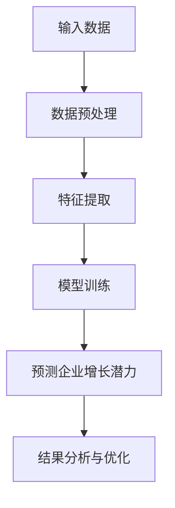
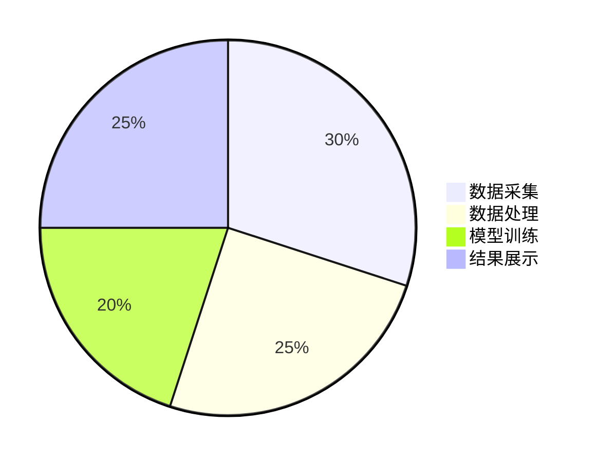
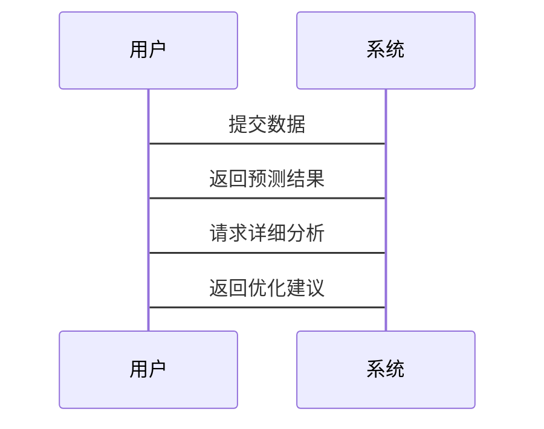

                 


# 如何识别企业的长期增长潜力

> 关键词：企业增长潜力、长期增长、数据分析、战略规划、风险管理、财务指标、市场趋势

> 摘要：本文将深入探讨如何识别企业的长期增长潜力，从背景介绍、核心概念、算法原理、数学模型、系统架构到项目实战和最佳实践，全面分析企业增长的关键因素和评估方法，帮助读者制定有效策略，实现企业的可持续发展。

---

## 第1章：企业长期增长潜力的背景介绍

### 1.1 问题背景
- 1.1.1 经济环境对企业增长的影响
- 1.1.2 行业竞争加剧的挑战
- 1.1.3 企业可持续发展的需求

### 1.2 问题描述
- 1.2.1 企业增长潜力的核心要素
- 1.2.2 企业内外部环境的复杂性
- 1.2.3 企业增长潜力的多维度分析

### 1.3 问题解决方法
- 1.3.1 识别企业增长潜力的关键指标
- 1.3.2 利用数据分析工具进行预测
- 1.3.3 结合战略规划制定增长策略

### 1.4 边界与外延
- 1.4.1 企业增长潜力的适用范围
- 1.4.2 相关概念的区分与联系
- 1.4.3 企业增长潜力的长期性与短期性

### 1.5 核心概念结构与要素
- 1.5.1 核心概念的层次结构
- 1.5.2 核心要素的定义与特征
- 1.5.3 核心概念的系统性分析

---

## 第2章：企业增长潜力的核心概念

### 2.1 核心概念的原理
- 2.1.1 企业增长潜力的定义与内涵
- 2.1.2 核心驱动因素的分析
- 2.1.3 关键成功要素的识别

### 2.2 核心概念的属性特征对比
- 2.2.1 企业规模与增长潜力的关系
- 2.2.2 市场地位与增长潜力的关联
- 2.2.3 财务健康状况对增长的影响

### 2.3 ER实体关系图
```mermaid
er
  entity 企业增长潜力 (Enterprise_Growth_Poten
  entity 企业规模 (Enterprise_Size)
  entity 市场地位 (Market_Position)
  entity 财务状况 (Financial_Status)
  entity 竞争优势 (Competitive_Advantage)
  entity 创新能力 (Innovation_Capacity)
  entity 客户满意度 (Customer_Satisfaction)
  entity 行业趋势 (Industry_Trends)
  entity 战略规划 (Strategy_Planning)
  entity 风险管理 (Risk_Management)
  relation 实体关系 (Entity_Relationships)
```

---

## 第3章：企业增长潜力的算法原理

### 3.1 算法原理概述
- 3.1.1 算法目标与输入
- 3.1.2 算法流程与步骤
- 3.1.3 算法输出与结果分析

### 3.2 算法流程图


### 3.3 算法数学模型
- 3.3.1 线性回归模型
  $$y = \beta_0 + \beta_1x + \epsilon$$
- 3.3.2 独立性检验
  $$p < 0.05 \Rightarrow \text{拒绝原假设}$$
- 3.3.3 风险评估模型
  $$R = \sum_{i=1}^{n} (r_i - \bar{r})^2$$

### 3.4 算法实现
- 3.4.1 Python代码实现
  ```python
  import numpy as np
  import pandas as pd
  from sklearn.linear_model import LinearRegression

  # 数据预处理
  data = pd.read_csv('enterprise_data.csv')
  X = data[['revenue', 'profit_margin']]
  y = data['growth_potential']

  # 模型训练
  model = LinearRegression()
  model.fit(X, y)

  # 预测结果
  predictions = model.predict(X)
  ```

---

## 第4章：企业增长潜力的数学模型与公式

### 4.1 核心公式
- 4.1.1 净资产收益率（ROE）
  $$\text{ROE} = \frac{\text{净利润}}{\text{净资产}}$$
- 4.1.2 资产负债率
  $$\text{负债率} = \frac{\text{总负债}}{\text{总资产}}$$
- 4.1.3 营收增长率
  $$\text{增长率} = \frac{\text{当前营收} - \text{上期营收}}{\text{上期营收}} \times 100\%$$

### 4.2 模型应用
- 4.2.1 财务指标分析
- 4.2.2 市场趋势预测
- 4.2.3 风险评估与优化

---

## 第5章：企业增长潜力的系统架构设计

### 5.1 系统功能设计
- 5.1.1 数据采集与处理
- 5.1.2 模型训练与预测
- 5.1.3 结果展示与分析

### 5.2 系统架构图


### 5.3 接口设计
- 5.3.1 数据接口
- 5.3.2 API接口
- 5.3.3 用户界面

### 5.4 交互流程图


---

## 第6章：企业增长潜力的项目实战

### 6.1 项目背景与目标
- 6.1.1 项目背景
- 6.1.2 项目目标

### 6.2 核心代码实现
- 6.2.1 数据清洗
  ```python
  data = data.dropna()
  ```
- 6.2.2 模型训练
  ```python
  model.fit(X_train, y_train)
  ```
- 6.2.3 结果可视化
  ```python
  plt.scatter(y_true, y_pred)
  ```

### 6.3 项目总结
- 6.3.1 成果与经验
- 6.3.2 改进建议
- 6.3.3 拓展方向

---

## 第7章：企业增长潜力的最佳实践与小结

### 7.1 最佳实践
- 7.1.1 定期评估企业状况
- 7.1.2 关注市场趋势变化
- 7.1.3 优化内部管理流程

### 7.2 小结
- 7.2.1 核心概念回顾
- 7.2.2 关键技术总结
- 7.2.3 未来发展趋势

---

## 附录

### 附录A：常用工具与资源
- 数据分析工具
- 开发框架
- 在线资源

### 附录B：参考文献
- 经济学书籍
- 数据分析文献
- 行业报告

---

## 作者：AI天才研究院 & 禅与计算机程序设计艺术

---

通过以上目录，我们可以系统地从背景、概念、算法、数学模型、系统架构到项目实战和最佳实践，全面了解如何识别企业的长期增长潜力。每一章都深入浅出地展开，帮助读者掌握关键技术和方法，制定有效的增长策略。

