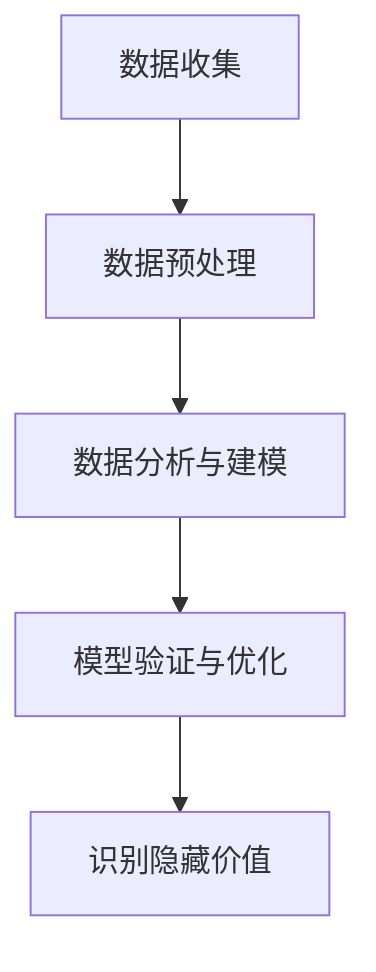

                 


# 如何识别企业的隐藏价值

## 关键词：企业价值，隐藏价值，数据分析，资源优化，系统架构，算法模型

## 摘要：本文将探讨如何识别和挖掘企业中的隐藏价值，通过系统的方法、数据分析和优化策略，帮助企业在竞争激烈的市场中发现新的增长点。文章从隐藏价值的定义、识别方法、数学模型、系统架构设计到实战案例，全面解析隐藏价值的识别过程，并提供实用的建议和工具。

---

# 第一部分: 企业隐藏价值的背景与概念

## 第1章: 企业隐藏价值的定义与重要性

### 1.1 隐藏价值的定义与内涵

隐藏价值是指企业在日常运营中未被充分挖掘或利用的资源、能力和机会。这些价值可能隐藏在企业内部的资源、流程、文化和关系中，可以通过系统化的分析和优化来发现和利用。

- **隐藏价值的定义**：隐藏价值是企业在现有资源、流程和能力中未被充分利用的部分，可以通过优化和创新来释放其潜在价值。
- **隐藏价值的内涵**：
  - 资源未充分利用：例如，员工潜力未发挥、设备利用率低。
  - 流程优化空间：流程中的瓶颈和低效环节。
  - 未开发的市场机会：潜在客户、新兴市场或未充分利用的产品线。
  - 隐性知识与经验：员工的经验和知识未被系统化利用。

### 1.2 识别隐藏价值的重要性

识别隐藏价值对企业的可持续发展至关重要：

- **提升竞争力**：通过优化内部流程和资源利用，降低运营成本，提升效率。
- **发现新机会**：挖掘未开发的市场和客户，扩展业务范围。
- **增强创新能力**：利用员工经验和知识，推动产品和服务创新。

### 1.3 隐藏价值的识别方法与工具

- **数据分析法**：通过数据挖掘和统计分析，发现隐藏的价值点。
- **资源评估法**：评估企业内部资源的利用情况，识别未被充分利用的部分。
- **价值链分析法**：分析企业价值链中的每个环节，发现低效和浪费的环节。

---

## 第2章: 隐藏价值的核心要素分析

### 2.1 隐藏价值的构成要素

隐藏价值的识别需要从多个维度进行分析：

- **资源要素**：包括人力资源、财务资源、技术资源等。
- **流程要素**：包括生产流程、管理流程、供应链流程等。
- **文化要素**：包括企业文化、员工激励机制等。
- **组织要素**：包括组织结构、部门协作效率等。

### 2.2 隐藏价值的属性特征对比

通过对比分析，可以更清晰地理解隐藏价值的特点：

- **隐藏性与显性性对比**：隐藏价值通常不被显性化，需要通过分析才能发现。
- **价值性与非价值性对比**：隐藏价值具有潜在的高价值，而非价值性要素则不具备。
- **可持续性与不可持续性对比**：隐藏价值的利用可以带来长期收益，而非可持续性要素则可能带来短期利益。

### 2.3 隐藏价值的ER实体关系图

通过ER图可以更直观地理解隐藏价值的构成和关系：

```mermaid
erd
  title 隐藏价值 ER 实体关系图
  企业 -><many-to-many>  隐藏价值：通过资源、流程、文化等连接
  资源 -><many-to-many>  隐藏价值：通过优化和利用连接
  流程 -><many-to-many>  隐藏价值：通过改进和优化连接
  文化 -><many-to-many>  隐藏价值：通过激励和协作连接
```

---

## 第3章: 隐藏价值识别的算法原理

### 3.1 隐藏价值识别的算法概述

- **数据挖掘算法**：如关联规则挖掘、聚类分析等，用于发现数据中的隐藏模式。
- **机器学习算法**：如随机森林、神经网络等，用于预测隐藏价值的存在和潜力。
- **统计分析算法**：如回归分析，用于评估隐藏价值的影响因素。

### 3.2 隐藏价值识别的流程图

识别隐藏价值的流程如下：



### 3.3 算法实现的Python代码示例

以下是使用Python进行隐藏价值识别的示例代码：

```python
import pandas as pd
from sklearn.ensemble import RandomForestRegressor
from sklearn.metrics import mean_squared_error

# 数据预处理
data = pd.read_csv('enterprise_data.csv')
X = data.drop('value', axis=1)
y = data['value']

# 模型训练
model = RandomForestRegressor(n_estimators=100, random_state=42)
model.fit(X, y)

# 模型预测
y_pred = model.predict(X)

# 模型评估
mse = mean_squared_error(y, y_pred)
print(f"均方误差：{mse}")
```

---

## 第4章: 隐藏价值的数学模型与公式

### 4.1 隐藏价值的评估公式

隐藏价值（HV）可以通过以下公式进行评估：

$$ HV = \sum_{i=1}^{n} w_i \cdot v_i $$

其中，\( w_i \) 是第 \( i \) 个要素的权重，\( v_i \) 是第 \( i \) 个要素的值。

### 4.2 隐藏价值的预测模型

- **线性回归模型**：

$$ y = \beta_0 + \beta_1 x_1 + \beta_2 x_2 + \dots + \beta_k x_k $$

- **随机森林模型**：

$$ y = \text{R

