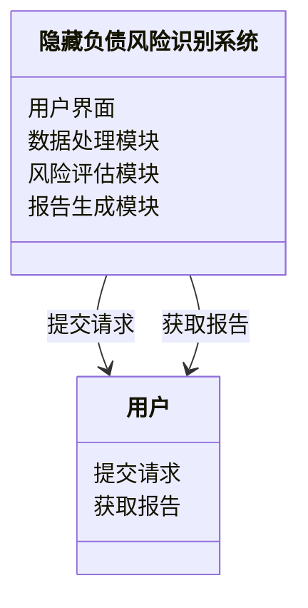
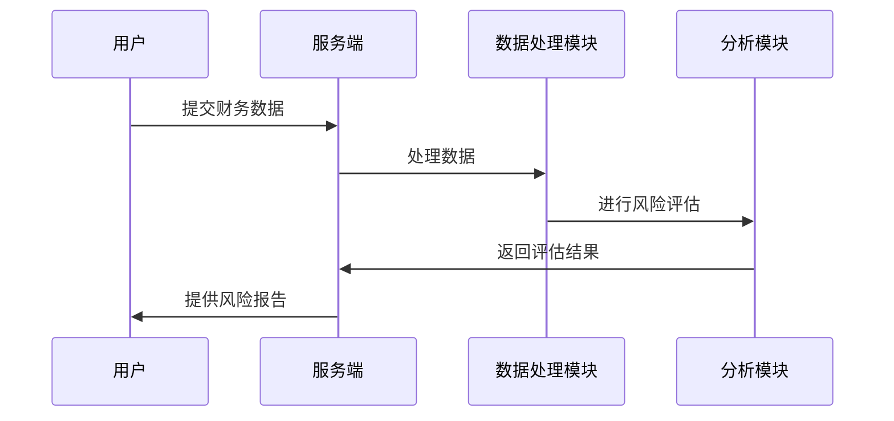

                 


---

# 如何识别企业的隐藏负债风险

## 关键词：
- 企业财务风险
- 隐藏负债
- 风险管理
- 资产负债表
- 或有负债
- 潜在负债

## 摘要：
识别企业的隐藏负债风险是保障企业财务健康的重要环节。隐藏负债是指那些未在企业资产负债表中明确列出，但可能对企业财务状况产生重大影响的潜在负债。本文将从概念、识别方法、系统设计、实战案例等多方面深入分析，帮助企业全面了解隐藏负债风险，并提供有效的识别和管理策略。

---

## 目录大纲

# 第一部分：隐藏负债风险的背景与概念

## 第1章：隐藏负债风险的定义与重要性

### 1.1 隐藏负债风险的定义

#### 1.1.1 什么是隐藏负债风险
隐藏负债风险是指企业在财务报表中未明确列示，但可能由于合同义务、法律纠纷、担保责任或其他潜在事项导致的未来潜在负债风险。

#### 1.1.2 隐藏负债风险的特征
- 隐蔽性：未在财务报表中反映
- 或然性：可能发生的概率
- 未来性：影响未来财务状况

#### 1.1.3 隐藏负债风险与企业财务健康的关系
隐藏负债风险可能影响企业的信用评级、资本成本和财务决策，严重时可能导致企业财务危机。

### 1.2 隐藏负债风险的分类

#### 1.2.1 潜在负债
- 由企业未来可能发生的债务承担义务形成的潜在负债。

#### 1.2.2 或有负债
- 由过去的交易或事项形成，其存在需通过未来不确定事项确定。

#### 1.2.3 未记录的负债
- 由于信息不对称或故意隐瞒形成的未记录负债。

### 1.3 隐藏负债风险的核心要素

#### 1.3.1 负债的形成原因
- 合同义务
- 法律纠纷
- 担保责任

#### 1.3.2 负债的隐藏机制
- 未及时确认
- 信息隐瞒
- 会计处理差异

#### 1.3.3 负债的识别边界
- 财务报表范围
- 会计准则限制
- 信息获取渠道

## 第2章：隐藏负债风险的背景与现状

### 2.1 企业财务风险的现状

#### 2.1.1 传统财务风险的局限性
- 仅关注表内负债，忽视表外负债。
- 未考虑潜在负债对企业信用评级的影响。

#### 2.1.2 隐藏负债风险的普遍性
- 企业并购中的或有负债。
- 诉讼与仲裁中的潜在负债。
- 行业政策变化带来的隐藏负债。

#### 2.1.3 数字化时代的财务风险管理
- 数据驱动的财务分析。
- 技术手段辅助识别隐藏负债。

### 2.2 隐藏负债风险的典型案例

#### 2.2.1 企业并购中的或有负债
- 案例：某公司并购后因目标公司未披露债务引发财务危机。

#### 2.2.2 诉讼与仲裁中的潜在负债
- 案例：因产品质量问题被起诉，形成潜在的赔偿负债。

#### 2.2.3 行业政策变化带来的隐藏负债
- 案例：环保政策收紧导致企业可能承担的环境治理费用。

### 2.3 隐藏负债风险对企业的影响

#### 2.3.1 对企业财务状况的影响
- 增加企业实际债务负担。
- 影响企业偿债能力。

#### 2.3.2 对企业信用评级的影响
- 降低企业信用评分。
- 影响融资成本。

#### 2.3.3 对企业经营决策的影响
- 妨碍企业战略规划。
- 影响投资决策。

---

# 第二部分：隐藏负债风险的识别方法论

## 第3章：隐藏负债风险的识别框架

### 3.1 风险识别的基本原则

#### 3.1.1 全面性原则
- 从企业内外部多方面识别潜在负债。

#### 3.1.2 重要性原则
- 突出重点，关注高风险领域。

#### 3.1.3 及时性原则
- 定期进行财务审查，及时发现潜在负债。

### 3.2 风险识别的关键步骤

#### 3.2.1 确定风险来源
- 分析企业内部管理、外部环境、法律政策等。

#### 3.2.2 评估风险概率
- 结合历史数据和行业经验，评估潜在负债发生的可能性。

#### 3.2.3 量化风险影响
- 估算潜在负债的金额和对企业财务状况的影响程度。

### 3.3 风险识别的工具与技术

#### 3.3.1 财务报表分析
- 审查资产负债表、利润表和现金流量表，识别未记录的负债。

#### 3.3.2 数据挖掘技术
- 使用数据挖掘技术分析企业历史数据，发现隐藏负债的模式。

#### 3.3.3 专家访谈与法律审查
- 通过专家访谈和法律审查，识别潜在的或有负债。

---

## 第4章：隐藏负债风险的分析模型

### 4.1 风险评估模型

#### 4.1.1 潜在负债风险评估模型
- 输入：企业财务数据、历史案例、行业经验。
- 输出：潜在负债风险评分。

#### 4.1.2 或有负债风险评估模型
- 输入：企业法律纠纷、合同义务。
- 输出：或有负债风险等级。

### 4.2 风险预警机制

#### 4.2.1 风险指标设定
- 设定关键风险指标（KPIs），如负债比率、偿债能力指标。

#### 4.2.2 风险预警阈值
- 根据行业标准和企业实际情况设定预警阈值。

#### 4.2.3 风险预警报告
- 定期生成风险预警报告，及时反馈潜在负债风险。

---

## 第5章：隐藏负债风险的管理策略

### 5.1 风险预防措施

#### 5.1.1 完善内部控制系统
- 加强内部审计，确保财务数据的真实性和完整性。

#### 5.1.2 建立风险预警机制
- 通过技术和制度双重手段，提前发现潜在负债。

### 5.2 风险应对措施

#### 5.2.1 财务储备
- 提前计提潜在负债准备金，降低财务风险。

#### 5.2.2 保险转移
- 通过保险手段转移部分潜在负债风险。

#### 5.2.3 法律手段
- 通过法律途径解决潜在负债，降低企业损失。

---

# 第三部分：系统分析与架构设计

## 第6章：系统分析与架构设计

### 6.1 问题场景介绍

#### 6.1.1 需求背景
- 企业需要一个高效的系统来识别和管理隐藏负债风险。

#### 6.1.2 项目目标
- 开发一个智能化的隐藏负债风险识别系统，帮助企业管理潜在财务风险。

### 6.2 系统功能设计

#### 6.2.1 领域模型设计
- 使用Mermaid类图展示系统功能模块及其关系。



#### 6.2.2 系统架构设计
- 使用Mermaid架构图展示系统的整体架构。

```mermaid
archiecture
    客户端 --> 服务端
    服务端 --> 数据库
    服务端 --> 分析模块
```

### 6.3 系统接口设计

#### 6.3.1 系统交互流程
- 使用Mermaid序列图展示系统交互流程。



### 6.4 系统实现细节

#### 6.4.1 数据处理模块
- 使用Python编写数据处理脚本，对财务数据进行清洗和转换。

#### 6.4.2 风险评估模块
- 使用机器学习算法对潜在负债进行预测和评估。

#### 6.4.3 报告生成模块
- 生成风险报告，包括风险评分、建议和预警信息。

---

# 第四部分：项目实战

## 第7章：隐藏负债风险识别系统开发实战

### 7.1 环境安装

#### 7.1.1 安装Python
- 使用Anaconda安装Python 3.8及以上版本。

#### 7.1.2 安装依赖库
- 使用pip安装numpy、pandas、scikit-learn等库。

### 7.2 核心代码实现

#### 7.2.1 数据处理代码

```python
import pandas as pd
import numpy as np

# 读取数据
data = pd.read_csv('financial_data.csv')

# 数据清洗
data.dropna(inplace=True)
data['潜在负债'] = data['潜在负债'].apply(lambda x: 1 if x > 0 else 0)

# 数据转换
data.to_csv('processed_data.csv', index=False)
```

#### 7.2.2 风险评估代码

```python
from sklearn.linear_model import LogisticRegression

# 训练模型
model = LogisticRegression()
model.fit(X_train, y_train)

# 预测潜在负债风险
y_pred = model.predict(X_test)
```

### 7.3 案例分析

#### 7.3.1 实际案例分析
- 以某企业为例，分析其隐藏负债风险，并展示系统如何识别潜在负债。

#### 7.3.2 系统输出报告
- 生成风险报告，包括风险评分、建议和预警信息。

---

## 第8章：总结与展望

### 8.1 总结
- 本文详细介绍了隐藏负债风险的识别方法和系统设计，为企业提供了一套完整的解决方案。

### 8.2 未来展望
- 隐藏负债风险识别将更加智能化和自动化，结合更多先进技术，如AI和大数据分析，提升识别效率和准确性。

### 8.3 最佳实践
- 定期进行财务审查和风险评估。
- 加强内部控制系统，确保财务数据的真实性和完整性。

### 8.4 小结
- 隐藏负债风险识别是企业财务风险管理的重要组成部分，需要企业从多个方面综合考虑。

---

## 作者：AI天才研究院/AI Genius Institute & 禅与计算机程序设计艺术/Zen And The Art of Computer Programming

---

以上是完整的目录大纲，文章将围绕这些内容展开，详细讲解每个部分，确保读者能够全面理解和掌握如何识别企业的隐藏负债风险。

