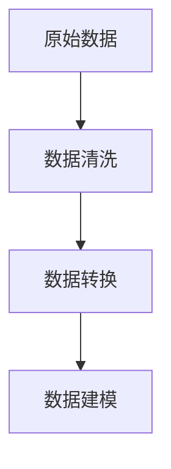
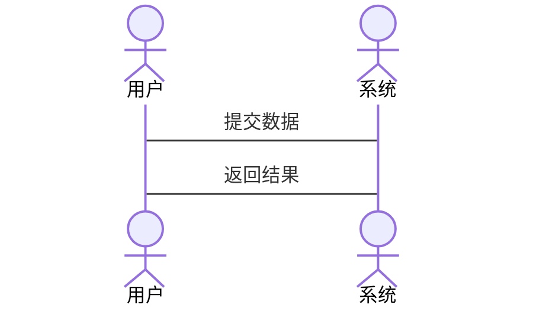

                 


# 如何识别企业的隐藏资产

> 关键词：企业资产识别、隐藏资产、资产管理系统、数据挖掘、风险管理

> 摘要：企业隐藏资产是指那些未被充分识别或记录的企业资源，包括数据、品牌价值、员工技能等。本文将从定义、分类、识别方法到系统设计、项目实战等方面，全面解析如何识别和管理企业隐藏资产。

---

# 第一部分：企业隐藏资产概述

## 第1章：隐藏资产的定义与背景

### 1.1 什么是隐藏资产
#### 1.1.1 隐藏资产的定义
隐藏资产是指企业在日常运营中未被充分识别或记录的资源，这些资源可能以数据、知识、品牌价值或员工技能等形式存在。与传统资产不同，隐藏资产通常不易被直接观察或量化。

#### 1.1.2 隐藏资产的分类
- **数据型资产**：包括未被充分利用的数据、客户行为数据等。
- **知识型资产**：员工的技能、经验和知识储备。
- **品牌型资产**：品牌价值、客户忠诚度等无形资产。
- **流程型资产**：优化的业务流程和操作规范。

#### 1.1.3 隐藏资产与传统资产的区别
| 属性 | 传统资产 | 隐藏资产 |
|------|----------|----------|
| 存在形式 | 实物资产（如设备、房地产） | 数据、知识、品牌等无形资产 |
| 可见性 | 明确记录在资产负债表中 | 未被记录或未被充分识别 |
| 价值来源 | 物理价值 | 知识价值、关系价值 |

### 1.2 隐藏资产的重要性
#### 1.2.1 隐藏资产对企业价值的影响
隐藏资产往往决定了企业的核心竞争力。例如，客户数据的价值远超过设备的价值，数据驱动的决策能够为企业创造更大的价值。

#### 1.2.2 隐藏资产对企业竞争力的作用
- 隐藏资产能够提高企业的运营效率。
- 隐藏资产能够增强企业的市场竞争力。
- 隐藏资产能够降低企业的运营成本。

#### 1.2.3 隐藏资产对企业风险管理的意义
隐藏资产的风险管理能够帮助企业避免潜在的法律纠纷和财务损失，尤其是在数据泄露或品牌危机的情况下。

### 1.3 隐藏资产的识别挑战
#### 1.3.1 隐藏资产识别的难点
- 隐藏资产通常没有明确的记录。
- 隐藏资产的价值难以量化。
- 隐藏资产的识别需要跨部门的合作。

#### 1.3.2 隐藏资产识别的常见误区
- 仅关注有形资产，忽视无形资产。
- 低估员工技能和知识的价值。
- 忽视数据的潜在价值。

#### 1.3.3 隐藏资产识别的边界与外延
- 边界：明确隐藏资产的范围，避免过度扩展。
- 外延：扩展到企业的外部合作伙伴和生态系统。

---

## 第2章：隐藏资产的核心概念与联系

### 2.1 隐藏资产的核心要素
#### 2.1.1 资产的属性特征对比
| 属性 | 数据型资产 | 知识型资产 | 品牌型资产 |
|------|------------|------------|------------|
| 存在形式 | 数据库、文件 | 人员技能、经验 | 品牌声誉、客户忠诚度 |
| 价值来源 | 数据驱动 | 知识积累 | 品牌影响力 |

#### 2.1.2 资产的生命周期分析
- 数据型资产：从数据收集到数据利用，再到数据归档或删除。
- 知识型资产：从知识积累到知识共享，再到知识应用。
- 品牌型资产：从品牌建立到品牌推广，再到品牌维护。

#### 2.1.3 资产的评估维度
- 数据型资产：数据的完整性和准确性。
- 知识型资产：知识的深度和广度。
- 品牌型资产：品牌知名度和美誉度。

### 2.2 隐藏资产的实体关系图
```mermaid
erDiagram
    actor 员工 : 员工的技能和知识
    actor 客户 : 客户的反馈和数据
    actor 供应商 : 供应商提供的资源和服务
    actor 企业 : 企业的品牌和声誉
    actor 竞争对手 : 竞争对手的动态
    员工 --> "贡献" --> 企业
    客户 --> "影响" --> 企业
    供应商 --> "支持" --> 企业
    企业 --> "依赖" --> 竞争对手
```

### 2.3 隐藏资产的关联性分析
#### 2.3.1 资产之间的相互作用
- 数据驱动知识：数据是知识的基础。
- 知识支持品牌：员工的知识和技能直接影响品牌价值。
- 品牌影响数据：品牌价值影响客户数据的质量和数量。

#### 2.3.2 资产与企业战略的关系
- 隐藏资产是企业战略的核心。
- 隐藏资产影响企业的市场定位和竞争优势。

#### 2.3.3 资产与外部环境的互动
- 客户反馈影响数据和知识。
- 供应商和竞争对手影响企业的资源分配。

---

## 第3章：隐藏资产的识别方法与工具

### 3.1 隐藏资产的识别方法
#### 3.1.1 定性分析法
- 通过访谈、问卷和焦点小组了解隐藏资产。
- 通过观察员工行为和客户互动发现隐藏资产。

#### 3.1.2 定量分析法
- 使用数据分析工具对数据进行清洗和建模。
- 通过统计分析量化隐藏资产的价值。

#### 3.1.3 综合分析法
- 结合定性和定量分析，全面识别隐藏资产。

### 3.2 隐藏资产的识别工具
#### 3.2.1 数据挖掘工具
- 使用Python的pandas库进行数据清洗。
- 使用scikit-learn进行数据建模和分析。

#### 3.2.2 资产评估工具
- 使用资产管理系统记录和评估隐藏资产。
- 使用企业资源计划（ERP）系统整合隐藏资产信息。

#### 3.2.3 业务分析工具
- 使用商业智能（BI）工具分析隐藏资产的分布和价值。

### 3.3 隐藏资产识别的算法原理
#### 3.3.1 数据预处理流程


#### 3.3.2 数据分析算法
- 使用聚类分析（K-Means）识别隐藏资产的类别。
- 使用回归分析（线性回归）量化隐藏资产的价值。

#### 3.3.3 结果验证与优化
- 使用交叉验证评估模型的准确性。
- 通过调整参数优化算法性能。

---

## 第4章：隐藏资产的系统分析与架构设计

### 4.1 系统分析方法
#### 4.1.1 需求分析
- 确定系统的目标和范围。
- 收集用户需求和业务流程。

#### 4.1.2 业务流程分析
- 绘制业务流程图，识别隐藏资产的关键节点。

#### 4.1.3 数据流分析
- 绘制数据流图，分析数据的流动和处理过程。

### 4.2 系统架构设计
#### 4.2.1 系统功能模块划分
- 数据采集模块：收集隐藏资产数据。
- 数据处理模块：清洗和转换数据。
- 数据分析模块：进行数据建模和分析。

#### 4.2.2 系统架构图


#### 4.2.3 系统接口设计
- 定义API接口，确保不同模块之间的数据交互。

### 4.3 系统交互设计
#### 4.3.1 用户角色分析
- 管理员：负责系统的配置和管理。
- 普通用户：负责数据的录入和查询。

#### 4.3.2 交互流程设计


#### 4.3.3 交互界面优化
- 设计直观的用户界面，提升用户体验。

---

## 第5章：隐藏资产的法律与风险管理

### 5.1 隐藏资产的法律保护
#### 5.1.1 知识产权保护
- 通过专利、商标等方式保护企业知识资产。

#### 5.1.2 合同风险管理
- 确保合同条款符合法律法规，避免法律纠纷。

#### 5.1.3 数据隐私保护
- 遵守数据保护法规，保护客户隐私。

### 5.2 隐藏资产的风险管理
#### 5.2.1 风险识别与评估
- 使用风险评估矩阵识别潜在风险。

#### 5.2.2 风险应对策略
- 制定应急预案，降低风险影响。

#### 5.2.3 风险监控与预警
- 建立监控系统，实时预警潜在风险。

### 5.3 隐藏资产的合规性分析
#### 5.3.1 行业合规要求
- 遵守行业标准和规范。

#### 5.3.2 企业内部合规
- 制定内部政策和流程，确保合规性。

#### 5.3.3 合规性验证
- 定期进行合规性审查和审计。

---

## 第6章：隐藏资产识别的项目实战

### 6.1 项目背景与目标
#### 6.1.1 项目需求分析
- 企业希望通过识别隐藏资产提升竞争力。

#### 6.1.2 项目目标设定
- 建立隐藏资产识别和管理系统。

#### 6.1.3 项目范围界定
- 限定项目时间和预算。

### 6.2 项目实施过程
#### 6.2.1 数据收集与清洗
- 使用Python的pandas库进行数据清洗。
- 代码示例：
  ```python
  import pandas as pd
  data = pd.read_csv('data.csv')
  data_clean = data.dropna()
  ```

#### 6.2.2 数据分析与建模
- 使用scikit-learn进行聚类分析。
- 代码示例：
  ```python
  from sklearn.cluster import KMeans
  model = KMeans(n_clusters=3)
  model.fit(data_clean)
  ```

#### 6.2.3 结果验证与优化
- 通过交叉验证优化模型参数。

### 6.3 项目成果展示
#### 6.3.1 成果总结
- 成功识别和量化了企业隐藏资产。

#### 6.3.2 成果应用案例
- 某企业通过识别隐藏资产提升了客户满意度和市场份额。

#### 6.3.3 成果推广建议
- 将成果推广到其他企业或行业。

---

## 第7章：隐

---

作者：AI天才研究院/AI Genius Institute & 禅与计算机程序设计艺术 /Zen And The Art of Computer Programming

